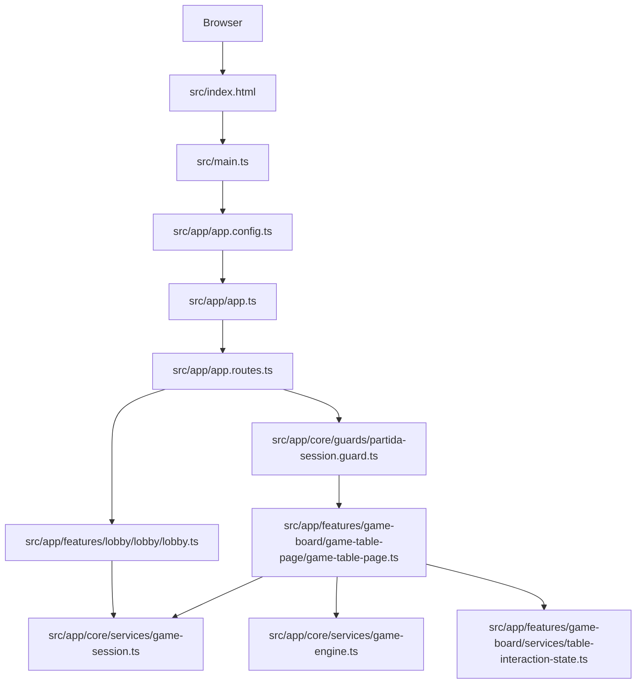
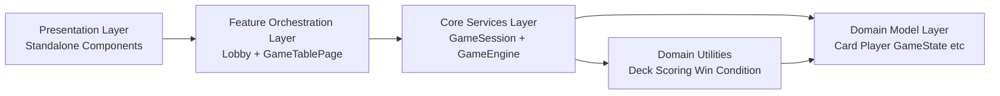
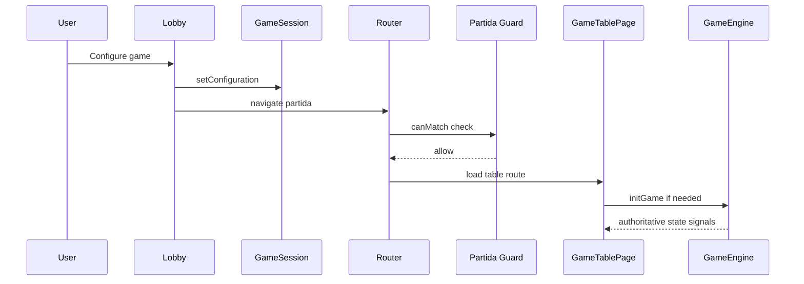
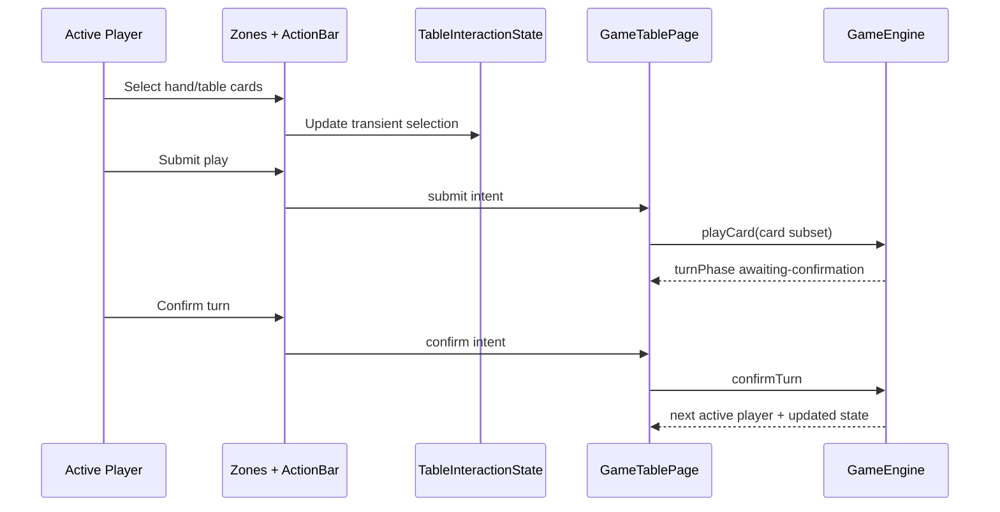
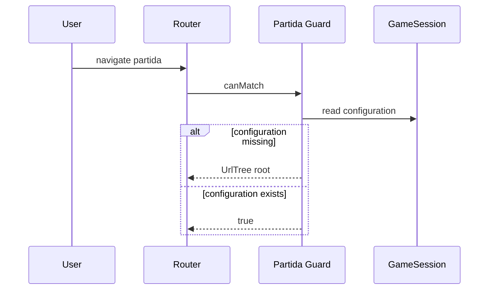

# Final Application Architecture Design

## 1. Purpose

This document defines the final architecture of the Escobita application at the current implementation state.
It is system-wide and independent from any single feature specification.

Scope covered:

- Application runtime and routing
- Domain model and core game logic architecture
- Feature boundaries and UI composition
- State ownership and flow
- Security, reliability, and quality controls
- Testing and delivery architecture

Out of scope:

- Future backend architecture (not implemented)
- Networked multiplayer transport (not implemented)
- Persistent match storage (not implemented)

## 2. System Context

Escobita is a browser-based Angular single-page application that implements La Escoba game play for:

- Single-player mode
- Local pass-and-play multiplayer mode

The application is client-side only. No external API or backend dependency exists in runtime behavior.

## 3. Technology Baseline

- Framework: Angular 21 (standalone components)
- Language: TypeScript (strict mode)
- Styling: SCSS
- Unit/Integration testing: Angular TestBed + Vitest
- End-to-end testing: Cypress + Cucumber preprocessor
- Linting/formatting: ESLint + Prettier
- Commit quality gate: Husky + lint-staged

## 4. Runtime Architecture

### 4.1 Entry and bootstrap

- Application bootstrap occurs in src/main.ts using bootstrapApplication.
- Global providers are configured in src/app/app.config.ts.
- Root app shell is src/app/app.ts and src/app/app.html with a router outlet host.

### 4.2 Runtime topology

## 5. Routing and Navigation Design

Routing is lazy-loaded for both main boundaries:

- Empty path loads Lobby feature.
- Partida path loads GameTablePage feature.

Guarding rule:

- The partida route applies a canMatch guard that redirects to root if session configuration is missing.

Navigation model:

1. User configures mode and players in Lobby.
2. Lobby persists configuration to GameSession.
3. Lobby navigates to partida.
4. Guard validates session availability before allowing route match.

## 6. Layered Application Design

### 6.1 Layers

### 6.2 Layer responsibilities

- Presentation Layer
  - Renders UI and emits user intents.
  - Contains presentational components for table zones and action bars.

- Feature Orchestration Layer
  - Maps UI intents to service calls.
  - Holds feature-local transient UI state.
  - Synchronizes view model from core signals.

- Core Services Layer
  - Owns authoritative game and session state.
  - Enforces rules and transition contracts.

- Domain Model Layer
  - Defines stable game entities and aggregate structures.

- Domain Utilities
  - Encapsulates pure calculations and deterministic rule helpers.

## 7. Domain Model Architecture

Primary model types:

- Card: suit, rank, value
- Player: identity, hand, captured pile, escoba count
- GameConfiguration: mode, player setup, AI difficulty
- GameState: deck, table, players, turn index, score map, round metadata
- RoundResult: round score outcomes and match progression data

Design principles:

- Domain types are shared between core services and feature orchestrators.
- Authoritative outcomes are derived in core services, not duplicated in UI.

## 8. Core Game Logic Architecture

The GameEngine service is the authoritative state machine for match progression.

Core operations:

- initGame(configuration)
- playCard(card, captureSubset)
- confirmTurn()
- startNextRound()

Rule integrity architecture:

- GameEngine delegates pure computations to utility modules:
  - deck.utils
  - scoring.utils
  - win-condition.utils

State protection:

- Engine snapshots are frozen before exposure to reduce accidental mutation.

## 9. State Ownership Model

### 9.1 Authoritative state

Owned by root-scoped services:

- GameSession: active session configuration
- GameEngine: canonical match state, turn phase, round result, match winner

### 9.2 Transient state

Owned by feature-scoped service and orchestrator state:

- TableInteractionState:
  - selected hand card
  - selected table cards
  - capture validity readiness
  - handoff toggle
- GameTablePage local signals:
  - handoff overlay visibility
  - validation messages
  - live announcement message

### 9.3 State design rule

UI state can guide interaction but cannot replace core rule authority.

## 10. Feature Architecture

### 10.1 Lobby Feature

Boundary:

- src/app/features/lobby/lobby/lobby.ts

Responsibilities:

- Collect game configuration (mode, player count, names)
- Validate setup constraints
- Persist configuration into GameSession
- Navigate to partida route

### 10.2 Game Table Feature

Boundary:

- src/app/features/game-board/game-table-page/game-table-page.ts

Composition:

- MatchContextHud
- OpponentZones
- CenterTableZone
- ActiveHandZone
- PlayActionBar
- TurnHandoffOverlay
- A11yLiveRegion

Orchestration responsibilities:

- Bootstrap engine state from session
- Dispatch play and confirm actions to GameEngine
- Enforce phase-aware interaction gating
- Coordinate handoff branch behavior
- Map signal state to presentational contracts

### 10.3 Legacy placeholder

A game-board placeholder component still exists as a legacy artifact but is not active in runtime routing.

## 11. Interaction Sequence Design

### 11.1 Start game sequence

### 11.2 Turn action sequence

### 11.3 Guard redirect sequence

## 12. Security and Reliability Architecture

Security controls currently in place:

- Route access control for partida via session guard.
- CSP policy and nonce in index host page.
- Cryptographically secure randomness for deck shuffle.
- No runtime external HTTP dependency, reducing data exfiltration surface.

Reliability controls:

- Strict typing and template checks.
- Engine-authoritative progression with deterministic transition methods.
- Feature-local transient interaction service to avoid cross-feature leakage.

## 13. Testing Architecture

### 13.1 Unit and integration strategy

- Component and orchestration tests use TestBed-based isolation.
- Core domain tests validate engine rules, scoring, deck behavior, and guard behavior.
- Feature tests validate selection, submission, handoff, accessibility contracts, and route bootstrap.

### 13.2 End-to-end BDD strategy

Cypress + Cucumber feature suites validate:

- Startup and lobby flow
- Table core interaction flow
- Layout and responsive behavior
- Accessibility behavior
- Engine integration contracts
- Handoff and handoff consistency paths

Quality gate model:

- Build must pass
- Lint must pass
- Unit tests must pass
- E2E feature checkpoints pass on targeted suites

## 14. Build and Delivery Architecture

Build/runtime path:

1. Angular build produces dist output.
2. Public assets are bundled from public directory.
3. Environment replacement is applied per configuration.
4. Lint/test commands run via npm scripts.

Developer workflow controls:

- ESLint and Prettier enforce style and correctness.
- Husky pre-commit hook runs lint-staged checks.

## 15. Operational Constraints and Known Gaps

- State is in-memory only; page refresh resets active match context.
- No backend persistence or synchronization exists.
- No wildcard route fallback is currently configured.
- Multiplayer remains local device handoff, not networked multiplayer.

## 16. Extension Points

Near-term extension opportunities:

- Add persistence adapter for session/match recovery.
- Add backend API boundary for remote profile and telemetry.
- Introduce transport layer for online multiplayer.
- Add AI strategy layers beyond baseline difficulty.
- Add observability events for gameplay analytics.

## 17. Source Responsibility Index

| Concern                    | Primary Files                                                   |
| -------------------------- | --------------------------------------------------------------- |
| Bootstrap and providers    | src/main.ts, src/app/app.config.ts                              |
| Routing                    | src/app/app.routes.ts                                           |
| Root shell                 | src/app/app.ts, src/app/app.html                                |
| Route guard                | src/app/core/guards/partida-session.guard.ts                    |
| Session state              | src/app/core/services/game-session.ts                           |
| Authoritative game state   | src/app/core/services/game-engine.ts                            |
| Domain models              | src/app/models/\*.ts                                            |
| Domain utilities           | src/app/core/utils/\*.ts                                        |
| Lobby feature              | src/app/features/lobby/lobby/\*                                 |
| Game table orchestrator    | src/app/features/game-board/game-table-page/game-table-page.ts  |
| Game table transient state | src/app/features/game-board/services/table-interaction-state.ts |
| Card visual mapping        | src/app/features/game-board/utils/card-asset-mapper.ts          |
| Unit/integration tests     | src/app/\*_/_.spec.ts                                           |
| E2E BDD tests              | cypress/e2e/_.feature, cypress/e2e/_.ts                         |
| Quality/tooling            | package.json, angular.json, eslint.config.js, cypress.config.ts |

---

This architecture document reflects the current implemented application and is intended to serve as the new system-level reference after the latest changes.
