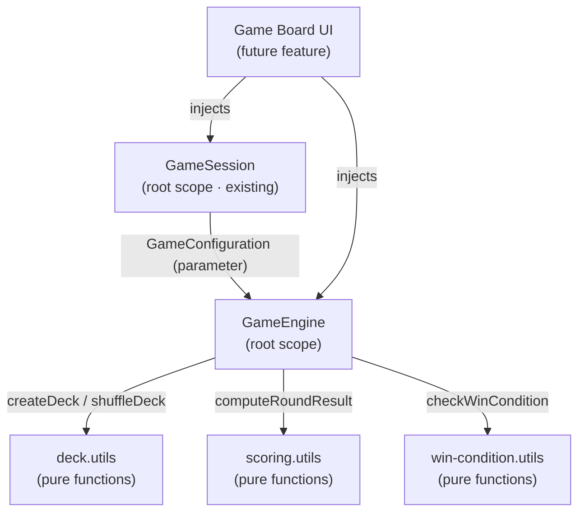
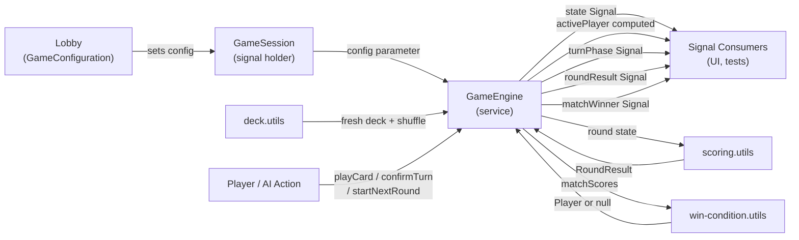
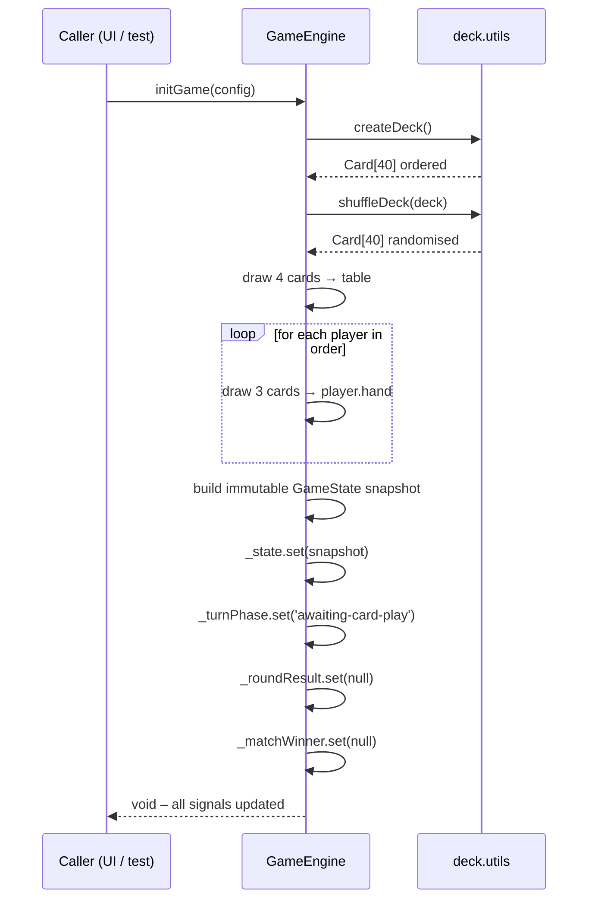
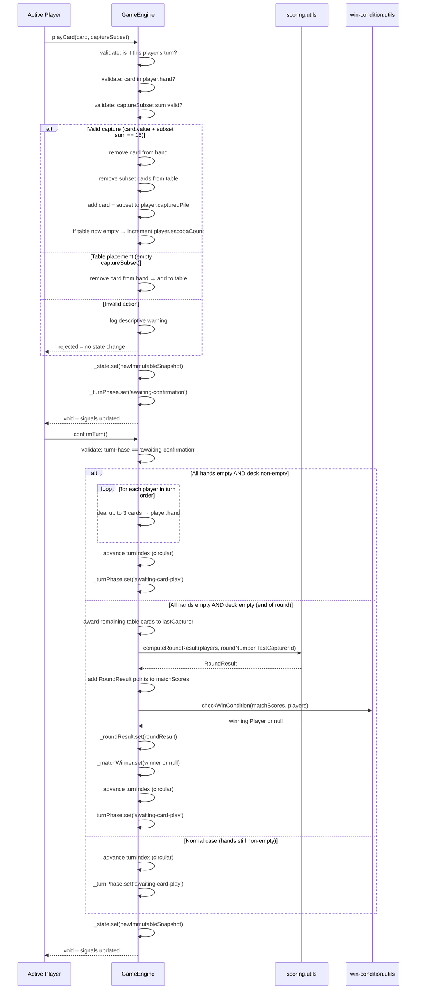
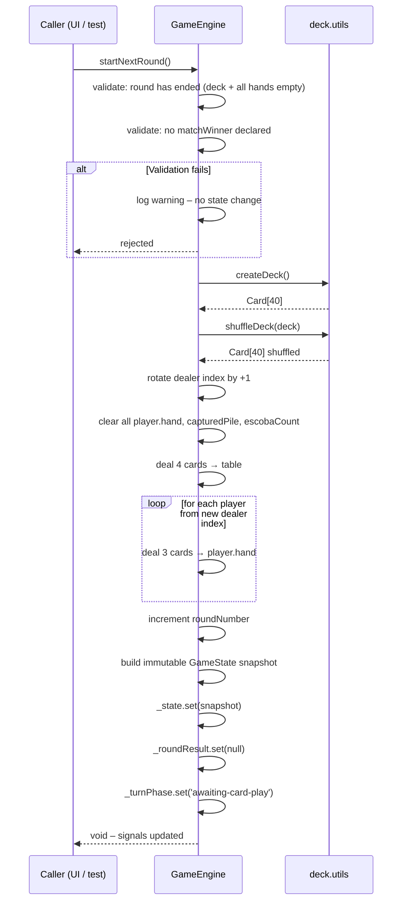
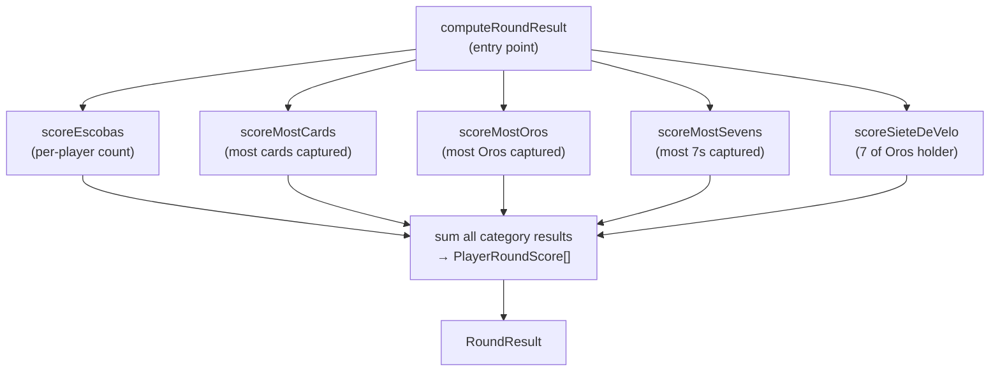

# Technical Design: Game Engine Core

**Source Spec:** `docs/specs/game-engine/core/`
**Based on:** `proposal.md`, `spec.md`, `user-stories.md`

---

## 1. Overview

The Game Engine Core is the foundational logic layer for "La Escoba de 15". It is a purely back-end feature that introduces no new UI components and no new routes. Its deliverables are four data model files, three pure utility modules, and one Angular service — all sitting beneath the existing `src/app/` folder structure.

The engine accepts a `GameConfiguration` produced by the Lobby feature, orchestrates a full match (initialisation, turns, deals, scoring, and win detection), and exposes all observable game state through Angular Signals. Every future feature — game board UI, AI opponent, local multiplayer — will consume this layer.

The existing `GameSession` service is not modified. It continues to hold the `GameConfiguration` produced by the Lobby; callers pass that configuration directly into `GameEngine.initGame()` as a parameter.

---

## 2. Architecture Diagrams

### 2.1 Service Dependency Diagram

> **Diagram notes:**
>
> - `GameSession` and `GameEngine` are both provided at root scope. `GameSession` is unchanged.
> - The three utility modules are plain TypeScript modules — they have no Angular decorators and receive no injected dependencies.
> - The "Game Board UI (future feature)" node represents components that will be built in the UI epic; they are shown here to clarify the intended consumption points.

---

### 2.2 Data Flow Diagram

---

### 2.3 Sequence Diagram — Game Initialisation

---

### 2.4 Sequence Diagram — playCard and confirmTurn (Two-Phase Turn)

---

### 2.5 Sequence Diagram — startNextRound

---

### 2.6 Scoring Utility — Internal Category Composition

> **Extensibility note (AD-6 / NFR-3.1):** Adding the Setenta category in a future release requires only adding a new pure function `scoreSetenta` and wiring it into the composition inside `computeRoundResult` — no existing category function is touched.

---

## 3. Architectural Decisions

### AD-1: Two-Phase Turn Model

- **Context:** The spec contains a contradiction between FR-4.2 (auto-advance) and FR-5.8 (confirmation required). The proposal and all user stories align with FR-5.8.
- **Decision:** Implement the two-phase turn model. `playCard()` transitions the engine to `awaiting-confirmation`. `confirmTurn()` triggers turn advance. FR-4.2 is treated as a stale entry.
- **Rationale:** The proposal explicitly describes the confirmation model as intentional — it gives the player a moment to review the outcome before handing off. US-3 and US-5 acceptance criteria both state "the turn does NOT advance immediately."
- **Consequences:** The engine exposes a `turnPhase` signal; callers must call both `playCard()` and `confirmTurn()` to complete a turn. A future "Listo" button UI feature will trigger `confirmTurn()`.
- **Requirements:** FR-5.8, US-3, US-5, US-11.

---

### AD-2: TurnPhase as a Separate Signal (Not in GameState)

- **Context:** TR-4.3 requires a Signal for turn phase. TR-1.4 specifies the `GameState` fields without mentioning turn phase.
- **Decision:** `turnPhase` is a separate private signal exposed as a read-only signal from `GameEngine`. It is not embedded in the `GameState` interface.
- **Rationale:** `GameState` captures the observable state of the game world (cards, players, scores). `TurnPhase` is engine-internal workflow state indicating what the engine is waiting for next. Keeping them separate avoids leaking engine workflow mechanics into the domain data model.
- **Consequences:** Consumers subscribe to `turnPhase` independently. The `GameState` interface remains a clean domain snapshot.
- **Requirements:** TR-1.4, TR-4.3, FR-5.8.

---

### AD-3: RoundResult as a Separate Signal (Not in GameState)

- **Context:** TR-4.3 requires a Signal for round result. TR-1.4 does not include round result in `GameState`.
- **Decision:** `roundResult` is a separate signal, null during an ongoing round and populated once per round end. It is not embedded in `GameState`.
- **Rationale:** A round result is a transient outcome artefact produced at one specific moment, not part of the continuously-updated in-play state. Separating it avoids nullability cluttering the main game state and makes the end-of-round lifecycle event distinct and observable.
- **Consequences:** The UI can react to `roundResult` transitioning from null to a value to display a round summary. Calling `startNextRound()` resets it to null.
- **Requirements:** FR-8.4, TR-4.3, US-8.

---

### AD-4: Utility Functions as Pure TypeScript Modules (No Angular DI)

- **Context:** TR-2.1, TR-3.1 require deck and scoring logic to be pure functions with no Angular dependencies.
- **Decision:** `deck.utils.ts`, `scoring.utils.ts`, and `win-condition.utils.ts` are plain TypeScript module files under `src/app/core/utils/`. They export free functions and do not use Angular decorators or inject tokens.
- **Rationale:** Pure functions are trivially unit-testable with Vitest without TestBed. They have no side effects, making behaviour fully deterministic and easy to reason about. This also aligns with the project's convention of keeping services thin and delegating computation to utilities.
- **Consequences:** These utilities can be imported and tested directly. The `GameEngine` service calls them as ordinary function calls.
- **Requirements:** TR-2.1, TR-3.1, TR-2.4, TR-3.3, NFR-1.2.

---

### AD-5: Card Identity by Structural Equality (Suit + Rank)

- **Context:** Each Spanish deck card is uniquely identified by its suit-rank combination. No card appears twice.
- **Decision:** Cards are compared by structural equality on `suit` and `rank` fields. No generated ID field is added to the `Card` interface.
- **Rationale:** The specification says "A card is an immutable value" (FR-1.5). In a 40-card Spanish deck, suit + rank is a natural key. Adding a synthetic ID would bloat the model and complicate creation without adding correctness.
- **Consequences:** Capture validation and hand/table card removal logic uses suit+rank comparison. Consumers must not assume reference equality.
- **Requirements:** FR-1.5, TR-1.2, FR-5.2, FR-5.3.

---

### AD-6: Scoring Categories as Independent Composable Handlers

- **Context:** NFR-3.1 requires that new scoring categories (e.g., Setenta) can be added without modifying existing category handlers.
- **Decision:** Each of the five scoring categories (escobas, most-cards, most-oros, most-sevens, siete-de-velo) is implemented as a separate pure function inside `scoring.utils.ts`. `computeRoundResult()` composes them sequentially, collecting per-player results and summing totals.
- **Rationale:** This is an open/closed approach: the composition function is the only place that needs to change when a new category is added. Individual category functions are self-contained and testable in isolation.
- **Consequences:** The Setenta category can be added in a future task by writing one new function and registering it in the composition. No existing category function is modified.
- **Requirements:** NFR-3.1, FR-8.2, FR-8.4.

---

### AD-7: GameSession Unchanged; Configuration Passed as Parameter

- **Context:** TR-5.1 and TR-5.2 specify that `GameSession` retains its role and is not modified structurally.
- **Decision:** `GameEngine.initGame()` accepts `GameConfiguration` as a direct parameter. The caller (currently the game board component, once built) reads the configuration from `GameSession.configuration` and passes it to `initGame()`. `GameSession` is not injected into `GameEngine`.
- **Rationale:** Injecting `GameSession` into `GameEngine` would create a tight coupling between two root-scoped services where none is needed. The clean contract is: the caller is responsible for reading the configuration from `GameSession` and passing it to the engine.
- **Consequences:** `GameEngine` has no dependency on `GameSession`. `GameSession` requires no changes.
- **Requirements:** TR-5.1, TR-5.2.

---

### AD-8: Immutable State Snapshots for All Transitions

- **Context:** TR-4.5 requires that all state transitions produce new object references. NFR-2.1 requires state to be immutable from outside the service.
- **Decision:** Every method that changes state creates a fresh `GameState` object using spread operators and array constructors. The private signal's `set()` is called with the new object. Signals are exposed via `asReadonly()`.
- **Rationale:** Angular's signal change detection works by reference equality. Immutable updates ensure that computed signals depending on `state` are correctly invalidated. It also prevents external mutation.
- **Consequences:** Slightly more allocation per state transition, which is acceptable given the tiny data size of a 40-card deck (NFR-4.1 — all operations well under 16 ms).
- **Requirements:** TR-4.5, NFR-2.1, NFR-4.1.

---

## 4. Component Architecture

This feature introduces no UI components. The architecture is purely a service and utility layer.

The existing `GameBoardPlaceholder` component (`src/app/features/game-board/game-board-placeholder/`) is the intended future consumer of `GameEngine`. It will inject `GameEngine` and read its signals to drive the UI. Wiring that component to the engine is out of scope for this feature.

---

## 5. State Management

All observable state is managed exclusively through Angular Signals inside `GameEngine`. No RxJS observables are used. The following signals are exposed:

| Signal         | Type                          | Description                                                                                           |
| -------------- | ----------------------------- | ----------------------------------------------------------------------------------------------------- |
| `state`        | `Signal<GameState \| null>`   | Full immutable game state snapshot. Null before `initGame()` is called.                               |
| `activePlayer` | `Signal<Player \| null>`      | Computed from `state.players[state.turnIndex]`. Null before game starts.                              |
| `turnPhase`    | `Signal<TurnPhase>`           | `awaiting-card-play` or `awaiting-confirmation`. Defaults to `awaiting-card-play`.                    |
| `roundResult`  | `Signal<RoundResult \| null>` | Null during a round; set to the round outcome when a round ends. Reset to null by `startNextRound()`. |
| `matchWinner`  | `Signal<Player \| null>`      | Null during ongoing match; set to the winning player after win condition is met.                      |

**State transition summary:**

- `initGame()` → resets all signals to their initial values and sets `state` to a freshly initialised game.
- `playCard()` → updates `state` with the result of the play; transitions `turnPhase` to `awaiting-confirmation`.
- `confirmTurn()` → may trigger end-of-hand dealing, end-of-round resolution, or simple turn advance; updates `state` and `turnPhase`; may also set `roundResult` and `matchWinner`.
- `startNextRound()` → resets `state` to a new round, resets `roundResult` to null, resets `turnPhase` to `awaiting-card-play`.

---

## 6. Service Layer

### 6.1 GameEngine (New)

- **Scope:** `providedIn: 'root'` — singleton across the application.
- **Responsibility:** Central game orchestrator. Initialises match state from a `GameConfiguration`, validates and executes player actions, manages turn flow (including end-of-hand dealing and end-of-round resolution), and exposes all reactive state via Angular Signals.
- **Dependencies:** `deck.utils`, `scoring.utils`, `win-condition.utils` (imported as pure functions — not injected).
- **Key methods (described in plain English):**
  - _Initialise game_ — takes a `GameConfiguration`, creates and shuffles a new deck via `deck.utils`, deals initial table cards and player hands, builds the initial `GameState` snapshot, and resets all signals.
  - _Play card_ — validates that it is the correct player's turn, that the card is in the player's hand, and that the capture subset is legal. Applies the resulting state change (capture or table placement). Transitions turn phase to awaiting-confirmation.
  - _Confirm turn_ — validates that the engine is in the awaiting-confirmation phase. Advances turn index. If all hands are now empty and the deck still has cards, auto-deals the next batch. If all hands are empty and the deck is exhausted, triggers end-of-round resolution. Otherwise simply advances to the next player.
  - _Start next round_ — validates that the current round has ended and no match winner exists. Creates a new shuffled deck, resets all per-round player state, deals new table cards and player hands, rotates the dealer, increments the round number, and resets the round result signal.

---

### 6.2 GameSession (Existing — Unchanged)

- **Scope:** `providedIn: 'root'`.
- **Responsibility:** Holds the `GameConfiguration` produced by the Lobby feature. Acts as the handoff point from Lobby to the game.
- **Usage in this feature:** Callers read `GameSession.configuration()` and pass the value into `GameEngine.initGame()`. `GameSession` is not injected into `GameEngine`.

---

### 6.3 deck.utils (New)

- **Scope:** Plain TypeScript module — no Angular DI.
- **Responsibility:** Creates the full 40-card Spanish deck and shuffles it.
- **Key functions (described in plain English):**
  - _Create deck_ — returns a new array of 40 `Card` objects, one per suit-rank combination, with correct numeric values applied. Always returns the same structure in the same initial order. Deterministic.
  - _Shuffle deck_ — takes a deck array and returns a new array with the same 40 cards in a random order. Uses Fisher-Yates (or equivalent) to ensure every permutation is equally likely. Does not mutate the input array.

---

### 6.4 scoring.utils (New)

- **Scope:** Plain TypeScript module — no Angular DI.
- **Responsibility:** Computes the `RoundResult` at the end of a round from the completed player state.
- **Key functions (described in plain English):**
  - _Compute round result_ — orchestrates all scoring categories. Takes the completed players array, round number, and last capturer identity; calls each category scorer in sequence; sums per-player totals; returns a `RoundResult`.
  - _Score escobas_ — awards 1 point per escoba recorded on each player's escoba count. Independent per player; no tie condition.
  - _Score most cards_ — finds the player with the strictly highest captured pile size. Awards 1 point (or 2 if all 40 cards). Awards 0 on any tie.
  - _Score most Oros_ — finds the player with the strictly highest count of Oros-suit cards in their captured pile. Awards 1 point (or 2 if all 10 Oros). Awards 0 on any tie.
  - _Score most sevens_ — finds the player with the strictly highest count of rank-7 cards in their captured pile. Awards 1 point (or 2 if all 4 sevens). Awards 0 on any tie.
  - _Score Siete de Oros_ — awards 1 point to the player who captured the 7 of Oros. Independent of Most Oros and Most Sevens categories.

---

### 6.5 win-condition.utils (New)

- **Scope:** Plain TypeScript module — no Angular DI.
- **Responsibility:** Determines whether a match winner exists after round scores are applied.
- **Key function (described in plain English):**
  - _Check win condition_ — takes the updated match scores map and the players array. Returns the winning player if exactly one player has the highest score at or above 15. Returns null if no player has reached 15, or if multiple players share the highest score at or above 15 (resulting in a tie — another round is played).

---

## 7. Routing

No new routes are introduced. The engine is a pure service layer. The existing lazy-loaded route to `GameBoardPlaceholder` remains unchanged. Future UI features will build on that route and inject `GameEngine` to drive display.

---

## 8. Data Model

All interfaces are located in `src/app/models/` alongside the existing `GameConfiguration` model. No model contains methods or business logic (TR-1.6).

### 8.1 Suit

A string union of the four suit names: Oros, Copas, Espadas, Bastos.

### 8.2 Rank

A string union of the ten rank names: 1, 2, 3, 4, 5, 6, 7, Sota, Caballo, Rey.

### 8.3 Card

- Suit field — one of the four suit values.
- Rank field — one of the ten rank values.
- Numeric value field — a number reflecting the card's worth in capture calculations. Ranks 1–7 equal their rank number; Sota equals 8; Caballo equals 9; Rey equals 10.
- Cards are immutable value objects; no ID field is needed since suit + rank uniquely identifies each card.

### 8.4 Player

- Unique string identifier — generated at game initialisation.
- Display name string — taken from `GameConfiguration.playerNames`.
- Hand — array of Card objects currently held by this player.
- Captured pile — array of Card objects won in captures during the current round.
- Escoba count — numeric count of escobas scored in the current round (resets each round).

### 8.5 GameState

- Deck — array of remaining undealt Card objects.
- Table — array of Card objects currently face-up on the table.
- Players — ordered array of all Player entities.
- Turn index — numeric index into the players array indicating the active player.
- Round number — integer starting at 1, incremented each round.
- Match scores — a record mapping each player's unique identifier to their accumulated match score (integer points).
- Last capturer identifier — the unique string identifier of the player who most recently made a successful capture during the current round. Nullable (null if no capture has been made yet in the round).

### 8.6 TurnPhase

A string union discriminating between two engine workflow states: `awaiting-card-play` (the active player has not yet played a card) and `awaiting-confirmation` (the active player has played a card and must call `confirmTurn()` to advance).

### 8.7 PlayerRoundScore

- Player identifier — string key linking the score to a Player.
- Escobas points — integer (1 per escoba earned during the round).
- Most-cards points — 0, 1, or 2.
- Most-Oros points — 0, 1, or 2.
- Most-sevens points — 0, 1, or 2.
- Siete-de-Velo points — 0 or 1.
- Total — sum of all category points for this player in this round.

### 8.8 RoundResult

- Round number — integer.
- Player scores — ordered array of `PlayerRoundScore`, one entry per player.

---

## 9. API Integration

This feature has no backend API. All logic is computed synchronously in the browser. No HTTP calls, no WebSocket connections, no asynchronous operations of any kind. All game engine methods are synchronous and complete within a single JavaScript execution tick (NFR-4.1).

---

## 10. Error Handling

The game engine does not throw exceptions for invalid player actions (TR-4.6). Instead:

- **Invalid `playCard()` calls** — If the turn is wrong, the card is not in the hand, or the capture subset is illegal, the method logs a descriptive `console.warn` message and returns without altering any signal.
- **Invalid `confirmTurn()` calls** — If called while `turnPhase` is `awaiting-card-play`, the method logs a warning and returns.
- **Invalid `startNextRound()` calls** — If called when the round has not ended or a match winner is already declared, the method logs a warning and returns.
- **No state corruption** — All validation happens before any state mutation. If a validation check fails, no signals are touched.

No global error handler integration is needed for this release. Error boundaries and user-facing error messages are concerns of the UI epic.

---

## 11. Accessibility

This feature introduces no UI. Accessibility concerns are deferred entirely to the game board UI epic, which will consume the engine's signals and implement the necessary ARIA patterns for card interaction.

---

## 12. Performance Considerations

- All operations (initialise, play card, score round) are synchronous and operate on a data set that never exceeds 40 cards and 4 players. All operations are expected to complete well under 1 ms, satisfying NFR-4.1.
- Angular's signal-based change detection propagates only to computed signals that depend on changed signals. Since `activePlayer` is computed from `state`, it only re-evaluates when `state` changes.
- Immutable state snapshots ensure reference equality checks in computed signals work correctly. The cost of creating small new objects per transition is negligible.
- No `OnPush` change detection decisions are needed at this layer since no components are introduced.

---

## 13. Testing Strategy

**Unit testing framework:** Vitest (existing project convention). Tests are placed in `.spec.ts` files co-located with their implementation files.

### Utility functions — tested without TestBed

- `deck.utils.ts` — Verify: deck has exactly 40 cards; each suit has exactly 10 cards; each rank per suit has the correct numeric value; total sum of all values equals 220; shuffle returns a new array (no mutation); shuffle distributes cards differently from the original order across repeated calls.
- `scoring.utils.ts` — Verify each scoring category independently with controlled player state: escoba counts, capture pile sizes, Oros capture counts, seven counts, Siete de Oros possession, tie scenarios producing zero points, all-cards bonus (2 points), all-Oros bonus (2 points), all-sevens bonus (2 points).
- `win-condition.utils.ts` — Verify: no winner returned when no player reaches 15; correct winner returned when one player leads at or above 15; no winner (tie) when multiple players share the same highest score at or above 15.

### GameEngine service — tested with TestBed

- `initGame()` — verifies initial state shape: 4 table cards, 3 cards per player hand, empty captured piles, zero escobas, zero match scores, turn index at 0, turn phase at `awaiting-card-play`, round result null, match winner null.
- `playCard()` — valid capture: verifies card removed from hand, subset removed from table, all added to captured pile, state updated; tests escoba detection (table empty after capture); tests table placement (empty subset); tests rejection on wrong-turn attempt; tests rejection on card not in hand; tests rejection on invalid capture subset sum; tests that state is unchanged after any rejection.
- `confirmTurn()` — verifies turn advances to next player; verifies end-of-hand auto-deal triggers when hands are empty and deck is non-empty; verifies end-of-round resolution triggers when hands and deck are both empty; verifies `roundResult` signal is set after end of round; verifies `matchWinner` signal is set when win condition is met.
- `startNextRound()` — verifies round number increments; verifies dealer rotation; verifies per-round player state is reset; verifies match scores are preserved; verifies `roundResult` returns to null; verifies rejection when match winner already exists.

Each test description references the relevant requirement code (e.g., "Covers: FR-2.1, FR-5.3, US-3") to maintain traceability.

---

## 14. Risk Assessment

| Risk                                                                 | Likelihood | Impact | Mitigation                                                                                                                                                                            |
| -------------------------------------------------------------------- | ---------- | ------ | ------------------------------------------------------------------------------------------------------------------------------------------------------------------------------------- |
| FR-4.2 vs FR-5.8 conflict causes misunderstanding during development | Low        | Medium | AD-1 is documented clearly. FR-4.2 is explicitly noted as superseded in the spec conflict note above.                                                                                 |
| Immutability rule violated accidentally (in-place array mutation)    | Medium     | Medium | Unit tests that verify state identity (previous state unchanged) catch this. All tests run on the pure utility functions first, making the pattern clear before the service is built. |
| Scoring edge cases (ties, all-cards bonus) implemented incorrectly   | Medium     | High   | Each scoring category has dedicated unit tests with controlled inputs covering all edge cases including ties and bonus conditions.                                                    |
| Fisher-Yates shuffle bias (incorrect implementation)                 | Low        | Medium | Deck utility tests verify shuffle produces varying output across many calls. Implementation references the standard Fisher-Yates algorithm.                                           |
| Win condition tie resolution produces infinite loop                  | Low        | High   | `checkWinCondition` returns null on a tie; `startNextRound` is the only way to continue. The engine never auto-starts a new round; it only does so when explicitly called.            |
| `confirmTurn` called in wrong phase by test or future UI             | Low        | Low    | Validation guard and warning log prevent any state change. Unit tests cover the rejection case.                                                                                       |
