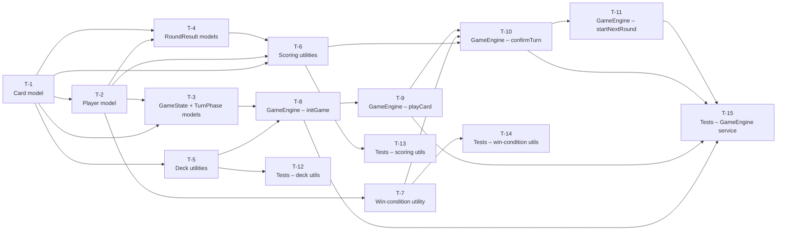

# Implementation Tasks: Game Engine Core

**Source Design:** `docs/specs/game-engine/core/design.md`

---

## Task Dependency Overview

---

## Tasks

---

### T-1: Define Card, Suit, and Rank Types

- **Status:** ✅ Implemented
- **Description:** Create the `card.ts` model file in `src/app/models/`. Define a `Suit` string union type covering the four Spanish suit names (Oros, Copas, Espadas, Bastos). Define a `Rank` string union type covering the ten rank names (1 through 7, Sota, Caballo, Rey). Define a `Card` interface with three fields: suit (of type Suit), rank (of type Rank), and value (a number). No methods or logic belong in this file.
- **Architectural Decision:** AD-5 (structural equality by suit + rank; no generated ID needed), AD-8 (immutable value object).
- **Depends on:** None.
- **Components affected:** New file `src/app/models/card.ts`.
- **Acceptance criteria:**
  - [ ] `Suit` type is a string union of exactly the four suit names.
  - [ ] `Rank` type is a string union of exactly the ten rank names.
  - [ ] `Card` interface exposes `suit`, `rank`, and `value` fields only; no methods.
  - [ ] The file exports `Suit`, `Rank`, and `Card` as named exports.
  - [ ] TypeScript strict mode raises no errors on the file.
- **Estimation hint:** XS
- **Spec traceability:** FR-1.1, FR-1.2, FR-1.5, TR-1.2.

---

### T-2: Define Player Model

- **Status:** ✅ Implemented
- **Description:** Create `src/app/models/player.ts`. Define a `Player` interface with five fields: a unique string identifier, a display name string, a hand array of Card objects (cards currently held), a captured-pile array of Card objects (cards won in captures this round), and a numeric escoba count for the current round. No methods or logic.
- **Architectural Decision:** AD-8 (pure data shape, no methods).
- **Depends on:** T-1.
- **Components affected:** New file `src/app/models/player.ts`.
- **Acceptance criteria:**
  - [ ] `Player` interface has `id: string`, `name: string`, `hand: Card[]`, `capturedPile: Card[]`, and `escobaCount: number` fields.
  - [ ] No methods or computed properties are present.
  - [ ] The file exports `Player` as a named export.
  - [ ] TypeScript strict mode raises no errors.
- **Estimation hint:** XS
- **Spec traceability:** FR-3.1, TR-1.3.

---

### T-3: Define GameState and TurnPhase Models

- **Status:** ✅ Implemented
- **Description:** Create `src/app/models/game-state.ts`. Define a `TurnPhase` string union type with two values: `awaiting-card-play` and `awaiting-confirmation`. Define a `GameState` interface with seven fields: `deck` (Card array), `table` (Card array), `players` (Player array), `turnIndex` (number), `roundNumber` (number), `matchScores` (a `Record<string, number>` mapping player id to accumulated points), and `lastCapturerId` (a nullable string — the id of the last player who made a capture, or null if none has yet).
- **Architectural Decision:** AD-2 (TurnPhase is a separate type, not embedded as a field in `GameState`), AD-8.
- **Depends on:** T-1, T-2.
- **Components affected:** New file `src/app/models/game-state.ts`.
- **Acceptance criteria:**
  - [ ] `TurnPhase` is a union of exactly `'awaiting-card-play'` and `'awaiting-confirmation'`.
  - [ ] `GameState` contains all seven specified fields with correct types.
  - [ ] `lastCapturerId` is typed as `string | null`.
  - [ ] `matchScores` is typed as `Record<string, number>`.
  - [ ] No methods or business logic are present.
  - [ ] The file exports both `TurnPhase` and `GameState` as named exports.
  - [ ] TypeScript strict mode raises no errors.
- **Estimation hint:** XS
- **Spec traceability:** FR-5.8, TR-1.4, AD-2.

---

### T-4: Define RoundResult and PlayerRoundScore Models

- **Status:** ✅ Implemented
- **Description:** Create `src/app/models/round-result.ts`. Define a `PlayerRoundScore` interface with seven fields: `playerId` (string), `escobas` (number), `mostCards` (number, 0–2), `mostOros` (number, 0–2), `mostSevens` (number, 0–2), `sieteDiVelo` (number, 0–1), and `total` (number — sum of all category points). Define a `RoundResult` interface with two fields: `roundNumber` (number) and `playerScores` (array of `PlayerRoundScore`).
- **Architectural Decision:** AD-3 (RoundResult is separate from GameState), AD-6 (each category has its own field for extensibility).
- **Depends on:** T-1, T-2.
- **Components affected:** New file `src/app/models/round-result.ts`.
- **Acceptance criteria:**
  - [ ] `PlayerRoundScore` has all seven specified fields with correct types.
  - [ ] `RoundResult` has `roundNumber` and `playerScores` fields.
  - [ ] No methods or logic are present.
  - [ ] Both types are exported as named exports.
  - [ ] TypeScript strict mode raises no errors.
- **Estimation hint:** XS
- **Spec traceability:** FR-8.4, TR-1.5, AD-3.

---

### T-5: Implement Deck Utilities

- **Status:** ✅ Implemented
- **Description:** Create `src/app/core/utils/deck.utils.ts`. Implement two exported pure functions. The first, `createDeck`, takes no arguments and returns a new array of exactly 40 `Card` objects — one per suit-rank combination — with the correct numeric value assigned to each card (ranks 1–7 equal their number; Sota equals 8; Caballo equals 9; Rey equals 10). The second, `shuffleDeck`, accepts an array of cards and returns a new shuffled array without mutating the input, using the Fisher-Yates algorithm (or equivalent) to ensure every permutation is equally likely.
- **Architectural Decision:** AD-4 (pure functions, no Angular DI), AD-8 (no mutation of input).
- **Depends on:** T-1.
- **Components affected:** New file `src/app/core/utils/deck.utils.ts`. New folder `src/app/core/utils/` is created.
- **Acceptance criteria:**
  - [ ] `createDeck()` returns an array of exactly 40 cards.
  - [ ] Each suit contains exactly 10 cards, one per rank.
  - [ ] Each card has the correct `value` (1–7 for numbered ranks, 8 for Sota, 9 for Caballo, 10 for Rey).
  - [ ] The sum of all 40 card values equals 220.
  - [ ] `createDeck()` is deterministic — the initial order is always the same.
  - [ ] `shuffleDeck(deck)` returns a new array; the input array is not mutated.
  - [ ] Both functions are exported as named exports.
  - [ ] No Angular imports are present in the file.
- **Estimation hint:** S
- **Spec traceability:** FR-1.1, FR-1.2, FR-1.3, FR-1.4, TR-2.1, TR-2.2, TR-2.3, TR-2.4.

---

### T-6: Implement Scoring Utilities

- **Status:** ✅ Implemented
- **Description:** Create `src/app/core/utils/scoring.utils.ts`. Implement `computeRoundResult(players, roundNumber, lastCapturerId)` as the main entry point. Internally, decompose scoring into five independent pure category functions (one per scoring category: escobas, most-cards, most-Oros, most-sevens, Siete de Velo). `computeRoundResult` calls each category function sequentially, collects the per-player results, sums totals per player, and returns a fully-formed `RoundResult`.

  Scoring rules to implement:
  - **Escobas:** 1 point per escoba recorded in the player's escoba count. No tie condition.
  - **Most Cards:** 1 point to the player with strictly the most captured cards; 2 points if that player has all 40. Zero points if two or more players tie for most.
  - **Most Oros:** 1 point to the player with strictly the most Oros-suit cards in their captured pile; 2 points if that player has all 10. Zero on tie.
  - **Most Sevens:** 1 point to the player with strictly the most rank-7 cards captured; 2 points if all 4. Zero on tie.
  - **Siete de Velo:** 1 point to the player who has the 7 of Oros in their captured pile. Independent of the other categories.

- **Architectural Decision:** AD-6 (independent composable category handlers for extensibility).
- **Depends on:** T-1, T-2, T-4.
- **Components affected:** New file `src/app/core/utils/scoring.utils.ts`.
- **Acceptance criteria:**
  - [ ] `computeRoundResult` returns a `RoundResult` with one `PlayerRoundScore` per player.
  - [ ] Escoba points correctly reflect each player's escoba count.
  - [ ] Most-cards points are 0 on a tie, 1 for a clear winner, 2 when the winner has all 40 cards.
  - [ ] Most-Oros points are 0 on a tie, 1 for a clear winner, 2 when the winner has all 10 Oros.
  - [ ] Most-sevens points are 0 on a tie, 1 for a clear winner, 2 when the winner has all 4 sevens.
  - [ ] Siete de Velo points are 1 for the holder of 7 of Oros, 0 for all others.
  - [ ] `total` field in `PlayerRoundScore` equals the sum of all category fields.
  - [ ] No Angular imports are present in the file.
  - [ ] The five category functions are independently importable (or at minimum independently exercisable in tests).
- **Estimation hint:** M
- **Spec traceability:** FR-8.1, FR-8.2, FR-8.3, FR-8.4, TR-3.1, TR-3.2, TR-3.3, NFR-3.1, US-8.

---

### T-7: Implement Win-Condition Utility

- **Status:** ✅ Implemented
- **Description:** Create `src/app/core/utils/win-condition.utils.ts`. Implement `checkWinCondition(matchScores, players)` as a pure function. It examines the match scores map, finds all players at or above 15 points, and returns the `Player` object with the highest score. Returns null if no player has reached 15 points, or if two or more players share the highest score at or above 15 (a tie — no winner declared until the next round resolves the tie).
- **Architectural Decision:** AD-4 (pure function, no Angular DI), AD-8.
- **Depends on:** T-2.
- **Components affected:** New file `src/app/core/utils/win-condition.utils.ts`.
- **Acceptance criteria:**
  - [ ] Returns null when no player has reached 15 points.
  - [ ] Returns the winning player when exactly one player has the highest score at or above 15.
  - [ ] Returns null when two or more players share the same highest score at or above 15.
  - [ ] Correctly handles the case where multiple players exceed 15 but one has a strictly higher score.
  - [ ] No Angular imports are present in the file.
  - [ ] The function is exported as a named export.
- **Estimation hint:** S
- **Spec traceability:** FR-9.1, FR-9.2, FR-9.3, FR-9.4, US-9.

---

### T-8: Implement GameEngine Service — Scaffold and initGame

- **Status:** ✅ Implemented
- **Description:** Create `src/app/core/services/game-engine.ts`. Scaffold the `GameEngine` class as an Angular injectable service with `providedIn: 'root'`. Declare the five private signals: `_state`, `_turnPhase`, `_roundResult`, `_matchWinner`, and the computed `_activePlayer`. Expose all five as public read-only signals (using `asReadonly()` for writable signals; `computed()` for `activePlayer`). Implement `initGame(config: GameConfiguration): void`. The method must: create a new deck via `createDeck`, shuffle it via `shuffleDeck`, build the initial player entities (one per name in the config, with generated unique ids and empty hands/piles), deal 4 cards to the table, deal 3 cards per player in order, build the immutable initial `GameState` snapshot, and reset all signals to their initial values.
- **Architectural Decision:** AD-2 (TurnPhase separate), AD-3 (RoundResult separate), AD-7 (config accepted as parameter), AD-8 (immutable snapshot).
- **Depends on:** T-1, T-2, T-3, T-4, T-5.
- **Components affected:** New file `src/app/core/services/game-engine.ts`.
- **Acceptance criteria:**
  - [ ] `GameEngine` is decorated with `@Injectable({ providedIn: 'root' })`.
  - [ ] All five public signals are read-only (typed as `Signal<…>`).
  - [ ] `activePlayer` is a computed signal derived from `state().players[state().turnIndex]`.
  - [ ] After `initGame(config)`, `state()` is not null.
  - [ ] `state().table` has exactly 4 cards.
  - [ ] Each player's `hand` has exactly 3 cards.
  - [ ] All player captured piles are empty and escoba counts are zero.
  - [ ] All match scores are zero.
  - [ ] `turnIndex` is 0.
  - [ ] `roundNumber` is 1.
  - [ ] `turnPhase()` equals `'awaiting-card-play'`.
  - [ ] `roundResult()` is null.
  - [ ] `matchWinner()` is null.
  - [ ] Calling `initGame` a second time fully resets the state (no remnants from the previous match).
  - [ ] No RxJS imports are present in the file.
- **Estimation hint:** M
- **Spec traceability:** FR-2.1, FR-2.2, FR-2.3, FR-2.4, FR-2.5, TR-4.1, TR-4.2, TR-4.3, TR-4.5, US-1, US-11.

---

### T-9: Implement GameEngine Service — playCard

- **Status:** ✅ Implemented
- **Description:** Add `playCard(card: Card, captureSubset: Card[]): void` to `GameEngine`. The method must:
  1. Validate that `turnPhase()` is `awaiting-card-play`; reject with a warning if not.
  2. Validate that it is the active player's turn; reject with a warning if not (this guards against future multi-agent scenarios where the wrong agent calls the method).
  3. Validate that the card is in the active player's hand (structural suit+rank equality); reject with a warning if not.
  4. If `captureSubset` is non-empty, validate that `card.value + sum(captureSubset values) === 15` and that all subset cards exist on the table; reject with a warning if invalid.
  5. Apply the appropriate state transition:
     - **Capture:** remove the card from hand, remove subset from table, add all to captured pile; if table is now empty, increment `escobaCount`.
     - **Table placement (empty subset):** remove the card from hand, add it to the table.
  6. Build a new immutable `GameState` snapshot.
  7. Set `_state` to the new snapshot.
  8. Set `_turnPhase` to `awaiting-confirmation`.

  All rejections must leave all signals unchanged.

- **Architectural Decision:** AD-1 (two-phase turn — method transitions to awaiting-confirmation), AD-5 (structural equality for card matching), AD-8 (immutable state).
- **Depends on:** T-8.
- **Components affected:** `src/app/core/services/game-engine.ts`.
- **Acceptance criteria:**
  - [ ] Valid capture: card removed from hand, subset removed from table, all added to captured pile.
  - [ ] Valid capture that empties the table: player's `escobaCount` incremented by 1.
  - [ ] Table placement (empty subset): card removed from hand, added to table. No changes to captured pile. No escoba.
  - [ ] After any valid `playCard()` call, `turnPhase()` equals `'awaiting-confirmation'`.
  - [ ] Attempt to play a card when `turnPhase` is `'awaiting-confirmation'`: rejected, state unchanged, warning logged.
  - [ ] Attempt to play a card not in the active player's hand: rejected, state unchanged, warning logged.
  - [ ] Attempt to play with an invalid capture subset (sum ≠ 15): rejected, state unchanged, warning logged.
  - [ ] Attempt to play with a capture subset containing a card not on the table: rejected, state unchanged, warning logged.
  - [ ] A player may place a card even when a valid capture exists (no "must capture" enforcement).
  - [ ] All Signals reflect the updated state after a valid action.
- **Estimation hint:** M
- **Spec traceability:** FR-5.1–FR-5.8, TR-4.4, TR-4.6, US-3, US-4, US-5.

---

### T-10: Implement GameEngine Service — confirmTurn (Including End-of-Hand and End-of-Round)

- **Status:** ✅ Implemented
- **Description:** Add `confirmTurn(): void` to `GameEngine`. This is the most complex method in the engine. It must:
  1. Validate that `turnPhase()` is `awaiting-confirmation`; reject with a warning if not.
  2. Determine the next state via the following decision tree:
     - **Normal case:** some players still have cards in their hands — advance `turnIndex` circularly, set `turnPhase` back to `awaiting-card-play`.
     - **End-of-hand case:** all hands are empty AND the deck still has cards — deal up to 3 cards per player from the deck in circular order starting from the current turn order (first player to receive cards is the next player in turn order after the current active player). Advance `turnIndex` circularly. Set `turnPhase` to `awaiting-card-play`.
     - **End-of-round case:** all hands are empty AND the deck is empty — award all remaining table cards to the player identified by `lastCapturerId` (or to the last player in turn order if `lastCapturerId` is null); call `computeRoundResult`; add the round scores to `matchScores`; call `checkWinCondition`; set `_roundResult`; set `_matchWinner` (null if no winner yet). Advance `turnIndex` circularly. Set `turnPhase` to `awaiting-card-play`.
  3. In all cases, build a new immutable `GameState` snapshot and call `_state.set(newSnapshot)`.
- **Architectural Decision:** AD-1 (two-phase turn — this method completes the turn), AD-8 (immutable state).
- **Depends on:** T-9, T-6, T-7.
- **Components affected:** `src/app/core/services/game-engine.ts`.
- **Acceptance criteria:**
  - [ ] Normal case: `turnIndex` advances to the next player; `turnPhase()` returns `'awaiting-card-play'`.
  - [ ] `confirmTurn()` called while `turnPhase` is `awaiting-card-play`: rejected, state unchanged, warning logged.
  - [ ] End-of-hand case: each player receives up to 3 new cards; deck shrinks accordingly; no new table cards added.
  - [ ] End-of-hand case with fewer cards than 3 × players: remaining cards distributed starting from the player next in turn order; some players may receive fewer cards.
  - [ ] End-of-round case: remaining table cards are added to the last capturer's captured pile (no escoba recorded for this).
  - [ ] End-of-round case: `roundResult()` is non-null and correctly reflects per-player scores.
  - [ ] End-of-round case: match scores are updated with round result points.
  - [ ] End-of-round case: if a win condition is met, `matchWinner()` is non-null.
  - [ ] End-of-round case with no prior captures: remaining table cards awarded to last player in turn order.
  - [ ] Turn order is circular (after last player, returns to first).
  - [ ] All Signals reflect the updated state.
- **Estimation hint:** L
- **Spec traceability:** FR-4.1–FR-4.4, FR-5.8, FR-6.1–FR-6.3, FR-7.1–FR-7.4, FR-8.1–FR-8.4, FR-9.1–FR-9.5, US-6, US-7, US-8, US-9.

---

### T-11: Implement GameEngine Service — startNextRound

- **Status:** ✅ Implemented
- **Description:** Add `startNextRound(): void` to `GameEngine`. The method must:
  1. Validate that the current round has ended (deck is empty and all hands are empty); reject with a warning if not.
  2. Validate that no match winner has been declared (`matchWinner()` is null); reject with a warning if not.
  3. Increment `roundNumber`.
  4. Rotate the dealer: compute the new starting player index as `(current turnIndex + 1) % players.length`. Turn order for dealing and play begins from this new index.
  5. Reset all per-round player state: clear each player's `hand`, `capturedPile`, and reset `escobaCount` to zero. Preserve all players' accumulated match scores in `matchScores`.
  6. Create a new deck via `createDeck`, shuffle it via `shuffleDeck`, deal 4 cards to the table, deal 3 cards per player starting from the new dealer index.
  7. Set `lastCapturerId` to null.
  8. Build a new immutable `GameState` snapshot and call `_state.set(newSnapshot)`.
  9. Set `_roundResult` to null.
  10. Set `_turnPhase` to `'awaiting-card-play'`.
- **Architectural Decision:** AD-8 (immutable state), AD-1 (turnPhase reset to awaiting-card-play).
- **Depends on:** T-10.
- **Components affected:** `src/app/core/services/game-engine.ts`.
- **Acceptance criteria:**
  - [ ] `roundNumber` is incremented by 1 after `startNextRound()`.
  - [ ] The new `turnIndex` reflects the dealer rotation (offset by 1 from the previous round's start).
  - [ ] All player hands, captured piles, and escoba counts are reset to empty/zero.
  - [ ] All accumulated match scores are preserved (not reset).
  - [ ] The table has exactly 4 new cards.
  - [ ] Each player has exactly 3 new cards.
  - [ ] `roundResult()` is null after `startNextRound()`.
  - [ ] `turnPhase()` is `'awaiting-card-play'` after `startNextRound()`.
  - [ ] Calling `startNextRound()` when a match winner exists: rejected, state unchanged, warning logged.
  - [ ] Calling `startNextRound()` mid-round (hands non-empty or deck non-empty): rejected, state unchanged, warning logged.
  - [ ] All Signals reflect the updated state.
- **Estimation hint:** M
- **Spec traceability:** FR-10.1, FR-10.2, FR-10.3, US-10.

---

### T-12: Unit Tests — Deck Utilities

- **Status:** ✅ Implemented
- **Description:** Create `src/app/core/utils/deck.utils.spec.ts`. Write Vitest unit tests for `createDeck` and `shuffleDeck`. Test descriptions must reference requirement codes where applicable.
- **Architectural Decision:** AD-4 (tested without TestBed — plain function calls).
- **Depends on:** T-5.
- **Components affected:** New file `src/app/core/utils/deck.utils.spec.ts`.
- **Acceptance criteria:**
  - [ ] `createDeck()` returns exactly 40 cards.
  - [ ] Each of the four suits has exactly 10 cards.
  - [ ] Each suit contains exactly one card of each rank.
  - [ ] Rank-1 cards have `value` 1; rank-7 cards have `value` 7; Sota cards have `value` 8; Caballo cards have `value` 9; Rey cards have `value` 10.
  - [ ] Sum of all `value` fields across the 40 cards equals 220.
  - [ ] `shuffleDeck(deck)` returns a new array (not the same reference as the input).
  - [ ] The input array to `shuffleDeck` is not mutated.
  - [ ] `shuffleDeck` called multiple times with the same input does not always return the same order (probabilistic test — run at least twice and compare).
  - [ ] All tests pass with `vitest run`.
- **Estimation hint:** S
- **Spec traceability:** FR-1.1, FR-1.2, FR-1.3, FR-1.4, NFR-1.2, US-2.

---

### T-13: Unit Tests — Scoring Utilities

- **Status:** ✅ Implemented
- **Description:** Create `src/app/core/utils/scoring.utils.spec.ts`. Write Vitest unit tests for `computeRoundResult` and the individual scoring category logic. Test with manually constructed `Player` arrays so that each scenario is fully deterministic.
- **Architectural Decision:** AD-6 (each category independently tested).
- **Depends on:** T-6.
- **Components affected:** New file `src/app/core/utils/scoring.utils.spec.ts`.
- **Acceptance criteria:**
  - [ ] Escoba points: player with 2 escobas receives 2 points; player with 0 receives 0.
  - [ ] Most-cards: clear winner receives 1 point; tied players receive 0.
  - [ ] Most-cards: winner with all 40 cards receives 2 points.
  - [ ] Most-Oros: clear winner receives 1 point; tied players receive 0.
  - [ ] Most-Oros: winner with all 10 Oros receives 2 points.
  - [ ] Most-sevens: clear winner receives 1 point; tied players receive 0.
  - [ ] Most-sevens: winner with all 4 sevens receives 2 points.
  - [ ] Siete de Velo: the holder of 7 of Oros receives 1 point regardless of most-Oros/most-sevens outcome.
  - [ ] `total` field equals the sum of all category fields for each player.
  - [ ] `roundNumber` in the returned `RoundResult` matches the input.
  - [ ] All tests pass with `vitest run`.
- **Estimation hint:** M
- **Spec traceability:** FR-8.1, FR-8.2, FR-8.3, FR-8.4, NFR-1.2, US-8.

---

### T-14: Unit Tests — Win-Condition Utility

- **Status:** ✅ Implemented
- **Description:** Create `src/app/core/utils/win-condition.utils.spec.ts`. Write Vitest unit tests for `checkWinCondition`.
- **Architectural Decision:** AD-4 (tested without TestBed).
- **Depends on:** T-7.
- **Components affected:** New file `src/app/core/utils/win-condition.utils.spec.ts`.
- **Acceptance criteria:**
  - [ ] Returns null when no player has reached 15 points.
  - [ ] Returns the single player who has reached or exceeded 15 points when no tie exists.
  - [ ] When multiple players exceed 15 and one has a strictly higher score, returns the highest scorer.
  - [ ] Returns null when two or more players share the same highest score at or above 15.
  - [ ] Returns null when all players are below 15 even if one leads.
  - [ ] All tests pass with `vitest run`.
- **Estimation hint:** S
- **Spec traceability:** FR-9.1, FR-9.2, FR-9.3, FR-9.4, NFR-1.2, US-9.

---

### T-15: Unit Tests — GameEngine Service

- **Status:** ✅ Implemented
- **Description:** Create `src/app/core/services/game-engine.spec.ts`. Write Vitest unit tests using Angular `TestBed` for all state transitions in `GameEngine`. Each test description must reference requirement codes. Tests for `playCard` and `confirmTurn` should use controlled game states (set up via `initGame` and then manual card plays) rather than relying on random deck order — either use a deterministic seed or replace the internal deck before playing.
- **Architectural Decision:** AD-1 (two-phase turn tested thoroughly), AD-8 (immutable state — assert previous state is not mutated).
- **Depends on:** T-8, T-9, T-10, T-11.
- **Components affected:** New file `src/app/core/services/game-engine.spec.ts`.
- **Acceptance criteria:**
  - [ ] `initGame` tests: all initial state values are correct; calling `initGame` twice produces a fresh state (US-1).
  - [ ] `playCard` valid capture: card removed from hand, subset removed from table, added to captured pile; `turnPhase()` transitions to `awaiting-confirmation` (US-3).
  - [ ] `playCard` escoba: after a capture that empties the table, `escobaCount` increments (US-4).
  - [ ] `playCard` table placement: card moves from hand to table; captured piles unchanged; no escoba; `turnPhase()` transitions (US-5).
  - [ ] `playCard` rejection cases: wrong turn, card not in hand, invalid subset sum — all leave state unchanged (FR-5.6).
  - [ ] `confirmTurn` normal case: `turnIndex` advances; `turnPhase()` returns to `awaiting-card-play`.
  - [ ] `confirmTurn` end-of-hand: new cards dealt to all players; deck shrinks.
  - [ ] `confirmTurn` end-of-round: `roundResult()` is set; `matchScores` updated; `matchWinner()` set correctly when threshold reached.
  - [ ] `confirmTurn` rejection: called when `turnPhase` is `awaiting-card-play` — state unchanged.
  - [ ] `startNextRound`: round increments; match scores preserved; per-round state reset; new hands dealt (US-10).
  - [ ] `startNextRound` rejection: when match winner exists or round not complete — state unchanged (US-9).
  - [ ] All signals are read-only (TypeScript compile-time check via type assertions in tests).
  - [ ] All tests pass with `vitest run`.
- **Estimation hint:** L
- **Spec traceability:** NFR-1.2, US-1, US-3, US-4, US-5, US-6, US-7, US-9, US-10, US-11.

---

## Implementation Order

Recommended sequence considering dependencies and risk — build from stable foundations up to the complex orchestration layer, with tests following their implementation targets:

1. **T-1 — Card model** — Foundation for everything. No dependencies.
2. **T-2 — Player model** — Depends only on T-1.
3. **T-3 — GameState + TurnPhase** — Depends on T-1, T-2.
4. **T-4 — RoundResult models** — Depends on T-1, T-2. Can be done in parallel with T-3.
5. **T-5 — Deck utilities** — First testable pure logic. Depends on T-1.
6. **T-7 — Win-condition utility** — Simple pure function. Depends only on T-2.
7. **T-6 — Scoring utilities** — More complex but still pure. Depends on T-1, T-2, T-4.
8. **T-12 — Tests for deck utils** — Test T-5 immediately after it is complete.
9. **T-14 — Tests for win-condition utils** — Test T-7 immediately after it is complete.
10. **T-13 — Tests for scoring utils** — Test T-6 immediately after it is complete.
11. **T-8 — GameEngine initGame** — First service implementation. Depends on T-3, T-4, T-5.
12. **T-9 — GameEngine playCard** — Depends on T-8. Highest validation complexity.
13. **T-10 — GameEngine confirmTurn** — Largest task. Depends on T-9, T-6, T-7.
14. **T-11 — GameEngine startNextRound** — Depends on T-10.
15. **T-15 — Tests for GameEngine** — Full service integration tests after all methods are implemented.
