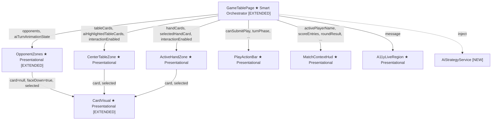
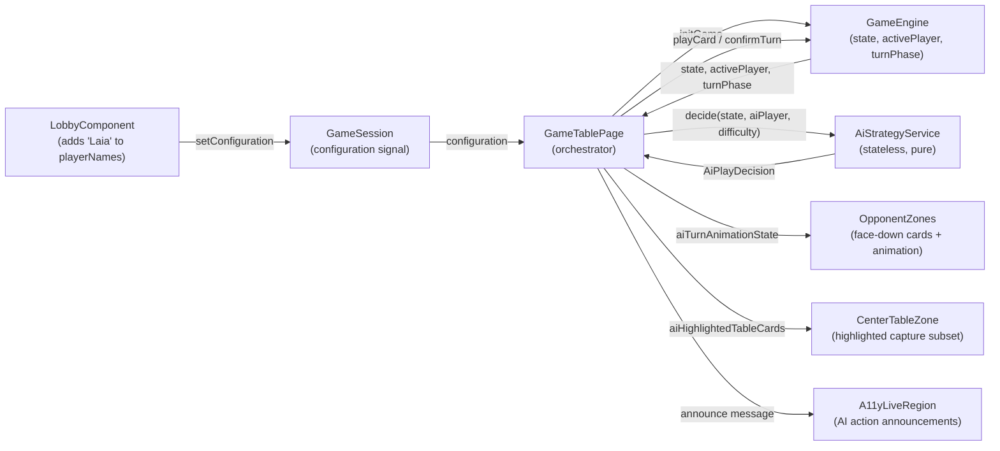
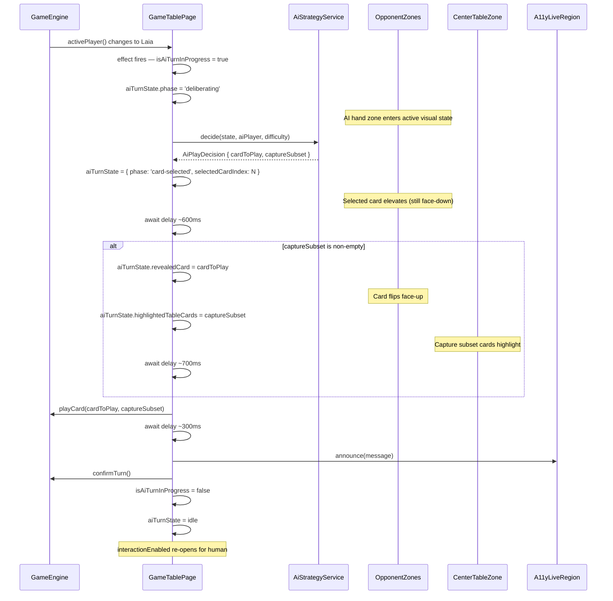
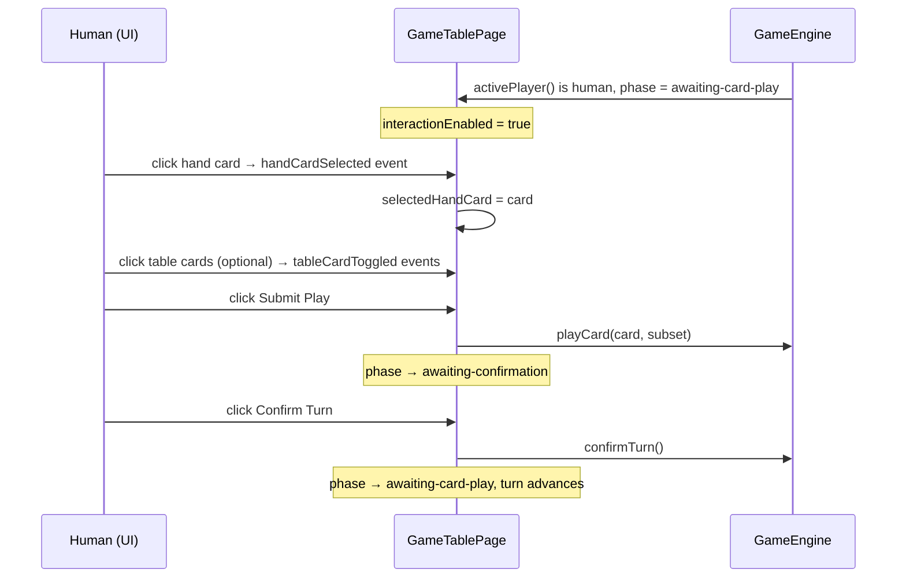
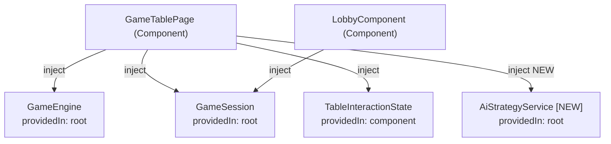
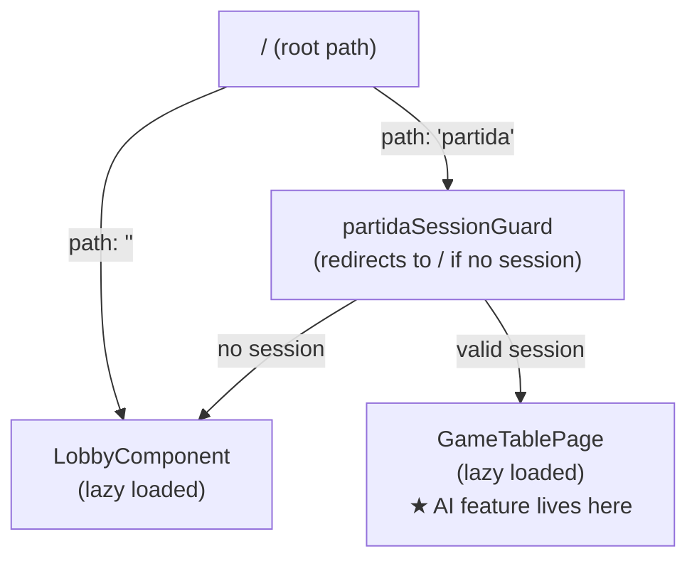

# Technical Design: Single Player Mode — AI Opponent (Laia)

**Source Spec:** `docs/specs/single-player/ai-opponent/`
**Based on:** proposal.md, spec.md, user-stories.md
**Angular version:** 21 (signals, standalone components, signal-based inputs/outputs)

---

## 1. Overview

This feature activates the currently non-functional Single Player mode by introducing an AI opponent named "Laia" who plays automatically on her turns. The feature is built entirely outside the game engine: a new `AiStrategyService` computes Laia's decision given the current game state, and the existing `GameTablePage` orchestrator drives Laia's turn through the engine's public API with a step-by-step visual animation. The game engine, routing, and core session infrastructure remain untouched.

The three difficulty levels — Fácil, Intermedio, and Difícil — are implemented as pure strategy functions that each accept a `GameState` snapshot and return an `AiPlayDecision`. No mutable state is maintained between turns: all card-history reasoning is derived directly from the game state's captured piles and table cards, which already encode everything that has been played.

Five existing files are modified. Three new files are introduced. No new routes, no new guards, and no new Angular modules are needed.

---

## 2. Architecture Diagrams

### 2.1 Component Tree

Shows the full component hierarchy. Components marked **[EXTENDED]** receive new inputs or new rendering responsibility. The new `AiStrategyService` is shown as a dependency of the orchestrator, not a component.

### 2.2 Data Flow

Shows how data enters the feature, is processed by the AI strategy, and flows back into the game engine and UI zones.

### 2.3 Sequence Diagram — AI Turn Flow

The primary user flow: Laia takes her turn fully automatically with step-by-step animation.

### 2.4 Sequence Diagram — Human Turn Flow (Unchanged Reference)

Included for contrast. The human path is entirely unchanged by this feature.

### 2.5 Service Dependency Diagram

Shows injection relationships and scopes for all services involved in this feature.

### 2.6 Routing Diagram

No routing changes. The feature is fully contained within the existing `partida` route.

---

## 3. Architectural Decisions

### AD-1: Lobby registers "Laia" as the second player name in Single Player mode

- **Context:** `GameEngine.initGame(config)` creates exactly as many `Player` objects as there are entries in `config.playerNames`. Currently, in Single Player mode the Lobby only puts the human's name in that array, so the engine creates one player and Laia does not exist as a `Player` at all.
- **Decision:** The Lobby's `buildConfiguration()` method appends the fixed string `'Laia'` as the second entry in `playerNames` when mode is Single Player. `playerCount` stays at 2.
- **Rationale:** The engine is not modified. The fix is a one-line change in the Lobby. "Laia" then flows into the engine as a normal `Player` with a generated UUID, name, hand, and capture pile — indistinguishable from a human player from the engine's perspective.
- **Consequences:** The match scores overlay, round result overlay, and match-over overlay all use `Player.name` directly, so "Laia" appears correctly everywhere without any additional mapping.
- **Requirement:** FR-1.1, US-1

---

### AD-2: AI player identified by a stable player ID derived at game initialisation

- **Context:** `GameTablePage` needs to know which player is Laia on every turn to decide whether to trigger the AI orchestration or wait for human input.
- **Decision:** After `gameEngine.initGame()` is called, a `aiPlayerId` computed signal reads `gameEngine.state()?.players[1]?.id`. This UUID never changes during the match. All AI-turn checks compare `activePlayer().id === aiPlayerId()`.
- **Rationale:** Comparing by UUID is more robust than comparing by name. It avoids fragile string comparison in reactive hot paths and survives any future renaming of the AI without logic changes.
- **Consequences:** The AI is always at player index 1. This is an enforced convention by AD-1. The convention is documented and must be maintained in the Lobby's `buildConfiguration()` method.
- **Requirement:** FR-1.2, FR-1.3, TR-3.2

---

### AD-3: AiStrategyService is stateless — all card history derived from GameState

- **Context:** The spec describes Intermedio as "maintaining a running record" and Difícil as "maintaining a full record" of played cards. An initial reading suggests a stateful memory object that accumulates data and resets per round.
- **Decision:** The service is stateless. Instead of a mutable record, both Intermedio and Difícil derive all needed history at decision time from the current `GameState`: the "seen" cards are the union of all cards in all players' `capturedPile` arrays. The "unseen" cards are the full 40-card deck minus Laia's hand, minus table cards, minus all captured pile cards.
- **Rationale:** `GameState` already contains complete and accurate card-history information. A separate mutable mirror would be redundant, risk going out of sync, require an explicit reset on every round boundary, and make the service stateful and harder to unit test. The observable behaviour is identical: Laia "knows" what has been played because the captured piles record it.
- **Consequences:** No `resetRoundMemory()` method is needed. No `recordPlay()` hook is needed. The round-boundary concern (FR-10) is automatically satisfied. Every strategy function is a pure function of its inputs and can be tested by constructing any `GameState`.
- **Requirement:** FR-3.1, FR-4.1, FR-5.1, TR-1.3, TR-1.4, TR-1.5, NFR-3.1

---

### AD-4: AI turn orchestration via an Angular `effect()` in GameTablePage

- **Context:** The game engine's turn lifecycle is synchronous and driven entirely by explicit method calls. There is no engine hook or callback for "a turn has started." The orchestration layer must detect this externally.
- **Decision:** A single Angular `effect()` inside `GameTablePage` watches two signals: `gameEngine.activePlayer()` and `gameEngine.turnPhase()`. When both conditions hold — the active player is Laia and the phase is `'awaiting-card-play'` — and the AI turn is not already in progress, the effect calls `runAiTurn()`.
- **Rationale:** `effect()` is the canonical Angular 21 mechanism for reactive side effects tied to signal changes. It fires whenever either of the watched signals changes (e.g., after `confirmTurn()` advances the turn, or after a new hand is dealt). This covers FR-2.2 (triggers on every turn including after mid-round deals) without any manual subscription management.
- **Consequences:** The effect must guard against double-firing with the `isAiTurnInProgress` signal. The `runAiTurn()` method must be async. The `allowSignalWrites` effect option is needed since the method writes to signals during its animation sequence.
- **Requirement:** FR-2.1, FR-2.2, FR-2.3, TR-2.1, TR-2.2

---

### AD-5: Animation state held in a single `aiTurnAnimationState` writable signal

- **Context:** The animation sequence in `runAiTurn()` progresses through several distinct phases: idle → deliberating → card-selected → capture-previewing → resolving. Each phase requires different visual changes in `OpponentZones` and `CenterTableZone`. Multiple individual signals would need to stay in sync.
- **Decision:** A single `aiTurnAnimationState` writable signal holds an object with four fields: the current animation phase (a string union), the index of the selected hand card (number or null), the revealed card (Card or null — set only during a capture), and the highlighted table cards array (Card[]). The idle state is a known constant.
- **Rationale:** A single coordinated signal prevents inconsistent intermediate states where, for example, `revealedCard` is set but `highlightedTableCards` is not yet. It also makes the animation state trivially resettable by assigning the constant idle object.
- **Consequences:** `OpponentZones` receives the full `aiTurnAnimationState` object as an input and derives what to render from it. `CenterTableZone` receives only `aiHighlightedTableCards`, derived as a computed signal from `aiTurnAnimationState`.
- **Requirement:** FR-6.1–FR-6.7, FR-8.3, FR-8.4, TR-2.3, TR-2.4

---

### AD-6: `interactionEnabled` extended with `!isAiTurnInProgress` guard

- **Context:** The existing `interactionEnabled` computed signal returns `true` when `turnPhase === 'awaiting-card-play' && !showTurnHandoffOverlay()`. During Laia's turn, `turnPhase` is `'awaiting-card-play'` and the overlay is not shown, so without a change the human could select cards and click Submit while Laia is animating.
- **Decision:** A private `isAiTurnInProgress` writable boolean signal is introduced. `interactionEnabled` is extended to also require `!isAiTurnInProgress()`. The signal is set to `true` at the very start of `runAiTurn()` and cleared to `false` after `confirmTurn()` is called.
- **Rationale:** The interaction lock must persist across the entire async animation sequence, even as the engine phase transitions from `'awaiting-card-play'` to `'awaiting-confirmation'` and back. A separate signal decoupled from the engine phase is the only way to maintain this lock reliably.
- **Consequences:** The `isAiTurnInProgress` signal also serves as the guard inside the `effect()` to prevent double-invocation of `runAiTurn()`.
- **Requirement:** FR-7.1, FR-7.2, FR-7.3, TR-2.4

---

### AD-7: CardVisual gets an explicit `faceDown` boolean input

- **Context:** Passing `null` as the `card` input to `CardVisual` already renders the back-of-card image (`/cards/Card_Back.png`), but the semantic label is "Carta no disponible" — which is incorrect for a deliberately hidden card and would confuse screen reader users.
- **Decision:** A new optional signal-based boolean input `faceDown` (default: `false`) is added to `CardVisual`. When `true`, it renders the back image with a semantically correct label (e.g., "Carta oculta"). The `card` input continues to exist and is ignored when `faceDown` is `true`.
- **Rationale:** Correct accessibility semantics require a distinct label for a hidden-but-present card versus an absent card. Adding a dedicated input is the minimal change that achieves this without breaking any existing usage.
- **Consequences:** All existing usages of `CardVisual` pass `faceDown` as `false` (or omit it, taking the default), so there are zero regressions. `OpponentZones` passes `faceDown=true` for each of Laia's hand cards.
- **Requirement:** FR-8.1, FR-8.2, TR-4.1, TR-4.2

---

### AD-8: OpponentZones renders Laia's hand as N face-down cards using card count, not card data

- **Context:** Currently `OpponentZones` shows only the opponent's name and captured card count — no hand cards are displayed at all. To show face-down hand cards for Laia, the component needs to know how many cards to render without being given the actual card objects (which would expose them to the template).
- **Decision:** Two new inputs are added to `OpponentZones`: `aiHandCardCount` (a number) and `aiTurnAnimationState` (the animation state object). The component renders `aiHandCardCount` instances of `CardVisual` with `faceDown=true`. The animation state drives which card is elevated and, when `revealedCard` is non-null, which card flips face-up.
- **Rationale:** Passing only the count (not the Card array) ensures the card identities are never in the template context, reinforcing the face-down contract by design rather than convention. The AI's hand size is the public `aiPlayer.hand.length`, which `GameTablePage` can read and pass safely.
- **Consequences:** `GameTablePage` reads `aiPlayer.hand.length` from the engine state to compute `aiHandCardCount` as a computed signal. The actual `Card[]` array is read only by `AiStrategyService.decide()`, inside `runAiTurn()`, in the component TypeScript — never in a template.
- **Requirement:** FR-8.1, FR-8.2, FR-8.3, FR-8.4, TR-4.1, US-5

---

### AD-9: Timing uses a pure promise-based `delay()` utility

- **Context:** The animation sequence requires pauses between stages — deliberation pause (~600ms), capture preview pause (~700ms), post-play pause (~300ms). The codebase has no RxJS, no Angular animations DSL, and no existing timing utilities.
- **Decision:** A new pure utility function `delay(ms: number): Promise<void>` is introduced. It wraps `setTimeout` in a Promise. The async `runAiTurn()` method `await`s these delays between animation state transitions.
- **Rationale:** This is the simplest approach consistent with the project's existing patterns (no RxJS), does not block Angular's change detection cycle (change detection runs normally between awaits in async tasks via the microtask queue), and requires no new dependencies.
- **Consequences:** The delay durations are constants defined in the `runAiTurn()` method, making them easy to tune. In unit tests, `delay` can be replaced with an immediately-resolving stub.
- **Requirement:** FR-6.7, TR-2.3, NFR-1.1, NFR-1.2

---

### AD-10: All three difficulty strategies are pure functions on GameState snapshots

- **Context:** Each difficulty level has distinct decision logic. The architecture must allow each to be unit tested independently and a fourth difficulty to be added later (NFR-4.1) without touching the orchestration.
- **Decision:** Inside `AiStrategyService`, each difficulty is a private pure method: `decideFacil`, `decideIntermedio`, `decideDificil`. The public `decide()` method routes to the correct private method based on the difficulty argument. Each private method accepts `(state: GameState, aiPlayer: Player, randomFn: RandomFn)` and returns `AiPlayDecision`. Randomness is injected via a `RandomFn` function type (default: a wrapper around `crypto.getRandomValues`-based shuffling).
- **Rationale:** Pure functions are trivially unit-testable with any constructed state. The routing switch in `decide()` means adding a new difficulty requires only a new private method and a new case — no orchestration changes.
- **Consequences:** The random seam is injectable in tests, enabling deterministic coverage of all branches. The `AiPlayDecision` type is defined in its own file so both the service and the orchestration can import it without circular dependencies.
- **Requirement:** FR-3.1–FR-3.5, FR-4.1–FR-4.7, FR-5.1–FR-5.6, NFR-2.1, NFR-2.2, NFR-3.1, NFR-4.1

---

## 4. Component Architecture

### 4.1 GameTablePage

- **Type:** Smart (container / orchestrator)
- **Responsibility:** Bootstraps the game engine from session configuration. Manages all game interaction events. **New in this feature:** detects when it is the AI's turn via an `effect()`, runs the AI animation sequence, manages `isAiTurnInProgress`, and feeds the `aiTurnAnimationState` to child zones.
- **New signals introduced:**
  - `isAiTurnInProgress` — writable boolean, initially false; gates human interaction and prevents double-AI-turn firing
  - `aiTurnAnimationState` — writable object signal; drives OpponentZones and CenterTableZone animation visuals
  - `aiPlayerId` — computed from `gameEngine.state()?.players[1]?.id`; the stable UUID used for AI turn detection
  - `aiHandCardCount` — computed from the AI player's hand length; passed to OpponentZones
  - `aiHighlightedTableCards` — computed from `aiTurnAnimationState`; passed to CenterTableZone
- **Modified computed:** `interactionEnabled` gains the `&& !isAiTurnInProgress()` condition
- **New method:** `runAiTurn()` — async, implements the full animation sequence including delays, signal updates, engine calls, and accessibility announcement
- **New effect:** watches `activePlayer()` and `turnPhase()`; triggers `runAiTurn()` when AI conditions are met

### 4.2 OpponentZones

- **Type:** Presentational
- **Responsibility:** Renders the opponent section(s) of the game table. **New in this feature:** renders Laia's face-down hand cards and reacts to the `aiTurnAnimationState` to show deliberation, card selection, and card reveal.
- **New inputs:**
  - `aiHandCardCount` — number; how many face-down cards to render in Laia's hand section
  - `aiTurnAnimationState` — the animation state object; drives card elevation, face-up reveal, and active-zone styling
- **Children:** now renders `CardVisual` instances (previously had none for hands)

### 4.3 CardVisual

- **Type:** Presentational (leaf)
- **Responsibility:** Renders a single card image with accessibility label. **New in this feature:** supports a face-down state with the correct semantic label.
- **New input:** `faceDown` — boolean, default false; when true renders the card back image with the label "Carta oculta"
- **Existing inputs:** `card` (Card or null), `selected` (boolean)

### 4.4 CenterTableZone

- **Type:** Presentational
- **Responsibility:** Renders the face-up table cards. **No new inputs** — it already has `selectedTableCards` for the human's selection state. The AI capture preview is passed via `aiHighlightedTableCards`, which the page supplies as the value of the existing `selectedTableCards` input during the animation phase.
- **Change in GameTablePage wiring:** `selectedTableCards` input to `CenterTableZone` is changed from a direct binding to the human's selection to a computed that returns `aiHighlightedTableCards` if the AI turn is in the capture-previewing phase, otherwise the human's selection.

### 4.5 AiStrategyService (new)

- **Type:** Angular service, `providedIn: 'root'`
- **Responsibility:** Pure computation layer. Takes a game state snapshot, the AI player, and a difficulty level, and returns an `AiPlayDecision`. Contains no state, makes no side effects, does not inject any other services.
- **Key methods (described in plain English):**
  - `decide` — public entry point; routes to the correct difficulty strategy based on the difficulty argument
  - `decideFacil` — private; checks for escoba opportunity first; then picks randomly from valid captures; falls back to random placement
  - `decideIntermedio` — private; checks for escoba first; then scores all captures by counting Oros and rank-7 cards in the capture subset; picks the highest-scoring (with random tie-breaking); falls back to random placement
  - `decideDificil` — private; checks for escoba first; computes the unseen card set by eliminating known cards from the full 40-card deck; for each possible play evaluates an expected score contribution weighted by the probability that each scoring category can still be won; picks the highest-expected-value play (with random tie-breaking); falls back to random placement if no capture exists

---

## 5. State Management

All state management uses Angular Signals, consistent with the existing codebase patterns.

**Game state** remains entirely within `GameEngine` (its private writable signals). `GameTablePage` reads only the public read-only signals.

**AI turn animation state** is a new writable signal in `GameTablePage`. It is never written by any child component — only `runAiTurn()` writes to it. Child components receive it as an input and render reactively.

**AI player identity** is a computed signal (`aiPlayerId`) derived from the game state after initialisation. It does not change during a match.

**isAiTurnInProgress** is a writable boolean signal in `GameTablePage`. It is the authoritative lock for both the `interactionEnabled` computed and the `effect()` AI-turn trigger.

**Session configuration** continues to flow through `GameSession` exactly as before. The only change is that the configuration now consistently contains two player names in Single Player mode.

---

## 6. Service Layer

### 6.1 GameEngine (existing, unchanged)

- **Scope:** `providedIn: 'root'`
- **Responsibility:** Authoritative game state machine. Remains completely mode-agnostic. Called by `runAiTurn()` identically to how it is called by human actions.

### 6.2 GameSession (existing, unchanged)

- **Scope:** `providedIn: 'root'`
- **Responsibility:** Holds the active `GameConfiguration` signal. The configuration now always contains two names in Single Player mode.

### 6.3 AiStrategyService (new)

- **Scope:** `providedIn: 'root'` — stateless, so shared scope is safe and efficient
- **Responsibility:** Computes the AI player's move decision for any given game state and difficulty. Does not modify game state. Does not interact with any Angular service.
- **Dependencies:** None (no injected services). Imports the deck utilities to access the full 40-card reference set for the Difícil unseen-card calculation.

---

## 7. Routing

No changes to routing. The feature is fully encapsulated within the existing `partida` route and `GameTablePage` component. No new routes, no new guards, and no new resolvers are introduced.

---

## 8. Data Model

### AiPlayDecision (new type)

A plain TypeScript type (not a class, not an Angular model). Contains two fields:

- The card to play — one Card object from Laia's hand
- The capture subset — an array of Card objects from the table (empty array when the play is a placement)

### AiTurnAnimationState (new type)

A plain TypeScript type used as the shape of the `aiTurnAnimationState` signal. Contains four fields:

- Phase — a string union: one of `'idle'`, `'deliberating'`, `'card-selected'`, `'capture-previewing'`, `'resolving'`
- Selected card index — a number indicating which position in Laia's hand is highlighted, or null when no card is selected
- Revealed card — a Card object shown face-up during a capture animation, or null at all other times
- Highlighted table cards — an array of Card objects that form the capture preview on the table, empty when not in capture-previewing phase

### GameConfiguration (existing, modified in construction only)

The type itself does not change. The `playerNames` field in Single Player mode now always contains two entries: the human's name at index 0 and the string `'Laia'` at index 1. The `aiDifficulty` field (`'Easy'` | `'Medium'` | `'Hard'`) and `mode` field (`'Single Player'` | `'Multiplayer'`) are already correctly defined and stored.

### All other models (Card, Player, GameState, RoundResult) are unchanged.

---

## 9. API Integration

This application is entirely client-side. There are no backend API calls. The "API" is the `GameEngine` service's public method surface. The `runAiTurn()` method calls:

- `gameEngine.playCard(cardToPlay, captureSubset)` — with the AI's decided card and optional capture subset
- `gameEngine.confirmTurn()` — called automatically after the post-play animation delay

Both calls are made in exactly the same way as human-initiated calls from `submitPlay()` and `confirmTurn()` in the existing `GameTablePage`. No new engine methods are added.

Loading state: not applicable (synchronous engine). Error state: `AiStrategyService.decide()` is specified to always return a valid decision (NFR-2.2). In production, an unexpected null decision should be treated as a defensive no-op, leaving the game in `awaiting-card-play` phase with `isAiTurnInProgress` cleared.

---

## 10. Error Handling

**AI decision always valid (NFR-2.1, NFR-2.2):** The strategy functions enumerate all legal plays from Laia's hand and the current table. The "no capture" fallback (random placement) is always available as long as Laia has cards in hand. The service should defensively assert non-empty hand before returning; if unexpectedly empty, `runAiTurn()` no-ops and clears `isAiTurnInProgress`.

**Async error in runAiTurn:** The async method should be wrapped in a try/finally block. The `finally` block clears `isAiTurnInProgress` and resets `aiTurnAnimationState` to idle, ensuring the game never gets stuck in a locked state if an error occurs mid-animation.

**Phase guard (FR-2.3):** The `effect()` checks `gameEngine.turnPhase() === 'awaiting-card-play'` before triggering `runAiTurn()`. The `runAiTurn()` method itself re-checks the phase at entry to guard against edge cases where the effect fires twice in quick succession (the `isAiTurnInProgress` signal provides the primary guard).

---

## 11. Accessibility

All existing accessibility mechanisms remain in place. New additions:

- **AI placement announcement:** "Laia colocó una carta en la mesa" — fires after `confirmTurn()` returns
- **AI capture announcement:** "Laia capturó N cartas de la mesa" — fires after `confirmTurn()` returns, where N is the capture subset size
- **Escoba announcement:** "¡Escoba! Laia limpió la mesa" — fires when `aiPlayer.escobaCount` increased after the play; detected by comparing count before and after the `playCard()` call
- **Card identity not revealed in text:** Announcements never name the specific card played (consistent with the face-down contract). Card identity becomes visible via the visual face-up reveal animation, not via screen reader text.
- **`faceDown` card semantic label:** "Carta oculta" — used for all of Laia's non-revealed hand cards. This is distinct from "Carta no disponible" (used for the null-card fallback) and clearly communicates presence without identity.
- **AI turn active-zone announcements:** No additional live-region text is emitted for the deliberation or card-selection animation phases. Only the completed action (placement, capture, escoba) is announced, consistent with how human actions are announced.

---

## 12. Performance Considerations

**Fácil and Intermedio:** Decision complexity is proportional to the number of valid captures available (maximum a small subset of hand cards × table subsets). For a 3-card hand and 4-table cards this is at most a few dozen combinations. Runs in microseconds. No concern.

**Difícil:** The probability model evaluates each possible play against five scoring categories, weighting by the inferred unseen card distribution. The unseen set is at most 40 cards. The number of possible plays per turn is bounded by 3 hand cards × (number of valid capture subsets per hand card + 1 placement option). This is well within the 100ms budget specified in NFR-1.1. Calculation is completed before the first animation delay begins (AD-9), so all UI rendering occurs with the result already available.

**Change detection:** `runAiTurn()` is an async method. Angular's zone-based change detection will pick up signal writes that happen synchronously after each `await`. No `ChangeDetectorRef.markForCheck()` calls are needed since the page is signal-driven.

**Animation fluidity:** Delays (~600ms, ~700ms, ~300ms) are implemented via promise-wrapped `setTimeout`. These do not execute on the main thread's synchronous path and do not cause frame drops.

---

## 13. Testing Strategy

### Unit Tests — AiStrategyService

- One `describe` block per difficulty strategy (Fácil, Intermedio, Difícil)
- Each strategy tested with a deterministic `randomFn` returning a fixed index, allowing exact assertion on which capture is selected
- Cover: escoba always preferred, greedy selection in Intermedio, probability weighting in Difícil, random placement when no capture, tie-breaking

### Unit Tests — GameTablePage (AI orchestration)

- Test that `interactionEnabled` is false when `isAiTurnInProgress` is true
- Test that the `effect()` does not trigger `runAiTurn()` during the human's turn
- Test that `aiTurnAnimationState` progresses through expected phases during a mocked AI turn

### Unit Tests — CardVisual

- Test that `faceDown=true` renders the back image with the correct semantic label
- Test that `faceDown=false` (default) renders normally, no regression

### Unit Tests — OpponentZones

- Test that `aiHandCardCount=3` renders 3 face-down CardVisual instances
- Test that `aiTurnAnimationState.selectedCardIndex=1` applies the selected CSS class to card 1

### E2E Tests (Cypress / BDD scenarios)

New E2E fixture support needed for AI-deterministic scenarios. The existing `applyE2eFixture` mechanism exposes five named fixtures. New AI-specific fixtures are added to cover:

- A state where it is Laia's turn with a known hand (to verify she plays automatically)
- A state where an escoba is available (to verify she takes it)

BDD scenarios SC-06 through SC-47 (from `bdd-test.md`) are implemented in a new Cypress feature file and step-definition file under `cypress/e2e/`.

---

## 14. Risk Assessment

| Risk                                                                                                 | Likelihood | Impact | Mitigation                                                                                                                               |
| ---------------------------------------------------------------------------------------------------- | ---------- | ------ | ---------------------------------------------------------------------------------------------------------------------------------------- |
| `effect()` fires during engine mid-transition, triggering AI turn before state has settled           | Medium     | High   | Phase guard (`turnPhase === 'awaiting-card-play'`) plus `isAiTurnInProgress` flag prevent double-firing                                  |
| `runAiTurn()` leaves game locked if an unhandled error occurs mid-animation                          | Low        | High   | try/finally block clears `isAiTurnInProgress` and resets `aiTurnAnimationState` unconditionally                                          |
| Difícil calculation exceeds 100ms on low-end devices                                                 | Low        | Medium | Calculation is a simple set-subtraction + probability weighting, not exponential; benchmark on target devices before release             |
| Face-down rendering does not match the visual design of the back-card asset                          | Low        | Low    | The existing `null`-card path already uses `/cards/Card_Back.png`; the new `faceDown` input reuses the same asset                        |
| Lobby "Laia" playerNames change breaks an existing E2E test that checks session configuration shape  | Medium     | Medium | Review all existing E2E step definitions and fixtures that read session configuration; update assertions that check `playerNames.length` |
| `CenterTableZone` selected-cards input is overloaded for both human selection and AI capture preview | Low        | Medium | The computed signal in GameTablePage cleanly selects which value to pass; document the overload explicitly to prevent future confusion   |
