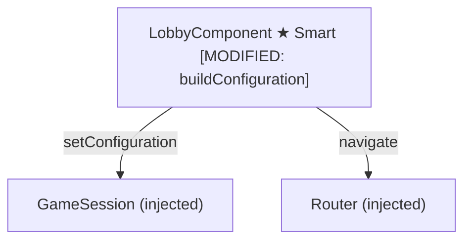
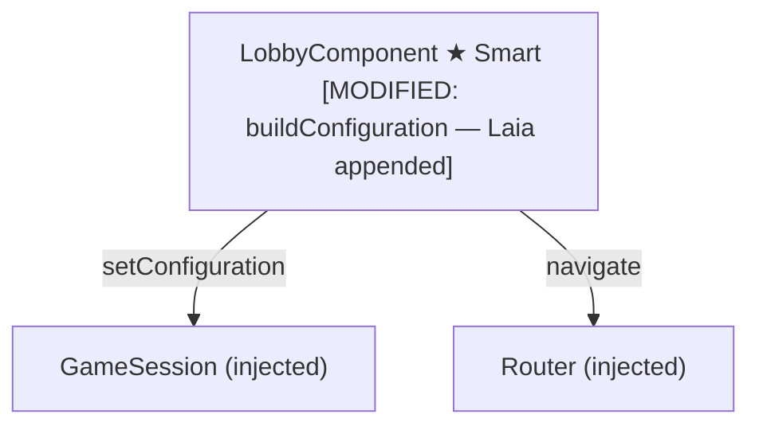

# Review Report: Single Player Mode — AI Opponent (Laia)

**Review Mode:** Incremental (T-1: Lobby registers "Laia" as the second player name in Single Player configuration) — Implementation complete
**Source:** `docs/specs/single-player/ai-opponent/`
**Reviewed against:** proposal.md, spec.md, user-stories.md, bdd-test.md, design.md, tasks.md

## 1. Executive Summary

Full implementation review of T-1. The Lobby component's `buildConfiguration()` method now correctly includes both the human player name at index 0 and the fixed string "Laia" at index 1 in the `playerNames` array when mode is Single Player. The `playerCount` remains 2 and `aiDifficulty` is passed through unchanged. The Multiplayer path is completely unaffected — it continues to use only human-entered names. The implementation is a minimal, correct change that exactly matches AD-1.

Three unit tests comprehensively validate the configuration payload: one with the default name, one with a custom name and non-default difficulty, and one multiplayer regression guard. All tests are meaningful with full object shape assertions via `toHaveBeenCalledWith`. The implementation follows Angular best practices: `inject()` for DI, signal-based state, signal forms, standalone component. No architecture drift, no regressions, no security concerns.

Two previously identified findings remain open from the RED phase review — both are low-impact documentation observations.

- Total findings: 5 (0 Critical, 0 Major, 1 Minor, 1 Note) — 3 resolved, 2 open
- Spec compliance: 2 of 2 requirements fully met (FR-1.1, FR-1.2)
- Architecture alignment: fully aligned with AD-1
- Test quality: meaningful — all configuration assertions verify the full object shape with exact matching

## 2. Architecture Comparison

### 2.1 Planned Component Tree (T-1 scope)

T-1 modifies only the Lobby component's internal `buildConfiguration()` method. No component tree changes are planned.

### 2.2 Actual Component Tree

The Lobby component's `buildConfiguration()` method has been updated exactly as specified. No structural changes — only the internal construction of the `playerNames` array was modified.

### 2.3 Drift Analysis

No architecture drift. The implementation exactly matches AD-1: the `buildConfiguration()` method appends the fixed string "Laia" as the second entry in `playerNames` when mode is Single Player. The component tree, service dependencies, routing, and injection scopes are entirely unchanged. The `GameConfiguration` type and `GameSession` service required no modifications, as specified.

The `currentPlayerNames()` helper method (used only for form validation via `isPlayDisabled`) correctly continues to return only the human name in Single Player mode — "Laia" is not included in validation checks since it is hardcoded and always valid. This separation between the validation helper and the configuration builder is a clean design choice.

## 3. Findings

### RV-01: Missing test for custom player name combined with Laia [Major] — RESOLVED

- **Category:** Test Coverage
- **Severity:** Major → Resolved
- **Related:** FR-1.1, US-1, SC-01, T-1 AC #1
- **Resolution:** The test "stores the entered single player name and Laia when starting a game" enters the custom name "Carlos", selects "Hard" difficulty, clicks Jugar, and asserts the full configuration including both the custom name at index 0 and "Laia" at index 1. This directly satisfies FR-1.1 and maps to SC-01.

### RV-02: Missing multiplayer regression test for T-1 [Major] — RESOLVED

- **Category:** Test Coverage
- **Severity:** Major → Resolved
- **Related:** FR-1.1, T-1 AC #4
- **Resolution:** The test "keeps multiplayer configuration payload unchanged when starting multiplayer" switches to Multiplayer mode, enters "Ana" and "Luis" as player names, clicks Jugar, and asserts that the configuration contains only those two human names without "Laia". This correctly serves as a regression guard.

### RV-03: No explicit assertion for FR-1.2 array index semantics [Minor]

- **Category:** Test Coverage
- **Severity:** Minor
- **Related:** FR-1.2, AD-1, AD-2, T-1 AC #2
- **Description:** FR-1.2 specifies that the human player is always at index 0 and Laia is always at index 1 in the `playerNames` array. Both configuration tests implicitly validate this through array literal assertions, since `toHaveBeenCalledWith` performs exact matching including array order. However, neither test title explicitly calls out the index-position contract.
- **Expected:** The importance of array ordering (FR-1.2, AD-2) warrants a descriptive test name or comment that documents why the order matters — the AI player identity (AD-2) depends on "Laia" always being at index 1.
- **Actual:** The second test name ("stores the entered single player name and Laia when starting a game") is more descriptive than the first and makes the presence of "Laia" explicit, but neither test references index positions. The traceability to FR-1.2 and AD-2 is not self-evident from the test names alone.
- **Recommendation:** Consider renaming the default-name test to something like "registers human at index 0 and Laia at index 1 in the default Single Player configuration" to document the index contract explicitly.
- **Impact:** Low functional risk (the implicit validation works via exact array matching across two tests). Reduced documentation value only.

### RV-04: No test for non-default difficulty combined with Laia registration [Minor] — RESOLVED

- **Category:** Test Coverage
- **Severity:** Minor → Resolved
- **Related:** FR-1.1, SC-05, T-1 AC #5
- **Resolution:** The test "stores the entered single player name and Laia when starting a game" selects "Hard" difficulty and asserts the full configuration object including both `aiDifficulty: 'Hard'` and `playerNames: ['Carlos', 'Laia']`. This covers SC-05 at the unit level and confirms difficulty changes do not interfere with Laia registration.

### RV-05: Superficial `toBeTruthy()` assertion on component instance [Note]

- **Category:** Test Quality
- **Severity:** Note
- **Related:** T-1 (general test quality)
- **Description:** The first test "renders the hero title and decorative element" begins with `expect(component).toBeTruthy()` before proceeding to meaningful assertions about heading content and the decorative element.
- **Expected:** Tests should assert behaviour, not existence. The `toBeTruthy()` check on the component instance is a no-op — if the component failed to create, the `TestBed.createComponent` call in `beforeEach` would have thrown.
- **Actual:** The `toBeTruthy()` line provides no additional confidence. The subsequent assertions (heading text, decorative element) are meaningful and sufficient.
- **Recommendation:** This is a pre-existing pattern unrelated to T-1. No action needed for this task. Note it for future cleanup.
- **Impact:** None — the test is otherwise meaningful. The superficial line is harmless but does not contribute to coverage.

## 4. Traceability Matrix

| Finding | Severity  | Category      | Related Spec                   | Status      |
| ------- | --------- | ------------- | ------------------------------ | ----------- |
| RV-01   | ~~Major~~ | Test Coverage | FR-1.1, US-1, SC-01, T-1 AC #1 | ✅ Resolved |
| RV-02   | ~~Major~~ | Test Coverage | FR-1.1, T-1 AC #4              | ✅ Resolved |
| RV-03   | Minor     | Test Coverage | FR-1.2, AD-1, AD-2, T-1 AC #2  | Open        |
| RV-04   | ~~Minor~~ | Test Coverage | FR-1.1, SC-05, T-1 AC #5       | ✅ Resolved |
| RV-05   | Note      | Test Quality  | —                              | Open        |

## 5. Spec Compliance Summary

| Requirement | Status | Notes                                                                                                                                                                                                                                                                                  |
| ----------- | ------ | -------------------------------------------------------------------------------------------------------------------------------------------------------------------------------------------------------------------------------------------------------------------------------------- |
| FR-1.1      | ✅ Met | The `buildConfiguration()` method constructs a two-element `playerNames` array with the human name and "Laia" in Single Player mode. Two unit tests assert the full configuration payload. Multiplayer regression test confirms "Laia" does not leak into multiplayer payloads.        |
| FR-1.2      | ✅ Met | The array literal in `buildConfiguration()` places the human name at index 0 and "Laia" at index 1. Both unit tests validate this order implicitly via `toHaveBeenCalledWith` exact matching on array literals. Minor: test names do not explicitly reference index positions (RV-03). |

## 6. Task Completion Summary

| Task | Title                                        | Status      | Findings                       |
| ---- | -------------------------------------------- | ----------- | ------------------------------ |
| T-1  | Lobby registers "Laia" as second player name | ✅ Complete | RV-03, RV-05 (minor/note only) |

### Implementation Assessment

The implementation consists of a single change in the `buildConfiguration()` method of the Lobby component. In the Single Player branch, the `playerNames` array is now constructed with two elements: the human name from the signal form at index 0 and the hardcoded string "Laia" at index 1. The `playerCount` remains 2. The Multiplayer branch is untouched.

**Angular best practices compliance:**

- Uses `inject()` for dependency injection (Router, GameSession, DOCUMENT) — correct
- Uses Angular signals for all reactive state (`mode`, `aiDifficulty`, `multiplayerPlayerCount`, form models) — correct
- Uses signal forms (`form()` from `@angular/forms/signals`) for form management — correct for Angular 21
- Component selector is `app-lobby` with kebab-case — matches ESLint rule
- Standalone component with `imports` array — correct
- No unnecessary change detection manipulation — correct

**Implementation correctness:**

- `buildConfiguration()` correctly separates the Single Player and Multiplayer paths
- The `currentPlayerNames()` method (used for validation) correctly returns only the human name in Single Player mode — "Laia" is excluded from validation since it is always valid
- The form validation logic (`isPlayDisabled`, `singleNameErrorVisible`) is unaffected
- The `hydrateFromSessionConfiguration()` method correctly handles re-population from a stored configuration without special-casing "Laia"

### T-1 Acceptance Criteria Checklist

| AC                                                                     | Status | Evidence                                                                                                                                   |
| ---------------------------------------------------------------------- | ------ | ------------------------------------------------------------------------------------------------------------------------------------------ |
| Starting a Single Player match results in two players including "Laia" | ✅ Met | `buildConfiguration()` returns `playerNames: [humanName, 'Laia']`; verified by two unit tests                                              |
| Human at index 0, Laia at index 1                                      | ✅ Met | Array literal order in `buildConfiguration()`; validated by exact array matching in tests                                                  |
| Lobby form still validates human name                                  | ✅ Met | `currentPlayerNames()` returns only the human name; existing validation tests pass                                                         |
| Multiplayer mode is unaffected                                         | ✅ Met | Multiplayer branch in `buildConfiguration()` uses `currentPlayerNames()` which never includes "Laia"; multiplayer regression test confirms |
| `aiDifficulty` and `playerCount` correct                               | ✅ Met | Both fields passed through correctly in both configuration branches; asserted in unit tests (both "Easy" and "Hard" difficulty variants)   |

## 7. Test Coverage Summary

| Scenario | Step Definitions                                                       | Meaningful | Findings |
| -------- | ---------------------------------------------------------------------- | ---------- | -------- |
| SC-01    | ✅ Yes (unit: custom name "Carlos" + "Laia" asserted in configuration) | ✅ Yes     | —        |
| SC-02    | ✅ Yes (covered by existing lobby validation tests)                    | ✅ Yes     | —        |
| SC-03    | ✅ Yes (covered by existing route guard E2E)                           | ✅ Yes     | —        |
| SC-04    | ✅ Yes (unit: "shows single player setup defaults"; E2E: SC-15)        | ✅ Yes     | —        |
| SC-05    | ✅ Yes (unit: "Hard" difficulty variant asserted with "Laia")          | ✅ Yes     | —        |

## 8. Test Quality Summary

| Test File                | Type | Meaningful Assertions | Issues                                                                                                                                                                                         |
| ------------------------ | ---- | --------------------- | ---------------------------------------------------------------------------------------------------------------------------------------------------------------------------------------------- |
| lobby.spec.ts            | Unit | ✅ Yes                | All three configuration-payload tests use `toHaveBeenCalledWith` with full object matching — meaningful and precise. One pre-existing superficial `toBeTruthy()` in an unrelated test (RV-05). |
| lobby.feature / lobby.ts | E2E  | ✅ Yes                | E2E tests are well-structured and meaningful. No T-1-specific E2E updates needed (E2E coverage for SC-01/SC-05 deferred to T-14).                                                              |

## 9. Security Cross-Reference

The companion security report (`security-report_T-1.md`) was generated during the RED phase review and reports 0 findings at any severity. T-1's implementation change — appending a hardcoded string literal to an array — introduces no new security surface. There is no user input flowing into the "Laia" value (it is hardcoded), no dynamic code execution, no network or storage changes, and no authentication or authorisation impact. The security assessment from the RED phase remains valid for the implementation phase.

No Critical or High security findings apply.

## 10. Recommendations

### Critical (blocks release)

None.

### Major (fix before merge)

None.

### Minor (improvement)

1. **Improve test naming for FR-1.2 traceability (RV-03):** Consider renaming the default-name configuration test to explicitly reference the index contract (e.g., "registers human at index 0 and Laia at index 1 in the default Single Player configuration"). Low priority — the implicit validation is functionally correct.

### Notes (informational)

1. **Pre-existing `toBeTruthy()` (RV-05):** Consider removing in a future cleanup pass. Not blocking for T-1.
2. **Traceability comment:** The comment at the top of the test file references requirements from the UI Lobby spec (FR-2.x through FR-7.x) but does not mention FR-1.1 or FR-1.2 from the AI Opponent spec. Consider adding the AI Opponent requirement references to the comment for completeness.
