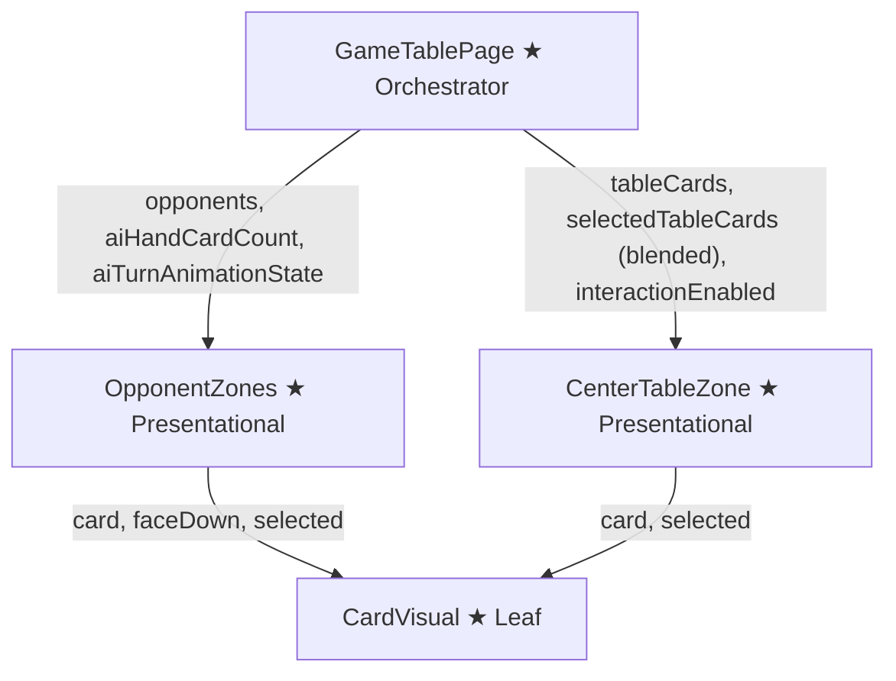
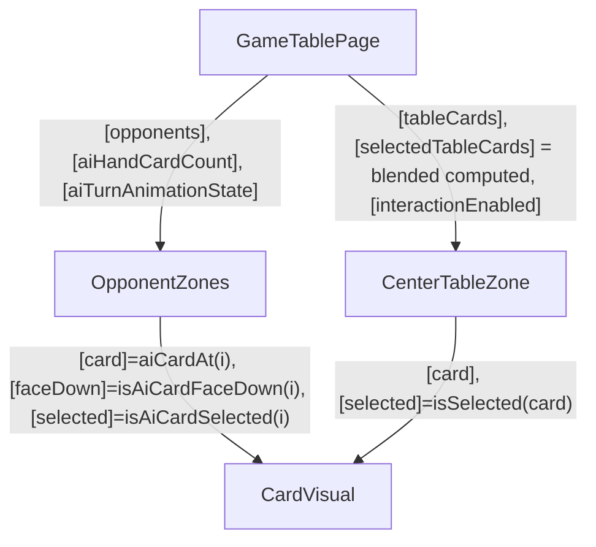

# Review Report: Wire AI Animation State to Zones (T-10)

**Review Mode:** Incremental (T-10: Wire animation state to OpponentZones and CenterTableZone in GameTablePage template)
**Source:** `docs/specs/single-player/ai-opponent/`
**Reviewed against:** proposal.md, spec.md, user-stories.md, bdd-test.md, design.md, tasks.md

## 1. Executive Summary

T-10 is implemented correctly and faithfully. The GameTablePage template passes `aiHandCardCount` and `aiTurnAnimationState` to OpponentZones, and the blended `selectedTableCards` computed cleanly switches between AI-highlighted cards (during `capture-previewing`) and the human's selection (at all other times). Multiplayer suppression is correct — `aiHandCardCount` returns 0 when the mode is not Single Player. The two T-10 unit tests are meaningful and traceable. One Minor finding and two Notes are documented below.

- **Total findings:** 3 (0 Critical, 0 Major, 1 Minor, 2 Note)
- **Spec compliance:** 5 of 5 T-10 acceptance criteria met
- **Architecture alignment:** aligned (one minor layering deviation, confirmed intentional)
- **Test quality:** meaningful

## 2. Architecture Comparison

### 2.1 Planned Component Tree (design.md section 2.1 — T-10 scope)

### 2.2 Actual Component Tree

### 2.3 Drift Analysis

No structural drift. The template bindings match the planned wiring exactly:

- OpponentZones receives `aiHandCardCount()` and `aiTurnAnimationState()` as inputs.
- CenterTableZone receives the blended `selectedTableCards()` computed, which returns `aiHighlightedTableCards` during `capture-previewing` and the human's selection otherwise.
- The `aiHighlightedTableCards` computed exists (introduced in T-8) but the blended `selectedTableCards` reads `aiTurnAnimationState().highlightedTableCards` directly for simplicity. This was confirmed as intentional; there is no functional difference.

## 3. Findings

### RV-01: OpponentZones re-declares AiTurnAnimationState types locally [Minor]

- **Category:** Code Quality
- **Severity:** Minor
- **Related:** AD-10, T-3, T-10
- **Description:** OpponentZones defines its own `AiTurnAnimationPhase` type alias, `AiTurnAnimationState` interface, and `AI_TURN_IDLE` constant locally instead of importing from the canonical `src/app/models/ai-turn.ts` module.
- **Expected:** Per design.md section 8 and AD-10, the `AiTurnAnimationState` type is defined in its own file precisely so that both the service and the orchestration (and by extension, presentational components) can import it without circular dependencies.
- **Actual:** OpponentZones declares a structurally identical but separate copy of the type, the phase union, and the idle constant.
- **Recommendation:** Replace the local declarations in OpponentZones with imports from `src/app/models/ai-turn.ts`. This was introduced by T-3, not T-10, but it affects the type safety of T-10's wiring path.
- **Impact:** If the canonical `AiTurnAnimationState` type is extended (e.g., a new phase is added), the local copy in OpponentZones will not reflect the change, potentially causing silent type mismatches at runtime.

### RV-02: No explicit test for the human-selection fallback branch of the blended computed [Note]

- **Category:** Test Coverage
- **Severity:** Note
- **Related:** AD-5, T-10, SC-10, SC-11
- **Description:** The blended `selectedTableCards` computed has two branches: (1) return AI highlighted cards when phase is `capture-previewing`, and (2) return the human's selected table cards otherwise. The T-10 test suite explicitly covers branch 1 but does not include a dedicated assertion for branch 2 in the context of AI animation phases like `deliberating` or `card-selected`.
- **Expected:** An explicit T-10 test verifying that during non-`capture-previewing` AI animation phases, CenterTableZone still receives the human's selection.
- **Actual:** Branch 2 is implicitly covered by all pre-existing human-interaction tests (which run with `aiTurnAnimationState` at idle). The risk is extremely low.
- **Recommendation:** No action needed — the implicit coverage is sufficient for this simple two-branch computed. Documented for completeness.
- **Impact:** Negligible. A regression in this branch would be caught by dozens of existing tests.

### RV-03: OpponentZones uses decorator-based @Input() instead of signal-based input() [Note]

- **Category:** Code Quality
- **Severity:** Note
- **Related:** T-3, AD-8
- **Description:** The `aiHandCardCount` and `aiTurnAnimationState` inputs on OpponentZones use the `@Input() set/get` decorator pattern backed by internal writable signals, rather than Angular 21's `input()` / `input.required()` signal-based input functions recommended in the project's Angular developer instructions.
- **Expected:** Signal-based inputs per the Angular 21 guidelines in `.github/instructions/angular-developer.instructions.md`.
- **Actual:** Decorator-based inputs consistent with the pre-existing pattern used for the `opponents` input. This pattern was established before T-10 and is not introduced by this task.
- **Recommendation:** This is a pre-existing pattern from T-3. If a future cleanup pass modernises OpponentZones inputs, all three inputs should be migrated together. Not actionable for T-10.
- **Impact:** No functional impact. The decorator pattern works correctly; it is a style deviation from the Angular 21 recommendation.

## 4. Traceability Matrix

| Finding | Severity | Category      | Related Spec       | Status                       |
| ------- | -------- | ------------- | ------------------ | ---------------------------- |
| RV-01   | Minor    | Code Quality  | AD-10, T-3, T-10   | Open                         |
| RV-02   | Note     | Test Coverage | AD-5, SC-10, SC-11 | Open (no action needed)      |
| RV-03   | Note     | Code Quality  | T-3, AD-8          | Open (deferred to T-3 scope) |

## 5. Spec Compliance Summary

| Requirement                                  | Status | Notes                                                                              |
| -------------------------------------------- | ------ | ---------------------------------------------------------------------------------- |
| FR-6.1 (AI hand zone enters active state)    | ✅ Met | `aiTurnAnimationState` wired to OpponentZones; `isAiHandActive()` drives CSS class |
| FR-6.2 (Selected card highlighted)           | ✅ Met | `selectedCardIndex` flows through to CardVisual `[selected]` binding               |
| FR-6.3 (Card flipped face-up for capture)    | ✅ Met | `revealedCard` flows through to CardVisual `[card]` and `[faceDown]` bindings      |
| FR-6.4 (Capture subset highlighted on table) | ✅ Met | Blended computed returns `highlightedTableCards` during `capture-previewing`       |
| FR-8.1 (Face-down in single player)          | ✅ Met | `aiHandCardCount` passes count, not Card[]; OpponentZones renders face-down        |
| FR-8.2 (Face-down at all difficulties)       | ✅ Met | `aiHandCardCount` is difficulty-independent                                        |
| FR-8.3 (Selected card distinguished)         | ✅ Met | `isAiCardSelected(index)` applies selected visual state                            |
| FR-8.4 (Card revealed face-up for capture)   | ✅ Met | `aiCardAt(index)` returns `revealedCard` when selectedCardIndex matches            |
| TR-4.1 (Face-down driven by input)           | ✅ Met | `aiHandCardCount` and `aiTurnAnimationState` are input-driven                      |
| US-3 (Animation visible to human)            | ✅ Met | Template wiring enables all animation phases to render                             |
| US-5 (Cards always face-down)                | ✅ Met | Card identities never in template except during intentional reveal                 |

## 6. Task Completion Summary

| Task | Title                                                     | Status      | Findings            |
| ---- | --------------------------------------------------------- | ----------- | ------------------- |
| T-10 | Wire animation state to OpponentZones and CenterTableZone | ✅ Complete | RV-01, RV-02, RV-03 |

### T-10 Acceptance Criteria Verification

| Criterion                                                                                    | Status |
| -------------------------------------------------------------------------------------------- | ------ |
| During `capture-previewing`, CenterTableZone highlights AI's capture subset                  | ✅ Met |
| During all other phases, CenterTableZone highlights human's selected table cards             | ✅ Met |
| OpponentZones renders face-down cards from `aiHandCardCount` and responds to animation state | ✅ Met |
| No existing input bindings broken                                                            | ✅ Met |
| In Multiplayer, `aiHandCardCount` is 0 and `aiTurnAnimationState` is idle                    | ✅ Met |

## 7. Test Coverage Summary

| Scenario                               | Step Definitions                 | Meaningful | Findings |
| -------------------------------------- | -------------------------------- | ---------- | -------- |
| SC-10 (Full capture animation)         | ✅ Yes (T-9 orchestration tests) | ✅ Yes     | —        |
| SC-11 (Placement animation)            | ✅ Yes (T-9 orchestration tests) | ✅ Yes     | —        |
| SC-18 (Face-down cards throughout)     | ✅ Yes (OpponentZones spec)      | ✅ Yes     | —        |
| SC-19 (Card revealed face-up)          | ✅ Yes (OpponentZones spec)      | ✅ Yes     | —        |
| SC-20 (Placement card stays face-down) | ✅ Yes (T-9 orchestration tests) | ✅ Yes     | —        |
| SC-22 (Multiplayer unaffected)         | ✅ Yes (T-10 suppression test)   | ✅ Yes     | —        |

## 8. Test Quality Summary

| Test File                                                                         | Type | Meaningful Assertions | Issues                                                                                  |
| --------------------------------------------------------------------------------- | ---- | --------------------- | --------------------------------------------------------------------------------------- |
| game-table-page.spec.ts ("T-10 / AD-5 - blends AI highlighted cards…")            | Unit | ✅ Yes                | None — verifies computed value, CenterTableZone binding, and OpponentZones bindings     |
| game-table-page.spec.ts ("T-10 / AD-8 - suppresses AI hand cards in Multiplayer") | Unit | ✅ Yes                | None — verifies computed returns 0, animation state is idle, and no AI hand zone in DOM |
| opponent-zones.spec.ts (renders AI hand card backs)                               | Unit | ✅ Yes                | None — verifies card count, aria-label "Carta oculta"                                   |
| opponent-zones.spec.ts (applies active styling)                                   | Unit | ✅ Yes                | None — verifies CSS class on ai-hand-zone                                               |
| opponent-zones.spec.ts (marks selected AI card)                                   | Unit | ✅ Yes                | None — verifies CSS class on selected vs unselected cards                               |
| opponent-zones.spec.ts (reveals selected AI card)                                 | Unit | ✅ Yes                | None — verifies face-up image src vs face-down image src                                |

## 9. Security Cross-Reference

No Critical or High security findings. See `docs/specs/single-player/ai-opponent/security-report_T-10.md` for the full assessment. T-10 introduces no new attack surface — it is purely a template-wiring change using Angular property bindings with information disclosure mitigated by the count-not-cards design (AD-8).

## 10. Recommendations

### Minor (improvement)

1. **RV-01:** Replace the local `AiTurnAnimationState` type declarations in OpponentZones with imports from `src/app/models/ai-turn.ts` to eliminate the duplicated type definition. This is a T-3 remediation item that should be addressed before the feature is considered complete.

### Notes (informational)

1. **RV-02:** The fallback branch of the blended `selectedTableCards` computed is implicitly covered by dozens of pre-existing tests. No additional test is needed.
2. **RV-03:** The `@Input() set/get` pattern in OpponentZones is consistent with the component's pre-existing style. A future modernisation pass to signal-based `input()` could address all three inputs together.
