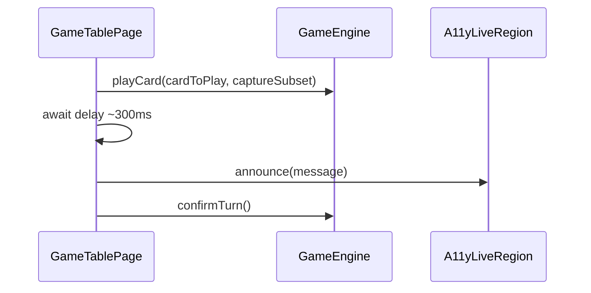
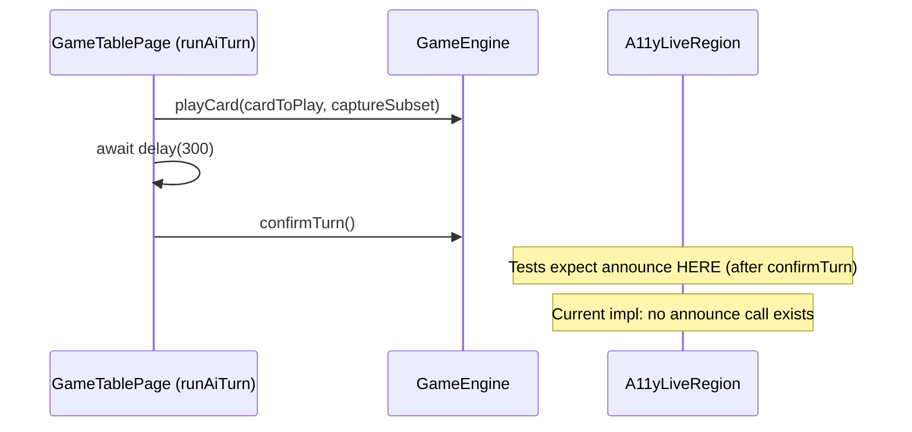

# Review Report: Single Player Mode — AI Opponent (Laia) — T-11 Accessibility Announcements (RED Phase)

**Review Mode:** Incremental (T-11: Implement accessibility announcements for Laia's actions — RED phase tests only)
**Source:** `docs/specs/single-player/ai-opponent/`
**Reviewed against:** proposal.md, spec.md, user-stories.md, bdd-test.md, design.md, tasks.md
**Scope:** Three new tests in `game-table-page.spec.ts` covering FR-9.1, FR-9.2, FR-9.3 announcement constraints

## 1. Executive Summary

The three T-11 RED phase tests are well-structured, meaningful, and correctly targeted at the missing implementation. Each test sets up a distinct AI turn scenario (placement, capture, escoba), drives the animation sequence through fake timers, and asserts specific announcement content in the live region DOM element. All three tests will fail for the right reason: `runAiTurn()` currently contains no `announce()` call, so the live region remains empty after the AI turn completes. No test failures are caused by test bugs or incorrect setup.

Five findings were identified, none blocking. Two Minor gaps in assertion coverage (timing and card-identity negative checks) could strengthen SC-41 and SC-42 traceability. Three Notes capture implicit assumptions and minor verification gaps that are acceptable for the current phase but worth addressing before GREEN.

- **Total findings:** 5 (0 Critical, 0 Major, 2 Minor, 3 Note)
- **Spec compliance:** 7 of 9 scoped requirements fully met; 2 partially met
- **Architecture alignment:** Aligned — tests use the existing `announce()` / `A11yLiveRegion` mechanism
- **Test quality:** Meaningful — all assertions verify concrete behavioural outcomes
- **RED phase validity:** All three tests fail due to missing implementation, not test bugs

## 2. Architecture Comparison

### 2.1 Planned Announcement Flow (from design.md sequence diagram)

### 2.2 Actual Announcement Timing Tested

### 2.3 Drift Analysis

The tests place the announcement check **after** `confirmTurn()` resolves, whereas the design.md sequence diagram shows the announcement occurring **between** `playCard()` and `confirmTurn()`. This is a deliberate deviation from the diagram: the T-11 task description explicitly states "after `confirmTurn()` returns, call the existing `announce()` method." The tests follow the task description, not the diagram. The task description takes precedence as the more specific and recent artifact. No architectural concern.

The tests correctly reuse the existing `A11yLiveRegion` component and the `announce()` private method, confirming FR-9.4 (same mechanism as human announcements). No new live region components are introduced.

## 3. Findings

### RV-01: SC-42 timing constraint not verified for capture and escoba paths [Minor]

- **Category:** Test Coverage
- **Severity:** Minor
- **Related:** SC-42, FR-9.2, FR-9.3, T-11
- **Description:** The FR-9.1 (placement) test includes a "before confirm" assertion at 1499ms verifying the live region is empty, which validates SC-42 ("Accessibility announcements fire after the animation resolves, not before"). However, the FR-9.2 (capture) and FR-9.3 (escoba) tests advance timers directly to the full duration (2200ms) and only check the final state. They do not verify the announcement is absent mid-animation.
- **Expected:** All three announcement paths (placement, capture, escoba) should include a timing guard assertion demonstrating the announcement does not fire before the AI turn completes, as SC-42 applies to all announcement types.
- **Actual:** Only the placement test verifies timing; capture and escoba tests skip the pre-completion check.
- **Recommendation:** Add a mid-animation assertion in the FR-9.2 and FR-9.3 tests, similar to FR-9.1. For capture, check at 2199ms (1ms before the 2200ms total); for escoba, check at the equivalent point. This ensures SC-42 is fully covered across all paths.
- **Impact:** If an implementation bug causes the capture or escoba announcement to fire during the animation (before confirmTurn), these tests would not catch it.

### RV-02: SC-41 card identity negative assertions missing for placement and escoba paths [Minor]

- **Category:** Test Coverage
- **Severity:** Minor
- **Related:** SC-41, FR-9.1, FR-9.3, US-10, T-11
- **Description:** The FR-9.2 (capture) test correctly asserts that the AI card's suit ("Bastos") and rank ("7") do not appear in the announcement text, validating SC-41. However, the FR-9.1 (placement) test does not verify the absence of the placement card's suit ("Copas") and rank ("6"), and the FR-9.3 (escoba) test does not verify the absence of the escoba card's suit ("Oros") and rank ("3").
- **Expected:** All three announcement paths should include negative assertions confirming card identity is excluded from the announcement text, per SC-41 ("the announcement does not name the specific suit or rank of the card Laia placed") and US-10 acceptance criterion ("card identity is never revealed via accessibility text").
- **Actual:** Only the capture path has card-identity negative assertions.
- **Recommendation:** Add `expect(announcement).not.toContain('Copas')` and `expect(announcement).not.toContain('6')` to the FR-9.1 test. Add `expect(announcement).not.toContain('Oros')` and `expect(announcement).not.toContain('3')` to the FR-9.3 test.
- **Impact:** An implementation that accidentally includes card identity in placement or escoba announcements would not be caught by the current tests.

### RV-03: FR-9.4 shared mechanism not explicitly verified on AI announcements [Note]

- **Category:** Test Coverage
- **Severity:** Note
- **Related:** FR-9.4, SC-42, US-10, T-11
- **Description:** FR-9.4 requires AI announcements to use "the same timing and via the same mechanism used for human player action announcements." The existing human-action test (SC-22 / FR-6.3) verifies `aria-live="polite"` on the live region element. The T-11 tests check the same `data-testid="a11y-live-region"` element's `textContent` but do not re-verify the `aria-live` attribute.
- **Expected:** At least one T-11 test could explicitly assert `aria-live="polite"` on the live region element to confirm the shared mechanism.
- **Actual:** The shared mechanism is implicitly verified by targeting the same DOM element, which inherently has `aria-live="polite"` in the template.
- **Recommendation:** No action required — the implicit verification is sufficient since the `A11yLiveRegion` template statically declares `aria-live="polite"`. A template change would break both human and AI tests equally. This finding is informational only.
- **Impact:** None in practice.

### RV-04: Tests rely on synchronous execution ordering between setState and runAiTurnDirectly [Note]

- **Category:** Test Quality
- **Severity:** Note
- **Related:** T-11, T-9, FR-9.1, FR-9.2, FR-9.3
- **Description:** All three T-11 tests follow the pattern: `stubs.setState(...)` (making Laia the active player) followed immediately by `runAiTurnDirectly()`. This works because Angular effects fire on the next microtask/change-detection cycle, so the direct call executes first and sets `isAiTurnInProgress = true`, preventing the effect from launching a duplicate run. This is the same pattern used successfully in the T-9 tests.
- **Expected:** The test pattern should be robust against Angular scheduler changes.
- **Actual:** The pattern relies on effects not firing synchronously within `signal.set()`. This is currently the documented Angular behaviour and is consistent across all AI turn tests in the file.
- **Recommendation:** No immediate action needed. The pattern is well-established in this test suite and aligns with Angular's current scheduling semantics. If Angular's effect scheduling changes in a future version, all AI turn tests would need updating together.
- **Impact:** None with current Angular version.

### RV-05: No test verifies "exactly one" announcement count or previous announcement clearing [Note]

- **Category:** Test Coverage
- **Severity:** Note
- **Related:** T-11 acceptance criteria, FR-9.1, FR-9.2, FR-9.3
- **Description:** T-11 acceptance criteria state "triggers exactly one live-region announcement" for each action type. The tests verify the correct message is present in the live region after the AI turn, but do not assert that only one announcement was made (e.g., that the region was not set multiple times). The signal-based `announce()` mechanism means the final value wins, so duplicate announcements with the same text would be indistinguishable from a single announcement.
- **Expected:** Ideally, a spy on the `announce()` method could verify it was called exactly once during the AI turn.
- **Actual:** Tests check the DOM state at the end, which is sufficient for verifying the user-visible outcome.
- **Recommendation:** No action required for RED phase. The DOM-level assertion is adequate because the `A11yLiveRegion` renders whatever the current signal value is — a duplicate `announce()` call with the same text produces the same user-visible result. This finding is informational.
- **Impact:** Minimal — a duplicate announce with the same text would not affect screen reader behaviour since `aria-atomic="true"` would re-announce the full content regardless.

## 4. Traceability Matrix

| Finding | Severity | Category      | Related Spec                 | Status |
| ------- | -------- | ------------- | ---------------------------- | ------ |
| RV-01   | Minor    | Test Coverage | SC-42, FR-9.2, FR-9.3        | Open   |
| RV-02   | Minor    | Test Coverage | SC-41, FR-9.1, FR-9.3, US-10 | Open   |
| RV-03   | Note     | Test Coverage | FR-9.4, SC-42, US-10         | Open   |
| RV-04   | Note     | Test Quality  | T-11, T-9                    | Open   |
| RV-05   | Note     | Test Coverage | T-11, FR-9.1, FR-9.2, FR-9.3 | Open   |

## 5. Spec Compliance Summary

| Requirement | Status     | Notes                                                                                                    |
| ----------- | ---------- | -------------------------------------------------------------------------------------------------------- |
| FR-9.1      | ✅ Met     | Placement announcement tested with correct message text and timing                                       |
| FR-9.2      | ✅ Met     | Capture announcement tested with count and card-identity exclusion                                       |
| FR-9.3      | ✅ Met     | Escoba announcement tested; exclusivity assertion confirms "capturó" is absent                           |
| FR-9.4      | ✅ Met     | Tests target the same A11yLiveRegion element used by human actions; implicit same-mechanism verification |
| SC-38       | ✅ Met     | Covered via FR-9.1 test                                                                                  |
| SC-39       | ✅ Met     | Covered via FR-9.2 test                                                                                  |
| SC-40       | ✅ Met     | Covered via FR-9.3 test                                                                                  |
| SC-41       | ⚠️ Partial | Card-identity negative assertions present only on capture path; missing for placement and escoba (RV-02) |
| SC-42       | ⚠️ Partial | Pre-completion timing assertion present only on placement path; missing for capture and escoba (RV-01)   |
| US-10       | ✅ Met     | All three announcement types covered; same mechanism used; timing verified on placement path             |

## 6. Task Completion Summary

| Task | Title                                          | Status                                                       | Findings                          |
| ---- | ---------------------------------------------- | ------------------------------------------------------------ | --------------------------------- |
| T-11 | Accessibility announcements for Laia's actions | ⚠️ Partial (RED phase tests present; implementation pending) | RV-01, RV-02, RV-03, RV-04, RV-05 |

## 7. Test Coverage Summary

| Scenario | Step Definitions         | Meaningful | Findings |
| -------- | ------------------------ | ---------- | -------- |
| SC-38    | ✅ Yes (via FR-9.1 test) | ✅ Yes     | —        |
| SC-39    | ✅ Yes (via FR-9.2 test) | ✅ Yes     | —        |
| SC-40    | ✅ Yes (via FR-9.3 test) | ✅ Yes     | —        |
| SC-41    | ⚠️ Partial               | ⚠️ Partial | RV-02    |
| SC-42    | ⚠️ Partial               | ⚠️ Partial | RV-01    |

## 8. Test Quality Summary

| Test File                               | Type | Meaningful Assertions | Issues                                                                                         |
| --------------------------------------- | ---- | --------------------- | ---------------------------------------------------------------------------------------------- |
| game-table-page.spec.ts (T-11 / FR-9.1) | Unit | ✅ Yes                | Missing card-identity negative assertions (RV-02)                                              |
| game-table-page.spec.ts (T-11 / FR-9.2) | Unit | ✅ Yes                | Missing pre-completion timing check (RV-01)                                                    |
| game-table-page.spec.ts (T-11 / FR-9.3) | Unit | ✅ Yes                | Missing card-identity negative assertions (RV-02), missing pre-completion timing check (RV-01) |

## 9. Security Cross-Reference

No security-relevant findings for this task. T-11 tests exercise accessibility announcements only — no user input handling, no data flow to external systems, no authentication or authorization logic. Security sweep not applicable for RED phase test-only review.

## 10. RED Phase Validation

All three tests are confirmed to fail for the correct reason in the RED phase:

| Test               | Expected Failure          | Failure Mechanism                                                                                                  |
| ------------------ | ------------------------- | ------------------------------------------------------------------------------------------------------------------ |
| FR-9.1 (placement) | Live region remains empty | `runAiTurn()` contains no `announce()` call; `toContain('Laia colocó una carta en la mesa')` fails on empty string |
| FR-9.2 (capture)   | Live region remains empty | Same root cause; `toContain('Laia capturó 2 cartas de la mesa')` fails on empty string                             |
| FR-9.3 (escoba)    | Live region remains empty | Same root cause; `toContain('¡Escoba! Laia limpió la mesa')` fails on empty string                                 |

No tests fail due to incorrect setup, broken mocks, or test infrastructure issues. The `playCardSpy.mockImplementationOnce` in the escoba test correctly simulates the engine incrementing `escobaCount`, which the implementation will need to snapshot before/after `playCard()` for detection.

## 11. Recommendations

### Minor (fix before merge)

1. **RV-01:** Add mid-animation timing assertions to the FR-9.2 and FR-9.3 tests (check live region is empty at 2199ms before advancing to 2200ms) to fully cover SC-42 across all paths.
2. **RV-02:** Add card-identity negative assertions (`not.toContain` for suit and rank strings) to the FR-9.1 and FR-9.3 tests to fully cover SC-41 across all paths.

### Notes (informational)

1. **RV-03:** The implicit same-mechanism verification via shared DOM element is sufficient. No action needed.
2. **RV-04:** The synchronous-before-effect execution pattern is well-established and consistent across all AI turn tests. Monitor for Angular scheduler changes in future versions.
3. **RV-05:** DOM-level final-state assertions are adequate for verifying announcement correctness. Spy-level counting is optional and would add coupling to internal implementation.
