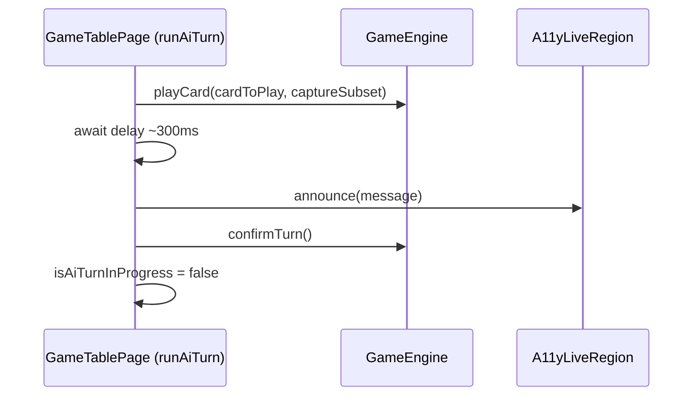
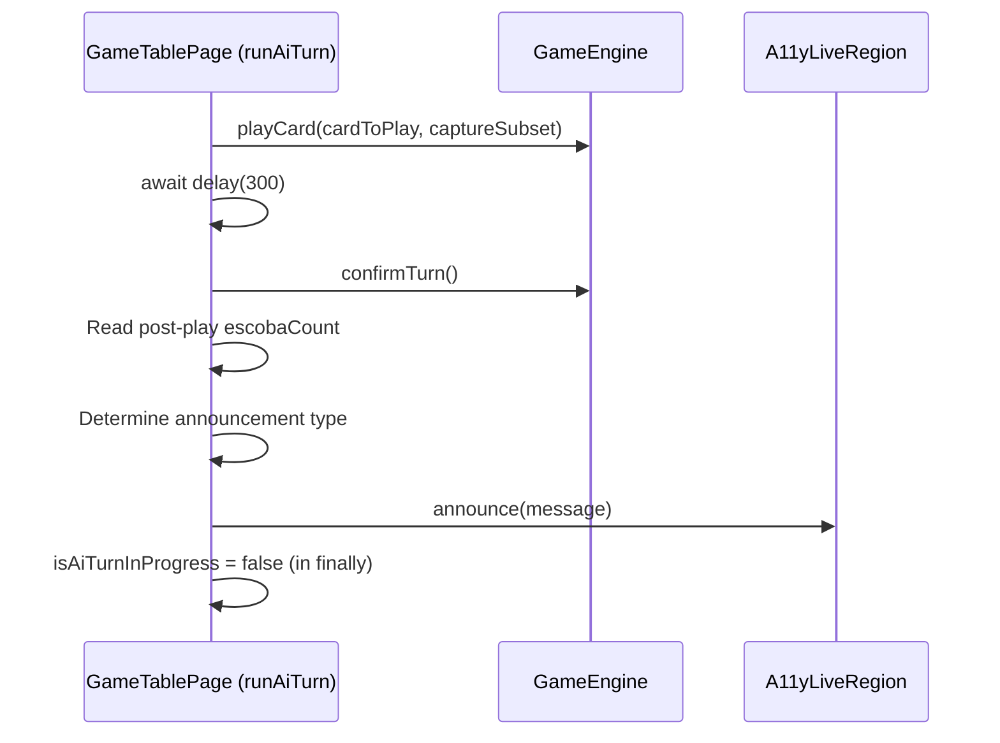

# Review Report: Single Player Mode — AI Opponent (Laia) — T-11 Accessibility Announcements (GREEN Phase)

**Review Mode:** Incremental (T-11: Implement accessibility announcements for Laia's actions)
**Source:** `docs/specs/single-player/ai-opponent/`
**Reviewed against:** proposal.md, spec.md, user-stories.md, bdd-test.md, design.md, tasks.md
**Scope:** Implementation of AI action announcements in `runAiTurn()` within `game-table-page.ts`, plus the three unit tests from the RED phase

## 1. Executive Summary

The T-11 implementation is well-targeted and correctly integrates accessibility announcements for Laia's three action types (placement, capture, escoba) into the existing `runAiTurn()` orchestration method. The announcements fire at the correct point in the turn lifecycle (after `confirmTurn()` returns), reuse the existing `announce()` mechanism and `A11yLiveRegion` component, and do not reveal Laia's card identity. Escoba detection uses the escobaCount snapshot comparison approach specified in the task description.

One Minor code quality finding was identified: the capture announcement always uses the plural "cartas" regardless of count, producing grammatically incorrect Spanish for single-card captures. Two Minor test coverage gaps persisting from the RED-phase review (timing assertions and card-identity negative assertions) remain unaddressed. Two Notes document justified deviations and expected future work.

- **Total findings:** 5 (0 Critical, 0 Major, 3 Minor, 2 Note)
- **Spec compliance:** 7 of 9 scoped requirements fully met; 2 partially met (SC-41, SC-42 tests incomplete)
- **Architecture alignment:** Aligned — minor justified deviation in announce timing relative to the design diagram
- **Test quality:** Meaningful — all three tests verify concrete behavioural outcomes with appropriate assertions

## 2. Architecture Comparison

### 2.1 Planned Announcement Flow (from design.md section 2.3)

### 2.2 Actual Announcement Flow (as implemented)

### 2.3 Drift Analysis

The design.md sequence diagram (section 2.3) positions the `announce(message)` call **between** `playCard()` and `confirmTurn()`. The actual implementation positions it **after** `confirmTurn()`. This deviation is justified: the T-11 task description explicitly states "after `confirmTurn()` returns, call the existing `announce()` method," and the escoba detection logic requires reading the post-`playCard()` engine state, which is stable after `confirmTurn()`. This ordering also matches the existing human `confirmTurn()` method pattern, which announces "Turn changed to ..." after `gameEngine.confirmTurn()`. No architectural concern arises from this deviation.

The announcement mechanism (the private `announce()` method updating `liveAnnouncementState` signal and directly setting `textContent` on the live region DOM element) and the `A11yLiveRegion` component (with `aria-live="polite"` and `aria-atomic="true"`) are identical to those used for human action announcements, satisfying FR-9.4.

## 3. Findings

### RV-01: Capture announcement uses plural "cartas" regardless of count [Minor]

- **Category:** Code Quality
- **Severity:** Minor
- **Related:** FR-9.2, SC-39, US-10
- **Description:** The capture announcement uses the template "Laia capturó N cartas de la mesa" where N is the capture subset length. When Laia captures exactly one table card, the message reads "Laia capturó 1 cartas de la mesa" — grammatically incorrect in Spanish. The plural "cartas" should be "carta" when the count is one.
- **Expected:** Grammatically correct Spanish for all capture counts. Single-card captures should use "carta" (singular); multi-card captures should use "cartas" (plural).
- **Actual:** The message always uses "cartas" (plural) regardless of count. Single-card captures are realistic in Escoba de 15 (e.g., playing a 7 to capture an 8) and would produce the incorrect form.
- **Recommendation:** Add a conditional to select singular or plural form based on the capture count. No new method or abstraction is needed — a simple ternary within the template literal suffices.
- **Impact:** Screen reader users hearing "1 cartas" receive a grammatically incorrect announcement, reducing the polish of the accessibility experience.

### RV-02: SC-42 timing constraint not verified for capture and escoba test paths [Minor]

- **Category:** Test Coverage
- **Severity:** Minor
- **Related:** SC-42, FR-9.2, FR-9.3, T-11
- **Description:** This finding persists from the RED-phase review (RV-01 in review-report_T-11.md). The FR-9.1 (placement) test includes a mid-animation timing assertion at 1499ms verifying the live region is empty before the announcement fires at 1500ms. However, the FR-9.2 (capture) and FR-9.3 (escoba) tests advance timers directly to 2200ms without a corresponding pre-completion check. SC-42 ("Accessibility announcements fire after the animation resolves, not before") applies to all three announcement types.
- **Expected:** All three announcement paths should include a timing guard assertion demonstrating the announcement is absent mid-animation, consistent with SC-42.
- **Actual:** Only the placement path verifies timing; capture and escoba paths skip the pre-completion check.
- **Recommendation:** Add a mid-animation assertion to the FR-9.2 test (check live region is empty at 2199ms before advancing to 2200ms) and similarly for FR-9.3. This ensures SC-42 is fully covered across all announcement paths.
- **Impact:** An implementation bug that causes the capture or escoba announcement to fire prematurely (during animation, before confirmTurn) would not be caught.

### RV-03: SC-41 card-identity negative assertions missing for placement and escoba paths [Minor]

- **Category:** Test Coverage
- **Severity:** Minor
- **Related:** SC-41, FR-9.1, FR-9.3, US-10, T-11
- **Description:** This finding persists from the RED-phase review (RV-02 in review-report_T-11.md). The FR-9.2 (capture) test correctly asserts that the AI card's suit and rank do not appear in the announcement text. However, the FR-9.1 (placement) test does not verify the absence of the placement card's suit ("Copas") and rank ("6"), and the FR-9.3 (escoba) test does not verify the absence of the escoba card's suit ("Oros") and rank ("3"). SC-41 requires card identity to not be revealed in accessibility text for any announcement variant.
- **Expected:** All three announcement paths should include negative assertions confirming card identity is excluded, per SC-41 and US-10 acceptance criteria.
- **Actual:** Only the capture path has card-identity negative assertions.
- **Recommendation:** Add suit and rank negative assertions to the FR-9.1 and FR-9.3 tests, mirroring the pattern already established in FR-9.2.
- **Impact:** A future implementation change that accidentally includes card identity in placement or escoba announcements would not be detected.

### RV-04: Design diagram shows announce before confirmTurn; implementation places it after [Note]

- **Category:** Architecture Drift
- **Severity:** Note
- **Related:** AD-5, T-11, T-9
- **Description:** The design.md sequence diagram (section 2.3) shows the announce call occurring between playCard and confirmTurn. The implementation places it after confirmTurn. This aligns with the T-11 task description ("after `confirmTurn()` returns") and with the existing human confirmTurn pattern.
- **Expected:** Announce timing per design.md diagram.
- **Actual:** Announce fires after confirmTurn, consistent with task description and existing codebase patterns.
- **Recommendation:** No action required. If the design diagram is considered authoritative, it could be updated to reflect the actual (and specified) ordering. This is an informational observation.
- **Impact:** None. The functional requirements (FR-9.1–FR-9.4) and BDD scenarios (SC-38–SC-42) are all satisfied by the current ordering.

### RV-05: No E2E test coverage for SC-38 through SC-42 from ai-opponent BDD scenarios [Note]

- **Category:** Test Coverage
- **Severity:** Note
- **Related:** SC-38, SC-39, SC-40, SC-41, SC-42, T-14
- **Description:** The BDD scenarios SC-38 through SC-42 in bdd-test.md define E2E-level acceptance criteria for accessibility announcements. No E2E feature file or step definitions exist for these scenarios. This is expected: T-14 (E2E tests for Single Player AI turn flow) is the designated task for this coverage and depends on T-11 and T-12 (E2E fixture extension). No E2E feature file for single-player AI exists in the cypress directory.
- **Expected:** E2E coverage deferred to T-14.
- **Actual:** No E2E coverage exists. Unit tests provide the current verification layer.
- **Recommendation:** No immediate action. Ensure SC-38–SC-42 are included in the T-14 E2E test plan.
- **Impact:** None for T-11 scope. E2E coverage is a T-14 deliverable.

## 4. Traceability Matrix

| Finding | Severity | Category           | Related Spec                 | Status                          |
| ------- | -------- | ------------------ | ---------------------------- | ------------------------------- |
| RV-01   | Minor    | Code Quality       | FR-9.2, SC-39, US-10         | Open                            |
| RV-02   | Minor    | Test Coverage      | SC-42, FR-9.2, FR-9.3        | Open (persists from RED review) |
| RV-03   | Minor    | Test Coverage      | SC-41, FR-9.1, FR-9.3, US-10 | Open (persists from RED review) |
| RV-04   | Note     | Architecture Drift | AD-5, T-11, T-9              | Open                            |
| RV-05   | Note     | Test Coverage      | SC-38–SC-42, T-14            | Open (deferred to T-14)         |

## 5. Spec Compliance Summary

| Requirement | Status     | Notes                                                                                                              |
| ----------- | ---------- | ------------------------------------------------------------------------------------------------------------------ |
| FR-9.1      | ✅ Met     | Placement announcement "Laia colocó una carta en la mesa" with no card identity                                    |
| FR-9.2      | ⚠️ Partial | Capture announcement includes count; plural grammar incorrect for count of 1 (RV-01)                               |
| FR-9.3      | ✅ Met     | Escoba announcement "¡Escoba! Laia limpió la mesa" correctly selected over generic capture                         |
| FR-9.4      | ✅ Met     | Same `announce()` method and `A11yLiveRegion` component used for all announcements                                 |
| US-10       | ✅ Met     | All three action types have announcements; card identity not revealed; same mechanism as human actions             |
| SC-38       | ✅ Met     | Placement announcement verified in unit test                                                                       |
| SC-39       | ✅ Met     | Capture announcement with count verified in unit test                                                              |
| SC-40       | ✅ Met     | Escoba announcement verified in unit test                                                                          |
| SC-41       | ⚠️ Partial | Card-identity exclusion verified only on capture path; placement and escoba paths lack negative assertions (RV-03) |
| SC-42       | ⚠️ Partial | Post-animation timing verified only on placement path; capture and escoba paths lack timing guard (RV-02)          |

## 6. Task Completion Summary

| Task | Title                                          | Status     | Findings                          |
| ---- | ---------------------------------------------- | ---------- | --------------------------------- |
| T-11 | Accessibility announcements for Laia's actions | ⚠️ Partial | RV-01, RV-02, RV-03, RV-04, RV-05 |

### T-11 Acceptance Criteria Assessment

| Criterion                                                                 | Status     | Evidence                                                                                                     |
| ------------------------------------------------------------------------- | ---------- | ------------------------------------------------------------------------------------------------------------ |
| Placement triggers exactly one live-region announcement with no card name | ✅ Met     | `announce('Laia colocó una carta en la mesa')` fires after confirmTurn; no card identity in message          |
| Capture triggers exactly one announcement that includes the capture count | ⚠️ Partial | Count is included via template literal; plural grammar incorrect for count of 1 (RV-01)                      |
| Escoba triggers the escoba announcement instead of the generic capture    | ✅ Met     | escobaCount comparison correctly routes to "¡Escoba! Laia limpió la mesa"; test verifies "capturó" is absent |
| No announcement fires before confirmTurn returns                          | ✅ Met     | announce() calls are positioned after confirmTurn() in the code; placement test verifies timing              |
| No announcement names the specific card Laia played                       | ✅ Met     | All three message strings contain no card suit, rank, or value references                                    |
| Uses the same announce() mechanism — no new live region component         | ✅ Met     | Same private `announce()` method; same `A11yLiveRegion` component with `aria-live="polite"`                  |

## 7. Test Coverage Summary

| Scenario | Step Definitions              | Meaningful | Findings                                         |
| -------- | ----------------------------- | ---------- | ------------------------------------------------ |
| SC-38    | ✅ Yes (via FR-9.1 unit test) | ✅ Yes     | —                                                |
| SC-39    | ✅ Yes (via FR-9.2 unit test) | ✅ Yes     | RV-01 (grammar not tested)                       |
| SC-40    | ✅ Yes (via FR-9.3 unit test) | ✅ Yes     | —                                                |
| SC-41    | ⚠️ Partial                    | ⚠️ Partial | RV-03 (negative assertions only on capture path) |
| SC-42    | ⚠️ Partial                    | ⚠️ Partial | RV-02 (timing assertion only on placement path)  |

## 8. Test Quality Summary

| Test File                               | Type | Meaningful Assertions | Issues                                                                                        |
| --------------------------------------- | ---- | --------------------- | --------------------------------------------------------------------------------------------- |
| game-table-page.spec.ts (T-11 / FR-9.1) | Unit | ✅ Yes                | Timing guard present; missing card-identity negative assertions (RV-03)                       |
| game-table-page.spec.ts (T-11 / FR-9.2) | Unit | ✅ Yes                | Card-identity negatives present; missing pre-completion timing check (RV-02)                  |
| game-table-page.spec.ts (T-11 / FR-9.3) | Unit | ✅ Yes                | Escoba exclusivity verified; missing timing check (RV-02) and card-identity negatives (RV-03) |

All three tests are meaningful: they set up distinct AI turn scenarios, drive the animation through fake timers, and assert specific announcement content in the live region DOM. No superficial or tautological assertions were found.

## 9. Security Cross-Reference

No Critical or High security findings for T-11. The companion `security-report_T-11.md` (scoped to RED phase) reports two findings:

| SEC ID | Severity | OWASP    | Summary                                                           |
| ------ | -------- | -------- | ----------------------------------------------------------------- |
| SEC-01 | Low      | A04:2021 | Private test seam bypass can mask runtime guard regressions       |
| SEC-02 | Info     | A04:2021 | Partial privacy-regression assertions for hidden AI card identity |

The GREEN-phase implementation introduces no new security risks. The `announce()` method uses `textContent` (not `innerHTML`), preventing XSS. All announcement messages are composed from hardcoded strings and a numeric array length — no user input is interpolated. Card identity is correctly excluded from all announcement text, preserving hand secrecy. SEC-02 remains relevant: the card-identity negative assertion gap (RV-03) means a future regression could leak card identity through accessibility text without test detection.

## 10. Recommendations

### Critical (blocks release)

_(none)_

### Major (fix before merge)

_(none)_

### Minor (fix before merge)

1. **RV-01:** Add singular/plural handling in the capture announcement. Use "carta" when the capture count is one and "cartas" otherwise. This ensures grammatically correct Spanish for screen reader users.
2. **RV-02:** Add mid-animation timing assertions to the FR-9.2 and FR-9.3 tests to verify announcements are absent before the AI turn completes, fully covering SC-42 across all paths.
3. **RV-03:** Add card-identity negative assertions to the FR-9.1 and FR-9.3 tests, mirroring the existing pattern in FR-9.2, to fully cover SC-41 across all announcement types.

### Notes (informational)

1. **RV-04:** The announce-after-confirmTurn ordering is a justified deviation from the design diagram. Consider updating design.md section 2.3 if the diagram is treated as a living reference.
2. **RV-05:** Ensure SC-38–SC-42 are included in the T-14 E2E test plan when that task is implemented.
