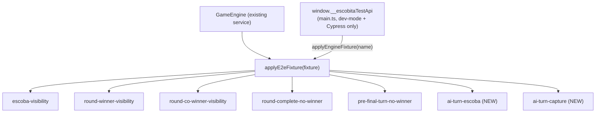
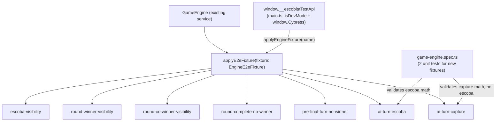

# Review Report: Single Player Mode — AI Opponent (Laia)

**Review Mode:** Incremental (T-12: Extend E2E fixture mechanism to support AI-deterministic test scenarios)
**Source:** `docs/specs/single-player/ai-opponent/`
**Reviewed against:** proposal.md, spec.md, user-stories.md, bdd-test.md, design.md, tasks.md

## 1. Executive Summary

T-12's implementation is solid. The two new E2E fixtures (`ai-turn-escoba` and `ai-turn-capture`) are correctly integrated into the existing `applyE2eFixture` switch in GameEngine, follow the established patterns of the five pre-existing fixtures, are properly guarded behind dev-mode and Cypress presence checks, produce arithmetically valid game states, and are covered by unit tests. The only substantive finding is an unnecessary type cast in the unit tests that could mask future type drift.

- Total findings: 2 (0 Critical, 0 Major, 1 Minor, 1 Note)
- Spec compliance: 4 of 4 requirements fully met
- Architecture alignment: aligned — no structural drift
- Test quality: meaningful

## 2. Architecture Comparison

### 2.1 Planned Fixture API Surface

T-12 specifies extending the existing `applyE2eFixture` method with two new named fixture cases while preserving the original five. No new services, components, or routes are introduced.

### 2.2 Actual Fixture API Surface

### 2.3 Drift Analysis

No architecture drift detected. The implementation matches the planned approach exactly:

- Two new cases added to the existing switch statement in `applyE2eFixture`.
- The `EngineE2eFixture` type union expanded from five to seven members.
- The `main.ts` test API bridge imports the updated type and requires no code changes (the generic delegation already forwards any valid fixture name).
- The five pre-existing fixtures remain untouched in both implementation and their existing E2E/unit test coverage.

## 3. Findings

### RV-01: Unnecessary double type cast in unit tests for new fixture names [Minor]

- **Category:** Code Quality
- **Severity:** Minor
- **Related:** T-12, TR-1.6
- **Description:** The two unit tests for the new fixture names pass the fixture string through a double cast (`as unknown as Parameters<typeof engine.applyE2eFixture>[0]`) before calling `applyE2eFixture`.
- **Expected:** The `EngineE2eFixture` type union explicitly includes both `'ai-turn-escoba'` and `'ai-turn-capture'`. The method signature accepts `EngineE2eFixture`, so the string literals should be accepted directly without any cast.
- **Actual:** Both tests use the `as unknown as ...` cast pattern, suggesting either the tests were written before the type was updated or the cast was copied from a development workaround and never cleaned up.
- **Recommendation:** Remove the double cast from both test call sites and pass the fixture name string directly to `applyE2eFixture`. This restores the type safety that the `EngineE2eFixture` union is designed to provide.
- **Impact:** The cast suppresses TypeScript's type checking for the fixture name argument. If a fixture name were renamed or removed in the future, these tests would continue to compile instead of producing a type error, allowing silent regressions.

### RV-02: Capture-existence validation in unit test checks only single-card pairs [Note]

- **Category:** Test Quality
- **Severity:** Note
- **Related:** T-12, NFR-3.2, SC-24, SC-29
- **Description:** The `ai-turn-capture` unit test verifies that a non-escoba capture exists by iterating over each hand card and each individual table card, checking if any pair sums to 15. It does not test multi-card subset captures.
- **Expected:** The `ai-turn-capture` fixture data supports both single-card captures (Caballo de Oros value 9 + Bastos 6 value 6 = 15) and multi-card captures (Caballo de Oros value 9 + Oros 4 value 4 + Copas 2 value 2 = 15). The multi-card capture path is important for SC-29 (Intermedio selects the capture with the most high-value cards), where the multi-card capture including Oros 4 should be preferred over the single-card capture of Bastos 6.
- **Actual:** The test confirms that at least one single-card capture exists and that no escoba is possible. Both assertions are correct for the fixture data. The multi-card capture capability is not explicitly validated.
- **Recommendation:** This is informational. The fixture data is correct and supports multi-card captures. T-14's E2E tests will exercise both capture paths through the actual AI strategy. No action is strictly required.
- **Impact:** Minimal. The fixture is valid. The multi-card capture dimension will be exercised by downstream E2E tests.

## 4. Traceability Matrix

| Finding | Severity | Category     | Related Spec                | Status |
| ------- | -------- | ------------ | --------------------------- | ------ |
| RV-01   | Minor    | Code Quality | T-12, TR-1.6                | Open   |
| RV-02   | Note     | Test Quality | T-12, NFR-3.2, SC-24, SC-29 | Open   |

## 5. Spec Compliance Summary

| Requirement       | Status | Notes                                                                                                                                                   |
| ----------------- | ------ | ------------------------------------------------------------------------------------------------------------------------------------------------------- |
| TR-1.6            | ✅ Met | Random seam and deterministic fixture mechanism fully support E2E testing of AI decisions. New fixtures accessible via the established test API bridge. |
| NFR-3.2           | ✅ Met | E2E fixture mechanism extended with two AI-specific fixtures. Both produce valid GameState objects. Existing fixtures preserved.                        |
| SC-06             | ✅ Met | Both fixtures set turnIndex to 1 and turnPhase to awaiting-card-play, enabling the AI turn trigger effect to fire when GameTablePage mounts.            |
| SC-23/SC-28/SC-33 | ✅ Met | ai-turn-escoba fixture provides a guaranteed escoba opportunity: Bastos 3 (value 3) + table sum 12 = 15, clearing all table cards.                      |

## 6. Task Completion Summary

| Task | Title                                                                   | Status      | Findings     |
| ---- | ----------------------------------------------------------------------- | ----------- | ------------ |
| T-12 | Extend E2E fixture mechanism to support AI-deterministic test scenarios | ✅ Complete | RV-01, RV-02 |

## 7. Test Coverage Summary

T-12 is not directly linked to BDD scenarios but enables deterministic testing of the following scenarios via E2E fixtures:

| Scenario | Fixture Support    | Notes                                                                        |
| -------- | ------------------ | ---------------------------------------------------------------------------- |
| SC-06    | ✅ Both fixtures   | turnIndex=1, phase=awaiting-card-play triggers AI auto-turn                  |
| SC-23    | ✅ ai-turn-escoba  | Escoba opportunity verified in unit test                                     |
| SC-24    | ✅ ai-turn-capture | Non-escoba capture verified in unit test                                     |
| SC-28    | ✅ ai-turn-escoba  | Same fixture supports Intermedio escoba priority                             |
| SC-29    | ✅ ai-turn-capture | Fixture includes Oros card in multi-card capture subset for greedy selection |
| SC-33    | ✅ ai-turn-escoba  | Same fixture supports Difícil escoba priority                                |
| SC-34    | ✅ ai-turn-capture | Fixture supports probability-weighted capture evaluation                     |

## 8. Test Quality Summary

| Test File                                  | Type | Meaningful Assertions | Issues                                                                                     |
| ------------------------------------------ | ---- | --------------------- | ------------------------------------------------------------------------------------------ |
| game-engine.spec.ts (ai-turn-escoba test)  | Unit | ✅ Yes                | None — verifies player count, turn index, phase, Laia name, hand presence, and escoba math |
| game-engine.spec.ts (ai-turn-capture test) | Unit | ✅ Yes                | RV-01 (unnecessary cast), RV-02 (single-card capture check only)                           |

Both unit tests make meaningful assertions:

- They verify the structural integrity of the fixture state (player count, turn index, turn phase, Laia's name, hand card presence).
- They verify the arithmetic correctness of the fixture (escoba sum = 15 for the escoba fixture; capture exists but no escoba for the capture fixture).
- They do not fall into superficial assertion patterns (no `toBeTruthy`-only checks).

## 9. Security Cross-Reference

No Critical or High security findings were identified for T-12. The implementation correctly:

- Guards `applyE2eFixture` behind `isDevMode()`, throwing an error in production builds.
- Exposes the test API on `window.__escobitaTestApi` only when both `window.Cypress` is defined and `isDevMode()` returns true.
- Fails closed on unknown fixture names via the default switch case that throws an Error.
- Returns only minimal metadata (roundNumber) in the fixture result, exposing no sensitive game data.
- Uses `freezeGameState()` to prevent post-fixture state mutation.

No companion `security-report_T-12.md` is generated as there are no actionable security findings.

## 10. Recommendations

### Minor (improvement)

1. **Remove the unnecessary double type cast** in the two unit tests for `ai-turn-escoba` and `ai-turn-capture`. The `EngineE2eFixture` type already includes both values. Passing the string directly to `applyE2eFixture` restores compile-time type safety and prevents silent regressions if fixture names change.

### Notes (informational)

1. **The ai-turn-capture fixture is well-designed for multi-difficulty testing.** The table includes an Oros card (Oros 4) in a multi-card capture subset, which enables Intermedio's greedy high-value selection to differentiate between capture options. This property is not explicitly validated in the current unit test but will be exercised by T-14's E2E tests.

2. **The fixture arithmetic has been independently verified.** For ai-turn-escoba: Bastos 3 (value 3) + table sum (5+4+3=12) = 15, yielding a valid escoba. For ai-turn-capture: Caballo de Oros (value 9) + Bastos 6 (value 6) = 15, single-card capture; and Caballo de Oros (value 9) + Oros 4 (value 4) + Copas 2 (value 2) = 15, multi-card capture. No hand card + full table sum = 15, confirming no escoba is possible.
