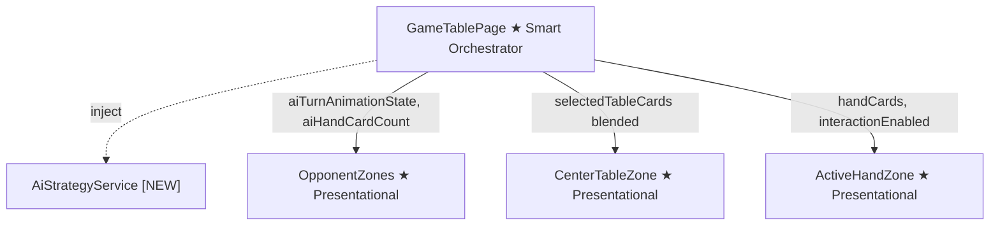
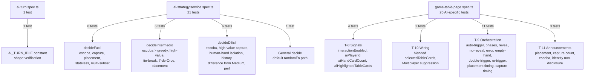

# Review Report: Single Player Mode — AI Opponent (Laia)

**Review Mode:** Incremental (T-13: Unit tests for AiStrategyService and GameTablePage AI orchestration)
**Source:** `docs/specs/single-player/ai-opponent/`
**Reviewed against:** proposal.md, spec.md, user-stories.md, bdd-test.md, design.md, tasks.md
**Review date:** 2026-05-14 (third review — all prior findings resolved)

## 1. Executive Summary

This is the third review of T-13. All findings from the prior two reviews have been fully resolved. The tautological AiPlayDecision type test (RV-01 Major from the second review) has been removed from ai-turn.spec.ts, which now contains only the meaningful AI_TURN_IDLE constant verification. The AiStrategyService spec covers all three difficulty strategies with 21 meaningful tests using deterministic random seams. The GameTablePage spec covers AI orchestration signals, animation phase progression, error recovery, timing bounds, accessibility announcements, and zone wiring with 20 AI-specific tests. Test quality across all T-13 scope files is uniformly high with no superficial, tautological, or no-op assertions remaining.

- Total findings: 1 (0 Critical, 0 Major, 0 Minor, 1 Note)
- Spec compliance: 5 of 6 acceptance criteria fully met, 1 unverifiable (build/test execution)
- Architecture alignment: aligned — test structure mirrors design exactly
- Test quality: meaningful

## 2. Architecture Comparison

### 2.1 Planned Component Tree (from design.md)

### 2.2 Actual Test Coverage Tree

### 2.3 Drift Analysis

No architecture drift detected. The test file structure directly mirrors the planned design:

- The AiStrategyService spec tests the service as a `providedIn: 'root'` service via TestBed injection, consistent with AD-10 and the service layer design in section 6.3 of design.md.
- The GameTablePage spec tests all five new signals described in section 4.1 of design.md: `isAiTurnInProgress`, `aiTurnAnimationState`, `aiPlayerId`, `aiHandCardCount`, and `aiHighlightedTableCards`.
- The `selectedTableCards` blending test verifies the computed described in section 4.4 of design.md, which returns `aiHighlightedTableCards` during capture-previewing phase and the human's selection otherwise.
- The Multiplayer suppression test verifies the design constraint in AD-8 that `aiHandCardCount` is 0 outside Single Player mode.
- The stubs correctly model the service dependency graph from design.md section 2.5: GameTablePage depends on GameEngine, GameSession, AiStrategyService, and TableInteractionState.

## 3. Findings

### RV-01: Difícil probability model tested by output difference, not formula correctness [Note]

- **Category:** Test Quality
- **Severity:** Note
- **Related:** T-13, FR-5.3, FR-5.4, SC-34
- **Description:** The test "selects a different move than Medium when probability weighting favors a non-greedy option" proves the Hard strategy produces a different decision than Medium for the same game state, but does not verify that the probability-weighted expected score calculation itself is correct.
- **Expected:** Per prior review discussion, this is an intentional design choice. Pinning exact probability formula outputs would create brittle tests tightly coupled to the internal scoring heuristic, which may be tuned over time.
- **Actual:** The test asserts that the Hard and Medium decisions differ and verifies the Hard result is a valid, non-empty capture play from Laia's hand. It does not assert projected or probability score values.
- **Recommendation:** No action required. If the probability model is significantly modified in the future, consider adding a small number of regression-pinning tests with known expected score contributions to guard against formula regressions.
- **Impact:** A subtle bug in the scoring heuristic that still produces a different ranking from the greedy approach would go undetected. The risk is mitigated by the simplicity of the current formula and the comprehensive correctness checks (valid card, valid subset, sum to 15) that apply to all difficulty levels.

## 4. Traceability Matrix

| Finding | Severity | Category     | Related Spec                | Status       |
| ------- | -------- | ------------ | --------------------------- | ------------ |
| RV-01   | Note     | Test Quality | FR-5.3, FR-5.4, SC-34, T-13 | Acknowledged |

### Prior Findings — Resolution Status (all resolved)

| Prior Finding                                                 | Prior Severity | Resolution                                                                                     |
| ------------------------------------------------------------- | -------------- | ---------------------------------------------------------------------------------------------- |
| RV-01 (v1): Private method access for buildUnseenCards        | Minor          | ✅ Resolved — all Difícil tests use the public `decide()` API                                  |
| RV-02 (v1): Superficial "is injectable" toBeTruthy test       | Minor          | ✅ Resolved — first test verifies decision shape with `toEqual` assertions                     |
| RV-03 (v1): 3 tautological tests in ai-turn.spec.ts           | Major          | ✅ Resolved — all tautological tests removed; ai-turn.spec.ts now has 1 meaningful test only   |
| RV-01 (v2): 1 remaining tautological AiPlayDecision type test | Major          | ✅ Resolved — test removed from ai-turn.spec.ts                                                |
| RV-04 (v1) / RV-02 (v2): Difícil tested by difference         | Note           | ⏸️ Acknowledged — carried forward as RV-01 above                                               |
| RV-05 (v1): No test for empty AI hand                         | Note           | ✅ Resolved — test "T-9 / NFR-2.2 - short-circuits runAiTurn when AI has no hand cards" exists |

## 5. Spec Compliance Summary

| Requirement   | Status     | Notes                                                                                          |
| ------------- | ---------- | ---------------------------------------------------------------------------------------------- |
| NFR-1.1       | ✅ Met     | Performance assertion (under 100ms) present in Hard mode test with Date.now stopwatch          |
| NFR-2.1       | ✅ Met     | All tests verify cardToPlay comes from hand, captureSubset from table, sum equals 15           |
| NFR-2.2       | ✅ Met     | All tests verify non-null decisions for all difficulty levels; empty-hand guard tested         |
| NFR-3.1       | ✅ Met     | AiStrategyService spec demonstrates injectable, deterministic unit testing via randomFn seam   |
| NFR-4.1       | ✅ Met     | The routing switch in decide() and per-difficulty private methods demonstrate extensibility    |
| FR-3.1        | ✅ Met     | Fácil stateless behaviour tested with matching results across different captured histories     |
| FR-3.2        | ✅ Met     | Escoba preference tested deterministically with pickIndex seam                                 |
| FR-3.3        | ✅ Met     | Random capture (non-escoba) tested with valid subset verification                              |
| FR-3.4        | ✅ Met     | Random placement tested when no captures exist                                                 |
| FR-3.5        | ✅ Met     | No history consulted — identical decisions with different capture piles                        |
| FR-4.3        | ✅ Met     | High-value card scoring tested with specific subset assertions; 7 de Oros counts once          |
| FR-4.4        | ✅ Met     | Escoba always beats greedy — escoba with fewer Oros is chosen over non-escoba with more        |
| FR-4.5        | ✅ Met     | Tie-breaking tested with two runs using different pickIndex values                             |
| FR-4.6        | ✅ Met     | Placement fallback tested when no capture exists in Intermedio                                 |
| FR-4.7        | ✅ Met     | Stateless across rounds verified with identical outcomes despite different history             |
| FR-5.2        | ✅ Met     | Human hand access prevention tested via getter-based trap that throws on read                  |
| FR-5.3        | ⚠️ Partial | Probability-weighted decision tested by difference from Medium only (see RV-01)                |
| FR-5.4        | ⚠️ Partial | Same limitation as FR-5.3 — tied options tested but formula correctness not pinned             |
| FR-5.5        | ✅ Met     | Escoba preference tested in Hard mode                                                          |
| FR-6.1–FR-6.5 | ✅ Met     | Animation phase progression tested step-by-step with fake timers                               |
| FR-6.7        | ✅ Met     | Both placement and capture timing tested within 1.5–3 second bounds                            |
| FR-7.1        | ✅ Met     | interactionEnabled returns false when isAiTurnInProgress is true                               |
| FR-7.3        | ✅ Met     | interactionEnabled re-enables when AI turn completes                                           |
| FR-8.3        | ✅ Met     | revealedCard is never set for placement decisions                                              |
| FR-9.1        | ✅ Met     | Placement announcement tested with timing (empty before confirm, populated after)              |
| FR-9.2        | ✅ Met     | Capture announcement includes count; card identity explicitly excluded via negative assertions |
| FR-9.3        | ✅ Met     | Escoba announcement distinct from capture; verified via negative "capturó" assertion           |

## 6. Task Completion Summary

| Task | Title                                                               | Status      | Findings                   |
| ---- | ------------------------------------------------------------------- | ----------- | -------------------------- |
| T-13 | Unit tests for AiStrategyService and GameTablePage AI orchestration | ✅ Complete | RV-01 (Note, acknowledged) |

**Acceptance Criteria Assessment:**

| Criterion                                                                             | Status                                                                       |
| ------------------------------------------------------------------------------------- | ---------------------------------------------------------------------------- |
| Fácil: escoba preference, random capture, random placement covered                    | ✅ Complete                                                                  |
| Intermedio: escoba beats greedy, greedy selects max, tie-breaking, placement fallback | ✅ Complete                                                                  |
| Difícil: escoba preference, probability-based selection, unseen set, performance      | ✅ Complete (formula correctness intentionally tested by difference — RV-01) |
| GameTablePage: interactionEnabled with isAiTurnInProgress                             | ✅ Complete                                                                  |
| GameTablePage: aiPlayerId resolves to correct UUID                                    | ✅ Complete                                                                  |
| All tests pass ng build / Vitest                                                      | ❓ Unverifiable (not run during review)                                      |

## 7. Test Coverage Summary

| Scenario | Step Definitions  | Meaningful | Findings |
| -------- | ----------------- | ---------- | -------- |
| SC-23    | ✅ Yes (unit)     | ✅ Yes     | —        |
| SC-24    | ✅ Yes (unit)     | ✅ Yes     | —        |
| SC-25    | ✅ Yes (unit)     | ✅ Yes     | —        |
| SC-26    | ✅ Yes (unit)     | ✅ Yes     | —        |
| SC-27    | ✅ Yes (unit)     | ✅ Yes     | —        |
| SC-28    | ✅ Yes (unit)     | ✅ Yes     | —        |
| SC-29    | ✅ Yes (unit)     | ✅ Yes     | —        |
| SC-30    | ✅ Yes (unit)     | ✅ Yes     | —        |
| SC-31    | ✅ Yes (unit)     | ✅ Yes     | —        |
| SC-32    | ✅ Yes (implicit) | ✅ Yes     | —        |
| SC-33    | ✅ Yes (unit)     | ✅ Yes     | —        |
| SC-34    | ⚠️ Partial        | ⚠️ Partial | RV-01    |
| SC-35    | ✅ Yes (unit)     | ✅ Yes     | —        |
| SC-36    | ✅ Yes (implicit) | ✅ Yes     | —        |
| SC-37    | ✅ Yes (unit)     | ✅ Yes     | —        |

## 8. Test Quality Summary

| Test File                            | Type | Meaningful Assertions | Issues                                                                  |
| ------------------------------------ | ---- | --------------------- | ----------------------------------------------------------------------- |
| ai-strategy.service.spec.ts          | Unit | ✅ Yes                | None — all 21 tests are behaviour-driven with deterministic seams       |
| game-table-page.spec.ts (AI tests)   | Unit | ✅ Yes                | None — all 20 AI tests verify timing, phases, wiring, and announcements |
| ai-turn.spec.ts (T-4 dependency)     | Unit | ✅ Yes                | Tautological test from prior review removed; 1 meaningful test remains  |
| delay.utils.spec.ts (T-4 dependency) | Unit | ✅ Yes                | None                                                                    |

## 9. Security Cross-Reference

See `docs/specs/single-player/ai-opponent/security-report_T-13.md` for the full security analysis.

| SEC ID | Severity | OWASP    | Summary                                                             |
| ------ | -------- | -------- | ------------------------------------------------------------------- |
| SEC-01 | Medium   | A05:2021 | Static CSP nonce value in index.html weakens nonce-based protection |

SEC-02 and SEC-03 are Low severity (console logging concerns) and do not affect spec compliance.

Security-relevant test observations:

- The test for FR-5.2 ("does not access the human hand while deciding in Hard mode") uses a getter-based trap to verify information isolation. This is a meaningful security-relevant assertion that guards against AI cheating by accessing private game state.
- All test files use the deterministic random seam (TR-1.6) rather than `crypto.getRandomValues`, meaning the production secure-random path is not exercised by unit tests. This is expected and appropriate per TR-1.6.

## 10. Recommendations

### Critical (blocks release)

None.

### Major (fix before merge)

None.

### Minor (improvement)

None.

### Notes (informational)

1. **RV-01:** The Difícil probability model is intentionally tested by output difference. No action needed now. Consider regression-pinning tests if the formula changes significantly in the future.
