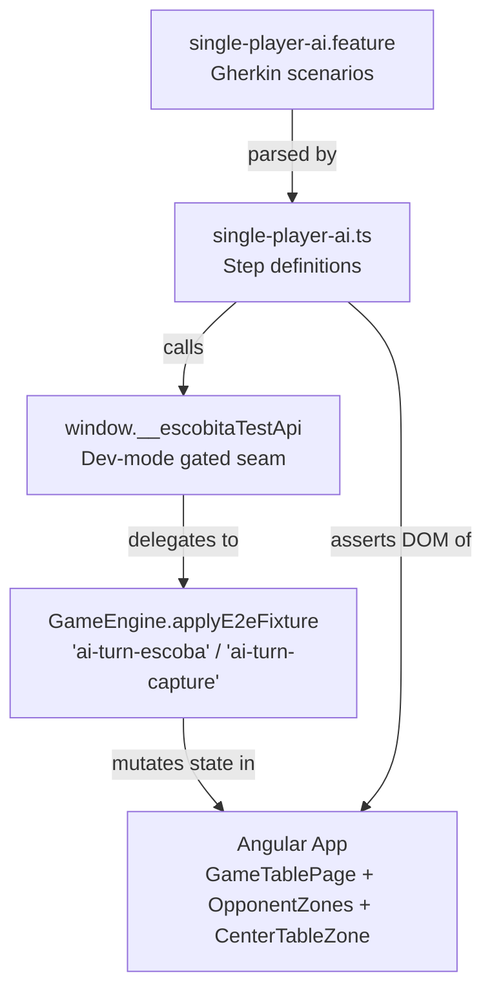
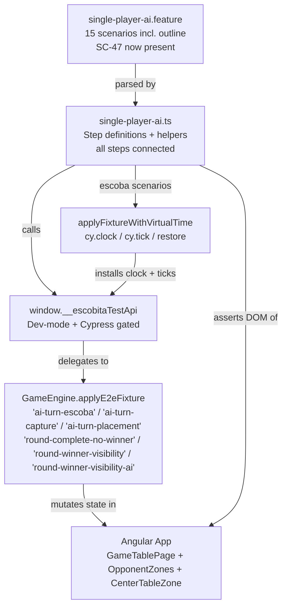

# Review Report: Single Player Mode — AI Opponent (Laia)

**Review Mode:** Incremental (T-14: E2E tests for Single Player AI turn flow)
**Source:** `docs/specs/single-player/ai-opponent/`
**Reviewed against:** proposal.md, spec.md, user-stories.md, bdd-test.md, design.md, tasks.md
**Review iteration:** 4 (re-review after SC-47 addition — verifying iteration 3 findings)

## 1. Executive Summary

This is the fourth review iteration of T-14. The Major finding from iteration 3 (RV-01: SC-47 missing from the feature file) is now **fully resolved**. SC-47 is present in the feature file at lines 68–71 with a meaningful scenario that applies the human winner fixture, clicks the return-to-lobby button, and asserts navigation back to the Lobby screen. The step definitions that were previously orphaned are now connected to this scenario. All SC-43 through SC-47 match progression scenarios are present and functional.

The four Minor findings and one Note from iteration 3 remain open and unchanged.

- **Total findings:** 5 (0 Critical, 0 Major, 4 Minor, 1 Note)
- **Spec compliance:** 15 of 17 directly-scoped requirements fully met (up from 14 of 17)
- **Architecture alignment:** Aligned — no structural drift detected
- **Test quality:** Mostly meaningful — SC-47 resolution closes the last coverage gap

### Resolution Summary from Iteration 3

| Iteration 3 Finding                     | Status      | Resolution                                                                                                                       |
| --------------------------------------- | ----------- | -------------------------------------------------------------------------------------------------------------------------------- |
| RV-01 (SC-47 missing from feature file) | ✅ Resolved | SC-47 now present at lines 68–71 with connected step definitions; return-to-lobby click and Lobby screen assertion are exercised |
| RV-02 (card-level selected CSS)         | ⏳ Open     | Unchanged (see new RV-01)                                                                                                        |
| RV-03 (cy.clock limited to escoba)      | ⏳ Open     | Unchanged (see new RV-02)                                                                                                        |
| RV-04 (SC-10 sequence ordering)         | ⏳ Open     | Unchanged (see new RV-03)                                                                                                        |
| RV-05 (Background/Outline conflict)     | ⏳ Open     | Unchanged (see new RV-04)                                                                                                        |
| RV-06 (waitForAiAnimation naming)       | ⏳ Open     | Unchanged (see new RV-05)                                                                                                        |

## 2. Architecture Comparison

### 2.1 Planned E2E Test Structure

### 2.2 Actual E2E Test Structure

### 2.3 Drift Analysis

No structural drift is detected. The E2E test architecture follows the planned approach: a Cypress feature file paired with step definitions exercising the application through the existing test API seam. The fixture mechanism from T-12 is correctly leveraged. The `round-winner-visibility-ai` fixture supports the SC-44 Laia-wins scenario — a consistent extension of the existing fixture pattern. The `applyFixtureWithVirtualTime` helper introduces the `cy.clock()`/`cy.tick()` pattern specified in the task description, though its adoption remains limited to the escoba fixture. An additional fixture (`ai-turn-placement`) beyond the two specified in T-12 supports the SC-11 placement animation scenario — a reasonable and consistent extension. All step definitions are now connected to scenarios — the previously orphaned SC-47 steps are fully wired.

## 3. Findings

### RV-01: "one AI hand card is highlighted" doesn't verify card-level selected CSS [Minor]

- **Category:** Test Quality
- **Severity:** Minor
- **Related:** SC-10, SC-11, FR-6.2, US-3, T-14
- **Description:** The step definition for "one AI hand card is highlighted" checks that the AI hand zone has the `ai-hand-zone--active` class and that AI hand card elements exist. It does not verify that any specific card element has the `.card-visual--selected` CSS class or equivalent elevation attribute. The `.card-visual--selected` selector is defined in the `selectors` object and successfully used for table card highlight verification, but is not applied to AI hand cards.
- **Expected:** FR-6.2 requires "the card Laia has chosen to play must be visually highlighted or elevated." The assertion should verify that at least one AI hand card element has the selected/highlighted CSS class.
- **Actual:** The step checks that the AI hand zone has the active class and that AI hand card elements exist — zone-level verification only. The `selectedCardVisual` selector (`.card-visual--selected`) is available but unused here.
- **Recommendation:** Add an assertion checking that one AI hand card element contains a child with the `.card-visual--selected` class, consistent with how table card highlighting is verified.
- **Impact:** SC-10 and SC-11 pass without verifying the specific card-level visual behaviour of card selection. The zone-level active class provides partial coverage.

### RV-02: cy.clock()/cy.tick() adoption is limited to escoba fixture only [Minor]

- **Category:** Spec Compliance
- **Severity:** Minor
- **Related:** T-14, TR-1.6, NFR-3.2
- **Description:** The `applyFixtureWithVirtualTime` helper correctly implements the `cy.clock()`/`cy.tick()`/`restore` pattern specified in the T-14 task description. However, it is only used for the escoba fixture in the Scenario Outline. Other scenarios — SC-10 (capture animation), SC-11 (placement animation), SC-14 (disabled controls), SC-15 (disabled buttons), SC-16 (re-enabled controls) — apply fixtures without clock control and rely on Cypress's built-in retry mechanism and natural timing.
- **Expected:** The task description states: "Use cy.clock() and cy.tick() to fast-forward animation delays in tests where timing is not the subject under test." Most of the above scenarios are not testing timing.
- **Actual:** The infrastructure exists (`applyFixtureWithVirtualTime`) but is underutilised.
- **Recommendation:** Extend `applyFixtureWithVirtualTime` usage to the capture and placement fixture scenarios where timing is not the test subject. This will make the full test suite faster and more deterministic in CI.
- **Impact:** Tests work but are slower and marginally less reliable in resource-constrained CI environments.

### RV-03: SC-10 does not verify animation sequence ordering [Minor]

- **Category:** Test Quality
- **Severity:** Minor
- **Related:** SC-10, FR-6.1, FR-6.2, FR-6.3, FR-6.4, FR-6.5, US-3, T-14
- **Description:** The T-14 acceptance criteria state: "test verifies the animation sequence — active zone, card elevation, face-up reveal, table card highlight, then resolution." The implementation tests individual states as separate "And" steps but does not verify their temporal ordering.
- **Expected:** The test should confirm that animation phases occur in the specified order: active zone first, then card elevation, then face-up reveal, then table card highlight, then resolution.
- **Actual:** Each "And" step independently checks for a visual state. Because Cypress retries assertions, a step could pass even if the state appeared out of order or simultaneously.
- **Recommendation:** Use `cy.clock()`/`cy.tick()` to pause the animation at each phase and assert the intermediate state before advancing to the next phase. This naturally aligns with RV-02's recommendation to extend clock control.
- **Impact:** An implementation that skipped a phase or reordered phases could still pass the test.

### RV-04: Background conflicts with Scenario Outline for escoba priority scenarios [Minor]

- **Category:** Code Quality
- **Severity:** Minor
- **Related:** SC-23, SC-28, SC-33, T-14
- **Description:** The feature file Background starts a game on Easy difficulty before every scenario. The SC-23/SC-28/SC-33 Scenario Outline also has a Given step that starts a game on the specified difficulty. This causes redundant navigation: each outline scenario starts a game on Easy, then immediately starts another game on the specified difficulty.
- **Expected:** The Scenario Outline should either override the Background cleanly or the Background should be conditional.
- **Actual:** Two full navigation sequences occur per outline scenario. The second `cy.visit('/')` overwrites the first, so the tests still work, but execution time is doubled for these scenarios.
- **Recommendation:** Either move the Background Given into the non-outline scenarios as their own Given step, or tag the outline scenarios separately with a different Background.
- **Impact:** Unnecessary test execution overhead; no functional impact.

### RV-05: waitForAiAnimation helper name is misleading [Note]

- **Category:** Code Quality
- **Severity:** Note
- **Related:** T-14
- **Description:** The `waitForAiAnimation()` helper first checks that `activeHandZone` (the human player's hand zone, identified by `data-testid="active-hand-zone"`) is visible before checking the AI hand zone's active class. The human hand zone visibility is a layout prerequisite, not an AI animation assertion.
- **Expected:** A helper named `waitForAiAnimation` should only assert on AI-related elements.
- **Actual:** The first assertion (`cy.get(selectors.activeHandZone).should('be.visible')`) checks the human's hand zone, which is always visible when the game table is loaded.
- **Recommendation:** Rename the helper to clarify its purpose (e.g., `waitForGameTableAndAiAnimation`) or remove the human hand zone visibility check if it is not needed as a guard.
- **Impact:** No functional impact; readability and maintainability concern only.

## 4. Traceability Matrix

| Finding | Severity | Category        | Related Spec               | Status |
| ------- | -------- | --------------- | -------------------------- | ------ |
| RV-01   | Minor    | Test Quality    | SC-10, SC-11, FR-6.2, US-3 | Open   |
| RV-02   | Minor    | Spec Compliance | T-14, TR-1.6, NFR-3.2      | Open   |
| RV-03   | Minor    | Test Quality    | SC-10, FR-6.1–FR-6.5, US-3 | Open   |
| RV-04   | Minor    | Code Quality    | SC-23, SC-28, SC-33        | Open   |
| RV-05   | Note     | Code Quality    | T-14                       | Open   |

## 5. Spec Compliance Summary

| Requirement | Status     | Notes                                                                                                      |
| ----------- | ---------- | ---------------------------------------------------------------------------------------------------------- |
| FR-2.1      | ✅ Met     | SC-06 verifies automatic trigger with active zone class and live region content                            |
| FR-6.1      | ✅ Met     | Active zone class verified on AI hand zone                                                                 |
| FR-6.2      | ⚠️ Partial | Zone active class checked but individual card CSS class not verified (RV-01)                               |
| FR-6.3      | ✅ Met     | Face-up reveal verified via aria-label assertion in SC-10 and SC-19                                        |
| FR-6.4      | ✅ Met     | Table card highlight verified via `aria-selected` and `.card-visual--selected` class                       |
| FR-7.1      | ✅ Met     | SC-14 and SC-15 both verify disabled state with meaningful assertions                                      |
| FR-7.2      | ✅ Met     | SC-15 verifies both buttons are visually disabled and click-resistant                                      |
| FR-7.3      | ✅ Met     | SC-16 verifies actual control interactivity restoration (click + state assertions)                         |
| FR-8.1      | ✅ Met     | SC-18 iterates all AI hand cards verifying "Carta oculta" label                                            |
| FR-8.2      | ✅ Met     | SC-18 applies on Easy difficulty; SC-23/28/33 outline covers all difficulties                              |
| FR-8.4      | ✅ Met     | SC-19 verifies face-up reveal during capture animation                                                     |
| US-2        | ✅ Met     | Automatic trigger verified with active zone class and live region content                                  |
| US-3        | ⚠️ Partial | Animation steps covered; card-level highlight not verified (RV-01); sequence ordering not verified (RV-03) |
| US-4        | ✅ Met     | SC-14, SC-15, SC-16 all present with meaningful assertions                                                 |
| US-5        | ✅ Met     | Face-down and face-up assertions are meaningful                                                            |
| US-11       | ✅ Met     | SC-43, SC-44, SC-45, SC-46, SC-47 all present and meaningful                                               |
| TR-1.6      | ⚠️ Partial | Clock control introduced but limited to escoba fixture (RV-02)                                             |
| NFR-3.2     | ⚠️ Partial | E2E tests exist; clock control partially adopted (RV-02)                                                   |

## 6. Task Completion Summary

| Task | Title                                                    | Status     | Findings                          |
| ---- | -------------------------------------------------------- | ---------- | --------------------------------- |
| T-14 | E2E tests for Single Player AI turn flow (Cypress / BDD) | ⚠️ Partial | RV-01, RV-02, RV-03, RV-04, RV-05 |

**Task acceptance criteria status:**

- SC-06: ✅ Test verifies automatic trigger with meaningful assertions
- SC-10: ⚠️ Test exists; table highlight and face-up reveal verified; card-level highlight still zone-only (RV-01); sequence ordering not verified (RV-03)
- SC-14–SC-16: ✅ All three scenarios present with meaningful assertions
- SC-18: ✅ All AI hand cards checked for face-down label
- SC-19: ✅ Face-up card verified via aria-label
- SC-43: ✅ Both player names and score values verified
- SC-44: ✅ Now correctly uses AI winner fixture and asserts "Laia"
- SC-45: ✅ Uses human winner fixture and asserts "Jugador-1"
- SC-46: ✅ Handoff overlay absence verified after AI turn and round-complete
- SC-47: ✅ Present with return-to-lobby click and Lobby screen navigation assertion
- cy.clock()/cy.tick(): ⚠️ Implemented for escoba fixture; not adopted elsewhere (RV-02)

## 7. Test Coverage Summary

| Scenario | Step Definitions | Meaningful | Findings     |
| -------- | ---------------- | ---------- | ------------ |
| SC-06    | ✅ Yes           | ✅ Yes     | —            |
| SC-10    | ✅ Yes           | ⚠️ Partial | RV-01, RV-03 |
| SC-11    | ✅ Yes           | ⚠️ Partial | RV-01        |
| SC-14    | ✅ Yes           | ✅ Yes     | —            |
| SC-15    | ✅ Yes           | ✅ Yes     | —            |
| SC-16    | ✅ Yes           | ✅ Yes     | —            |
| SC-18    | ✅ Yes           | ✅ Yes     | —            |
| SC-19    | ✅ Yes           | ✅ Yes     | —            |
| SC-23    | ✅ Yes           | ✅ Yes     | —            |
| SC-28    | ✅ Yes           | ✅ Yes     | —            |
| SC-33    | ✅ Yes           | ✅ Yes     | —            |
| SC-43    | ✅ Yes           | ✅ Yes     | —            |
| SC-44    | ✅ Yes           | ✅ Yes     | —            |
| SC-45    | ✅ Yes           | ✅ Yes     | —            |
| SC-46    | ✅ Yes           | ✅ Yes     | —            |
| SC-47    | ✅ Yes           | ✅ Yes     | —            |

## 8. Test Quality Summary

| Test File                | Type                   | Meaningful Assertions | Issues                                                                                 |
| ------------------------ | ---------------------- | --------------------- | -------------------------------------------------------------------------------------- |
| single-player-ai.feature | E2E (Gherkin)          | ⚠️ Partial            | Background/Outline conflict; all scenarios present including SC-47                     |
| single-player-ai.ts      | E2E (Step Definitions) | ⚠️ Partial            | Card-level highlight not verified; clock control underutilised; misleading helper name |

## 9. Security Cross-Reference

No new security findings were identified for T-14 in this re-review. The E2E test infrastructure continues to use the same `window.__escobitaTestApi` seam established in T-12, which is properly dual-gated behind `isDevMode()` and `window.Cypress` presence checks. See `docs/specs/single-player/ai-opponent/security-report_T-14.md` for the full security analysis (0 Critical, 0 High findings).

## 10. Recommendations

### Minor (improvement)

1. **Add card-level selected CSS assertion** in the "one AI hand card is highlighted" step. Use the existing `.card-visual--selected` selector to verify at least one AI hand card child element has the selected class, consistent with the table card highlight pattern.
2. **Extend `applyFixtureWithVirtualTime` adoption** to capture and placement fixture scenarios where timing is not the test subject, improving test speed and determinism.
3. **Verify animation sequence ordering** in SC-10 by using clock control to pause at each phase and assert intermediate states.
4. **Refactor Background/Scenario Outline conflict** by moving the Background Given step into individual non-outline scenarios or tagging the outline scenarios separately.

### Notes (informational)

1. The `waitForAiAnimation()` helper checks the human's hand zone visibility before the AI hand zone active class. Consider renaming or removing the unrelated assertion for clarity.
