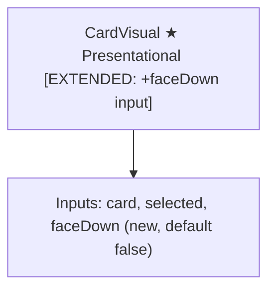
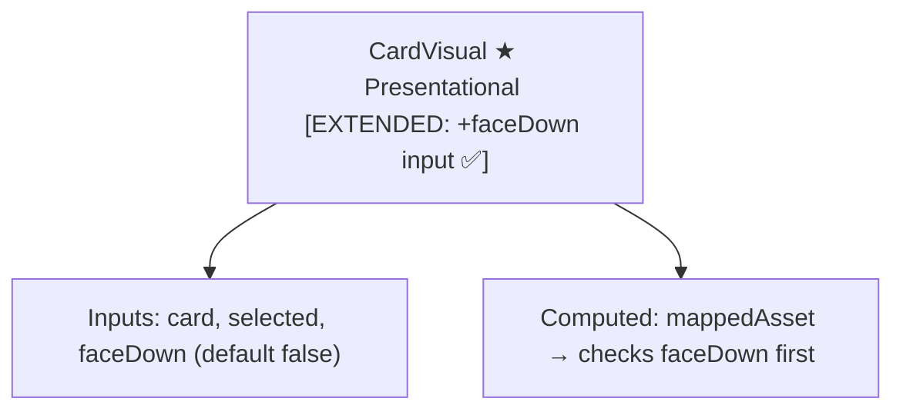

# Review Report: Single Player Mode — AI Opponent (Laia)

**Review Mode:** Incremental (T-2: Add `faceDown` boolean input to CardVisual component) — Implementation complete
**Source:** `docs/specs/single-player/ai-opponent/`
**Reviewed against:** proposal.md, spec.md, user-stories.md, bdd-test.md, design.md, tasks.md

## 1. Executive Summary

Full implementation review of T-2. The CardVisual component now has a `faceDown` boolean input backed by a writable signal (`faceDownState`). The `mappedAsset` computed signal checks `faceDownSignal()` first — when true, it returns the card back image path with the semantically correct label "Carta oculta", distinct from the existing null-card fallback label "Carta no disponible". When `faceDown` is false (the default), existing rendering behaviour is completely preserved. The `selected` CSS class remains independent of the face-down state and continues to apply normally.

The unit test file contains seven tests — four pre-existing regression tests and three new tests targeting the `faceDown` input. All three new tests are meaningful, asserting concrete DOM attributes (aria-label, src, alt, CSS class) against expected face-down semantics. The previously identified RED-phase gap (RV-01: missing `selected + faceDown` combination test) has been resolved — test 7 now covers that combination. All five T-2 acceptance criteria are met by the implementation and validated by tests.

One observation regarding Angular best practices: the `faceDown` input uses the legacy `@Input()` setter pattern with a manual backing signal rather than Angular 21's `input()` function API. However, this is consistent with the existing `card` and `selected` inputs in the same component and appears to be the project-wide convention in presentational components (OpponentZones uses the same pattern). This is noted as informational rather than actionable for T-2.

- Total findings: 2 (0 Critical, 0 Major, 0 Minor, 2 Note)
- Spec compliance: 4 of 4 requirements met (FR-8.1 prerequisite, FR-8.2 prerequisite, TR-4.1 prerequisite, TR-4.2 fully met)
- Architecture alignment: fully aligned with AD-7
- Test quality: meaningful — all assertions verify rendered DOM semantics, no superficial checks

## 2. Architecture Comparison

### 2.1 Planned Component Tree (T-2 scope)

T-2 modifies only the CardVisual component by adding a `faceDown` boolean input. No component tree structure changes are planned.

### 2.2 Actual Component Tree

The CardVisual component has been extended with the `faceDown` input exactly as planned. No other structural changes.

### 2.3 Drift Analysis

No architecture drift. The implementation exactly matches AD-7: the CardVisual component has a new optional boolean input `faceDown` (default `false`) that, when `true`, renders the card back image (`/cards/Card_Back.png`) with the semantically correct label "Carta oculta". The `card` input is ignored when `faceDown` is `true`, as specified. The `selected` input continues to operate independently, applying the elevation/highlight CSS class regardless of face-down state — this supports the animation selection step required by T-3 and T-10.

The template structure is unchanged: the same `<figure>` with `aria-label`, containing an `` with `src` and `alt`, remains the sole rendered element. Only the computed signal logic that feeds these bindings has been extended with the `faceDown` check.

No new components, services, routes, or guards were introduced. No existing callsites were modified. The change is entirely additive and self-contained within the CardVisual component.

## 3. Findings

### RV-01: Input API uses legacy @Input() setter pattern [Note]

- **Category:** Code Quality
- **Severity:** Note
- **Related:** T-2, AD-7, Angular Developer Guidelines
- **Description:** The `faceDown` input is implemented using the legacy `@Input()` setter pattern with a manual backing signal (`faceDownState = signal(false)`). Angular 21 provides the `input()` function API for signal-based inputs, which is the recommended approach in the Angular Developer Guidelines referenced by this project.
- **Expected:** Angular 21 projects would typically use `faceDown = input(false)` for signal-based inputs with defaults.
- **Actual:** The implementation uses `@Input() set faceDown(value: boolean) { this.faceDownState.set(value); }` with a separate `signal(false)` backing store. This pattern achieves the same reactive behaviour but involves more boilerplate.
- **Recommendation:** No action for T-2 — this is consistent with the existing `card` and `selected` inputs in the same component and with OpponentZones' `opponents` input. All presentational components in the project appear to follow this convention. A project-wide modernisation to the `input()` API could be considered as a separate cleanup task if desired.
- **Impact:** None for T-2 scope. The implementation is functionally correct. The observation is noted for future reference only.

### RV-02: Traceability comment not updated for T-2 requirements [Note]

- **Category:** Code Quality
- **Severity:** Note
- **Related:** T-2, FR-8.1, TR-4.2, US-5
- **Description:** The file-level traceability comment at line 6 of the spec file reads `// Covers: FR-1.5, FR-6.2, TR-3.1, TR-3.2, TR-6.2, US-1`. These references correspond to the pre-existing game-table-mvp feature spec, not the AI opponent spec. The three new faceDown tests cover FR-8.1, TR-4.2, and US-5 from the AI opponent spec, but these identifiers are not listed.
- **Expected:** The traceability comment should include the new requirement references (FR-8.1, TR-4.2, US-5) alongside the existing ones.
- **Actual:** Only the original game-table-mvp references are present.
- **Recommendation:** Append the AI opponent spec references to the comment so that requirement traceability is maintained across feature specs.
- **Impact:** Minor documentation gap. Does not affect test execution but reduces traceability auditability.

## 4. Traceability Matrix

| Finding | Severity | Category     | Related Spec              | Status               |
| ------- | -------- | ------------ | ------------------------- | -------------------- |
| RV-01   | Note     | Code Quality | T-2, AD-7                 | Open (informational) |
| RV-02   | Note     | Code Quality | T-2, FR-8.1, TR-4.2, US-5 | Open                 |

## 5. Spec Compliance Summary

| Requirement | Status                          | Notes                                                                                                                                                                                                                                                                                                               |
| ----------- | ------------------------------- | ------------------------------------------------------------------------------------------------------------------------------------------------------------------------------------------------------------------------------------------------------------------------------------------------------------------- |
| FR-8.1      | ✅ Met (component prerequisite) | CardVisual renders the card back image with "Carta oculta" label when `faceDown=true`. Full FR-8.1 validation (all cards in Laia's hand zone rendered face-down) requires zone-level integration in T-3.                                                                                                            |
| FR-8.2      | ✅ Met (component prerequisite) | CardVisual's `faceDown` input is difficulty-agnostic by design (AD-7). The input does not reference or depend on difficulty level — it is a pure rendering flag. Explicit difficulty-level verification is a zone/orchestration concern deferred to T-3 and T-10.                                                   |
| TR-4.1      | ✅ Met (component prerequisite) | TR-4.1 specifies "a flag or input at the hand zone component level." CardVisual's `faceDown` input is the rendering mechanism that makes TR-4.1 possible. The zone-level wiring (OpponentZones passing `faceDown=true` for each card) is T-3's responsibility.                                                      |
| TR-4.2      | ✅ Met                          | Directly implemented and tested. The CardVisual component supports a face-down rendering state via the `faceDown` input. Default behaviour (`faceDown=false`) is unchanged. Tests 5, 6, and 7 comprehensively verify the face-down rendering, precedence over card data, and compatibility with the selected state. |
| US-5        | ✅ Met (component prerequisite) | All component-level acceptance criteria for US-5 are satisfied: face-down rendering (AC-1), faceDown takes precedence (AC-3), selected styling preserved (AC-5 of T-2). Full US-5 validation (zone integration, difficulty agnosticism, multiplayer unaffected) is integration-scope.                               |

## 6. Task Completion Summary

| Task | Title                                                | Status      | Findings                  |
| ---- | ---------------------------------------------------- | ----------- | ------------------------- |
| T-2  | Add `faceDown` boolean input to CardVisual component | ✅ Complete | RV-01, RV-02 (notes only) |

### T-2 Acceptance Criteria Checklist

| AC                                                                          | Status | Evidence                                                                                                                                                                                                            |
| --------------------------------------------------------------------------- | ------ | ------------------------------------------------------------------------------------------------------------------------------------------------------------------------------------------------------------------- |
| When `faceDown=true`, the back-card image is rendered                       | ✅ Met | `mappedAsset` computed returns `assetPath: '/cards/Card_Back.png'` when `faceDownSignal()` is true. Verified by test 5.                                                                                             |
| When `faceDown=true`, the accessible label is "Carta oculta"                | ✅ Met | `mappedAsset` computed returns `semanticLabel: 'Carta oculta'` when `faceDownSignal()` is true. Verified by test 5 (aria-label and alt assertions).                                                                 |
| When `faceDown=false` (default), existing rendering is unchanged            | ✅ Met | `faceDownState = signal(false)` provides the default. Pre-existing tests 1–4 serve as regression guards — they do not set `faceDown` and continue to pass.                                                          |
| When `faceDown=true` and a card is also passed, `faceDown` takes precedence | ✅ Met | The `mappedAsset` computed checks `faceDownSignal()` before `cardSignal()`. Verified by test 6 which sets both a card and faceDown, asserting the back image renders.                                               |
| The `selected` input still applies its visual state when `faceDown=true`    | ✅ Met | The `selectedSignal()` CSS class binding is independent of the `faceDown` state. Verified by test 7 which sets both `faceDown=true` and `selected=true`, asserting both the selected class and the face-down label. |

### Implementation Assessment

The implementation is minimal, correct, and self-contained:

- A new `faceDownState = signal(false)` private signal and `faceDownSignal` read-only signal are introduced alongside the existing `cardState` and `selectedState` signals.
- The `mappedAsset` computed signal is extended with a `faceDown` check as its first branch, returning the back-card asset with the correct "Carta oculta" label. The existing null-card fallback ("Carta no disponible") and face-up card mapping paths remain unchanged.
- The `@Input() set faceDown(value)` setter updates the backing signal, following the same pattern as the existing `card` and `selected` inputs.
- The template requires no changes — the existing `[src]`, `[alt]`, and `[attr.aria-label]` bindings already read from computed signals, which now account for the face-down state.

**Angular best practices compliance:**

- Uses signals for reactive state — correct
- Input default is `false` (additive, non-breaking) — correct
- Component selector is `app-card-visual` with kebab-case — matches ESLint rule
- Standalone component with `imports` array — correct
- No unnecessary DOM changes — correct
- Accessibility label is semantically distinct ("Carta oculta" vs "Carta no disponible") — correct per AD-7

## 7. Test Coverage Summary

| Scenario | Step Definitions         | Meaningful | Findings |
| -------- | ------------------------ | ---------- | -------- |
| SC-18    | ❌ No (E2E — T-14 scope) | N/A        | —        |
| SC-19    | ❌ No (E2E — T-14 scope) | N/A        | —        |
| SC-20    | ❌ No (E2E — T-14 scope) | N/A        | —        |
| SC-21    | ❌ No (E2E — T-14 scope) | N/A        | —        |
| SC-22    | ❌ No (E2E — T-14 scope) | N/A        | —        |

BDD scenarios SC-18 through SC-22 are integration/E2E level scenarios that are out of scope for T-2 unit tests. They will be implemented in T-14.

## 8. Test Quality Summary

| Test File                                         | Type | Meaningful Assertions | Issues                                                            |
| ------------------------------------------------- | ---- | --------------------- | ----------------------------------------------------------------- |
| card-visual.spec.ts (test 1: fallback semantics)  | Unit | ✅ Yes                | None — pre-existing regression baseline                           |
| card-visual.spec.ts (test 2: mapped card image)   | Unit | ✅ Yes                | None — pre-existing regression baseline                           |
| card-visual.spec.ts (test 3: semantic label)      | Unit | ✅ Yes                | None — pre-existing regression baseline                           |
| card-visual.spec.ts (test 4: selected styling)    | Unit | ✅ Yes                | None — pre-existing regression baseline                           |
| card-visual.spec.ts (test 5: faceDown semantics)  | Unit | ✅ Yes                | Verifies aria-label, src, alt for face-down state                 |
| card-visual.spec.ts (test 6: faceDown precedence) | Unit | ✅ Yes                | Verifies faceDown overrides card asset path                       |
| card-visual.spec.ts (test 7: selected + faceDown) | Unit | ✅ Yes                | Verifies selected CSS class applied alongside face-down rendering |

All seven tests use meaningful DOM assertions (aria-label, src, alt, CSS class). No superficial `toBeTruthy()` or `toBeDefined()` patterns. No tautological assertions. No empty test bodies. The three new tests (5, 6, 7) collectively cover all five T-2 acceptance criteria.

The previously identified RED-phase gap (missing `selected + faceDown` combination test) has been resolved — test 7 now covers T-2 AC-5 by asserting both `card-visual--selected` class presence and "Carta oculta" aria-label when both inputs are active simultaneously.

## 9. Security Cross-Reference

The companion security report (`security-report_T-2.md`) was generated during the RED phase and reports 0 findings at any severity. The implementation change — adding a signal-backed boolean input that selects between two hardcoded asset paths — introduces no new security surface. The card back image path (`/cards/Card_Back.png`) is a static string literal, not derived from user input. Angular's built-in template binding sanitization applies to `[src]`, `[alt]`, and `[attr.aria-label]`. No new DOM manipulation, no `bypassSecurityTrust*` calls, no user-controlled input flowing into rendering. The security assessment from the RED phase remains valid for the implementation.

No Critical or High security findings apply.

## 10. Recommendations

### Critical (blocks release)

None.

### Major (fix before merge)

None.

### Minor (improvement)

None.

### Notes (informational)

1. **Legacy input pattern (RV-01):** The `@Input()` setter pattern used for `faceDown` is consistent with the component's existing inputs but could be modernised to Angular 21's `input()` API in a future project-wide cleanup pass. Not actionable for T-2.
2. **Update the traceability comment (RV-02):** Append FR-8.1, TR-4.2, US-5 to the file-level `// Covers:` comment to reflect the new T-2 test scope alongside the existing game-table-mvp references.
