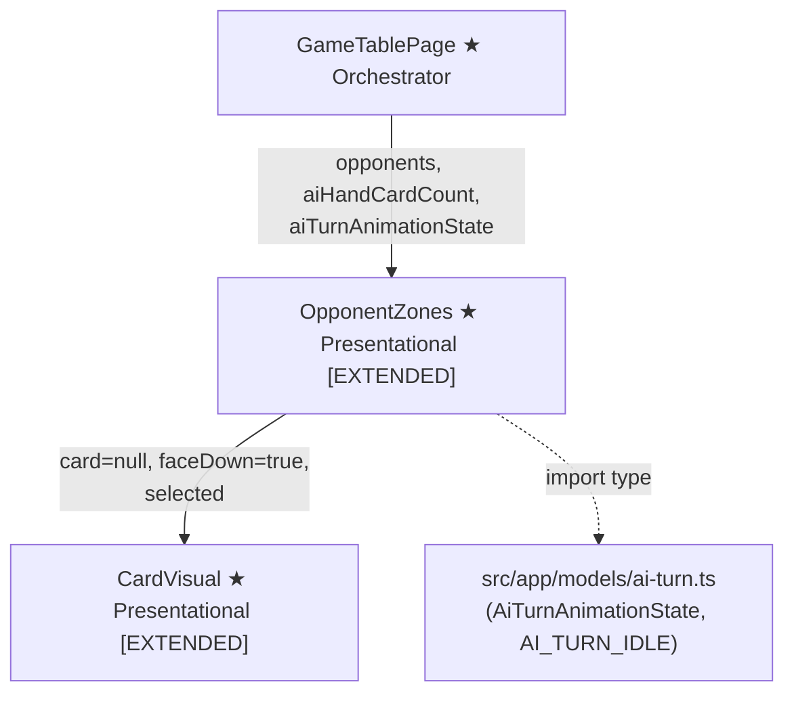
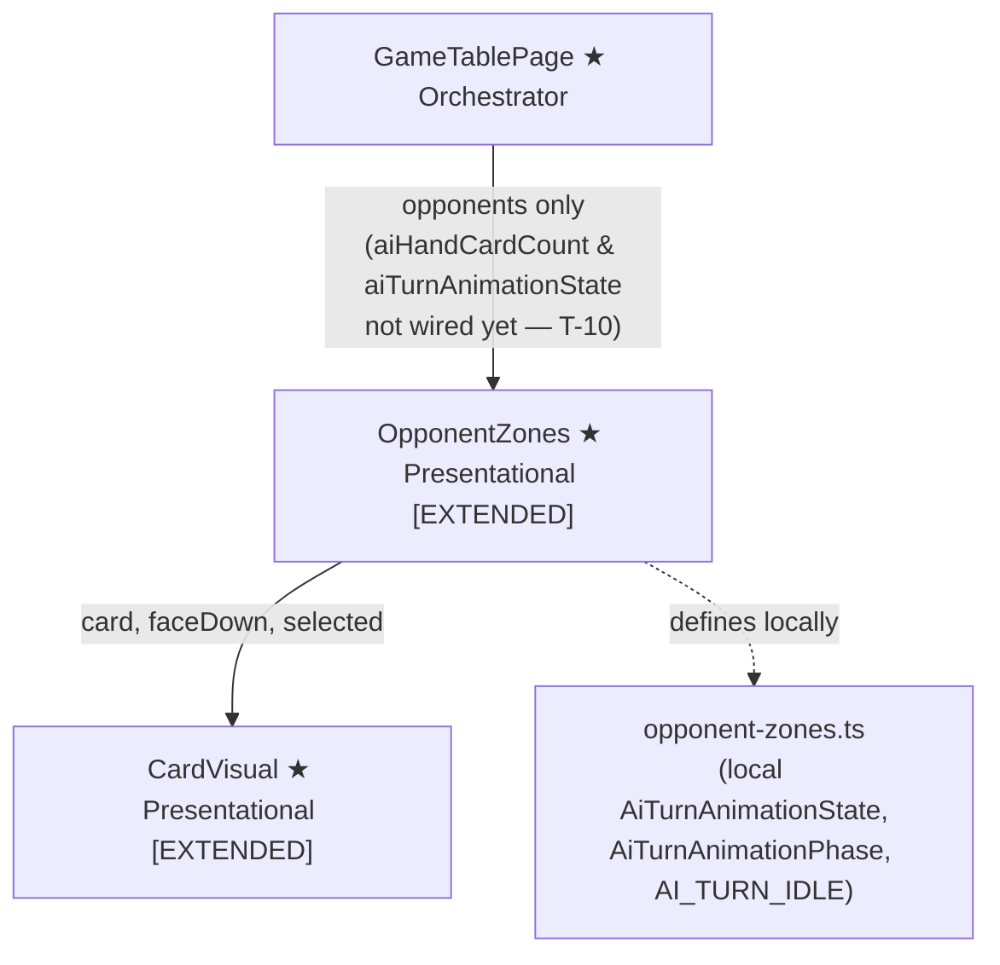

# Review Report: Single Player Mode — AI Opponent (Laia)

**Review Mode:** Incremental (T-3: Extend OpponentZones to render Laia's face-down hand cards with animation support)
**Source:** `docs/specs/single-player/ai-opponent/`
**Reviewed against:** proposal.md, spec.md, user-stories.md, bdd-test.md, design.md, tasks.md

## 1. Executive Summary

The T-3 implementation is functionally complete. All seven acceptance criteria are met: OpponentZones correctly renders face-down hand cards for Laia based on a card count input, applies the active-zone visual state during non-idle animation phases, highlights the selected card at the correct index, reveals a face-up card when the animation state includes a revealed card, and preserves the existing opponent name and capture-count display. The implementation approach — using a card count rather than card data — faithfully follows AD-8's design intent to keep card identities out of the template context.

- Total findings: 5 (0 Critical, 0 Major, 3 Minor, 2 Note)
- Spec compliance: 8 of 8 requirements met
- Architecture alignment: minor drift (local type duplication due to T-4 not yet implemented)
- Test quality: meaningful — all existing assertions verify real behaviour; gaps exist for edge cases

## 2. Architecture Comparison

### 2.1 Planned Component Tree (T-3 Scope)

### 2.2 Actual Component Tree (T-3 Scope)

### 2.3 Drift Analysis

**Type location drift.** The design (AD-5, T-4) specifies that `AiTurnAnimationState`, its phase union, and the `AI_TURN_IDLE` constant should be defined in a shared model file at `src/app/models/ai-turn.ts`. In the actual implementation, OpponentZones defines all three locally within its own component file. The shared model file does not exist — T-4 has not been implemented yet. This is an expected interim state given the task dependency graph (T-3 depends on T-2, not T-4), but when T-4 is implemented the local definitions must be replaced with imports from the shared model file to prevent type divergence.

**Template wiring.** The GameTablePage template currently passes only the `opponents` input to OpponentZones. The `aiHandCardCount` and `aiTurnAnimationState` inputs are not yet wired. This is expected — wiring is the responsibility of T-10, which depends on both T-3 and T-8. The OpponentZones component is correctly prepared to receive these inputs.

**Component structure.** The component hierarchy matches the plan. OpponentZones renders CardVisual children for Laia's hand zone exactly as specified: N face-down instances driven by a count, with animation-state-driven selection and reveal. No structural deviations.

## 3. Findings

### RV-01: Local type definitions for AiTurnAnimationState instead of shared import [Minor]

- **Category:** Architecture Drift
- **Severity:** Minor
- **Related:** AD-5, T-4, T-3
- **Description:** OpponentZones defines `AiTurnAnimationPhase`, `AiTurnAnimationState`, and `AI_TURN_IDLE` locally at the top of `opponent-zones.ts` instead of importing them from a shared model file.
- **Expected:** Per AD-5 and T-4, these types should be defined in `src/app/models/ai-turn.ts` and imported by all consumers, ensuring a single source of truth.
- **Actual:** The shared model file does not exist. OpponentZones defines its own local versions. The type shapes are correct (five-phase union, four fields, correct idle constant).
- **Recommendation:** When T-4 is implemented and creates `src/app/models/ai-turn.ts`, replace the local definitions in OpponentZones with imports from the shared file. Verify that the types match exactly at that point.
- **Impact:** If T-4 is implemented with a slightly different type shape (e.g., an additional field or a renamed phase), the local type in OpponentZones would silently diverge, causing potential runtime mismatches.

### RV-02: Missing unit test for aiHandCardCount equals zero [Minor]

- **Category:** Test Coverage
- **Severity:** Minor
- **Related:** T-3 acceptance criterion #6, FR-8.1
- **Description:** The T-3 acceptance criteria explicitly state "When aiHandCardCount is 0 (Laia has no cards), no card elements are rendered." No unit test covers this edge case.
- **Expected:** A test should set Laia as an opponent with `aiHandCardCount = 0` and verify that no `ai-hand-zone` element and no `ai-hand-card-*` elements are present in the DOM.
- **Actual:** The test file covers `aiHandCardCount = 3` (positive case) and `aiHandCardCount = 2` (active styling case) but never tests the zero boundary.
- **Recommendation:** Add a test that sets `aiHandCardCount = 0` with Laia as an opponent and asserts that `querySelector('[data-testid="ai-hand-zone"]')` returns null.
- **Impact:** Low risk — the template condition `aiHandCardCountSignal() > 0` handles this correctly, and the behaviour is trivially verifiable by reading the template. However, the explicit acceptance criterion warrants an explicit test.

### RV-03: Missing unit test for idle-phase negative case and placement scenario [Minor]

- **Category:** Test Coverage
- **Severity:** Minor
- **Related:** T-3 acceptance criterion #5, FR-6.1, FR-8.3, SC-20
- **Description:** Two related edge cases lack dedicated tests: (1) when `phase` is `'idle'`, no `ai-hand-zone--active` class should be present; (2) when `phase` is `'card-selected'` with a `selectedCardIndex` but `revealedCard` is null (a placement scenario), the selected card should be highlighted but remain face-down.
- **Expected:** The idle negative case is specified in acceptance criterion #5. The placement scenario is required by FR-8.3 ("the card remains face-down throughout") and covered by SC-20.
- **Actual:** Tests cover the positive active-styling case (`phase = 'deliberating'`) and the reveal case (`phase = 'capture-previewing'` with `revealedCard`), but neither the idle negative case nor the card-selected-without-reveal case is tested.
- **Recommendation:** Add two tests: one setting `phase = 'idle'` and asserting the active class is absent; one setting `phase = 'card-selected'` with `selectedCardIndex = 1` and `revealedCard = null`, then asserting the selected card has the selected class and shows the card back image (not face-up).
- **Impact:** Low risk — the component logic is straightforward and the positive-case tests provide reasonable confidence. These tests would strengthen coverage for edge case paths.

### RV-04: Decorator-based @Input() pattern used instead of signal-based input() [Note]

- **Category:** Code Quality
- **Severity:** Note
- **Related:** AD-8, T-3
- **Description:** OpponentZones uses the `@Input()` decorator with setter/getter pairs and backing writable signals for all three inputs (`opponents`, `aiHandCardCount`, `aiTurnAnimationState`). Angular 21 provides the signal-based `input()` function as the preferred approach for new inputs.
- **Expected:** Angular 21 best practices recommend `input()` for new signal-based inputs.
- **Actual:** The `@Input()` decorator pattern is used consistently across the entire codebase, including CardVisual and all other components. The backing signal approach achieves the same reactivity benefits.
- **Recommendation:** This is a codebase-wide pattern, not a T-3-specific deviation. No action is needed for T-3. If the team decides to migrate to `input()` in the future, it should be done as a separate refactoring effort across all components.
- **Impact:** None. The decorator-with-backing-signal pattern functions correctly and is internally consistent.

### RV-05: Missing test for non-AI opponent excludes AI hand zone [Note]

- **Category:** Test Coverage
- **Severity:** Note
- **Related:** SC-22, T-3 acceptance criterion #7
- **Description:** No test explicitly verifies that for a non-AI opponent (name other than "Laia"), the AI hand zone is not rendered even when `aiHandCardCount` is greater than zero.
- **Expected:** SC-22 requires that multiplayer mode is unaffected by face-down rendering rules.
- **Actual:** The existing seat-count tests use opponents named "Opponent-1" etc. and implicitly do not render an AI hand zone, but no assertion explicitly checks for its absence.
- **Recommendation:** Consider adding an assertion in one of the existing multi-opponent tests to verify `querySelector('[data-testid="ai-hand-zone"]')` returns null. This is informational — the template guard `isAiOpponent(opponent)` makes this behaviour obvious from code inspection.
- **Impact:** Minimal. The behaviour is correctly implemented and verifiable by template inspection.

## 4. Traceability Matrix

| Finding | Severity | Category           | Related Spec                    | Status |
| ------- | -------- | ------------------ | ------------------------------- | ------ |
| RV-01   | Minor    | Architecture Drift | AD-5, T-4, T-3                  | Open   |
| RV-02   | Minor    | Test Coverage      | T-3 AC#6, FR-8.1                | Open   |
| RV-03   | Minor    | Test Coverage      | T-3 AC#5, FR-6.1, FR-8.3, SC-20 | Open   |
| RV-04   | Note     | Code Quality       | AD-8, T-3                       | Open   |
| RV-05   | Note     | Test Coverage      | SC-22, T-3 AC#7                 | Open   |

## 5. Spec Compliance Summary

| Requirement | Status | Notes                                                                                                                                 |
| ----------- | ------ | ------------------------------------------------------------------------------------------------------------------------------------- |
| FR-6.1      | ✅ Met | Active visual state applied via `ai-hand-zone--active` class when phase is not idle                                                   |
| FR-6.2      | ✅ Met | Selected card elevated via `isAiCardSelected()` passing `selected` input to CardVisual                                                |
| FR-6.3      | ✅ Met | Card flipped face-up when `revealedCard` is non-null at the selected index                                                            |
| FR-8.1      | ✅ Met | All cards render face-down via `faceDown=true` on CardVisual; count-based rendering ensures card identities are never in the template |
| FR-8.2      | ✅ Met | No difficulty-level check in the component — face-down rendering applies unconditionally                                              |
| FR-8.3      | ✅ Met | Selected card distinguished via CardVisual's `selected` class while remaining face-down                                               |
| FR-8.4      | ✅ Met | Selected card reveals face-up when `revealedCard` is provided at the matching index                                                   |
| US-3        | ✅ Met | Component supports the full animation state progression: idle, deliberating, card-selected, capture-previewing, resolving             |
| US-5        | ✅ Met | All Laia hand cards rendered face-down; card data never in template context                                                           |

## 6. Task Completion Summary

| Task | Title                                                                             | Status      | Findings                          |
| ---- | --------------------------------------------------------------------------------- | ----------- | --------------------------------- |
| T-3  | Extend OpponentZones to render Laia's face-down hand cards with animation support | ✅ Complete | RV-01, RV-02, RV-03, RV-04, RV-05 |

## 7. Test Coverage Summary

| Scenario | Step Definitions                       | Meaningful | Findings |
| -------- | -------------------------------------- | ---------- | -------- |
| SC-10    | ❌ No (E2E — T-14)                     | N/A        | —        |
| SC-11    | ❌ No (E2E — T-14)                     | N/A        | —        |
| SC-18    | ⚠️ Partial (unit covers positive case) | ✅ Yes     | RV-02    |
| SC-19    | ✅ Yes (unit test)                     | ✅ Yes     | —        |
| SC-20    | ❌ No                                  | N/A        | RV-03    |
| SC-21    | ❌ No (E2E — T-14)                     | N/A        | —        |
| SC-22    | ❌ No                                  | N/A        | RV-05    |

## 8. Test Quality Summary

| Test File              | Type | Meaningful Assertions | Issues                                                                                                        |
| ---------------------- | ---- | --------------------- | ------------------------------------------------------------------------------------------------------------- |
| opponent-zones.spec.ts | Unit | ✅ Yes                | Coverage gaps on edge cases (RV-02, RV-03, RV-05) but all existing assertions are behavioural and non-trivial |
| card-visual.spec.ts    | Unit | ✅ Yes                | Complete and meaningful; faceDown, selected, and precedence tests all verify real rendering behaviour         |

## 9. Security Cross-Reference

T-3 is a purely presentational component change with no user input processing, no dynamic HTML rendering, no HTTP calls, and no security-sensitive operations. Card data flows exclusively through typed Angular inputs from a trusted parent component. The `isAiOpponent()` name comparison is used only for rendering decisions, not for security-relevant access control.

No security findings were identified. No `security-report_T-3.md` is warranted for this task.

## 10. Recommendations

### Minor (improvement)

1. **RV-01 — Align types with shared model when T-4 lands.** When T-4 creates `src/app/models/ai-turn.ts`, replace the local type definitions in OpponentZones with imports from the shared file. Verify field-level compatibility at that point.
2. **RV-02 — Add zero-count edge case test.** Add a unit test verifying that when `aiHandCardCount` is 0 with Laia as an opponent, no AI hand zone or card elements are rendered.
3. **RV-03 — Add idle-phase and placement-scenario tests.** Add two tests: one for the idle-phase negative case (no active class), one for the card-selected placement scenario (card stays face-down while selected).

### Notes (informational)

1. **RV-04 — @Input() vs input().** The decorator-based input pattern is a codebase-wide convention. No T-3-specific action needed.
2. **RV-05 — Non-AI opponent test.** Consider adding an explicit assertion that non-Laia opponents do not render an AI hand zone. Low priority given the template guard makes behaviour obvious.
