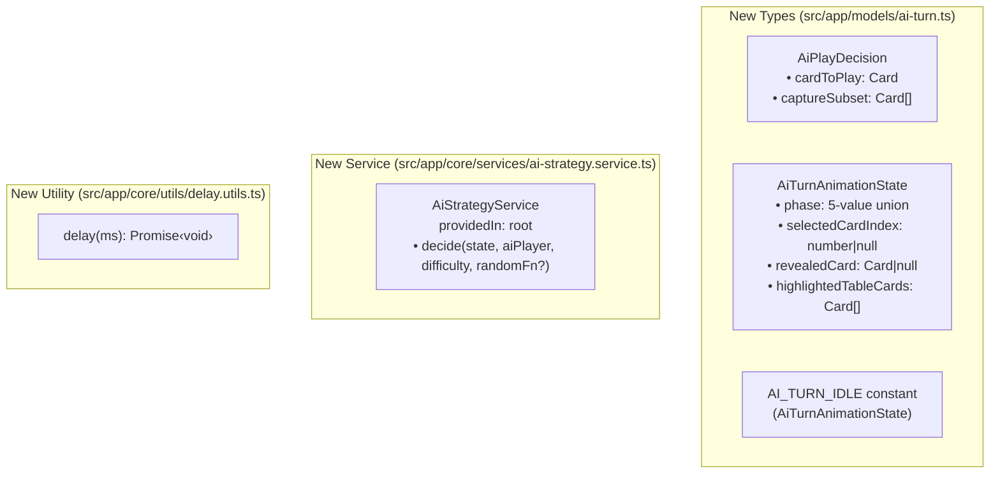
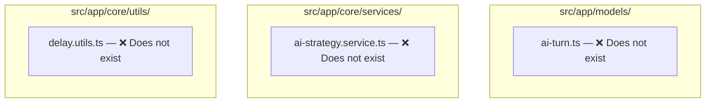

# Review Report: Single Player Mode — AI Opponent (Laia) — T-4 RED Phase

**Review Mode:** Incremental (T-4: Create AiPlayDecision type, AiTurnAnimationState type, and AiStrategyService skeleton) — RED Phase Test-Only
**Source:** `docs/specs/single-player/ai-opponent/`
**Reviewed against:** proposal.md, spec.md, user-stories.md, bdd-test.md, design.md, tasks.md
**Focus:** Whether `ai-turn.spec.ts`, `delay.utils.spec.ts`, and `ai-strategy.service.spec.ts` provide meaningful coverage for T-4 acceptance criteria and whether RED failures are for expected reasons.

## 1. Executive Summary

The three test files provide a solid foundation for T-4's RED phase, covering four of the five acceptance criteria with meaningful assertions. RED failures are confirmed to be for the correct reason: all three implementation files (`ai-turn.ts`, `ai-strategy.service.ts`, `delay.utils.ts`) do not yet exist, so every test fails at the module-resolution stage — exactly the expected TDD behaviour.

Test fixtures are correctly shaped against the existing model types (`Card`, `Player`, `GameState`, `AIDifficulty`), and the assertions capture the intended contracts from the design document.

Three minor coverage gaps were identified: the `AiTurnAnimationState` phase union is only exercised for two of five values, the `AiPlayDecision` type has no direct model-level test, and the optional `randomFn` parameter's default behaviour is not tested.

- Total findings: 6 (0 Critical, 0 Major, 4 Minor, 2 Note)
- T-4 acceptance criteria coverage: 4 of 5 fully covered, 1 partially covered (AC-4)
- Architecture alignment: N/A (RED phase — no implementation exists)
- Test quality: meaningful — assertions target the correct contracts with realistic data

## 2. Architecture Comparison

### 2.1 Planned Component Tree (T-4 Scope)

T-4 introduces no components. Its scope is limited to new types and a new service. The following diagram shows the planned artefacts from design.md sections 4.5 and 8:

### 2.2 Actual Implementation Tree

No implementation files exist yet. This is the expected state for a RED phase review:

### 2.3 Drift Analysis

Not applicable. No implementation exists to drift from the plan. This is the correct state for a RED phase TDD cycle.

## 3. Findings

### RV-01: AiTurnAnimationState phase union only exercised for two of five values [Minor]

- **Category:** Test Coverage
- **Severity:** Minor
- **Related:** AC-4, AD-5, design.md section 8
- **Description:** T-4 acceptance criterion AC-4 requires the `AiTurnAnimationState` type to include a phase union with exactly five values: `'idle'`, `'deliberating'`, `'card-selected'`, `'capture-previewing'`, `'resolving'`. The test file `ai-turn.spec.ts` only constructs objects with `'idle'` (via the `AI_TURN_IDLE` assertion) and `'capture-previewing'` (via the shape test). The phases `'deliberating'`, `'card-selected'`, and `'resolving'` are never referenced in any test.
- **Expected:** All five phase values should appear in at least one test to establish the full RED contract for the union type.
- **Actual:** Only `'idle'` and `'capture-previewing'` are exercised.
- **Recommendation:** Add test cases that construct `AiTurnAnimationState` objects with each of the three missing phase values. These can be lightweight assignments that verify TypeScript acceptance and that the phase field holds the expected value.
- **Impact:** Low. TypeScript compilation will catch missing union members at build time. However, explicit tests for each phase strengthen the TDD contract and make the RED-to-GREEN transition more precise — the implementer knows exactly which phase values must exist.

---

### RV-02: AiPlayDecision type has no direct model-level test [Minor]

- **Category:** Test Coverage
- **Severity:** Minor
- **Related:** AC-2, TR-1.2, AD-10, design.md section 8
- **Description:** T-4 creates two new types in `ai-turn.ts`: `AiPlayDecision` and `AiTurnAnimationState`. The `ai-turn.spec.ts` file tests `AiTurnAnimationState` and the `AI_TURN_IDLE` constant, but does not include any direct test for the `AiPlayDecision` type shape. The type is only indirectly validated through the `ai-strategy.service.spec.ts` test, which asserts that the return value of `decide()` has `cardToPlay` and `captureSubset` fields.
- **Expected:** Since both types are defined in the same `ai-turn.ts` file and both are part of T-4's deliverables, the model spec file should include a shape test for `AiPlayDecision` analogous to the existing `AiTurnAnimationState` shape test.
- **Actual:** Only `AiTurnAnimationState` and `AI_TURN_IDLE` are tested in the model spec.
- **Recommendation:** Add a test in `ai-turn.spec.ts` that imports `AiPlayDecision`, constructs an object with `cardToPlay` (a `Card`) and `captureSubset` (a `Card[]`), and asserts on the field values. This ensures the RED contract includes both types from the module.
- **Impact:** Low. The type is indirectly covered by the service spec. Adding a direct test improves traceability — both T-4 types are proven to exist and have the correct shape from the same spec file.

---

### RV-03: Default randomFn parameter not tested [Minor]

- **Category:** Test Coverage
- **Severity:** Minor
- **Related:** AC-2, TR-1.6, AD-10
- **Description:** T-4 specifies that the `decide` method has an optional `randomFn?` parameter with "a secure default." The `ai-strategy.service.spec.ts` test always passes an explicit `() => 0` as the fourth argument. No test calls `decide()` without the `randomFn` parameter to verify that the optional parameter works and that a default implementation is used.
- **Expected:** At least one test should call `decide(state, aiPlayer, difficulty)` without the fourth argument to establish the RED contract for the optional parameter with default.
- **Actual:** Every call to `decide()` includes an explicit `randomFn`.
- **Recommendation:** Add a test that calls `decide()` with three arguments (omitting `randomFn`). In the RED phase, this test will still fail at import resolution, but once the implementation exists it will verify the default parameter path. The assertion can simply check that the return value has the expected shape (no need to assert specific card selection, since the default uses true randomness).
- **Impact:** Low. If the parameter is accidentally made required rather than optional, no current test would catch it until the GREEN phase of a downstream task.

---

### RV-04: AiTurnAnimationState shape test is partially tautological [Minor]

- **Category:** Test Quality
- **Severity:** Minor
- **Related:** AC-4, AD-5
- **Description:** The second test in `ai-turn.spec.ts` constructs an `AiTurnAnimationState` object with specific values and then asserts those same values back. It checks `state.phase === 'capture-previewing'` and `state.highlightedTableCards.length === 1` — both of which were set by the test itself two lines above.
- **Expected:** Type-shape tests in the RED phase should verify that the type exists and that objects conforming to it can be constructed. Asserting the same values that were assigned is somewhat tautological. However, in the context of validating a type definition that does not yet exist, this is an acceptable pattern — the test serves as a compile-time contract, not a behavioural assertion.
- **Actual:** The test assigns values and asserts them, which verifies type construction but not runtime behaviour.
- **Recommendation:** This is acceptable for a type-definition RED test. To strengthen the test, consider also asserting on the `selectedCardIndex` and `revealedCard` fields (which are set but not asserted), and adding edge cases such as `selectedCardIndex: null` and `revealedCard: null`.
- **Impact:** Minimal. The test achieves its RED-phase purpose (establishing the type contract). Strengthening it would improve the assertion surface without changing the overall approach.

---

### RV-05: AiStrategyService injectability test uses toBeTruthy() [Note]

- **Category:** Test Quality
- **Severity:** Note
- **Related:** AC-1, TR-1.1
- **Description:** The `it('is injectable')` test asserts `expect(service).toBeTruthy()`. In isolation, a `toBeTruthy()` assertion on a service instance is a superficial pattern. However, in this context it is the standard Angular pattern for verifying that a service is correctly registered with the dependency injection system via `TestBed.inject()`. The test is not claiming to verify behaviour — it verifies that Angular's DI can resolve the service.
- **Expected:** For an injectability test, `toBeTruthy()` is the conventional assertion.
- **Actual:** Matches the convention. The second test (`returns a valid play decision shape`) provides the meaningful behavioural assertions.
- **Recommendation:** No action needed. This is informational. The `toBeTruthy()` assertion is appropriate for DI registration verification, and the test suite's overall quality is not diminished since the next test provides meaningful coverage.
- **Impact:** None.

---

### RV-06: delay test uses wall-clock timing [Note]

- **Category:** Test Quality
- **Severity:** Note
- **Related:** AC-3, AD-9, TR-2.3
- **Description:** The `delay.utils.spec.ts` test measures elapsed time using `Date.now()` before and after the `await delay(10)` call, then asserts `elapsed >= requestedMs`. This approach tests real asynchronous timing, which is the correct behaviour for a function that wraps `setTimeout`. However, wall-clock timing tests can be sensitive to system load, timer precision (especially on Windows where timer resolution can be ~15ms), and CI environment variability.
- **Expected:** The test should verify that `delay(ms)` returns a `Promise` that resolves after at least `ms` milliseconds.
- **Actual:** The test does verify this using `Date.now()` with a 10ms delay. The 10ms value minimises flakiness while still asserting on timing behaviour.
- **Recommendation:** No immediate action required. If CI flakiness is observed, consider using Vitest's `vi.useFakeTimers()` and `vi.advanceTimersByTime()` as an alternative approach. For now, the 10ms value is a reasonable pragmatic choice. Note that the test implicitly verifies the return type is `Promise<void>` via the `await` syntax.
- **Impact:** None unless CI timer precision issues arise.

## 4. Traceability Matrix

| Finding | Severity | Category      | Related Spec        | Status        |
| ------- | -------- | ------------- | ------------------- | ------------- |
| RV-01   | Minor    | Test Coverage | AC-4, AD-5          | Open          |
| RV-02   | Minor    | Test Coverage | AC-2, TR-1.2, AD-10 | Open          |
| RV-03   | Minor    | Test Coverage | AC-2, TR-1.6, AD-10 | Open          |
| RV-04   | Minor    | Test Quality  | AC-4, AD-5          | Open          |
| RV-05   | Note     | Test Quality  | AC-1, TR-1.1        | Informational |
| RV-06   | Note     | Test Quality  | AC-3, AD-9, TR-2.3  | Informational |

## 5. T-4 Acceptance Criteria Coverage

| Criterion | Description                                                           | Test File                   | Covered    | Notes                                                                                                                           |
| --------- | --------------------------------------------------------------------- | --------------------------- | ---------- | ------------------------------------------------------------------------------------------------------------------------------- |
| AC-1      | AiStrategyService can be injected without errors                      | ai-strategy.service.spec.ts | ✅ Yes     | `TestBed.inject()` + `toBeTruthy()`                                                                                             |
| AC-2      | `decide` method accepts expected arguments and returns AiPlayDecision | ai-strategy.service.spec.ts | ✅ Yes     | Calls `decide(state, aiPlayer, 'Easy', () => 0)`, asserts `cardToPlay` and `captureSubset` fields                               |
| AC-3      | `delay(ms)` returns a Promise that resolves after ms milliseconds     | delay.utils.spec.ts         | ✅ Yes     | Measures elapsed time with `Date.now()`, asserts `>= requestedMs`                                                               |
| AC-4      | AiTurnAnimationState has a typed phase union with five values         | ai-turn.spec.ts             | ⚠️ Partial | Only `'idle'` and `'capture-previewing'` are exercised. `'deliberating'`, `'card-selected'`, `'resolving'` are untested (RV-01) |
| AC-5      | AI_TURN_IDLE constant of type AiTurnAnimationState is exported        | ai-turn.spec.ts             | ✅ Yes     | Asserts all four fields match the expected idle state                                                                           |

## 6. Task Completion Summary

| Task | Title                                                                                 | Status                                               | Findings                                 |
| ---- | ------------------------------------------------------------------------------------- | ---------------------------------------------------- | ---------------------------------------- |
| T-4  | Create AiPlayDecision type, AiTurnAnimationState type, and AiStrategyService skeleton | ⚠️ RED phase — tests written, implementation pending | RV-01, RV-02, RV-03, RV-04, RV-05, RV-06 |

## 7. RED Phase Failure Verification

This section replaces the standard Test Coverage Summary for this RED-phase review.

| Test File                   | Import Source           | Source Exists | Expected Failure Mode     | Correct RED |
| --------------------------- | ----------------------- | ------------- | ------------------------- | ----------- |
| ai-turn.spec.ts             | `./ai-turn`             | ❌ No         | Module resolution failure | ✅ Yes      |
| ai-strategy.service.spec.ts | `./ai-strategy.service` | ❌ No         | Module resolution failure | ✅ Yes      |
| delay.utils.spec.ts         | `./delay.utils`         | ❌ No         | Module resolution failure | ✅ Yes      |

All three test files import from modules that do not yet exist. Every test will fail at the import stage with a module-not-found error. This is the correct RED behaviour: the tests define the contract, and the implementation must be created to make them pass.

**Test fixture correctness:** All test data structures (Card, Player, GameState, AIDifficulty) are correctly shaped against the existing model type definitions. No mismatches between test fixtures and actual model interfaces were found.

## 8. Test Quality Summary

| Test File                   | Type           | Meaningful Assertions | Issues                                                                                                                                              |
| --------------------------- | -------------- | --------------------- | --------------------------------------------------------------------------------------------------------------------------------------------------- |
| ai-turn.spec.ts             | Unit (model)   | ⚠️ Partial            | Covers AI_TURN_IDLE fully; shape test is partially tautological (RV-04); 3 of 5 phases untested (RV-01); AiPlayDecision not tested (RV-02)          |
| ai-strategy.service.spec.ts | Unit (service) | ✅ Yes                | Injectability verified; decide() signature and return shape tested with realistic data; randomFn seam exercised (though default not tested — RV-03) |
| delay.utils.spec.ts         | Unit (utility) | ✅ Yes                | Timing behaviour verified with wall-clock measurement; return type implicitly proven via await                                                      |

## 9. Security Cross-Reference

Security sweep deferred. No implementation code exists in the RED phase — there is no source code to scan for security vulnerabilities. The security review for T-4 should be performed during the GREEN phase once `ai-strategy.service.ts` and `delay.utils.ts` are implemented. The primary security concern for T-4 (per TR-1.6 and AD-10) is that the default `randomFn` uses a cryptographically secure source — this will be verifiable only after implementation.

## 10. Recommendations

### Minor (address before GREEN phase)

1. **Strengthen phase union coverage (RV-01):** Add test cases in `ai-turn.spec.ts` for the three missing phase values (`'deliberating'`, `'card-selected'`, `'resolving'`). This ensures the GREEN implementation must define all five union members.
2. **Add AiPlayDecision shape test (RV-02):** Add a direct import and construction test for `AiPlayDecision` in `ai-turn.spec.ts`. This establishes both T-4 types as RED contracts in the same spec file.
3. **Test default randomFn omission (RV-03):** Add one test in `ai-strategy.service.spec.ts` that calls `decide()` without the fourth argument. This verifies the parameter is optional and the service uses a default.

### Notes (informational)

1. **Shape test assertions (RV-04):** Consider asserting on all four fields of the constructed `AiTurnAnimationState` (currently only `phase` and `highlightedTableCards.length` are asserted; `selectedCardIndex` and `revealedCard` are set but unchecked).
2. **Monitor delay test stability (RV-06):** If the `Date.now()`-based timing test shows flakiness in CI, switch to Vitest fake timers (`vi.useFakeTimers()`).
