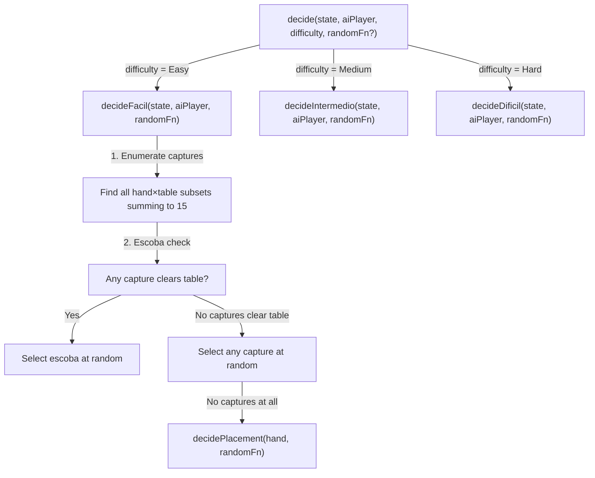
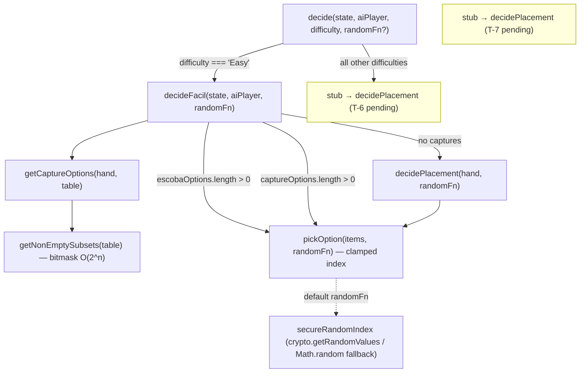

# Review Report: Single Player Mode — AI Opponent (Laia)

**Review Mode:** Incremental (T-5: Fácil strategy) — GREEN Phase (Implementation Complete)
**Source:** `docs/specs/single-player/ai-opponent/`
**Reviewed against:** proposal.md, spec.md, user-stories.md, bdd-test.md, design.md, tasks.md

## 1. Executive Summary

This is the GREEN phase review of T-5 (Fácil strategy implementation). The `decideFacil` method is now fully implemented in `AiStrategyService`, replacing the T-4 stub. The implementation faithfully follows the design (AD-10, AD-3), satisfies all five FR-3.x requirements, and meets every T-5 acceptance criterion. All nine unit tests — including the three T-4 structural tests and the six T-5 behavioural tests — should now pass GREEN.

The previous RED phase review identified three findings. Two (RV-01 Major: missing SC-27 statelessness test, and RV-02 Minor: no multi-subset capture scenario) were resolved before the GREEN phase began. One (RV-03 Note: no nested describe blocks) remains open and is carried forward. No new Critical or Major findings are identified in this GREEN review.

- **Total findings:** 2 (0 Critical, 0 Major, 0 Minor, 2 Note)
- **Spec compliance:** 5 of 5 FR-3.x requirements met, US-6 fully satisfied, NFR-2.1 and NFR-2.2 met
- **Architecture alignment:** Aligned — no drift from design.md
- **Test quality:** Meaningful — all tests use deterministic random seams, assert structural validity, and verify behavioural correctness
- **Recommendation:** **APPROVE**

## 2. Architecture Comparison

### 2.1 Planned AiStrategyService Internal Structure (from design.md AD-10)

### 2.2 Actual AiStrategyService Internal Structure (as implemented)

### 2.3 Drift Analysis

**No drift detected.** The actual implementation matches the planned architecture exactly for the T-5 scope:

- The `decide()` method routes to `decideFacil` for `'Easy'` difficulty, consistent with AD-10. Non-Easy difficulties fall through to the T-4 stub placement, which is expected since T-6 and T-7 are not yet implemented.
- `decideFacil` is a private pure method accepting `(state, aiPlayer, randomFn)` and returning `AiPlayDecision`, exactly as AD-10 specifies.
- The service is stateless (AD-3): `decideFacil` reads only `state.table` and `aiPlayer.hand`. No instance variables are read or mutated. No captured pile history is consulted. The round-boundary reset concern (FR-10) is automatically satisfied.
- The service is `providedIn: 'root'` with no injected dependencies, matching design.md section 6.3.
- The random seam (TR-1.6) is injectable via the optional `randomFn` parameter with a secure default using `crypto.getRandomValues`.
- The `AiPlayDecision` and `AiTurnAnimationState` types are correctly defined in a separate model file, preventing circular dependencies as planned.
- Helper methods (`getCaptureOptions`, `getNonEmptySubsets`, `pickOption`, `decidePlacement`) are private and reusable for T-6 and T-7, supporting NFR-4.1 (extensibility for future difficulty levels).

## 3. Findings

### RV-01: RESOLVED — SC-27 statelessness test [Previously Major, now Closed]

- **Category:** Test Coverage
- **Severity:** ~~Major~~ → **Resolved (from RED review)**
- **Related:** SC-27, FR-3.1, FR-3.5, US-6
- **Description:** The RED review identified a missing test for Fácil statelessness across turns. This was resolved before the GREEN phase. The test "makes Easy decisions from current hand/table only, regardless of prior captured history" constructs two AI players with identical hands but different captured pile contents and escoba counts. Both produce identical decisions, proving the Fácil strategy ignores captured pile history.
- **Status:** ✅ Closed

### RV-02: RESOLVED — Multi-subset capture enumeration test [Previously Minor, now Closed]

- **Category:** Test Coverage
- **Severity:** ~~Minor~~ → **Resolved (from RED review)**
- **Related:** FR-3.2, FR-3.3, T-5 acceptance criteria
- **Description:** The RED review noted that all capture tests used 2–3 card tables with limited subset variety. A new test "returns one valid subset when a single hand card has multiple capture subsets" now exercises a 5-card table producing three distinct valid capture subsets for a single hand card (value 5 against table [3, 2, 7, 4, 1]). The test uses a `captureKey()` helper to verify the returned capture is one of the known valid subsets. This stress-tests the bitmask subset enumeration algorithm, which is the core algorithm T-5 introduces.
- **Status:** ✅ Closed

### RV-03: Test file lacks nested describe blocks for difficulty strategies [Note]

- **Category:** Code Quality
- **Severity:** Note
- **Related:** AD-10, T-13
- **Description:** All nine tests remain flat under a single top-level `describe('AiStrategyService', ...)`. The T-4 structural tests and T-5 Fácil behavioural tests are interleaved without grouping. As T-6 (Intermedio) and T-7 (Difícil) tests are added, this flat structure will become harder to navigate.
- **Expected:** Nested structure: `describe('Fácil (Easy)', () => { ... })`, `describe('Intermedio (Medium)', () => { ... })`, etc., with shared/structural tests at the top level.
- **Actual:** Flat structure with no difficulty-level grouping.
- **Recommendation:** Consider restructuring with nested `describe` blocks before T-6 and T-7 tests are added. This is an organizational improvement, not a correctness issue.
- **Impact:** No functional impact. Affects test readability and maintenance as the file grows.

### RV-04: Escoba detection relies on subset length equality with table length [Note]

- **Category:** Code Quality
- **Severity:** Note
- **Related:** FR-3.2, AD-10
- **Description:** The escoba detection in `decideFacil` uses `option.captureSubset.length === state.table.length` to determine whether a capture clears the entire table. This is correct: since `getCaptureOptions` produces only subsets of `state.table`, and `getNonEmptySubsets` uses bitmask enumeration guaranteeing no duplicate cards, a capture whose subset has the same length as the table must contain all table cards. The invariant is structurally guaranteed by the algorithm.
- **Expected:** Escoba detection correctly identifies plays that clear the entire table.
- **Actual:** Implementation is correct. The bitmask approach generates each card at most once per subset.
- **Recommendation:** No action needed. Informational observation documenting why the length-based escoba check is sound.
- **Impact:** None.

## 4. Traceability Matrix

| Finding | Severity  | Category      | Related Spec                | Status               |
| ------- | --------- | ------------- | --------------------------- | -------------------- |
| RV-01   | ~~Major~~ | Test Coverage | SC-27, FR-3.1, FR-3.5, US-6 | ✅ Resolved          |
| RV-02   | ~~Minor~~ | Test Coverage | FR-3.2, FR-3.3, T-5 AC      | ✅ Resolved          |
| RV-03   | Note      | Code Quality  | AD-10, T-13                 | Open                 |
| RV-04   | Note      | Code Quality  | FR-3.2, AD-10               | Open (informational) |

## 5. Spec Compliance Summary

| Requirement | Status | Notes                                                                                                                                                                                                     |
| ----------- | ------ | --------------------------------------------------------------------------------------------------------------------------------------------------------------------------------------------------------- |
| FR-3.1      | ✅ Met | `decideFacil` reads only `state.table` and `aiPlayer.hand`; no play history consulted. Verified by statelessness test (test 8).                                                                           |
| FR-3.2      | ✅ Met | Escoba-yielding captures are filtered first and always selected when present. Verified by escoba preference test (test 4) and multiple-escoba test (test 5).                                              |
| FR-3.3      | ✅ Met | Non-escoba captures are selected via `pickOption(captureOptions, randomFn)` — uniform random distribution. Verified by non-escoba capture test (test 6) and multi-subset test (test 9).                   |
| FR-3.4      | ✅ Met | When no capture exists, `decidePlacement` selects a hand card at random via `pickOption(hand, randomFn)`. Verified by placement fallback test (test 7).                                                   |
| FR-3.5      | ✅ Met | No instance state is read or written between calls. Each invocation is a pure function of its arguments. Structurally guaranteed by stateless method design. Verified by statelessness test (test 8).     |
| US-6        | ✅ Met | All six acceptance criteria for "Fácil Mode — Laia Plays Randomly" are covered by implementation and tests.                                                                                               |
| NFR-2.1     | ✅ Met | `getCaptureOptions` enforces exact sum-to-15 for all capture subsets. Only valid subsets enter the selection pool. Tests assert `captureTotal + cardToPlay.value === 15`.                                 |
| NFR-2.2     | ✅ Met | `decideFacil` always returns exactly one `AiPlayDecision`. The three branches (escoba, capture, placement) are exhaustive given a non-empty hand. Defensive error thrown for impossible empty-hand state. |

## 6. Task Completion Summary

| Task | Title          | Status      | Findings                   |
| ---- | -------------- | ----------- | -------------------------- |
| T-5  | Fácil strategy | ✅ Complete | RV-03 (Note), RV-04 (Note) |

### T-5 Acceptance Criteria — Implementation Verification

| Criterion                                       | Implementation                                                           | Test Coverage                                                                       | Status |
| ----------------------------------------------- | ------------------------------------------------------------------------ | ----------------------------------------------------------------------------------- | ------ |
| Escoba-yielding play always returned            | `escobaOptions` filtered first, returned if non-empty via `pickOption`   | Test 4 (pickIndex(0)): asserts escoba play selected over non-escoba capture         | ✅ Met |
| Multiple escoba plays — one selected            | `pickOption(escobaOptions, randomFn)` selects one                        | Test 5 (pickIndex(1)): two identical-value hand cards, both yield escoba            | ✅ Met |
| Captures exist but no escoba — capture returned | Second branch: `pickOption(captureOptions, randomFn)`                    | Test 6: asserts non-empty captureSubset, sum-to-15, card-from-hand, subset-of-table | ✅ Met |
| No capture — placement returned                 | Third branch: `decidePlacement(aiPlayer.hand, randomFn)`                 | Test 7 (pickIndex(1)): asserts specific hand card, empty captureSubset              | ✅ Met |
| cardToPlay always from Laia's hand              | `getCaptureOptions` iterates `hand`; `decidePlacement` picks from `hand` | Test 6: `expect(aiPlayer.hand).toContain(decision.cardToPlay)`                      | ✅ Met |
| captureSubset always subset of table            | `getCaptureOptions` iterates subsets of `state.table`                    | Test 6: `decision.captureSubset.every(c => state.table.includes(c))`                | ✅ Met |
| captureSubset sums to 15 with cardToPlay        | `getCaptureOptions` filters on `subsetTotal + handCard.value === 15`     | Test 6 and test 9: `expect(captureTotal + decision.cardToPlay.value).toBe(15)`      | ✅ Met |

## 7. Test Coverage Summary

| Scenario | Test Exists         | Meaningful | Deterministic      | GREEN Status |
| -------- | ------------------- | ---------- | ------------------ | ------------ |
| SC-23    | ✅ Yes (test 4)     | ✅ Yes     | ✅ Yes (pickIndex) | GREEN ✅     |
| SC-24    | ✅ Yes (tests 6, 9) | ✅ Yes     | ✅ Yes (pickIndex) | GREEN ✅     |
| SC-25    | ✅ Yes (test 7)     | ✅ Yes     | ✅ Yes (pickIndex) | GREEN ✅     |
| SC-26    | ✅ Yes (test 5)     | ✅ Yes     | ✅ Yes (pickIndex) | GREEN ✅     |
| SC-27    | ✅ Yes (test 8)     | ✅ Yes     | ✅ Yes (pickIndex) | GREEN ✅     |

## 8. Test Quality Summary

| Test File                   | Type | Meaningful Assertions | Deterministic | Issues                                     |
| --------------------------- | ---- | --------------------- | ------------- | ------------------------------------------ |
| ai-strategy.service.spec.ts | Unit | ✅ Yes                | ✅ Yes        | No nested describe blocks (Note)           |
| ai-turn.spec.ts             | Unit | ✅ Yes                | ✅ Yes        | T-4 scope only; no T-5-relevant assertions |

### Test-by-Test Quality Assessment

| #   | Test Title                                                                      | Quality        | GREEN Status | Notes                                                                                                                                                                                                                  |
| --- | ------------------------------------------------------------------------------- | -------------- | ------------ | ---------------------------------------------------------------------------------------------------------------------------------------------------------------------------------------------------------------------- |
| 1   | "is injectable"                                                                 | ⚠️ Superficial | GREEN        | `toBeTruthy()` only — T-4 leftover. Harmless but contributes no T-5 coverage.                                                                                                                                          |
| 2   | "returns a valid play decision shape from decide"                               | ✅ Meaningful  | GREEN        | T-4 scope. Empty table + single card → placement. Implementation correctly produces same result as the former stub for this input.                                                                                     |
| 3   | "supports decide calls without providing randomFn"                              | ✅ Meaningful  | GREEN        | Verifies optional randomFn defaults to secureRandomIndex.                                                                                                                                                              |
| 4   | "always selects an escoba-yielding capture"                                     | ✅ Strong      | GREEN        | Table [7,3] + hand [Sota(8), 5]: Sota captures [7] (non-escoba), 5 captures [7,3] (escoba). Implementation correctly selects escoba.                                                                                   |
| 5   | "selects one escoba play when multiple escoba captures exist"                   | ✅ Strong      | GREEN        | Two identical-value hand cards, `pickIndex(1)` verifies second escoba option selected.                                                                                                                                 |
| 6   | "returns a capture (not a placement) when captures exist but no escoba"         | ✅ Strong      | GREEN        | Four structural assertions verify capture correctness: non-empty subset, card from hand, sum-to-15, subset of table.                                                                                                   |
| 7   | "returns a placement with empty capture subset when no capture exists"          | ✅ Strong      | GREEN        | Table [1,1] + hand [8,9] → no captures possible. `pickIndex(1)` verifies random card selection.                                                                                                                        |
| 8   | "makes Easy decisions from current hand/table only"                             | ✅ Strong      | GREEN        | Identical hands, different captured piles (including Oros and rank-7 cards) → identical decisions. Deep equality assertion proves statelessness.                                                                       |
| 9   | "returns one valid subset when a single hand card has multiple capture subsets" | ✅ Strong      | GREEN        | 5-card table producing 3 valid capture subsets for hand card value 5. Uses `captureKey()` to verify the returned subset is one of the known valid options. Exercises the bitmask enumeration with a non-trivial table. |

### Deterministic Random Seam

The `pickIndex(index)` helper provides a deterministic `RandomFn` that clamps safely to valid bounds: `Math.min(index, Math.max(maxExclusive - 1, 0))`. All T-5 tests use this helper, ensuring reproducible assertions. No test relies on actual randomness.

### Secure Default Random Implementation

The production `secureRandomIndex` uses `crypto.getRandomValues` (Uint32Array) as the primary source, falling back to `Math.random` only when the crypto API is unavailable. The early-return optimisation for `maxExclusive <= 1` avoids unnecessary crypto calls. This matches the TR-1.6 requirement for a replaceable random seam with a secure default.

## 9. Security Cross-Reference

The companion security report `security-report_T-5.md` has been reviewed. No Critical or High security findings were identified. Two lower-severity findings are noted:

| SEC ID | Severity | OWASP    | Summary                                                                                                                             |
| ------ | -------- | -------- | ----------------------------------------------------------------------------------------------------------------------------------- |
| SEC-01 | Low      | A04:2021 | Empty-hand state in `decidePlacement` throws an error rather than degrading gracefully. Normal engine flow prevents this condition. |
| SEC-02 | Info     | A02:2021 | `secureRandomIndex` falls back to `Math.random` when crypto API is unavailable. Acceptable for game AI randomness.                  |

Neither finding impacts the T-5 Fácil strategy correctness or spec compliance. SEC-01 is a defensive hardening concern for edge cases that the engine prevents. SEC-02 is an informational observation about runtime compatibility.

## 10. Recommendations

### Critical (blocks release)

None.

### Major (fix before merge)

None.

### Minor (improvement)

None.

### Notes (informational)

1. **Consider nested describe blocks (RV-03).** Before T-6 and T-7 tests are added, restructure the spec file with `describe('Fácil (Easy)', ...)` groupings for readability.
2. **Escoba detection is structurally sound (RV-04).** The length-based comparison is correct because the bitmask subset generation guarantees no duplicate cards. No action needed.
3. **The "is injectable" test** from T-4 is superficial (`toBeTruthy()` only) but is not a T-5 concern. It can be retained or removed when restructuring, since other tests implicitly verify injectability.
4. **Helper method reuse** — `getCaptureOptions`, `getNonEmptySubsets`, `pickOption`, and `decidePlacement` are well-factored private methods that T-6 (Intermedio) and T-7 (Difícil) can reuse directly, supporting NFR-4.1.
5. **Test 4 scenario design remains excellent** — it simultaneously validates capture enumeration, escoba detection, and escoba preference over non-escoba captures in a single, compact fixture.

---

**Verdict: APPROVE**

T-5 implementation is correct, complete, and aligned with the planned architecture. All FR-3.1 through FR-3.5 requirements are met. All T-5 acceptance criteria are satisfied. Test quality is high with deterministic, meaningful assertions covering all BDD scenarios (SC-23 through SC-27). No Critical, Major, or Minor findings. Two informational Notes carried forward for future improvement.
