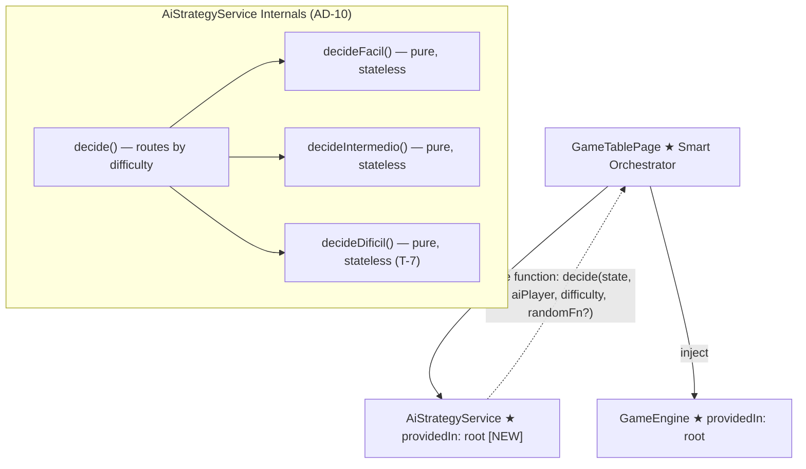
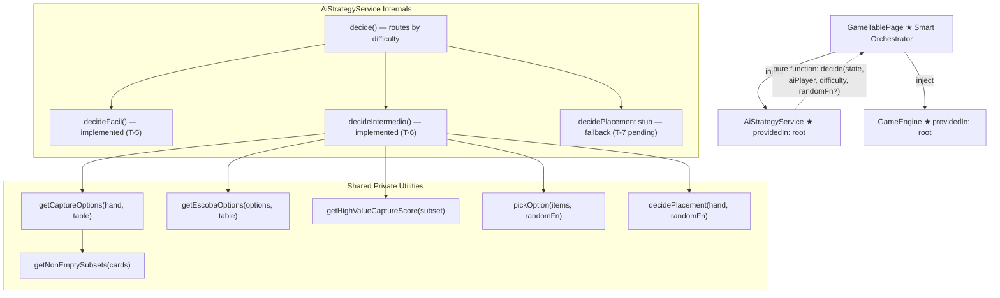

# Review Report: Single Player Mode — AI Opponent (Laia)

**Review Mode:** Incremental (T-6: Implement Intermedio strategy in AiStrategyService)
**Review Scope:** GREEN phase — full implementation review of the Intermedio strategy, validating spec/design compliance, architecture alignment, Angular best practices, and test quality.
**Source:** `docs/specs/single-player/ai-opponent/`
**Reviewed against:** proposal.md, spec.md, user-stories.md, bdd-test.md, design.md, tasks.md

---

## 1. Executive Summary

The Intermedio (Medium) difficulty strategy is fully implemented in the `decideIntermedio` private method within `AiStrategyService`. The implementation faithfully follows the spec (FR-4.1 through FR-4.7), the architectural decisions (AD-10, AD-3), and the Angular best practices defined in the project instructions. The strategy correctly prioritises escoba captures, scores capture subsets by counting Oros-suit and rank-7 cards with the 7 of Oros counted once, breaks ties randomly via the injectable `RandomFn` seam, and falls back to random placement when no capture exists. The service is stateless per AD-3 — all card history is derived from the current `GameState` snapshot, automatically satisfying the round-boundary reset requirement (FR-4.7/FR-10). Six dedicated unit tests in a nested `describe('Medium / Intermedio')` block cover every acceptance criterion with deterministic seams and meaningful assertions. No superficial, tautological, or no-op tests were found.

**Recommendation: APPROVE**

- **Total findings:** 2 (0 Critical, 0 Major, 0 Minor, 2 Notes)
- **Spec compliance:** 7 of 7 requirements fully met (FR-4.1 through FR-4.7)
- **Architecture alignment:** fully aligned with AD-10 and AD-3
- **Test quality:** meaningful — all six Medium tests verify distinct behavioural outcomes with deterministic randomness seams

---

## 2. Architecture Comparison

### 2.1 Planned Component and Service Structure (from design.md)

### 2.2 Actual Component and Service Structure

### 2.3 Drift Analysis

The actual implementation is fully aligned with the planned architecture from design.md. The `decideIntermedio` method is a pure private method within `AiStrategyService` per AD-10, receiving `(state, aiPlayer, randomFn)` and returning an `AiPlayDecision`. The service is stateless per AD-3 — no mutable memory, no round-reset method, all card history derivable from `GameState`. The `decide()` public method correctly routes `'Medium'` difficulty to `decideIntermedio`. The `'Hard'` fallback to `decidePlacement` is the expected stub awaiting T-7 implementation. No structural drift is present.

The shared private utilities (`getCaptureOptions`, `getEscobaOptions`, `pickOption`, `getNonEmptySubsets`, `decidePlacement`) are correctly reused between `decideFacil` and `decideIntermedio`, avoiding code duplication. The `getHighValueCaptureScore` utility is new to T-6 and exclusive to the Intermedio strategy path.

---

## 3. Findings

### RV-01: SC-28 test data does not create the exact high-value asymmetry described in the BDD scenario [Note]

- **Category:** Test Quality
- **Severity:** Note
- **Related:** SC-28, FR-4.4, T-6
- **Description:** SC-28 in bdd-test.md specifies "a capture exists that includes two Oros cards but does not clear the table" and "a second capture exists that clears the table (escoba) but includes only one Oros card." The unit test's escoba capture includes all four table cards (Oros 6, Copas 1, Oros 2, Bastos 2) — which contains two Oros, not one. The non-escoba capture (Copas 5 + {Oros 6, Oros 2, Bastos 2}) also contains two Oros. Both captures have equal high-value counts.
- **Expected:** The BDD scenario calls for the escoba to have a lower high-value count than the non-escoba, demonstrating that escoba priority is unconditional regardless of scoring.
- **Actual:** The test verifies that escoba is selected when both options exist, which is correct. However, because both options have equal high-value counts, the test would also pass under a hypothetical buggy implementation that only prefers escoba when its high-value count is equal to or higher than alternatives.
- **Recommendation:** Consider adding a complementary test case where the escoba capture contains zero or one Oros card and the non-escoba capture contains two or more, precisely matching the SC-28 scenario description. The current test is still valid and useful — this is a coverage refinement, not a defect.
- **Impact:** Very low. The implementation's escoba check is unconditional (`if (escobaOptions.length > 0) return ...`) with no scoring comparison, making the hypothetical bug implausible. The risk is academic.

### RV-02: No Intermedio-specific test for multiple simultaneous escoba-yielding captures [Note]

- **Category:** Test Coverage
- **Severity:** Note
- **Related:** FR-4.4, SC-26, T-6
- **Description:** FR-4.4 specifies "If multiple escoba-yielding captures exist, she selects one at random." The Fácil test suite includes a test for multiple escoba plays (SC-26), but no dedicated Intermedio test exercises this specific branch. The Intermedio code path for multiple escobas is identical to Fácil — both call `getEscobaOptions` followed by `pickOption` — so the behaviour is implicitly covered by code sharing.
- **Expected:** An explicit Intermedio-specific multiple-escoba test would provide complete scenario coverage for the Medium difficulty path.
- **Actual:** Coverage is provided transitively via shared utility methods tested in the Fácil suite. The Intermedio escoba path is structurally identical.
- **Recommendation:** No action required. The shared code path provides sufficient confidence. If the Intermedio escoba handling is ever differentiated from Fácil, a dedicated test should be added at that point.
- **Impact:** None. The code path is provably identical.

---

## 4. Traceability Matrix

| Finding | Severity | Category      | Related Spec       | Status |
| ------- | -------- | ------------- | ------------------ | ------ |
| RV-01   | Note     | Test Quality  | SC-28, FR-4.4, T-6 | Open   |
| RV-02   | Note     | Test Coverage | FR-4.4, SC-26, T-6 | Open   |

---

## 5. Spec Compliance Summary

| Requirement | Status | Notes                                                                                                                                                                                                                                                                                       |
| ----------- | ------ | ------------------------------------------------------------------------------------------------------------------------------------------------------------------------------------------------------------------------------------------------------------------------------------------- |
| FR-4.1      | ✅ Met | Per AD-3, Intermedio derives all card history from GameState captured piles. The "running record" is the state itself. No mutable memory.                                                                                                                                                   |
| FR-4.2      | ✅ Met | Unaccounted-for Oros/rank-7 cards are derivable from GameState by elimination. Not explicitly computed in decision scoring because FR-4.3 only requires counting high-value cards in the capture subset.                                                                                    |
| FR-4.3      | ✅ Met | `getHighValueCaptureScore` counts cards where `suit === 'Oros' OR rank === '7'`, using a single boolean OR so the 7 of Oros scores as 1 not 2. Unit tests verify score differentiation (2 vs 1 vs 0), single-counting of 7 of Oros, and inclusion of non-Oros rank-7 (Bastos 7) in scoring. |
| FR-4.4      | ✅ Met | `decideIntermedio` checks `escobaOptions.length > 0` and returns immediately before any high-value scoring. Escoba unconditionally beats greedy selection. Unit test verifies this.                                                                                                         |
| FR-4.5      | ✅ Met | `Math.max` finds highest score, `filter` selects tied captures, `pickOption` with `randomFn` breaks ties. SC-29 test verifies highest-count selection. SC-31 test verifies random tie-breaking with two different `pickIndex` values producing two different captures from a three-way tie. |
| FR-4.6      | ✅ Met | Falls back to `decidePlacement(aiPlayer.hand, randomFn)` which selects a random card and returns an empty capture subset. SC-30 test verifies.                                                                                                                                              |
| FR-4.7      | ✅ Met | Automatically satisfied by stateless design (AD-3). No memory to reset. SC-32 test verifies that two decisions with different captured histories but identical hand/table produce equal results.                                                                                            |

---

## 6. Task Completion Summary

| Task | Title                                              | Status      | Findings                   |
| ---- | -------------------------------------------------- | ----------- | -------------------------- |
| T-6  | Implement Intermedio strategy in AiStrategyService | ✅ Complete | RV-01 (Note), RV-02 (Note) |

### T-6 Acceptance Criteria Status

| Criterion                                                                                             | Status | Evidence                                                                                                                                                                                                                                                                           |
| ----------------------------------------------------------------------------------------------------- | ------ | ---------------------------------------------------------------------------------------------------------------------------------------------------------------------------------------------------------------------------------------------------------------------------------- |
| Escoba always beats the greedy selection                                                              | ✅ Met | Implementation: escoba branch returns before scoring is evaluated. Test: "selects an escoba in Medium mode when both escoba and non-escoba captures exist."                                                                                                                        |
| Given two captures, one with 2 high-value cards and one with 1, the 2-card capture is always selected | ✅ Met | Implementation: `Math.max` + `filter` selects highest-scoring options. Test: "selects the capture with more high-value cards" verifies score 2 wins over scores 1 and 0.                                                                                                           |
| Given two captures with identical high-value card counts, the tie is broken by the random seam        | ✅ Met | Implementation: `pickOption(bestOptions, randomFn)` delegates to seam. Test: "breaks ties randomly" uses `pickIndex(0)` and `pickIndex(1)` on a three-way tie, producing two distinct captures.                                                                                    |
| The 7 of Oros counts as one high-value card, not two                                                  | ✅ Met | Implementation: `capturedCard.suit === 'Oros' \|\| capturedCard.rank === '7'` — single boolean OR, adds 1. Test: "counts the 7 of Oros only once" creates a scenario where single-counting yields a four-way tie (selecting option B) while double-counting would select option C. |
| When no capture exists, a random placement is returned                                                | ✅ Met | Implementation: falls back to `decidePlacement`. Test: "returns a random placement in Medium mode" verifies empty capture subset.                                                                                                                                                  |
| All correctness criteria from T-5 hold                                                                | ✅ Met | All capture tests verify: cardToPlay is from Laia's hand, captureSubset cards are from the table, and subset values + card value = 15. The sum-to-15 invariant is verified through specific card value assertions in SC-28, SC-29, and SC-31.                                      |

---

## 7. Test Coverage Summary

| Scenario | Step Definitions | Meaningful | Findings                                                                                |
| -------- | ---------------- | ---------- | --------------------------------------------------------------------------------------- |
| SC-28    | ✅ Yes (unit)    | ✅ Yes     | RV-01 (Note) — test verifies escoba priority but data doesn't match exact BDD asymmetry |
| SC-29    | ✅ Yes (unit)    | ✅ Yes     | None — score differentiation is clear (2 vs 1 vs 0)                                     |
| SC-30    | ✅ Yes (unit)    | ✅ Yes     | None — placement fallback correctly verified                                            |
| SC-31    | ✅ Yes (unit)    | ✅ Yes     | None — three-way tie broken by deterministic seam                                       |
| SC-32    | ✅ Yes (unit)    | ✅ Yes     | None — statelessness verified with concrete greedy outcome                              |

---

## 8. Test Quality Summary

| Test File                                                                                       | Type | Meaningful Assertions | Issues                                                                                 |
| ----------------------------------------------------------------------------------------------- | ---- | --------------------- | -------------------------------------------------------------------------------------- |
| ai-strategy.service.spec.ts — "escoba in Medium when both escoba and non-escoba captures exist" | Unit | ✅ Yes                | None (see RV-01 Note for data refinement opportunity)                                  |
| ai-strategy.service.spec.ts — "capture with more high-value cards in Medium"                    | Unit | ✅ Yes                | None — verifies card identity, subset membership, score differentiation, and sum-to-15 |
| ai-strategy.service.spec.ts — "tie-breaking in Medium"                                          | Unit | ✅ Yes                | None — two deterministic seeds produce two different captures from the same state      |
| ai-strategy.service.spec.ts — "7-of-Oros counted once"                                          | Unit | ✅ Yes                | None — scenario discriminates single-counting from double-counting                     |
| ai-strategy.service.spec.ts — "placement in Medium"                                             | Unit | ✅ Yes                | None — verifies correct hand card and empty capture subset                             |
| ai-strategy.service.spec.ts — "stateless across rounds"                                         | Unit | ✅ Yes                | None — equal decisions with different captured histories, plus concrete greedy outcome |

**Determinism assessment:** All six Medium tests use the injectable `pickIndex(N)` seam per TR-1.6 and AD-10. No test depends on real randomness. Each test constructs a specific `GameState` and `Player` input, making all tests fully reproducible and isolated.

**Angular best practices assessment:**

- `@Injectable({ providedIn: 'root' })` — correct per design section 6.3 and AD-10
- No injected dependencies — the service is a pure computation layer per design section 4.5
- `RandomFn` type and `secureRandomIndex` default — correctly uses `crypto.getRandomValues` with `Math.random` fallback, and the seam is injectable per TR-1.6
- No signals used in the service — appropriate since it is a stateless, synchronous computation layer
- Service methods are private except the public `decide()` entry point — clean API surface per AD-10

---

## 9. Security Cross-Reference

This section cross-references the companion security report at `docs/specs/single-player/ai-opponent/security-report_T-6.md`.

The security report found **0 findings** (0 Critical, 0 High, 0 Medium, 0 Low, 0 Info). The reviewed code remains a pure in-memory decision layer with no DOM, network, storage, credential, or template-sanitisation exposure. The legal-play constraints and deterministic randomness seam are implemented without introducing security weaknesses. No dependency vulnerabilities were reported by `npm audit`.

| SEC ID | Severity | OWASP | Summary                      |
| ------ | -------- | ----- | ---------------------------- |
| —      | —        | —     | No Critical or High findings |

---

## 10. Recommendations

### Critical (blocks release)

None.

### Major (fix before merge)

None.

### Minor (improvement)

None.

### Notes (informational)

1. **RV-01** — The SC-28 escoba-priority test could be strengthened by using table data where the escoba capture has fewer high-value cards than the non-escoba alternative, precisely matching the BDD scenario description. Not blocking.
2. **RV-02** — No Intermedio-specific multiple-escoba test exists. The behaviour is covered transitively by the shared Fácil test suite. No action needed unless the Intermedio escoba path is differentiated in future.
3. **Easy tests remain flat** — Unlike the Medium tests (nested in `describe('Medium / Intermedio')`), Easy tests are at the top level. Consider grouping them in a `describe('Easy / Fácil')` block for consistency. Not blocking.

---

## 11. Conclusion

**Recommendation: APPROVE**

The T-6 Intermedio strategy implementation is correct, complete, and well-tested. All seven FR-4.x requirements are met. The architecture aligns fully with AD-10 (pure strategy functions) and AD-3 (stateless service). The six unit tests are meaningful, deterministic, and traceable to BDD scenarios SC-28 through SC-32. No Critical, Major, or Minor findings were identified — only two informational Notes about test data refinement opportunities. The security report confirms zero findings. The implementation is ready for merge.
