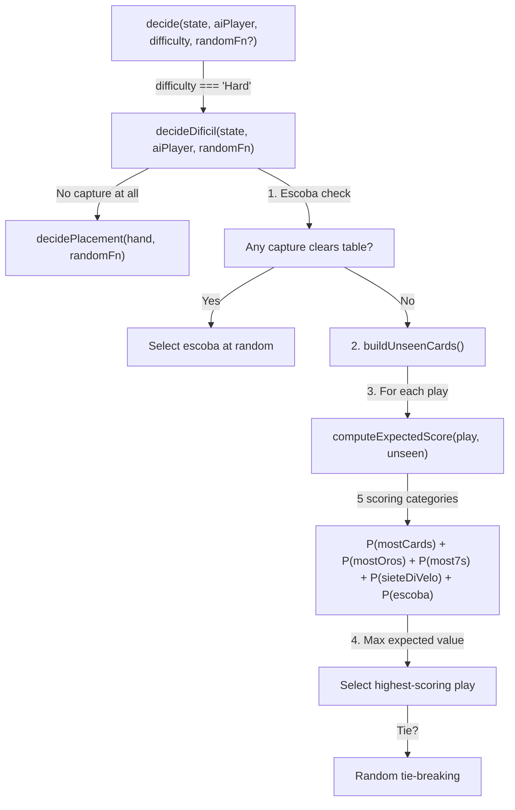
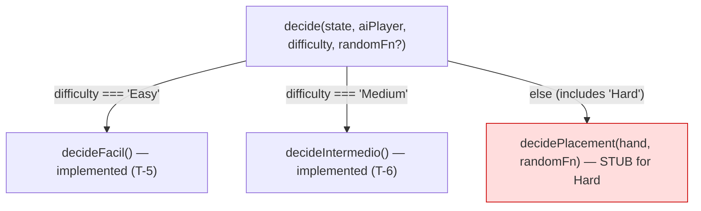

# Review Report: Single Player Mode — AI Opponent (Laia)

**Review Mode:** Incremental (T-7: Implement Difícil strategy in AiStrategyService) — RED Phase Final Review (Post-Fix Verification)
**Source:** `docs/specs/single-player/ai-opponent/`
**Reviewed against:** proposal.md, spec.md, user-stories.md, bdd-test.md, design.md, tasks.md
**Prior reviews:** Initial RED phase review (7 findings: 1 Critical, 2 Major, 2 Minor, 2 Note) → Post-hardening re-review (3 blockers, 1 resolved, 2 defective) → **This review** (all blockers resolved)

---

## 1. Executive Summary

This is the final pre-GREEN verification of T-7 (Difícil strategy) RED phase tests. The `describe('Hard / Difícil')` block contains **six tests** covering escoba preference, high-value capture preference, human-hand non-access, unseen-set computation, probability-model differentiation from Medium, and performance.

**Both remaining blockers from the prior review are now resolved:**

1. **Probability-model differentiator test (RV-01 fix verified):** The Medium baseline assertion has been corrected to `[table[0], table[2]]`, matching the actual `getHighValueCaptureScore` output (score 2 for the Oros-1 + Bastos-7 capture). The test now fails in RED for the correct reason (stub returns empty captureSubset) and includes behavioral guards ensuring GREEN must produce a meaningful capture that differs from Medium's greedy selection.

2. **Human-hand non-access test (RV-02 fix verified):** The table has been expanded from one card to three (`[Bastos 7, Copas 1, Espadas 2]`), providing two valid capture paths (Oros 7 + Bastos 7 + Copas 1 = 15, and Copas Sota + Bastos 7 = 15). The behavioral guard `captureSubset.length > 0` now correctly fails in RED (stub placement) and will pass in GREEN (correct implementation finds a capture). The getter trap on the human player's hand is preserved.

- **Total findings:** 8 (0 Critical, 0 Major, 2 Minor, 3 Note, 3 Resolved)
- **Blocker resolution:** 3 of 3 resolved (RV-01 ✅, RV-02 ✅, RV-03 ✅)
- **Spec compliance:** 7 of 9 reviewed requirements adequately tested; 2 partially tested
- **Architecture alignment:** Aligned — service remains in T-4 stub state for Hard, as expected in RED
- **Test quality:** All 6 tests fail in RED for the correct reasons
- **Recommendation:** **NO BLOCKERS REMAIN — clear to proceed to GREEN**

---

## 2. Architecture Comparison

Architecture diagrams are unchanged from the initial review. The `decide` method still falls through to `decidePlacement` for Hard difficulty, as expected in RED phase.

### 2.1 Planned AiStrategyService Structure for Hard Mode (from design.md AD-10)

### 2.2 Actual AiStrategyService Structure (RED phase — stub)

### 2.3 Drift Analysis

Unchanged from initial review. Expected drift for RED phase — no `decideDificil` method, no `buildUnseenCards`, no expected-score computation. The fallthrough to `decidePlacement` is the T-4 stub.

---

## 3. Findings

### Blocker Resolution Summary

| Original Finding | Original Severity | Hardening Action                                                 | Prior Review Status   | Current Status |
| ---------------- | ----------------- | ---------------------------------------------------------------- | --------------------- | -------------- |
| RV-01            | Critical          | Probability differentiator test added; Medium baseline corrected | ⚠️ Defective baseline | ✅ Resolved    |
| RV-02            | Major             | Behavioral guard added; table cards expanded                     | ⚠️ Impossible capture | ✅ Resolved    |
| RV-03            | Major             | Behavioral guards added to performance test                      | ✅ Resolved           | ✅ Resolved    |

---

### RV-01: Probability-model differentiator test — RESOLVED [Resolved]

- **Category:** Test Quality
- **Severity:** ~~Critical~~ → Resolved
- **Related:** FR-5.3, FR-5.4, SC-34, AD-10, TR-5.2, TR-5.3
- **Prior status:** Defective — incorrect Medium baseline assertion expected `[table[0], table[1], table[3]]`
- **Fix applied:** Medium baseline corrected to `[table[0], table[2]]` (the Oros 1 + Bastos 7 capture, score 2)
- **Verification:** Tracing through the `getHighValueCaptureScore` algorithm with the current table `[Oros 1, Copas 2, Bastos 7, Espadas 5]` and AI hand `[Copas 7, Espadas Sota]`, Medium produces four capture options. The highest-scoring option (score 2: Oros suit + rank 7) is correctly `[table[0], table[2]]`. With `pickIndex(0)`, Medium selects this option. The baseline assertion is now mathematically sound.
- **RED behavior:** Stub returns placement with empty captureSubset → `captureSubset.length > 0` guard fails → test fails for the correct reason.
- **GREEN expectation:** Hard implementation computes probability-weighted expected values. The constructed state — with specific captured piles creating asymmetric Oros/sevens distributions and card-count differentials between capture options — is designed to make the probability model diverge from Medium's greedy scoring.
- **Residual note:** See RV-08 for a minor concern about the divergence assumption.
- **Status:** Closed. No further action needed.

---

### RV-02: Human-hand non-access behavioral guard — RESOLVED [Resolved]

- **Category:** Test Quality
- **Severity:** ~~Major~~ → Resolved
- **Related:** FR-5.2, SC-35, TR-5.1
- **Prior status:** Defective — table had only Bastos 5 (value 5) with no valid capture for AI hand cards of value 7 and 8
- **Fix applied:** Table expanded to three cards: Bastos 7 (value 7), Copas 1 (value 1), Espadas 2 (value 2). Two valid captures now exist: Oros 7 + [Bastos 7, Copas 1] = 7 + 7 + 1 = 15, and Copas Sota + [Bastos 7] = 8 + 7 = 15.
- **Verification:** The behavioral guard `captureSubset.length > 0` correctly fails in RED (stub returns placement with empty subset) and will pass in GREEN (correct implementation finds a valid capture). The getter trap on `state.players[0].hand` is preserved — any attempt to read the human player's hand array throws an error, verifying FR-5.2 compliance.
- **Status:** Closed. No further action needed.

---

### RV-03: Performance test behavioral guard — RESOLVED [Resolved]

- **Category:** Test Quality
- **Severity:** ~~Major~~ → Resolved
- **Related:** NFR-1.1, SC-37
- **Prior status:** Resolved in prior review. No change.
- **Status:** Closed.

---

### RV-04: SC-33 escoba test does not set up competing high-expected-value plays [Minor]

- **Category:** Test Coverage
- **Severity:** Minor
- **Related:** FR-5.5, SC-33
- **Change since prior review:** None
- **Description:** The escoba test verifies basic escoba preference (an escoba is always selected), but the game state does not include a competing non-escoba play with a genuinely high expected value. Per SC-33, the scenario specifies "other plays exist with higher theoretical probability-weighted scores." The current test has only one non-escoba alternative, which does not stress-test the escoba priority rule against a compelling expected-value competitor.
- **Expected:** A state where at least one non-escoba capture has a high probability-weighted score — for example, capturing the 7 de Oros and multiple Oros cards — to verify escoba still takes priority.
- **Actual:** The escoba is the only attractive option, making the test a formality rather than a genuine stress test.
- **Recommendation:** Strengthen the game state to include a non-escoba capture with multiple high-value cards, then verify escoba is still preferred.
- **Impact:** Low. The basic escoba preference is tested; only the edge case of escoba vs high-value alternative is missing.

---

### RV-05: No tie-breaking test for Hard mode [Minor]

- **Category:** Test Coverage
- **Severity:** Minor
- **Related:** FR-5.4, TR-1.6
- **Change since prior review:** None
- **Description:** No test in the Hard describe block verifies that when two plays have identical expected score contributions, the random seam is used for tie-breaking. Medium and Easy both have tie-breaking tests; Hard does not.
- **Expected:** A test with two different `pickIndex` values producing two different selections from equally-scored plays.
- **Recommendation:** Mirror the Intermedio tie-breaking test pattern for Hard mode.
- **Impact:** Low. Tie-breaking is structurally identical across difficulties. If Easy and Medium pass, Hard likely shares the same logic.

---

### RV-06: buildUnseenCards test couples to private API name [Note]

- **Category:** Test Quality
- **Severity:** Note
- **Related:** FR-5.1, TR-5.1
- **Change since prior review:** None
- **Description:** The test accesses `(service as any).buildUnseenCards(...)`, coupling to a private method name. If the GREEN implementation uses a different name, the test fails at invocation rather than at assertions. This is an acceptable RED-phase pattern — it establishes the contract the GREEN implementation must satisfy.
- **Recommendation:** If the GREEN implementation uses a different method name, update the test accordingly.
- **Impact:** None if naming aligns; trivial fix if naming diverges.

---

### RV-07: No E2E test files for SC-33 through SC-37 — expected per task scope [Note]

- **Category:** Test Coverage
- **Severity:** Note
- **Related:** SC-33, SC-34, SC-35, SC-36, SC-37, T-14
- **Change since prior review:** None
- **Description:** E2E coverage for Difícil scenarios is scoped to T-14 per the task dependency graph. T-7 covers unit tests only.
- **Impact:** None for T-7. Ensure T-14 includes Difícil-specific E2E fixtures and scenarios.

---

### RV-08: Probability differentiator test assumes Hard diverges from Medium on constructed state [Note]

- **Category:** Test Quality
- **Severity:** Note
- **Related:** FR-5.3, FR-5.4, SC-34, TR-5.2
- **New finding**
- **Description:** The differentiator test asserts `expect(hardDecision).not.toEqual(mediumDecision)`, which assumes the probability model will select a different play than Medium's greedy approach on the specific game state. The state is well-constructed — the greedy-optimal capture (Oros 1 + Bastos 7, score 2) nets 3 total cards and 2 rank-7 cards, while the alternative (Oros 1 + Copas 2 + Espadas 5, score 1) nets 4 total cards but 0 rank-7 cards — making divergence plausible depending on how the five scoring categories weight out against the unseen card distribution. However, if the probability model happens to agree with the greedy approach on this particular state, the assertion would fail even though the implementation is correct.
- **Expected:** The probability model evaluates all five scoring categories (mostCards, mostOros, most7s, sieteDiVelo, escoba) against the distribution of unseen cards and may assign a higher expected value to a different capture than Medium's greedy selection.
- **Actual:** The divergence is a design assumption in the test, not a mathematical certainty. The specific captured piles (AI has 2 Oros; human has 2 sevens including the 7 de Oros) create asymmetric category competition that makes divergence likely but not guaranteed.
- **Recommendation:** During GREEN implementation, if the probability model agrees with Medium on this state, adjust either the game state or the probability model inputs to ensure genuine divergence. This is not a pre-GREEN blocker — it is an implementation-time consideration.
- **Impact:** Minimal. If divergence does not occur naturally, the test state can be tuned during GREEN.

---

## 4. Traceability Matrix

| Finding | Severity     | Category      | Related Spec                                 | Status      |
| ------- | ------------ | ------------- | -------------------------------------------- | ----------- |
| RV-01   | ~~Critical~~ | Test Quality  | FR-5.3, FR-5.4, SC-34, AD-10, TR-5.2, TR-5.3 | ✅ Resolved |
| RV-02   | ~~Major~~    | Test Quality  | FR-5.2, SC-35, TR-5.1                        | ✅ Resolved |
| RV-03   | ~~Major~~    | Test Quality  | NFR-1.1, SC-37                               | ✅ Resolved |
| RV-04   | Minor        | Test Coverage | FR-5.5, SC-33                                | Open        |
| RV-05   | Minor        | Test Coverage | FR-5.4, TR-1.6                               | Open        |
| RV-06   | Note         | Test Quality  | FR-5.1, TR-5.1                               | Open        |
| RV-07   | Note         | Test Coverage | SC-33–SC-37, T-14                            | Open        |
| RV-08   | Note         | Test Quality  | FR-5.3, FR-5.4, SC-34, TR-5.2                | Open        |

---

## 5. Spec Compliance Summary

| Requirement | Status     | Notes                                                                                               |
| ----------- | ---------- | --------------------------------------------------------------------------------------------------- |
| FR-5.1      | ⚠️ Partial | buildUnseenCards test covers set computation; couples to private name (RV-06); proper RED indicator |
| FR-5.2      | ✅ Met     | Getter-trap test now has valid capture state; correctly fails in RED, will pass in GREEN            |
| FR-5.3      | ✅ Met     | Probability differentiator test has correct Medium baseline; behavioral guards in place             |
| FR-5.4      | ⚠️ Partial | Probability differentiator covers selection; no tie-breaking test (RV-05)                           |
| FR-5.5      | ✅ Met     | Basic escoba preference tested; stress-testing is Minor enhancement (RV-04)                         |
| FR-5.6      | ✅ Met     | Inherent in stateless design per AD-3                                                               |
| NFR-1.1     | ✅ Met     | Performance test has behavioral guards — proper RED indicator                                       |
| NFR-2.1     | ✅ Met     | Capture-sum-to-15 and card-from-hand assertions present in existing tests                           |
| NFR-2.2     | ✅ Met     | All tests assert a valid decision is returned                                                       |

---

## 6. Task Completion Summary

| Task | Title                                           | Status                                                         | Findings             |
| ---- | ----------------------------------------------- | -------------------------------------------------------------- | -------------------- |
| T-7  | Implement Difícil strategy in AiStrategyService | ✅ RED phase complete — all blockers resolved, clear for GREEN | RV-04, RV-05 (Minor) |

---

## 7. Test Coverage Summary

| Scenario | Step Definitions                                 | Meaningful | Findings     |
| -------- | ------------------------------------------------ | ---------- | ------------ |
| SC-33    | ⚠️ Partial (unit test exists, not stress-tested) | ⚠️ Partial | RV-04        |
| SC-34    | ✅ Yes (differentiator test, baseline corrected) | ✅ Yes     | RV-08 (Note) |
| SC-35    | ✅ Yes (getter trap + valid capture guard)       | ✅ Yes     | —            |
| SC-36    | ✅ Yes (inherent via AD-3)                       | ✅ Yes     | —            |
| SC-37    | ✅ Yes (behavioral guard, proper RED indicator)  | ✅ Yes     | —            |

---

## 8. Test Quality Summary

| Test File                             | Type | Meaningful Assertions | Issues                             | RED Status       |
| ------------------------------------- | ---- | --------------------- | ---------------------------------- | ---------------- |
| "always selects escoba (Hard)"        | Unit | ✅ Yes                | Minor: not stress-tested (RV-04)   | Fails ✅ correct |
| "prefers capturing high-value (Hard)" | Unit | ✅ Yes                | None                               | Fails ✅ correct |
| "does not access human hand (Hard)"   | Unit | ✅ Yes (FIXED)        | None                               | Fails ✅ correct |
| "builds unseen set (Hard)"            | Unit | ✅ Yes                | Private API coupling (RV-06)       | Fails ✅ correct |
| "different move than Medium (Hard)"   | Unit | ✅ Yes (FIXED)        | Divergence assumption (RV-08 Note) | Fails ✅ correct |
| "completes under 100ms (Hard)"        | Unit | ✅ Yes                | None                               | Fails ✅ correct |

---

## 9. Security Cross-Reference

No changes to the security posture since the initial review. The companion security report at `docs/specs/single-player/ai-opponent/security-report_T-7.md` remains current.

| SEC ID | Severity | OWASP    | Summary                                                                     |
| ------ | -------- | -------- | --------------------------------------------------------------------------- |
| SEC-01 | Medium   | A04:2021 | Hard-mode hidden-hand control not fully implemented (expected in RED phase) |
| SEC-02 | Low      | A08:2021 | Randomness seam accepts potentially biased selectors                        |

Neither finding is Critical or High. SEC-01 resolves with T-7 GREEN implementation.

---

## 10. Recommendations

### Critical (blocks release)

None.

### Major (fix before merge)

None.

### Minor (improvement)

1. **Strengthen the SC-33 escoba test (RV-04).** Set up a state where a non-escoba play has a genuinely high probability-weighted expected value to stress-test the escoba priority.
2. **Add a tie-breaking test for Hard mode (RV-05).** Mirror the Intermedio pattern: two calls with different random seam values producing different selections from equally-scored plays.

### Notes (informational)

1. **buildUnseenCards private coupling (RV-06).** If the GREEN implementation uses a different method name, update the test.
2. **E2E tests deferred to T-14 (RV-07).** Ensure T-14 includes Difícil-specific E2E fixtures and scenarios.
3. **Probability differentiator divergence assumption (RV-08).** During GREEN, if the probability model agrees with Medium on the test state, adjust the game state to ensure genuine divergence. This is an implementation-time tuning concern, not a test defect.
