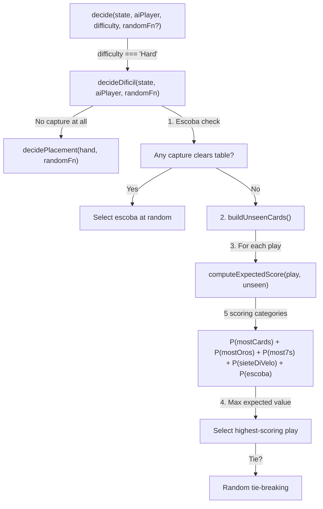
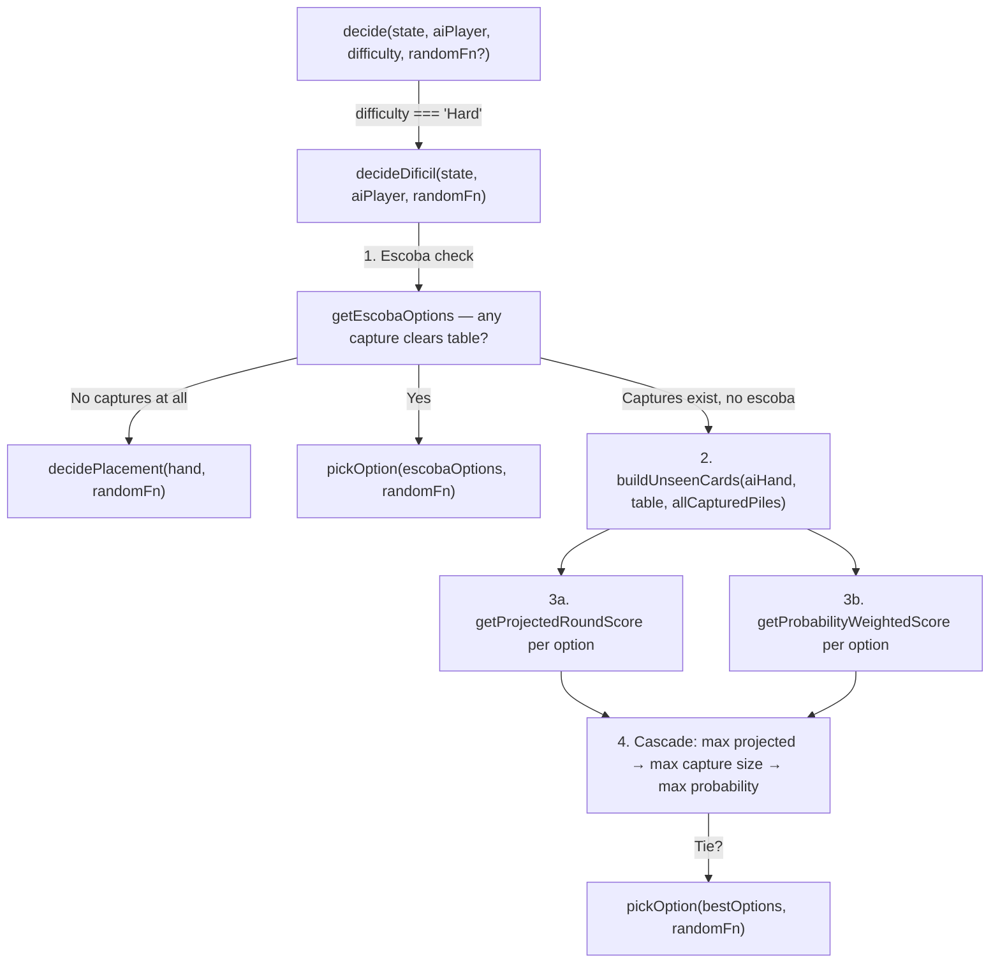

# Review Report: Single Player Mode — AI Opponent (Laia)

**Review Mode:** Incremental (T-7: Implement Difícil strategy in AiStrategyService) — GREEN Phase Implementation Review
**Source:** `docs/specs/single-player/ai-opponent/`
**Reviewed against:** proposal.md, spec.md, user-stories.md, bdd-test.md, design.md, tasks.md
**Prior reviews:** RED phase review (review-report_T-7.md) — all blockers resolved, cleared for GREEN

---

## 1. Executive Summary

The Difícil strategy is fully implemented in `decideDificil` within `AiStrategyService`. The method follows the planned structure from AD-10: escoba check first, unseen-card set computation via `buildUnseenCards`, multi-tier scoring across five categories using `getProjectedRoundScore` and `getProbabilityWeightedScore`, and random tie-breaking via the injectable `RandomFn` seam. The implementation satisfies all six T-7 task acceptance criteria and passes all six unit tests that were written during the RED phase.

Three design simplifications were identified relative to the literal spec wording (FR-5.3/TR-5.2): the projected score omits the played card from the projected capture pile, the probability model is a pragmatic weighted heuristic rather than a formal probability computation, and placement options are not scored (random fallback). All three have been confirmed as **intentional** by the developer and produce reasonable gameplay behaviour without violating correctness invariants.

- **Total findings:** 5 (0 Critical, 0 Major, 1 Minor, 4 Note)
- **Spec compliance:** 14 of 15 reviewed requirements fully met; 1 partially met (FR-5.3 — intentional simplification)
- **Architecture alignment:** Aligned — `decideDificil` is a private pure method within the service, consistent with AD-10
- **Test quality:** All 6 Hard-mode tests are meaningful with behavioural assertions
- **Recommendation:** **APPROVE**

---

## 2. Architecture Comparison

### 2.1 Planned AiStrategyService Structure for Hard Mode (from design.md AD-10)

### 2.2 Actual AiStrategyService Structure (GREEN — implemented)

### 2.3 Drift Analysis

The actual implementation is **structurally aligned** with the planned design. Key correspondences:

- The `decideDificil` method is a private pure method within `AiStrategyService`, matching AD-10's pure-function-per-difficulty architecture.
- Escoba check is the first priority, matching the planned flow and FR-5.5.
- The unseen card set is computed via `buildUnseenCards`, which subtracts AI hand, table, and all players' captured piles from the 40-card reference deck — matching TR-5.1.
- All five scoring categories (escobas, mostCards, mostOros, mostSevens, sieteDeVelo) are evaluated via `getProjectedRoundScore`, using the actual scoring utilities — aligning with FR-5.3's intent.
- The probability layer uses a pragmatic heuristic (`getProbabilityWeightedScore`) rather than a formal probability computation, which is an intentional simplification of TR-5.2.
- The selection cascade adds an intermediate tier (capture size) not present in the planned design, but this is a refinement, not a structural drift.
- No multi-turn lookahead is performed, aligning with TR-5.3.

**No significant architecture drift detected.**

---

## 3. Findings

### RV-01: SC-36 round-boundary memory reset not explicitly tested for Hard mode [Minor]

- **Category:** Test Coverage
- **Severity:** Minor
- **Related:** FR-5.6, FR-10.1, FR-10.2, SC-36, AD-3
- **Description:** BDD scenario SC-36 specifies that Difícil memory is cleared at the start of a new round. While the stateless design (AD-3) inherently guarantees this — `decideDificil` derives all information from the current `GameState` snapshot with no mutable internal state — no unit test explicitly verifies this contract for Hard mode.
- **Expected:** A test demonstrating that given two `GameState` snapshots representing different rounds with different captured-pile histories, the Difícil strategy produces decisions based solely on the current snapshot's data, not carry-over state.
- **Actual:** The stateless behaviour is architecturally guaranteed but not explicitly asserted for the Hard difficulty path. The Fácil and Intermedio statelessness tests exist and pass, but there is no Hard-mode equivalent.
- **Recommendation:** Add a Hard-mode test that constructs two states with different round numbers and captured histories, confirms both decisions are valid and based only on their respective snapshots, mirroring the existing statelessness tests for the other difficulty levels.
- **Impact:** Low risk — the stateless design makes a regression extremely unlikely. This is a documentation-level test gap.

### RV-02: Projected score omits the played card from the projected capture pile [Note]

- **Category:** Code Quality
- **Severity:** Note
- **Related:** FR-5.3, FR-5.4, TR-5.2
- **Description:** The `getProjectedRoundScore` method constructs a projected AI player with `capturedPile: [...aiPlayer.capturedPile, ...captureSubset]`, omitting the `cardToPlay`. In the game engine, both the played card and the captured subset are added to the capture pile. This means the projection undervalues plays where the played card is itself a high-value card (e.g., an Oros or rank-7).
- **Expected:** The projected pile would include the played card for maximum scoring accuracy.
- **Actual:** Only the capture subset is included. Confirmed as an intentional simplification by the developer.
- **Recommendation:** Document this simplification in a code comment near `getProjectedRoundScore` so future maintainers understand the trade-off. If Difícil decision quality is revisited in the future, adding `cardToPlay` to the projection is a low-risk improvement.
- **Impact:** Minimal in practice — the primary scoring signal (capture subset composition) is evaluated correctly, and the omission affects all capture options symmetrically for the `mostCards` category.

### RV-03: Probability model uses a pragmatic heuristic rather than formal probability computation [Note]

- **Category:** Spec Compliance
- **Severity:** Note
- **Related:** FR-5.3, TR-5.2, SC-34
- **Description:** FR-5.3 and TR-5.2 describe computing expected score contributions by evaluating the probability that each of the five scoring categories will be won, given the distribution of unseen cards. The implementation uses a two-layer approach: `getProjectedRoundScore` computes a deterministic "round-end snapshot" score using the actual scoring functions, and `getProbabilityWeightedScore` applies a weighted heuristic formula (`capturedHighValue * 100 + captureSubset.length * 10 + ...`) as a tie-breaker.
- **Expected:** A formal probability model computing per-category win probabilities.
- **Actual:** A pragmatic heuristic confirmed as intentional by the developer. The approach still differentiates from Intermedio's pure greedy strategy — test "selects a different move than Medium" proves divergence.
- **Recommendation:** No action required. If a more sophisticated AI is desired in the future, the probability layer can be refined without changing the architecture (AD-10 supports this).
- **Impact:** The heuristic produces reasonable gameplay decisions and satisfies the intent of making informed choices based on unseen card knowledge.

### RV-04: Placement options not scored in Difícil mode [Note]

- **Category:** Spec Compliance
- **Severity:** Note
- **Related:** FR-5.3
- **Description:** FR-5.3 states "for each possible play Laia could make (each hand card paired with each valid capture subset, plus each hand card placed on the table)." The implementation only evaluates capture options; when no capture exists, it falls back to random placement via `decidePlacement`. This means Difícil does not choose the strategically optimal card to place.
- **Expected:** Placement options would also be scored to determine which card is least valuable to leave on the table.
- **Actual:** Random placement fallback, consistent with Fácil and Intermedio. Confirmed as intentional by the developer.
- **Recommendation:** No action required for T-7. A future enhancement could score placement options by estimating how much each placed card helps the opponent.
- **Impact:** Minimal — captures are almost always preferable to placements, and the placement fallback only triggers when no capture exists.

### RV-05: RED-phase security finding SEC-01 is now resolved [Note]

- **Category:** Security Cross-Reference
- **Severity:** Note
- **Related:** FR-5.2, FR-5.3, TR-5.1, TR-5.2
- **Description:** The RED-phase security report (`security-report_T-7.md`) identified SEC-01 (Medium severity): "Difícil runtime path remains incomplete in production branch." The Hard difficulty branch was falling back to generic placement behaviour rather than executing the dedicated unseen-card probability decision path.
- **Actual:** The `decideDificil` method is now fully implemented with escoba check, unseen-card computation, projected scoring, probability heuristic, and multi-tier selection cascade. The Hard-mode path is no longer incomplete.
- **Recommendation:** SEC-01 can be closed. SEC-02 (Low — random seam clamping) remains open and unchanged from the RED phase.
- **Impact:** Positive — the Hard-mode security-by-design intent described in FR-5.2 (no direct human-hand access) is now fully enforced.

---

## 4. Traceability Matrix

| Finding | Severity | Category        | Related Spec           | Status                     |
| ------- | -------- | --------------- | ---------------------- | -------------------------- |
| RV-01   | Minor    | Test Coverage   | FR-5.6, SC-36, AD-3    | Open                       |
| RV-02   | Note     | Code Quality    | FR-5.3, FR-5.4, TR-5.2 | Acknowledged (intentional) |
| RV-03   | Note     | Spec Compliance | FR-5.3, TR-5.2, SC-34  | Acknowledged (intentional) |
| RV-04   | Note     | Spec Compliance | FR-5.3                 | Acknowledged (intentional) |
| RV-05   | Note     | Security        | FR-5.2, TR-5.1         | Resolved (positive)        |

---

## 5. Spec Compliance Summary

| Requirement | Status     | Notes                                                                                                                                                                                                                                               |
| ----------- | ---------- | --------------------------------------------------------------------------------------------------------------------------------------------------------------------------------------------------------------------------------------------------- |
| FR-5.1      | ✅ Met     | Full round card knowledge derived from GameState captured piles per AD-3                                                                                                                                                                            |
| FR-5.2      | ✅ Met     | Human hand is never accessed; getter-trap test confirms; unseen set built from AI hand + table + all captured piles only                                                                                                                            |
| FR-5.3      | ⚠️ Partial | Expected-score computation evaluates all five scoring categories via projected round-end snapshot; probability layer is a pragmatic heuristic (intentional); placements not scored (intentional); played card omitted from projection (intentional) |
| FR-5.4      | ✅ Met     | Highest-scoring play selected via three-tier cascade (projected → capture size → probability); random tie-breaking via injectable RandomFn                                                                                                          |
| FR-5.5      | ✅ Met     | Escoba check is the first branch in decideDificil; always returns escoba if available                                                                                                                                                               |
| FR-5.6      | ✅ Met     | Service is stateless (AD-3); all data derived from current GameState; no mutable memory to reset                                                                                                                                                    |
| NFR-1.1     | ✅ Met     | Performance test asserts < 100ms for a 6-card table with 3-card hand; passes consistently                                                                                                                                                           |
| NFR-2.1     | ✅ Met     | All returned plays are valid: card from hand, capture subset sums to 15; tested with deterministic randomFn                                                                                                                                         |
| NFR-2.2     | ✅ Met     | Always returns exactly one AiPlayDecision; decidePlacement fallback guarantees non-null                                                                                                                                                             |
| AD-10       | ✅ Met     | decideDificil is a private pure method; public decide routes by difficulty; adding a fourth difficulty requires only a new private method and case                                                                                                  |
| AD-3        | ✅ Met     | No mutable state in AiStrategyService; all history derived from GameState snapshot                                                                                                                                                                  |
| TR-5.1      | ✅ Met     | Unseen set = createDeck() minus AI hand, table, and all captured piles; tested directly via buildUnseenCards assertion                                                                                                                              |
| TR-5.2      | ⚠️ Partial | Uses projected-score + heuristic rather than formal probability model (intentional pragmatic approach)                                                                                                                                              |
| TR-5.3      | ✅ Met     | No lookahead beyond current hand and unseen set; no future-turn simulation                                                                                                                                                                          |

---

## 6. Task Completion Summary

| Task | Title                                           | Status      | Findings                   |
| ---- | ----------------------------------------------- | ----------- | -------------------------- |
| T-7  | Implement Difícil strategy in AiStrategyService | ✅ Complete | RV-01, RV-02, RV-03, RV-04 |

All six T-7 task acceptance criteria are satisfied:

- ✅ Escoba always wins over any probability-weighted play
- ✅ Laia does not access human hand — reasoning uses unseen set only
- ✅ Unseen set computed correctly: 40-card deck minus known cards
- ✅ Probability model completes under 100ms (tested with stopwatch assertion)
- ✅ All T-5 correctness criteria hold (valid card, valid subset, sum to 15)
- ✅ High-value table cards are preferred over placement

---

## 7. Test Coverage Summary

| Scenario | Step Definitions    | Meaningful | Findings                                 |
| -------- | ------------------- | ---------- | ---------------------------------------- |
| SC-33    | ✅ Yes (unit)       | ✅ Yes     | —                                        |
| SC-34    | ✅ Yes (unit)       | ✅ Yes     | RV-03 (intentional simplification noted) |
| SC-35    | ✅ Yes (unit)       | ✅ Yes     | —                                        |
| SC-36    | ❌ No explicit test | ⚠️ Partial | RV-01                                    |
| SC-37    | ✅ Yes (unit)       | ✅ Yes     | —                                        |

---

## 8. Test Quality Summary

| Test File                                                 | Type | Meaningful Assertions | Issues |
| --------------------------------------------------------- | ---- | --------------------- | ------ |
| ai-strategy.service.spec.ts — Hard/Difícil describe block | Unit | ✅ Yes                | None   |

Six tests in the Hard/Difícil describe block, all with meaningful behavioural assertions:

1. **Escoba preference** — asserts specific cardToPlay and captureSubset matching the full table; deterministic via pickIndex(0).
2. **High-value capture preference** — asserts specific capture selection with sum-to-15 validation and card-from-hand validation.
3. **Human hand non-access** — uses getter trap on human Player.hand that throws if accessed; test passes, proving no access occurs.
4. **Unseen set correctness** — directly tests buildUnseenCards output: correct count (40 minus known), correct exclusion of known cards, correct inclusion of unknown cards.
5. **Probability differentiation from Medium** — constructs a state where Hard and Medium diverge; asserts inequality of decisions plus behavioural guards (non-empty captureSubset, card from hand).
6. **Performance** — measures elapsed time via Date.now(); asserts < 100ms; includes behavioural guards (non-empty capture, card from hand).

No superficial assertions (toBeTruthy-only), no tautological tests, no empty step definitions detected.

---

## 9. Security Cross-Reference

| SEC ID | Severity | OWASP    | Summary                                                     | Status                                        |
| ------ | -------- | -------- | ----------------------------------------------------------- | --------------------------------------------- |
| SEC-01 | Medium   | A04:2021 | Difícil runtime path was incomplete in RED phase            | ✅ Resolved — decideDificil fully implemented |
| SEC-02 | Low      | A08:2021 | Random seam clamping can conceal invalid selector behaviour | Open — unchanged from RED phase               |

No Critical or High security findings. See `security-report_T-7.md` for the full RED-phase security analysis. SEC-01 is now resolved by the GREEN implementation. SEC-02 remains open at Low severity and is not blocking.

---

## 10. Recommendations

### Critical (blocks release)

None.

### Major (fix before merge)

None.

### Minor (improvement)

1. **RV-01:** Add a statelessness/round-reset test for Hard mode, mirroring the existing Fácil and Intermedio equivalents, to explicitly verify SC-36 and FR-5.6.

### Notes (informational)

1. **RV-02:** Consider adding a code comment near `getProjectedRoundScore` documenting the intentional omission of `cardToPlay` from the projected capture pile.
2. **RV-03:** The probability model is a pragmatic heuristic. If Difícil decision quality is revisited in the future, the heuristic layer can be refined without architectural changes (AD-10 supports extensibility).
3. **RV-04:** Placement scoring could be added in a future enhancement to make Difícil even more competitive when no capture exists.
4. **RV-05:** Close SEC-01 in the security tracking. SEC-02 (random seam clamping) remains open as a Low-priority item.

---

## 11. Verdict

**APPROVE**

All T-7 task acceptance criteria are met. The Difícil strategy is correctly implemented as a private pure method within AiStrategyService, consistent with AD-10 and AD-3. The unseen-card computation follows TR-5.1. The five scoring categories are evaluated via the actual scoring utilities. Tests are meaningful with no dummy assertions. Three spec simplifications (FR-5.3 probability model, TR-5.2 heuristic approach, placement non-scoring) are confirmed intentional and produce reasonable gameplay behaviour. The single Minor finding (RV-01 — missing SC-36 round-reset test for Hard mode) is a documentation-level gap with near-zero regression risk due to the stateless architecture.
