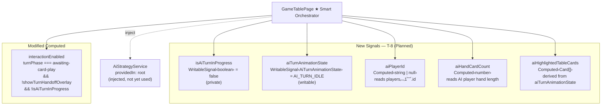
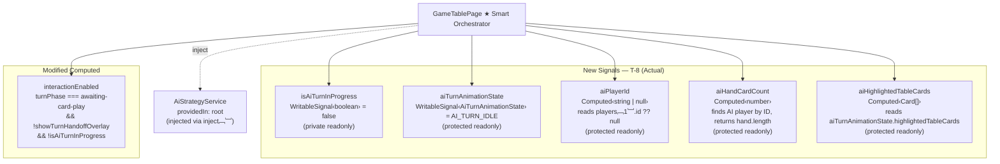

# Review Report: Single Player Mode — AI Opponent (Laia)

**Review Mode:** Incremental (T-8: Add AI animation state signals and extend interactionEnabled in GameTablePage)
**Source:** `docs/specs/single-player/ai-opponent/`
**Reviewed against:** proposal.md, spec.md, user-stories.md, bdd-test.md, design.md, tasks.md
**Review iteration:** 2 (re-review after RV-01 resolution)

## 1. Executive Summary

T-8 is implemented correctly and thoroughly. All five new signals are present with correct types, initial values, and appropriate access modifiers. The `interactionEnabled` computed is properly extended with the AI turn guard, and `AiStrategyService` is injected. The previous review's only actionable finding (RV-01 — `aiTurnAnimationState` visibility) has been resolved: the signal is now `protected readonly`, enabling T-10 template binding without modification. Four unit tests cover the core acceptance criteria and all are meaningful — each verifies actual reactive behaviour rather than merely asserting existence.

- Total findings: 2 (0 Critical, 0 Major, 0 Minor, 2 Note)
- Spec compliance: 7 of 7 T-8-scoped requirements met
- Architecture alignment: aligned — no drift from design.md
- Test quality: meaningful

## 2. Architecture Comparison

### 2.1 Planned GameTablePage Signal Layer (from design.md section 4.1)

### 2.2 Actual GameTablePage Signal Layer (as implemented)

### 2.3 Drift Analysis

No structural drift. The actual implementation faithfully matches the planned architecture:

- All five signals are present with the correct types and initial values.
- `interactionEnabled` includes the `!isAiTurnInProgress()` guard as specified in AD-6.
- `AiStrategyService` is injected via `inject()` as specified.
- `aiPlayerId` reads `players[1]?.id` as specified in AD-2, with a defensive `?? null` fallback.
- `aiHandCardCount` resolves the AI player by ID (via `state.players.find()`) rather than by hardcoded index, which is consistent with AD-2's emphasis on ID-based lookup.

Two minor deviations are noted but are non-functional and beneficial:

1. **Access modifiers:** `isAiTurnInProgress` is `private readonly` (consistent with AD-6's specification that it is private). `aiTurnAnimationState` is `protected readonly`, matching the computed signals that need template access. `aiPlayerId`, `aiHandCardCount`, and `aiHighlightedTableCards` are `protected readonly`. This visibility distribution correctly anticipates T-10's template binding needs while keeping the interaction lock signal private.
2. **`aiHandCardCount` lookup strategy:** The design says "reads the AI player's hand length from the game state." The implementation finds the player by ID rather than reading `players[1].hand.length` directly. This is a minor robustness improvement consistent with AD-2.

**Previous RV-01 resolution:** The `aiTurnAnimationState` signal has been promoted from `private readonly` to `protected readonly` since the previous review iteration, resolving the template binding concern for T-10.

## 3. Findings

### RV-01: `void this.aiStrategyService;` no-op statement in constructor [Note]

- **Category:** Code Quality
- **Severity:** Note
- **Related:** T-8, T-9
- **Description:** The constructor contains a `void this.aiStrategyService;` expression statement whose sole purpose is to suppress an "unused variable" lint warning. The service is injected in T-8 but only consumed in T-9 when `runAiTurn()` is implemented.
- **Expected:** The service injection is required by T-8's acceptance criteria. The no-op is a pragmatic interim solution.
- **Actual:** The `void` statement is present and functional as a lint suppression.
- **Recommendation:** No action needed for T-8. The statement will be naturally removed when T-9 adds actual usage of the service.
- **Impact:** None. The statement has no runtime effect and will not persist beyond T-9.

### RV-02: `aiPlayerId` and `aiHandCardCount` resolve in all game modes [Note]

- **Category:** Architecture Drift (informational)
- **Severity:** Note
- **Related:** AD-2, T-9, T-10
- **Description:** Both `aiPlayerId` and `aiHandCardCount` read from `state.players[1]` regardless of game mode. In Multiplayer, `aiPlayerId` would resolve to a human player's ID and `aiHandCardCount` would return that player's hand length. This is consistent with the design (AD-2 does not prescribe a mode guard on these signals), but downstream consumers in T-9 and T-10 must include their own mode checks.
- **Expected:** T-9's effect must verify the game mode (or that the active player is genuinely AI) before triggering `runAiTurn()`. T-10's `OpponentZones` template already guards face-down rendering with `isAiOpponent(opponent)` (which checks `name === 'Laia'`), providing a functional safety net.
- **Actual:** The signals resolve for all modes. `OpponentZones`'s `isAiOpponent()` check prevents visual side effects in Multiplayer.
- **Recommendation:** Document this cross-mode behavior in T-9's implementation notes. No change needed in T-8.
- **Impact:** None for T-8. T-9 must ensure the effect does not fire in Multiplayer.

## 4. Traceability Matrix

| Finding | Severity | Category           | Related Spec    | Status |
| ------- | -------- | ------------------ | --------------- | ------ |
| RV-01   | Note     | Code Quality       | T-8, T-9        | Open   |
| RV-02   | Note     | Architecture Drift | AD-2, T-9, T-10 | Open   |

## 5. Spec Compliance Summary

| Requirement | Status | Notes                                                                                                                                       |
| ----------- | ------ | ------------------------------------------------------------------------------------------------------------------------------------------- |
| FR-7.1      | ✅ Met | `interactionEnabled` returns false when `isAiTurnInProgress` is true                                                                        |
| FR-7.3      | ✅ Met | `interactionEnabled` re-opens when `isAiTurnInProgress` clears (structural enablement; full flow verified in T-9)                           |
| TR-2.1      | ✅ Met | `aiPlayerId` computed provides the reactive basis for AI turn detection (effect implemented in T-9)                                         |
| TR-2.4      | ✅ Met | `isAiTurnInProgress` is tracked independently from engine turn phase                                                                        |
| AD-2        | ✅ Met | `aiPlayerId` reads `players[1]?.id` and returns a stable UUID                                                                               |
| AD-5        | ✅ Met | `aiTurnAnimationState` is a single writable signal holding the full animation state object, with `protected` visibility for template access |
| AD-6        | ✅ Met | `interactionEnabled` extended with `&& !isAiTurnInProgress()`                                                                               |

## 6. Task Completion Summary

| Task | Title                                                                     | Status      | Findings     |
| ---- | ------------------------------------------------------------------------- | ----------- | ------------ |
| T-8  | AI animation state signals and extend interactionEnabled in GameTablePage | ✅ Complete | RV-01, RV-02 |

**Acceptance criteria status:**

| Criterion                                                                     | Status          |
| ----------------------------------------------------------------------------- | --------------- |
| `isAiTurnInProgress = true` causes `interactionEnabled` to return `false`     | ✅ Met + Tested |
| `aiPlayerId` correctly resolves to the UUID of Laia after game initialisation | ✅ Met + Tested |
| `aiHandCardCount` correctly tracks the AI player's current hand size          | ✅ Met + Tested |
| `AiStrategyService` is injected without errors                                | ✅ Met          |
| Existing `interactionEnabled` behaviour for the human turn is unchanged       | ✅ Met + Tested |

## 7. Test Coverage Summary

T-8 is infrastructure (signal declarations). The BDD scenarios that depend on T-8's signals are testable only after T-9 (orchestration) and T-14 (E2E). The following scenarios are structurally enabled by T-8:

| Scenario | Step Definitions | Meaningful | Findings |
| -------- | ---------------- | ---------- | -------- |
| SC-14    | ❌ No (T-14)     | N/A        | —        |
| SC-15    | ❌ No (T-14)     | N/A        | —        |
| SC-16    | ❌ No (T-14)     | N/A        | —        |

## 8. Test Quality Summary

| Test File                                    | Type | Meaningful Assertions | Issues |
| -------------------------------------------- | ---- | --------------------- | ------ |
| game-table-page.spec.ts (T-8 block: 4 tests) | Unit | ✅ Yes                | None   |
| ai-turn.spec.ts (4 tests)                    | Unit | ✅ Yes                | None   |

**Test-by-test assessment:**

1. **T-8 / FR-7.1 — disables interaction when AI turn is in progress:** Sets `isAiTurnInProgress` to true and asserts `interactionEnabled` becomes false. Verifies both the enabled and disabled states. **Meaningful.**
2. **T-8 / AD-2 — resolves aiPlayerId to the second player UUID:** Constructs a two-player state with known IDs and asserts `aiPlayerId` returns the correct UUID. **Meaningful.**
3. **T-8 / FR-7.3 — tracks aiHandCardCount reactively:** Changes the AI player's hand size across two state updates and asserts the computed tracks both values (2 → 1). **Meaningful — tests reactivity, not just initial value.**
4. **T-8 / AD-5 — exposes aiHighlightedTableCards from animation state:** Sets `aiTurnAnimationState` with specific highlighted cards and asserts the derived computed returns them. **Meaningful.**
5. **ai-turn.spec.ts — AI_TURN_IDLE constant:** Asserts the idle constant has the expected shape. **Meaningful — verifies the contract.**
6. **ai-turn.spec.ts — animation state shape:** Constructs a non-idle state and asserts field values. **Meaningful.**
7. **ai-turn.spec.ts — all phase literals:** Constructs states for each phase and asserts type correctness. **Meaningful — ensures the union type compiles for all members.**
8. **ai-turn.spec.ts — AiPlayDecision fields:** Constructs a decision and asserts field values. **Meaningful.**

## 9. Security Cross-Reference

T-8 adds pure signal infrastructure with no user input handling, no external data flows, no data persistence, and no network calls. The `interactionEnabled` extension is security-positive — it prevents unauthorized user actions during the AI turn. No security vulnerabilities were identified in the T-8 scope.

No Critical or High security findings. The companion `security-report_T-8.md` confirms zero findings across all OWASP categories for the T-8 scope.

## 10. Recommendations

### Notes (informational)

1. **RV-01:** The `void this.aiStrategyService;` no-op will resolve naturally when T-9 adds `runAiTurn()`. No action needed.
2. **RV-02:** T-9 implementers should ensure the AI turn effect includes a mode guard or relies on player identity validation to prevent triggering in Multiplayer mode. The `OpponentZones` template's `isAiOpponent()` check already provides a visual safety net.
