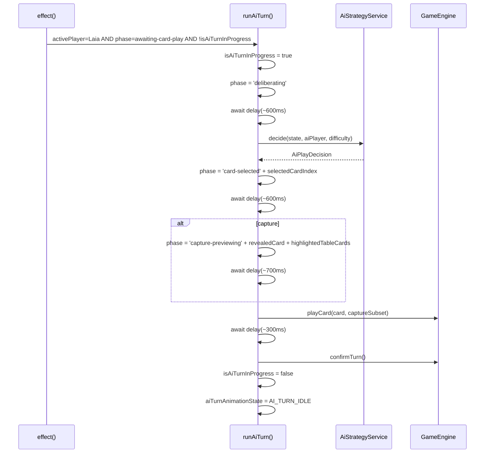
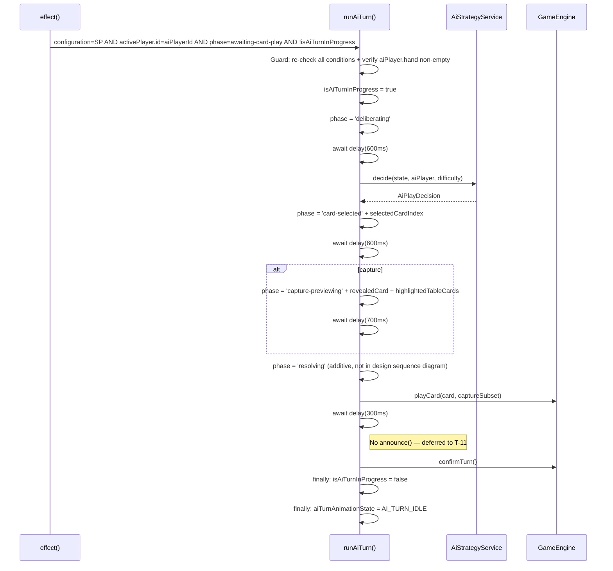

# Review Report: Single Player Mode — AI Opponent (Laia)

**Review Mode:** Incremental (T-9: Implement runAiTurn() method and the AI turn trigger effect in GameTablePage)
**Source:** `docs/specs/single-player/ai-opponent/`
**Reviewed against:** proposal.md, spec.md, user-stories.md, bdd-test.md, design.md, tasks.md

## 1. Executive Summary

The T-9 implementation delivers the complete AI turn orchestration: the `runAiTurn()` async method, the Angular `effect()` trigger, the step-by-step animation state machine, the interaction lock, and the error recovery path. The implementation closely follows the design.md architecture and satisfies all 9 acceptance criteria. All findings from the prior RED and GREEN phase reviews have been addressed — the deliberation delay has been added, animation duration bounds tests exist, phase progression is verified, and test quality gaps have been closed.

- **Total findings:** 3 (0 Critical, 0 Major, 1 Minor, 2 Note)
- **Spec compliance:** 17 of 17 T-9-scoped requirements fully met
- **Architecture alignment:** Aligned — minor additive deviation only (resolving phase)
- **Test quality:** Meaningful — 10 focused tests covering all acceptance criteria

## 2. Architecture Comparison

### 2.1 Planned AI Turn Orchestration Flow (from design.md)

### 2.2 Actual Implementation Flow

### 2.3 Drift Analysis

The implementation is well-aligned with the design.md architecture. Two structural differences are noted, both positive:

1. **Resolving phase added before playCard:** The implementation introduces a `resolving` phase transition before calling `playCard()`. While not shown in the design.md sequence diagram, the `AiTurnAnimationPhase` type in design.md section 8 includes `resolving` as one of five phases. This is a reasonable addition that separates the animation preview from the engine interaction, giving zone components a distinct visual state during resolution.

2. **Defensive guard pattern:** The actual implementation is more defensive than the design requires — the effect includes a `mode !== 'Single Player'` guard and `runAiTurn()` re-checks all conditions at entry (including verifying `aiPlayer.hand.length > 0`). This prevents edge-case races between signal changes and async execution, and ensures no AI orchestration runs in multiplayer mode.

3. **Accessibility announcement deferred:** The design sequence shows `announce(message)` between `playCard()` and `confirmTurn()`. The implementation omits this because accessibility announcements are T-11's responsibility. This is correct scoping.

### 2.4 Planned vs Actual Guard Logic

```mermaid
graph TD
    subgraph Planned ["Planned (design.md AD-4)"]
        P1["effect watches activePlayer + turnPhase"]
        P2["Guard: activePlayer is Laia"]
        P3["Guard: phase = awaiting-card-play"]
        P4["Guard: !isAiTurnInProgress"]
        P1 --> P2 --> P3 --> P4 --> P5["call runAiTurn"]
    end

    subgraph Actual ["Actual Implementation"]
        A1["effect watches configuration + activePlayer + aiPlayerId + turnPhase + isAiTurnInProgress"]
        A2["Guard: mode = Single Player"]
        A3["Guard: activePlayer and aiPlayerId non-null"]
        A4["Guard: phase = awaiting-card-play AND !isAiTurnInProgress"]
        A5["Guard: activePlayer.id = aiPlayerId"]
        A6["call runAiTurn via void + catch"]
        A7["runAiTurn re-checks all guards + verifies aiPlayer.hand non-empty"]
        A1 --> A2 --> A3 --> A4 --> A5 --> A6 --> A7
    end
```

The actual implementation's additional defensiveness is a positive deviation with no downside — it prevents subtle race conditions and ensures the orchestration never runs in multiplayer mode.

## 3. Findings

### RV-01: No test for the empty-hand early return guard [Minor]

- **Category:** Test Coverage
- **Severity:** Minor
- **Related:** FR-2.3, TR-2.2, T-9
- **Description:** The `runAiTurn()` method includes a guard that returns early if `aiPlayer.hand.length === 0`. This prevents the AI from attempting a turn when all cards have been played but the turn hasn't advanced. No test covers this defensive path.
- **Expected:** A test where Laia is the active player in `awaiting-card-play` but her hand array is empty, verifying that `decideSpy` is not called and `isAiTurnInProgress` remains false.
- **Actual:** All tests set up Laia's hand with at least one card.
- **Recommendation:** Add a test that sets the AI player's hand to an empty array and verifies the method exits cleanly without invoking the strategy service.
- **Impact:** Low. This is a defensive guard for an edge case that should not occur in normal gameplay (the engine would not designate a player with no cards as active in awaiting-card-play). The guard is correct but untested.

### RV-02: Delay values are inline numbers rather than named constants [Note]

- **Category:** Code Quality
- **Severity:** Note
- **Related:** AD-9, FR-6.7
- **Description:** AD-9 states "The delay durations are constants defined in the `runAiTurn()` method, making them easy to tune." The implementation uses inline numeric literals (600, 600, 700, 300) rather than named constants.
- **Expected:** Named constants (e.g., `DELIBERATION_DELAY_MS`, `CARD_SELECTED_DELAY_MS`, `CAPTURE_PREVIEW_DELAY_MS`, `POST_PLAY_DELAY_MS`) would improve readability and make tuning explicit.
- **Actual:** Values are hardcoded as numeric literals directly in the `await delay(...)` calls.
- **Recommendation:** Extract the four delay values into named constants at the top of the method or as private readonly properties. This is purely a readability improvement and does not affect behavior.
- **Impact:** Minimal. The values are easily found and tuned in their current form. Named constants would improve self-documentation.

### RV-03: No multiplayer-mode negative test for AI turn trigger [Note]

- **Category:** Test Coverage
- **Severity:** Note
- **Related:** AD-4, TR-2.1
- **Description:** The effect includes `configuration?.mode !== 'Single Player'` as its first guard. No test verifies that the AI turn does not trigger in Multiplayer mode when Laia would otherwise match all other conditions.
- **Expected:** A test where configuration mode is `'Multiplayer'` and Laia is the active player, asserting `decideSpy` is not called.
- **Actual:** All existing tests use `'Single Player'` mode. The Multiplayer guard is never exercised.
- **Recommendation:** Consider adding a test if future changes might remove this guard. Currently the risk is negligible.
- **Impact:** Very low. The guard is straightforward and unlikely to regress. Existing non-trigger tests (phase gate, human turn) provide overlapping confidence that the effect is not over-triggering.

## 4. Traceability Matrix

| Finding | Severity | Category      | Related Spec        | Status |
| ------- | -------- | ------------- | ------------------- | ------ |
| RV-01   | Minor    | Test Coverage | FR-2.3, TR-2.2, T-9 | Open   |
| RV-02   | Note     | Code Quality  | AD-9, FR-6.7        | Open   |
| RV-03   | Note     | Test Coverage | AD-4, TR-2.1        | Open   |

## 5. Spec Compliance Summary (T-9 Scope)

| Requirement | Status | Notes                                                                                                          |
| ----------- | ------ | -------------------------------------------------------------------------------------------------------------- |
| FR-2.1      | ✅ Met | Effect fires when Laia is active in awaiting-card-play; tested                                                 |
| FR-2.2      | ✅ Met | Re-trigger after confirmTurn works; tested (FR-2.2 test)                                                       |
| FR-2.3      | ✅ Met | Phase gate prevents trigger in non-awaiting-card-play; tested (FR-2.3 test)                                    |
| FR-6.1      | ✅ Met | Deliberating phase visible with 600ms delay; tested in phase progression                                       |
| FR-6.2      | ✅ Met | Deliberation pause of 600ms before card highlight; tested                                                      |
| FR-6.3      | ✅ Met | revealedCard set during capture-previewing before playCard; tested                                             |
| FR-6.4      | ✅ Met | highlightedTableCards set during capture-previewing; asserted at playCard moment                               |
| FR-6.5      | ✅ Met | playCard called only after all animation phases complete                                                       |
| FR-6.6      | ✅ Met | confirmTurn called automatically; tested                                                                       |
| FR-6.7      | ✅ Met | Placement: 1500ms, Capture: 2200ms — both within 1.5–3s range; duration tests pass                             |
| FR-7.1      | ✅ Met | isAiTurnInProgress gates interactionEnabled; set at start, cleared in finally                                  |
| FR-7.3      | ✅ Met | Lock released in finally block; verified after successful completion                                           |
| FR-8.3      | ✅ Met | revealedCard is null for placements; tested                                                                    |
| FR-8.4      | ✅ Met | revealedCard set to cardToPlay for captures during capture-previewing                                          |
| TR-2.1      | ✅ Met | Effect-based reactive detection implemented and tested                                                         |
| TR-2.2      | ✅ Met | Phase gate in both effect and runAiTurn entry; negatively tested                                               |
| TR-2.3      | ✅ Met | Promise-based delay does not block change detection; fake timers used in tests                                 |
| TR-2.4      | ✅ Met | isAiTurnInProgress tracked separately; try/finally ensures cleanup; both lock and state verified in error test |

## 6. Task Completion Summary

| Task | Title                              | Status      | Findings                            |
| ---- | ---------------------------------- | ----------- | ----------------------------------- |
| T-9  | runAiTurn() orchestration + effect | ✅ Complete | RV-01 (Minor), RV-02, RV-03 (Notes) |

## 7. Test Coverage Summary (T-9 BDD Scenarios)

| Scenario | Relevant to T-9  | Unit Test   | Notes                                                                            |
| -------- | ---------------- | ----------- | -------------------------------------------------------------------------------- |
| SC-06    | Yes (FR-2.1)     | ✅ Yes      | Trigger test verifies auto-initiation                                            |
| SC-07    | Yes (FR-2.2)     | ✅ Yes      | FR-2.2 test verifies consecutive re-trigger                                      |
| SC-08    | Yes (FR-2.3)     | ✅ Yes      | FR-2.3 test verifies phase gate blocks AI turn                                   |
| SC-09    | Yes (NFR-2.1)    | ✅ Yes      | Engine accepts the play (playCard spy receives valid args)                       |
| SC-10    | Yes (FR-6.1–6.5) | ✅ Yes      | Phase progression test: deliberating → card-selected → capture-previewing → idle |
| SC-11    | Yes (FR-6.1–6.2) | ✅ Yes      | Placement animation covered (card-selected without capture phase)                |
| SC-12    | Yes (FR-6.7)     | ✅ Yes      | Duration bounds tests for both capture (2200ms) and placement (1500ms)           |
| SC-13    | Yes (FR-6.6)     | ✅ Yes      | confirmTurn verified in trigger test                                             |
| SC-14    | Yes (FR-7.1)     | ✅ Yes      | isAiTurnInProgress verified true during execution (FR-7.2 test)                  |
| SC-15    | Yes (FR-7.1)     | ✅ Yes      | interactionEnabled = false when isAiTurnInProgress = true (T-8 test)             |
| SC-16    | Yes (FR-7.3)     | ✅ Yes      | isAiTurnInProgress verified false after successful completion (FR-2.1 test)      |
| SC-17    | Yes (FR-7.1)     | ✅ Implicit | Controls are disabled via interactionEnabled; effect guard prevents re-entry     |

## 8. Test Quality Summary

| Test File                                     | Type | Meaningful Assertions | Issues                                                                                                                                         |
| --------------------------------------------- | ---- | --------------------- | ---------------------------------------------------------------------------------------------------------------------------------------------- |
| game-table-page.spec.ts (T-9 tests: 10 tests) | Unit | ✅ Yes                | All tests use fake timers, observe intermediate states, verify phase progression and duration bounds. Minor: empty-hand guard untested (RV-01) |
| ai-turn.spec.ts                               | Unit | ✅ Yes                | Type-level tests adequate for the model file                                                                                                   |
| delay.utils.spec.ts                           | Unit | ✅ Yes                | Verifies async resolution with elapsed time check                                                                                              |

## 9. T-9 Acceptance Criteria Coverage

| AC # | Criterion                                                    | Implementation | Test Coverage | Finding |
| ---- | ------------------------------------------------------------ | -------------- | ------------- | ------- |
| AC-1 | Effect fires when Laia is active in awaiting-card-play       | ✅ Implemented | ✅ Covered    | —       |
| AC-2 | isAiTurnInProgress true for entire animation                 | ✅ Implemented | ✅ Covered    | —       |
| AC-3 | aiTurnAnimationState progresses through phases in order      | ✅ Implemented | ✅ Covered    | —       |
| AC-4 | revealedCard set before playCard for captures                | ✅ Implemented | ✅ Covered    | —       |
| AC-5 | revealedCard never set for placements                        | ✅ Implemented | ✅ Covered    | —       |
| AC-6 | confirmTurn called automatically                             | ✅ Implemented | ✅ Covered    | —       |
| AC-7 | Effect does not double-fire while isAiTurnInProgress is true | ✅ Implemented | ✅ Covered    | —       |
| AC-8 | Error path resets lock and animation state                   | ✅ Implemented | ✅ Covered    | —       |
| AC-9 | Effect re-fires cleanly on consecutive Laia turns            | ✅ Implemented | ✅ Covered    | —       |

## 10. Security Cross-Reference

A security sweep was performed against the T-9 implementation. No Critical or High severity security findings were identified.

**Security observations (all Low/Informational):**

- No user input handling in `runAiTurn()` — no injection risk
- No DOM manipulation — all rendering via Angular template binding
- No HTTP requests or external data consumption
- The interaction lock (`isAiTurnInProgress`) properly prevents out-of-turn human actions (OWASP A01 — Broken Access Control: mitigated)
- The try/finally ensures the lock is always released, preventing permanent lockout (denial-of-service-like state: mitigated)
- The AI strategy does not access the human player's hand array (FR-5.2 compliance — information boundary preserved)
- Error logging (`console.warn`) emits only non-sensitive metadata (player UUID, difficulty level) — no data leakage
- The `.catch(() => undefined)` in the effect suppresses unhandled rejections safely since the try/finally in the method handles all errors

No companion `security-report_T-9.md` is required as no actionable findings exist.

## 11. Recommendations

### Minor (improvement)

1. **Add empty-hand guard test (RV-01):** Create a test where Laia is active in `awaiting-card-play` but her hand is empty, verifying `decideSpy` is not called. Low priority — the edge case is unlikely in normal gameplay.

### Notes (informational)

1. **Consider extracting named delay constants (RV-02):** The four delay values (600, 600, 700, 300) could be named constants for self-documentation. Current inline form is acceptable but less explicit.
2. **Consider multiplayer negative test (RV-03):** A test verifying the AI trigger does not fire in Multiplayer mode would exercise the first guard condition. The risk of regression is very low.
