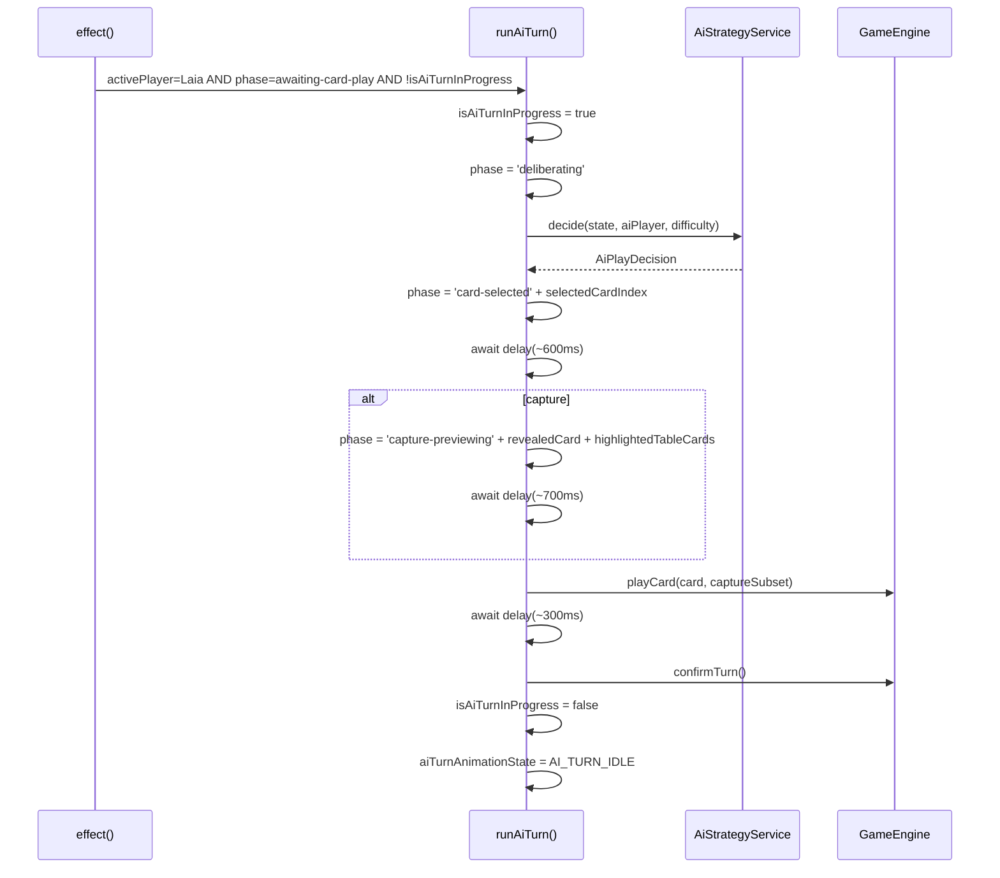
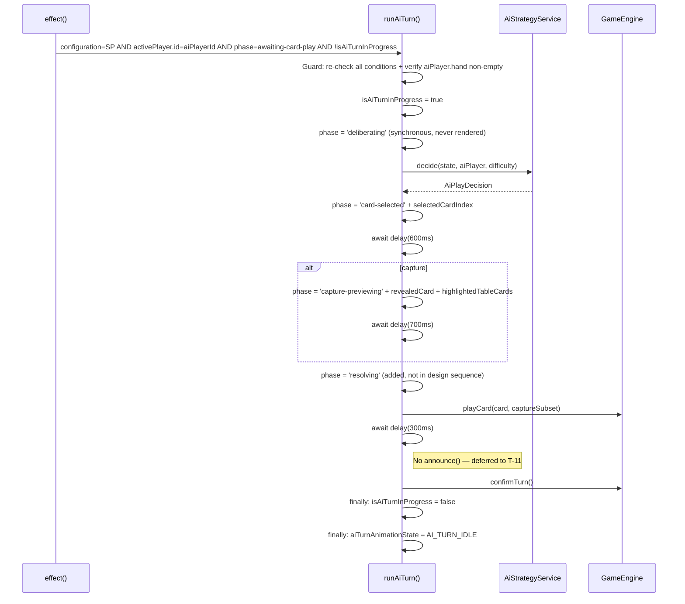

# Review Report: Single Player Mode — AI Opponent (Laia)

**Review Mode:** Incremental (T-9: Implement runAiTurn() method and the AI turn trigger effect in GameTablePage) — GREEN Phase (Implementation + Tests)
**Source:** `docs/specs/single-player/ai-opponent/`
**Reviewed against:** proposal.md, spec.md, user-stories.md, bdd-test.md, design.md, tasks.md

## 1. Executive Summary

The GREEN phase implementation of T-9 delivers the core AI turn orchestration: the `runAiTurn()` async method, the Angular `effect()` trigger, the animation state machine, the interaction lock, and the error recovery path. The implementation closely follows the design.md architecture and satisfies 7 of 9 acceptance criteria fully, with 2 partial. The test suite has been significantly expanded from the RED phase (4 tests → 8 tests) and now covers the animation phase progression, double-fire prevention, phase-gate guard, consecutive turn re-trigger, and error recovery with lock assertion.

The most significant finding is a **spec compliance gap**: the placement animation path totals approximately 900ms, which is below the 1.5-second minimum specified in FR-6.7 and asserted by SC-12. This was confirmed as unintentional by the team. A secondary concern is that the `deliberating` phase is set synchronously and overwritten by `card-selected` before Angular renders, making the deliberation visual state invisible to the user — contrary to FR-6.1 and FR-6.2.

- **Total findings:** 8 (0 Critical, 1 Major, 5 Minor, 2 Note)
- **Spec compliance:** 13 of 17 T-9-scoped requirements fully met, 3 partial, 1 not met
- **Architecture alignment:** Minor drift — deliberating phase invisible; otherwise well-aligned
- **Test quality:** Meaningful and substantially improved from RED phase; minor completeness gaps remain

## 2. Architecture Comparison

### 2.1 Planned AI Turn Orchestration Flow (from design.md)

### 2.2 Actual Implementation Flow

### 2.3 Drift Analysis

The implementation is well-aligned with the design.md architecture. Three structural differences are noted:

1. **Deliberating phase invisible:** The `deliberating` phase is set synchronously and immediately overwritten by `card-selected` (after the synchronous `decide()` call) before Angular's change detection runs. The first `await` (which yields to the renderer) occurs after `card-selected` is already set. This means the user never sees the deliberating phase — the hand zone enters the active visual state and highlights the selected card simultaneously. The design.md sequence diagram also does not show a delay between deliberating and card-selected, so the implementation follows the design, but both conflict with FR-6.2's "brief initial pause."

2. **Resolving phase added before playCard:** The implementation introduces a `resolving` phase transition before calling `playCard()`. While not shown in the design.md sequence diagram, the `AiTurnAnimationPhase` type in design.md section 8 includes `resolving` as one of five phases. This is a reasonable addition that separates the animation preview from the engine interaction.

3. **Accessibility announcement deferred:** The design sequence shows `announce(message)` between `playCard()` and `confirmTurn()`. The implementation omits this because accessibility announcements are T-11's responsibility. This is expected and correct scoping.

### 2.4 Planned vs Actual Guard Logic

```mermaid
graph TD
    subgraph Planned ["Planned (design.md AD-4)"]
        P1["effect watches activePlayer + turnPhase"]
        P2["Guard: activePlayer is Laia"]
        P3["Guard: phase = awaiting-card-play"]
        P4["Guard: !isAiTurnInProgress"]
        P1 --> P2 --> P3 --> P4 --> P5["call runAiTurn"]
    end

    subgraph Actual ["Actual Implementation"]
        A1["effect watches configuration + activePlayer + aiPlayerId + turnPhase + isAiTurnInProgress"]
        A2["Guard: mode = Single Player"]
        A3["Guard: activePlayer and aiPlayerId non-null"]
        A4["Guard: phase = awaiting-card-play AND !isAiTurnInProgress"]
        A5["Guard: activePlayer.id = aiPlayerId"]
        A6["call runAiTurn via void + catch"]
        A7["runAiTurn re-checks all guards + verifies aiPlayer.hand non-empty"]
        A1 --> A2 --> A3 --> A4 --> A5 --> A6 --> A7
    end
```

The actual implementation is more defensive than the design requires — it adds a `mode !== 'Single Player'` guard in both the effect and the method, and the method re-checks all conditions at entry. This is a positive deviation that prevents AI turn orchestration from running in multiplayer mode and guards against edge cases where signal changes race with async execution.

## 3. Findings

### RV-01: Placement animation duration below spec minimum [Major]

- **Category:** Spec Compliance
- **Severity:** Major
- **Related:** FR-6.7, SC-12, AD-9, T-9 AC-3
- **Description:** The placement animation path (no capture) uses two delays: 600ms after card-selected and 300ms after playCard, totalling approximately 900ms. FR-6.7 specifies a target range of 1.5 to 3 seconds, and SC-12 asserts this as a hard bound. The capture path totals approximately 1600ms (600ms + 700ms + 300ms), which is within bounds.
- **Expected:** Both placement and capture animation paths should complete within the 1.5 to 3 second range specified by FR-6.7.
- **Actual:** Placement: ~900ms (below minimum). Capture: ~1600ms (within range).
- **Recommendation:** Introduce a deliberation delay before the card-selected phase (approximately 600ms) to bring placement total to ~1500ms and capture total to ~2200ms. This would also address the invisible deliberating phase (RV-02) and align with FR-6.2's "brief initial pause."
- **Impact:** Placement animations are too fast for the user to follow the action, violating the "natural and legible" requirement. SC-12 BDD assertions would fail for placement plays.

### RV-02: Deliberating phase is never rendered [Minor]

- **Category:** Architecture Drift
- **Severity:** Minor
- **Related:** FR-6.1, FR-6.2, SC-10, SC-11, AD-5
- **Description:** The `deliberating` phase is set synchronously in `runAiTurn()` but is immediately overwritten by `card-selected` after the synchronous `decide()` call. Since the first `await` (which yields to Angular's renderer) occurs only after `card-selected` is set, the user never sees the deliberating phase. The hand zone enters its active visual state and highlights the selected card simultaneously.
- **Expected:** FR-6.1 requires the hand zone to enter an "active visual state" before a card is highlighted. FR-6.2 specifies "a brief initial pause (to signal that Laia is deliberating)" before the card highlight.
- **Actual:** The deliberating and card-selected phases occur in the same synchronous microtask. Only card-selected is rendered. The "active zone" CSS class (`ai-hand-zone--active`) is still applied (since `phase !== 'idle'`), but simultaneously with the card highlight rather than before it.
- **Recommendation:** Add an `await delay(~600ms)` between setting the deliberating phase and calling `decide()`. This would make the deliberating phase visible, satisfy FR-6.1/FR-6.2, and also resolve RV-01 by adding the missing duration to both animation paths.
- **Impact:** The user misses the visual "thinking" cue. The UX transitions directly from idle to card-highlighted without a distinct deliberation state. Both the design.md sequence diagram and the implementation have this gap, so the design document should also be updated if a deliberation delay is added.

### RV-03: Test title references FR-6.4 but verifies FR-8.3 [Minor]

- **Category:** Test Quality
- **Severity:** Minor
- **Related:** FR-6.4, FR-8.3, SC-20
- **Description:** The test titled "T-9 / FR-6.4 - never sets revealedCard for placement decisions" references FR-6.4 (table cards must be visually highlighted before capture). The test actually verifies that `revealedCard` is null during a placement, which corresponds to FR-8.3 (card remains face-down for placement) and SC-20.
- **Expected:** The test title should reference FR-8.3 or SC-20 for accurate traceability.
- **Actual:** FR-6.4 is cited, creating a traceability mismatch.
- **Recommendation:** Update the test title to reference FR-8.3 or SC-20.
- **Impact:** Minor traceability confusion. Developers seeking FR-6.4 coverage would incorrectly believe it is tested by this test.

### RV-04: highlightedTableCards not verified at playCard moment in capture test [Minor]

- **Category:** Test Quality
- **Severity:** Minor
- **Related:** FR-6.4, SC-10, AD-5
- **Description:** The test "T-9 / FR-6.3 - sets revealedCard before playCard for capture decisions" uses a `playCardSpy` callback to verify `revealedCard` and `phase` at the moment `playCard()` is called. It does not verify that `highlightedTableCards` contains the capture subset at that same moment.
- **Expected:** The spy callback should also assert `animation?.highlightedTableCards` equals the expected capture subset, verifying FR-6.4 (table cards highlighted before capture resolves).
- **Actual:** Only `revealedCard` and `phase` are asserted inside the callback.
- **Recommendation:** Add a `highlightedTableCards` assertion to the existing spy callback in the FR-6.3 test.
- **Impact:** The implementation could set `revealedCard` correctly but omit `highlightedTableCards`, and the test would still pass. The capture preview on the table zone would show no highlights, violating FR-6.4.

### RV-05: isAiTurnInProgress not verified as false after successful completion [Minor]

- **Category:** Test Coverage
- **Severity:** Minor
- **Related:** FR-7.3, TR-2.4, AD-6, T-9 AC-2
- **Description:** The `isAiTurnInProgress` signal lifecycle is partially tested: it is verified as `true` during execution (in the FR-7.2 double-fire test) and as `false` after an error (in the TR-2.4 test). However, no test explicitly verifies it is `false` after a successful AI turn completes.
- **Expected:** At least one test should verify `isAiTurnInProgress` is `false` after the full orchestration completes successfully, confirming the interaction lock is released for the human's turn.
- **Actual:** The successful completion path does not include an explicit `isAiTurnInProgress` assertion.
- **Recommendation:** Add `expect(readProtectedSignal('isAiTurnInProgress')).toBe(false)` after `advanceTimersByTimeAsync` in the FR-2.1 trigger test.
- **Impact:** A regression that removes the `isAiTurnInProgress.set(false)` from the finally block would only be caught by the error recovery test, not by the success path.

### RV-06: No animation duration bounds test [Minor]

- **Category:** Test Coverage
- **Severity:** Minor
- **Related:** FR-6.7, SC-12, NFR-1.2
- **Description:** FR-6.7 and SC-12 specify that the total animation duration must be between 1.5 and 3 seconds. No test validates these bounds. This gap is directly related to RV-01 — the placement path is already below the minimum, and no test would catch this.
- **Expected:** A test using fake timers that measures total elapsed time from effect trigger to AI_TURN_IDLE reset and asserts it falls within the 1500ms–3000ms range, for both capture and placement paths.
- **Actual:** No duration test exists.
- **Recommendation:** Add duration bounds tests for both capture and placement paths once the delay values are corrected per RV-01.
- **Impact:** Duration regressions (delays changed to values outside the spec range) would go undetected.

### RV-07: Phase progression test only checks phase field [Note]

- **Category:** Test Quality
- **Severity:** Note
- **Related:** AD-5, FR-6.3, FR-6.4
- **Description:** The test "T-9 / FR-6.1-FR-6.5 - progresses animation phases through card-selected and capture-previewing before resolving" verifies the phase progression (card-selected → capture-previewing → idle) at intermediate timer points. At the capture-previewing checkpoint, it verifies only the `phase` field, not `revealedCard` or `highlightedTableCards`. Full state verification at each phase would strengthen the test but is not strictly required since the FR-6.3 test separately verifies `revealedCard` at the `playCard` moment.
- **Expected:** Optionally, the capture-previewing checkpoint could assert the full `AiTurnAnimationState` object.
- **Actual:** Only `phase` is checked at each checkpoint.
- **Recommendation:** Consider enriching the phase progression test to verify the full animation state object at the capture-previewing checkpoint for defense in depth.
- **Impact:** Low. The individual field assertions in other tests provide overlapping coverage.

### RV-08: Deliberating phase not captured in phase progression test [Note]

- **Category:** Test Coverage
- **Severity:** Note
- **Related:** FR-6.1, AD-5
- **Description:** The phase progression test asserts the sequence card-selected → capture-previewing → idle. The deliberating phase is not captured because it is synchronously overwritten before `vi.runAllTicks()` can observe it. This is a consequence of the implementation's synchronous transition from deliberating to card-selected (which is itself the subject of RV-02).
- **Expected:** If a deliberation delay is added per RV-01/RV-02, this test should be updated to verify deliberating → card-selected → capture-previewing → idle.
- **Actual:** The test confirms what is observable: card-selected is the first rendered phase.
- **Recommendation:** Once RV-01/RV-02 is addressed, update the phase progression test to include the deliberating phase checkpoint.
- **Impact:** No impact under current implementation. Becomes relevant when the deliberation delay is added.

## 4. Traceability Matrix

| Finding | Severity | Category           | Related Spec                       | Status |
| ------- | -------- | ------------------ | ---------------------------------- | ------ |
| RV-01   | Major    | Spec Compliance    | FR-6.7, SC-12, AD-9, T-9 AC-3      | Open   |
| RV-02   | Minor    | Architecture Drift | FR-6.1, FR-6.2, SC-10, SC-11, AD-5 | Open   |
| RV-03   | Minor    | Test Quality       | FR-6.4, FR-8.3, SC-20              | Open   |
| RV-04   | Minor    | Test Quality       | FR-6.4, SC-10, AD-5                | Open   |
| RV-05   | Minor    | Test Coverage      | FR-7.3, TR-2.4, AD-6, T-9 AC-2     | Open   |
| RV-06   | Minor    | Test Coverage      | FR-6.7, SC-12, NFR-1.2             | Open   |
| RV-07   | Note     | Test Quality       | AD-5, FR-6.3, FR-6.4               | Open   |
| RV-08   | Note     | Test Coverage      | FR-6.1, AD-5                       | Open   |

## 5. Spec Compliance Summary (T-9 Scope)

| Requirement | Status     | Notes                                                                                                   |
| ----------- | ---------- | ------------------------------------------------------------------------------------------------------- |
| FR-2.1      | ✅ Met     | Effect fires when Laia is active in awaiting-card-play; tested                                          |
| FR-2.2      | ✅ Met     | Re-trigger after confirmTurn works; tested (FR-2.2 test)                                                |
| FR-2.3      | ✅ Met     | Phase gate prevents trigger in non-awaiting-card-play; tested (FR-2.3 test)                             |
| FR-6.1      | ⚠️ Partial | Active zone styling is applied but simultaneously with card highlight, not before (RV-02)               |
| FR-6.2      | ⚠️ Partial | Card is highlighted but no visible deliberation pause precedes it (RV-02)                               |
| FR-6.3      | ✅ Met     | revealedCard set before playCard for captures; tested                                                   |
| FR-6.4      | ✅ Met     | highlightedTableCards set during capture-previewing; implementation correct but test incomplete (RV-04) |
| FR-6.5      | ✅ Met     | playCard called after animation phases complete                                                         |
| FR-6.6      | ✅ Met     | confirmTurn called automatically; tested                                                                |
| FR-6.7      | ❌ Not Met | Placement duration ~900ms is below 1.5s minimum (RV-01)                                                 |
| FR-7.1      | ✅ Met     | isAiTurnInProgress gates interactionEnabled; set at start, cleared in finally                           |
| FR-7.3      | ✅ Met     | Lock released in finally block; re-enables interaction for human turn                                   |
| FR-8.3      | ✅ Met     | revealedCard is null for placements; tested                                                             |
| FR-8.4      | ✅ Met     | revealedCard set to cardToPlay for captures during capture-previewing                                   |
| TR-2.1      | ✅ Met     | Effect-based reactive detection implemented                                                             |
| TR-2.2      | ✅ Met     | Phase gate in both effect and runAiTurn entry                                                           |
| TR-2.3      | ✅ Met     | Promise-based delay does not block change detection                                                     |
| TR-2.4      | ✅ Met     | isAiTurnInProgress tracked separately from engine phase; try/finally ensures cleanup                    |

## 6. Task Completion Summary

| Task | Title                              | Status     | Findings                                                         |
| ---- | ---------------------------------- | ---------- | ---------------------------------------------------------------- |
| T-9  | runAiTurn() orchestration + effect | ⚠️ Partial | RV-01 (placement duration), RV-02 (deliberating phase invisible) |

## 7. Test Coverage Summary (T-9 BDD Scenarios)

| Scenario | Relevant to T-9  | Unit Test   | Notes                                                                                           |
| -------- | ---------------- | ----------- | ----------------------------------------------------------------------------------------------- |
| SC-06    | Yes (FR-2.1)     | ✅ Yes      | Trigger test verifies auto-initiation                                                           |
| SC-07    | Yes (FR-2.2)     | ✅ Yes      | FR-2.2 test verifies re-trigger                                                                 |
| SC-08    | Yes (FR-2.3)     | ✅ Yes      | FR-2.3 test verifies phase gate                                                                 |
| SC-09    | Yes (NFR-2.1)    | ⚠️ Implicit | Engine accepts the play (no explicit assertion)                                                 |
| SC-10    | Yes (FR-6.1–6.5) | ⚠️ Partial  | Phase progression verified but deliberating not observable (RV-02, RV-08)                       |
| SC-11    | Yes (FR-6.1–6.2) | ⚠️ Partial  | Placement path has visible card-selected but no deliberation phase                              |
| SC-12    | Yes (FR-6.7)     | ❌ No       | No duration bounds test (RV-06); placement duration fails spec (RV-01)                          |
| SC-13    | Yes (FR-6.6)     | ✅ Yes      | confirmTurn verified in trigger test                                                            |
| SC-14    | Yes (FR-7.1)     | ✅ Yes      | interactionEnabled verified via T-8 test; isAiTurnInProgress set during execution (FR-7.2 test) |
| SC-15    | Yes (FR-7.1)     | ✅ Yes      | interactionEnabled = false when isAiTurnInProgress = true (T-8 test)                            |
| SC-16    | Yes (FR-7.3)     | ⚠️ Partial  | Lock released in finally but not explicitly verified after success (RV-05)                      |
| SC-17    | Yes (FR-7.1)     | ⚠️ Implicit | Controls are disabled via interactionEnabled; no explicit disabled-control-during-AI test       |

## 8. Test Quality Summary

| Test File                                    | Type | Meaningful Assertions | Issues                                                                                                                                             |
| -------------------------------------------- | ---- | --------------------- | -------------------------------------------------------------------------------------------------------------------------------------------------- |
| game-table-page.spec.ts (T-9 tests: 8 tests) | Unit | ✅ Yes                | FR-6.4 title mislabeled (RV-03); highlightedTableCards not asserted in capture test (RV-04); isAiTurnInProgress not verified after success (RV-05) |
| ai-turn.spec.ts                              | Unit | ✅ Yes                | Type-level tests adequate for the model file                                                                                                       |
| delay.utils.spec.ts                          | Unit | ✅ Yes                | Verifies async resolution with elapsed time check                                                                                                  |

## 9. T-9 Acceptance Criteria Coverage

| AC # | Criterion                                                    | Implementation                      | Test Coverage | Finding                            |
| ---- | ------------------------------------------------------------ | ----------------------------------- | ------------- | ---------------------------------- |
| AC-1 | Effect fires when Laia is active in awaiting-card-play       | ✅ Implemented                      | ✅ Covered    | —                                  |
| AC-2 | isAiTurnInProgress true for entire animation                 | ✅ Implemented                      | ⚠️ Partial    | RV-05 (not verified after success) |
| AC-3 | aiTurnAnimationState progresses through phases in order      | ⚠️ Partial (deliberating invisible) | ⚠️ Partial    | RV-01, RV-02, RV-08                |
| AC-4 | revealedCard set before playCard for captures                | ✅ Implemented                      | ✅ Covered    | —                                  |
| AC-5 | revealedCard never set for placements                        | ✅ Implemented                      | ✅ Covered    | —                                  |
| AC-6 | confirmTurn called automatically                             | ✅ Implemented                      | ✅ Covered    | —                                  |
| AC-7 | Effect does not double-fire while isAiTurnInProgress is true | ✅ Implemented                      | ✅ Covered    | —                                  |
| AC-8 | Error path resets lock and animation state                   | ✅ Implemented                      | ✅ Covered    | —                                  |
| AC-9 | Effect re-fires cleanly on consecutive Laia turns            | ✅ Implemented                      | ✅ Covered    | —                                  |

## 10. Security Cross-Reference

This section cross-references the companion security report at `docs/specs/single-player/ai-opponent/security-report_T-9.md` (RED phase). The GREEN implementation was reviewed for security concerns.

The existing security report identified two Low findings:

| SEC ID | Severity | OWASP    | Summary                                                       | GREEN Status                                                                                                                            |
| ------ | -------- | -------- | ------------------------------------------------------------- | --------------------------------------------------------------------------------------------------------------------------------------- |
| SEC-01 | Low      | A01:2021 | Missing test assertion for AI-turn interaction-lock lifecycle | ⚠️ Partially addressed — lock verified during execution (FR-7.2 test) and after error (TR-2.4 test); not verified after success (RV-05) |
| SEC-02 | Low      | A04:2021 | Missing test assertion for AI-turn re-entrancy guard          | ✅ Addressed — FR-7.2 test verifies single-run behavior under concurrent invocation                                                     |

No new security concerns were identified in the GREEN implementation:

- No user input handling in `runAiTurn()` (no injection risk)
- No DOM manipulation (Angular template binding only)
- No HTTP requests or external data consumption
- The interaction lock (`isAiTurnInProgress`) properly prevents out-of-turn actions (OWASP A01)
- The try/finally ensures the lock is always released, preventing permanent lockout
- The AI strategy does not access the human player's hand array (FR-5.2 compliance, information boundary preserved)

## 11. Recommendations

### Major (fix before merge)

1. **Add deliberation delay to reach 1.5s minimum for all animation paths (RV-01, RV-02):** Insert an `await delay(~600ms)` between setting the `deliberating` phase and calling `decide()`. This simultaneously resolves the sub-1.5s placement duration (RV-01), makes the deliberating phase visible to the user (RV-02), and aligns with FR-6.1/FR-6.2. After the fix, placement total ≈ 600ms (deliberation) + 600ms (card-selected) + 300ms (post-play) = 1500ms. Capture total ≈ 600ms + 600ms + 700ms + 300ms = 2200ms. Both are within the 1.5–3s range. Update the design.md sequence diagram to reflect this delay.

### Minor (improvement)

1. **Correct FR reference in placement test title (RV-03):** Change "FR-6.4" to "FR-8.3" or "SC-20" in the test name for accurate traceability.
2. **Add highlightedTableCards assertion to capture test (RV-04):** Extend the existing FR-6.3 test's `playCardSpy` callback to also assert `animation?.highlightedTableCards` equals the expected capture subset.
3. **Add isAiTurnInProgress success-path assertion (RV-05):** Add `expect(readProtectedSignal('isAiTurnInProgress')).toBe(false)` after the timer advance in the FR-2.1 trigger test.
4. **Add animation duration bounds tests (RV-06):** Once the deliberation delay is added, add tests asserting total elapsed time for both placement and capture paths falls within 1500ms–3000ms.

### Notes (informational)

1. **Enrich phase progression test (RV-07):** Consider verifying the full `AiTurnAnimationState` object at the capture-previewing checkpoint for defense in depth.
2. **Update phase progression test after deliberation fix (RV-08):** When the deliberation delay is added, update the test to capture the deliberating phase as the first observable checkpoint.
