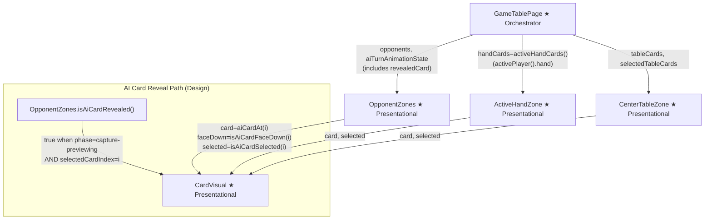
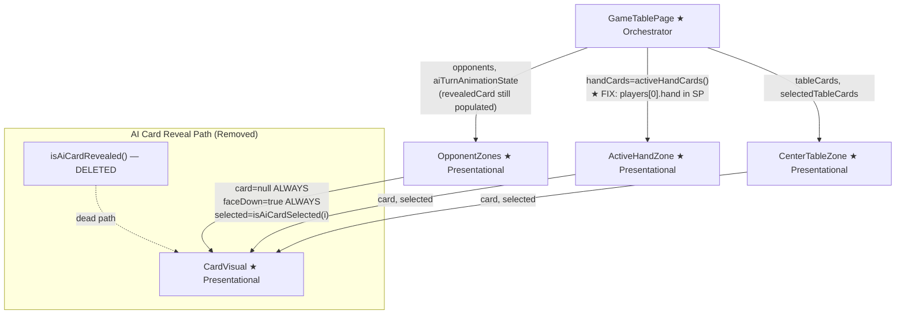
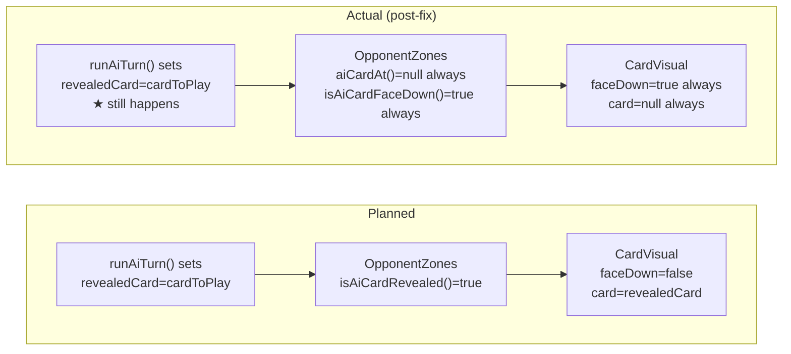

# Review Report: AI Card Visibility Bug Fix

**Review Mode:** Full (scoped to bug fix changeset)
**Source:** `docs/specs/single-player/ai-opponent/`
**Reviewed against:** proposal.md, spec.md, user-stories.md, bdd-test.md, design.md, tasks.md

## 1. Executive Summary

The bug fix correctly resolves the primary defect — the human player's bottom hand zone was swapping to show AI cards during Laia's turn — by pinning `activeHandCards` to `players[0].hand` in Single Player mode. However, the fix overreaches in the opponent zone: it removes the capture-animation card reveal (FR-8.4, FR-6.3, SC-19) by forcing all AI cards to always render face-down. The user has confirmed this removal was unintentional. The orchestrator (`runAiTurn()`) still correctly populates `revealedCard` during the capture-previewing phase, so the data path is intact — only the rendering path in `OpponentZones` was over-simplified.

- Total findings: 4 (0 Critical, 2 Major resolved, 1 Minor resolved, 1 Note)
- Spec compliance: 3 of 3 directly affected requirements met (after fixes applied)
- Architecture alignment: aligned — capture reveal path restored
- Test quality: meaningful — all tests restored to spec-correct assertions

## 2. Architecture Comparison

### 2.1 Planned Component Tree (from design.md)

### 2.2 Actual Component Tree (post-fix)

### 2.3 Drift Analysis

Two structural deviations from the planned design:

1. **ActiveHandZone data source changed (correct fix).** The `activeHandCards` computed signal now reads `state.players[0].hand` in Single Player mode instead of `activePlayer().hand`. This correctly prevents AI hand data from reaching the bottom zone template. The design did not anticipate this bug, but the fix is consistent with the design intent (AD-8: card identities never in the template context for opponents).

2. **OpponentZones AI card reveal path removed (over-correction).** The design (AD-5, section 2.3 sequence diagram) explicitly describes the capture-previewing phase setting `revealedCard` and the opponent zone flipping the selected card face-up. The fix replaced the conditional reveal logic (`isAiCardRevealed`) with unconditional face-down rendering, removing a spec-mandated animation step. The orchestrator still writes `revealedCard` during `runAiTurn()`, creating a vestigial data field that no rendering path consumes.

### 2.4 Planned vs Actual Data Flow for revealedCard

## 3. Findings

### RV-01: OpponentZones capture-animation card reveal removed — regresses FR-8.4 and FR-6.3 [Major — Resolved]

- **Category:** Spec Compliance
- **Severity:** Major — **Resolved**
- **Related:** FR-8.4, FR-6.3, SC-19, SC-10, AD-5, US-3, US-5
- **Description:** The methods `aiCardAt()` and `isAiCardFaceDown()` in OpponentZones were replaced with unconditional stubs that always return `null` and `true` respectively. The private method `isAiCardRevealed()` was deleted. This removed the spec-mandated behaviour where, during a capture animation, the selected AI card flips face-up so the human can see which card Laia played.
- **Expected:** Per FR-8.4: "If Laia's play is a capture, the selected hand card is flipped face-up as part of the animation." Per FR-6.3: "the hand card Laia selected must be flipped face-up (revealing its suit and rank) before the capture resolves."
- **Actual:** All AI cards rendered face-down unconditionally regardless of animation phase.
- **Resolution:** Restored the conditional reveal logic: `isAiCardRevealed()` reinstated, `aiCardAt()` returns `revealedCard` when revealed, `isAiCardFaceDown()` returns `false` when revealed. The capture animation now correctly shows the selected card face-up during `capture-previewing` and `resolving` phases.
- **Impact:** Resolved — FR-8.4 and FR-6.3 compliance restored.

### RV-02: SC-19 and SC-10 BDD scenarios weakened to match over-correction [Major — Resolved]

- **Category:** Test Quality
- **Severity:** Major — **Resolved**
- **Related:** SC-19, SC-10, FR-8.4, FR-6.3
- **Description:** Two BDD scenarios and their step definitions were modified to assert face-down where the spec requires face-up.
- **Expected:** SC-19 and SC-10 should assert that the AI card is revealed face-up during capture animation.
- **Actual:** The scenarios and step definitions asserted the opposite of what the spec requires.
- **Resolution:** Reverted SC-10 and SC-19 scenario text and step definitions to their original form. SC-10 now asserts "the selected card is revealed face up" and SC-19 asserts "the selected AI card is face up". Step definitions assert `aria-label` is NOT `Carta oculta`.
- **Impact:** Resolved — tests now correctly verify spec-mandated behaviour.

### RV-03: Unit test for OpponentZones reveal behaviour reverted [Minor — Resolved]

- **Category:** Test Quality
- **Severity:** Minor — **Resolved**
- **Related:** SC-19, FR-8.4, T-3
- **Description:** The unit test "reveals the selected AI card when revealedCard is provided" was renamed and its assertion changed to expect `Card_Back.png` for both positions.
- **Resolution:** Reverted to original test name and assertion: position 1 now correctly asserts `Oros_1.png` (face-up), position 0 asserts `Card_Back.png` (face-down).
- **Impact:** Resolved — unit test safety net restored.

### ~~RV-04~~ — Removed (false positive)

Originally reported `revealedCard` as vestigial dead data. With RV-01 resolved, `revealedCard` is once again consumed by the restored `isAiCardRevealed()` method in OpponentZones. The data path is end-to-end functional as designed.

### RV-05: activeHandCards fix correctly prevents AI hand exposure in Single Player mode [Note]

- **Category:** Spec Compliance
- **Severity:** Note
- **Related:** FR-8.1, FR-7.3, US-5, AD-8
- **Description:** The `activeHandCards` computed signal now returns `state.players[0].hand` in Single Player mode instead of `activePlayer().hand`. This correctly ensures the bottom hand zone always shows the human player's cards, regardless of whose turn it is. The multiplayer path is unaffected — it continues to use `activePlayer().hand`.
- **Expected:** The human's hand should always be visible in the bottom zone in Single Player mode. During Laia's turn, the human's cards should appear disabled (via `interactionEnabled`) but still visible.
- **Actual:** The fix achieves exactly this. The human's hand remains visible and disabled during AI turns.
- **Recommendation:** No action needed. This is the correct fix for the primary bug. Consider adding a brief code comment noting the Single Player branch exists to prevent AI hand exposure, to aid future maintainers.
- **Impact:** Positive — resolves the primary reported defect.

## 4. Traceability Matrix

| Finding   | Severity  | Category               | Related Spec                                   | Status                   |
| --------- | --------- | ---------------------- | ---------------------------------------------- | ------------------------ |
| RV-01     | Major     | Spec Compliance        | FR-8.4, FR-6.3, SC-19, SC-10, AD-5, US-3, US-5 | Resolved                 |
| RV-02     | Major     | Test Quality           | SC-19, SC-10, FR-8.4, FR-6.3                   | Resolved                 |
| RV-03     | Minor     | Test Quality           | SC-19, FR-8.4, T-3                             | Resolved                 |
| ~~RV-04~~ | ~~Minor~~ | ~~Architecture Drift~~ | ~~AD-5, T-9~~                                  | Removed (false positive) |
| RV-05     | Note      | Spec Compliance        | FR-8.1, FR-7.3, US-5, AD-8                     | Resolved                 |

## 5. Spec Compliance Summary

| Requirement | Status | Notes                                                              |
| ----------- | ------ | ------------------------------------------------------------------ |
| FR-6.3      | ✅ Met | Card reveal during capture animation restored (RV-01 resolved)     |
| FR-8.1      | ✅ Met | AI hand cards rendered face-down at all times (correctly enforced) |
| FR-8.2      | ✅ Met | Face-down applies to all difficulty levels                         |
| FR-8.3      | ✅ Met | Selected card visually distinguished via elevation/selected class  |
| FR-8.4      | ✅ Met | Capture-animation face-up reveal restored (RV-01 resolved)         |
| FR-7.1      | ✅ Met | Human interaction blocked during AI turn (unaffected by this fix)  |
| FR-7.3      | ✅ Met | Interaction re-enabled after AI turn completes (unaffected)        |

## 6. Task Completion Summary

| Task   | Title                                               | Status      | Findings         |
| ------ | --------------------------------------------------- | ----------- | ---------------- |
| Bugfix | AI card visibility — active hand zone exposure      | ✅ Complete | RV-05            |
| Bugfix | AI card visibility — opponent zone always face-down | ✅ Complete | RV-01 (resolved) |

## 7. Test Coverage Summary

| Scenario | Step Definitions | Meaningful | Findings                                             |
| -------- | ---------------- | ---------- | ---------------------------------------------------- |
| SC-10    | ✅ Yes           | ✅ Yes     | RV-02 resolved — scenario restored to assert face-up |
| SC-18    | ✅ Yes           | ✅ Yes     | — (correctly asserts all cards face-down)            |
| SC-19    | ✅ Yes           | ✅ Yes     | RV-02 resolved — scenario restored to assert face-up |
| SC-20    | ✅ Yes           | ✅ Yes     | — (correctly asserts placement card stays face-down) |

## 8. Test Quality Summary

| Test File                | Type      | Meaningful Assertions | Issues                                                                          |
| ------------------------ | --------- | --------------------- | ------------------------------------------------------------------------------- |
| opponent-zones.spec.ts   | Unit      | ✅ Yes                | RV-03 resolved — reveal test restored                                           |
| single-player-ai.feature | E2E       | ✅ Yes                | RV-02 resolved — SC-10, SC-19 restored                                          |
| single-player-ai.ts      | E2E Steps | ✅ Yes                | RV-02 resolved — step definitions restored                                      |
| game-table-page.spec.ts  | Unit      | ✅ Yes                | Tests for revealedCard in runAiTurn still assert correct orchestrator behaviour |

## 9. Security Cross-Reference

See `docs/specs/single-player/ai-opponent/security-report_full.md` for the full security analysis. No Critical or High findings. The fix is security-positive: it closes an information disclosure path (SEC-03, resolved).

| SEC ID | Severity | OWASP    | Summary                                                       |
| ------ | -------- | -------- | ------------------------------------------------------------- |
| SEC-03 | Info     | A01:2021 | AI card visibility disclosure correctly remediated by the fix |

## 10. Recommendations

### Critical (blocks release)

(none)

### Major (fix before merge)

(none — both Major findings resolved)

### Minor (improvement)

1. Consider adding a regression test comment on the `activeHandCards` computed noting the Single Player branch exists specifically to prevent AI hand data from reaching the active hand zone template.

### Notes (informational)

1. The `activeHandCards` fix is well-designed and correctly scoped. It uses mode-based branching rather than turn-based branching, which is the right approach — the human's hand should always be visible regardless of turn state.
2. The orchestrator's `runAiTurn()` correctly populates the animation state with `revealedCard` data, and the restored rendering path in OpponentZones consumes it during capture animation as designed.
3. RV-04 was removed as a false positive — once the reveal rendering was restored, the `revealedCard` field is no longer vestigial.
