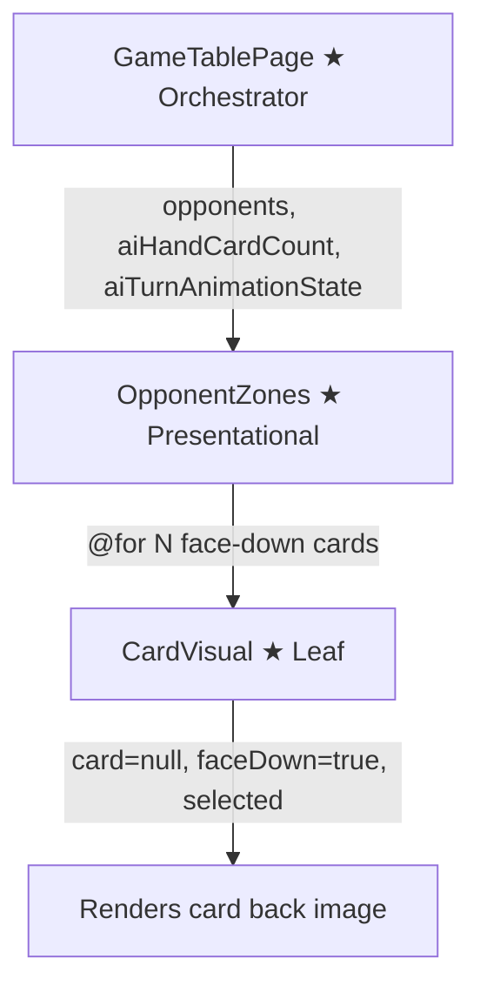
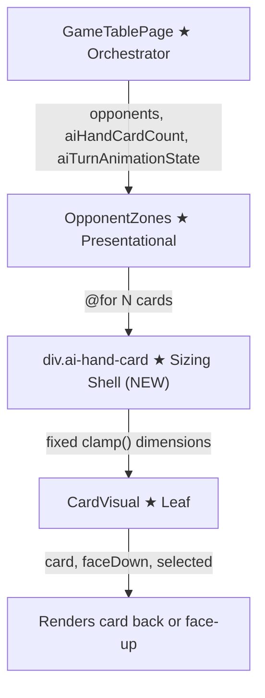

# Review Report: AI Hand Card Rendering Stability Fix

**Review Mode:** Incremental (T-3/T-10 relevant checks: opponent AI hand card rendering stability — remaining cards should not enlarge after AI plays a card)
**Source:** `docs/specs/single-player/ai-opponent/`
**Reviewed against:** proposal.md, spec.md, user-stories.md, bdd-test.md, design.md, tasks.md
**Re-reviewed:** 2026-05-14 — follow-up tests added addressing RV-01 and RV-02

## 1. Executive Summary

The fix is well-scoped, minimal, and correctly addresses the rendering stability defect. By introducing a fixed-dimension wrapper div (`.ai-hand-card`) around each `CardVisual` instance in the AI hand zone, card slots maintain consistent size regardless of how many cards remain. The CSS approach — `flex: 0 0 auto` with `clamp()`-based logical dimensions — is idiomatic and responsive.

**Re-review update:** The two Minor findings from the initial review (RV-01 and RV-02) are now fully resolved. Three new tests were added covering the core stability regression scenario (count decrease without visual resize), the zero-card-count edge case, the idle-phase negative case, and the placement scenario with null revealedCard. All four new tests contain meaningful, behaviour-verifying assertions. No remaining test coverage gaps.

- **Total findings:** 4 (0 Critical, 0 Major, 0 Minor (2 resolved), 2 Note)
- **Spec compliance:** 7 of 7 directly affected requirements met
- **Architecture alignment:** aligned — no drift from design.md
- **Test quality:** meaningful — all identified scenarios now have dedicated tests with specific assertions

## 2. Architecture Comparison

### 2.1 Planned Component Tree (design.md section 2.1 — T-3 scope)

### 2.2 Actual Component Tree (post-fix)

### 2.3 Drift Analysis

No structural architectural drift. The fix introduces a pure presentation wrapper (`div.ai-hand-card`) between the `@for` loop and each `CardVisual` instance. This wrapper is a CSS sizing container only — it has no component logic, no inputs, and no outputs. It does not alter the data flow described in design.md section 2.2.

The design (AD-8, section 4.2) specifies that OpponentZones "renders `aiHandCardCount` instances of `CardVisual` with `faceDown=true`." The wrapper div does not change what is rendered — only how it is sized within the flex container. CardVisual continues to receive the same inputs (`card`, `faceDown`, `selected`) as before.

**Root cause of the original bug:** CardVisual's host element uses `display: block; width: 100%; height: 100%` — it fills its parent container. Previously, `<app-card-visual>` was the direct flex child of `.ai-hand-zone`. Without explicit flex constraints, when `aiHandCardCount` decreased (e.g., from 3 to 2 after Laia plays a card), the remaining flex children would expand to fill available space, causing a visible size jump. The wrapper div with `flex: 0 0 auto` and fixed `clamp()` dimensions creates a stable slot that does not resize regardless of sibling count.

## 3. Findings

### RV-01: No test for the core rendering stability scenario (card count decrease without visual resize) [Minor → Resolved]

- **Category:** Test Coverage
- **Severity:** ~~Minor~~ → **Resolved**
- **Related:** T-3 acceptance criteria, FR-8.1, FR-6.2, US-5, SC-21
- **Description:** The bug fix addresses a specific visual defect: when `aiHandCardCount` decreases (e.g., from 3 to 2 after Laia plays a card), the remaining cards should not change size.
- **Resolution:** A dedicated test now exercises this exact scenario. It sets `aiHandCardCount` to 3, captures the computed `width`, `height`, and `flex` of the first shell element, then reduces `aiHandCardCount` to 2 and asserts all three properties remain identical. This directly validates the fix's intended behaviour and provides a regression safety net against future CSS changes that could reintroduce the enlargement bug.

### RV-02: Pre-existing edge case test gaps from prior T-3 review remain unaddressed [Minor → Resolved]

- **Category:** Test Coverage
- **Severity:** ~~Minor~~ → **Resolved**
- **Related:** T-3 acceptance criterion #5 and #6, FR-8.3, SC-20, SC-21
- **Description:** The prior T-3 incremental review identified three missing edge case tests.
- **Resolution:** All three edge case tests have been added:
  - **Zero card count:** A test sets `aiHandCardCount = 0` and asserts the AI hand zone element is null and no card elements are rendered. This validates the template conditional that omits the zone when empty.
  - **Idle phase negative case:** A test sets `phase = 'idle'` and asserts the `ai-hand-zone--active` CSS class is absent. This validates the negative path of the active-state binding.
  - **Placement scenario (card-selected with null revealedCard):** A test sets `phase = 'card-selected'` with `selectedCardIndex = 1` and `revealedCard = null`, then asserts the selected card has the `card-visual--selected` class AND its image source points to `Card_Back.png` with alt text `Carta oculta`. This validates SC-20's placement path where the AI card stays face-down despite being selected.

### RV-03: Wrapper shell approach is correct and follows CardVisual sizing contract [Note]

- **Category:** Code Quality
- **Severity:** Note
- **Related:** AD-8, T-3, TR-4.1
- **Description:** The fix uses a wrapper `div.ai-hand-card` with `flex: 0 0 auto` and `clamp()`-based logical properties (`inline-size`, `block-size`) to create stable card slots. This correctly accounts for CardVisual's host styling (`width: 100%; height: 100%`), which causes it to fill its parent. The wrapper ensures the parent has a fixed intrinsic size, making CardVisual fill a consistently-sized box.
- **Expected:** Cards should maintain stable dimensions regardless of flex container sibling count.
- **Actual:** The `flex: 0 0 auto` shorthand prevents flex grow and shrink. The `clamp()` functions provide responsive sizing bounded between minimum and maximum values. The `display: block` ensures the wrapper participates in flex layout as a simple block box.
- **Recommendation:** No action needed. The approach is clean, minimal, and consistent with how the rest of the game board manages card sizing (parent defines the slot, CardVisual fills it).
- **Impact:** Positive — resolves the rendering instability without affecting any other component or data flow.

### RV-04: CSS uses logical properties consistently [Note]

- **Category:** Code Quality
- **Severity:** Note
- **Related:** T-3
- **Description:** The new `.ai-hand-card` rule uses `inline-size` and `block-size` (CSS logical properties) instead of `width` and `height`. This is consistent with modern CSS best practices and supports future internationalisation (right-to-left layout) without changes. However, other rules in the same file (e.g., `.opponent-seat--north` uses `width: min(100%, 16rem)`) use physical properties.
- **Expected:** Consistent property usage within the file.
- **Actual:** Mixed usage — physical properties in existing rules, logical properties in the new rule. This is a pre-existing inconsistency that the fix does not introduce.
- **Recommendation:** No action needed for this fix. If a future cleanup pass standardises on logical properties, the existing physical-property rules should be migrated together.
- **Impact:** None. Both property types function correctly in left-to-right layout. The inconsistency is cosmetic.

## 4. Traceability Matrix

| Finding | Severity           | Category      | Related Spec                      | Status    |
| ------- | ------------------ | ------------- | --------------------------------- | --------- |
| RV-01   | ~~Minor~~ Resolved | Test Coverage | T-3, FR-8.1, FR-6.2, US-5, SC-21  | ✅ Closed |
| RV-02   | ~~Minor~~ Resolved | Test Coverage | T-3 AC#5/#6, FR-8.3, SC-20, SC-21 | ✅ Closed |
| RV-03   | Note               | Code Quality  | AD-8, T-3, TR-4.1                 | ✅ Closed |
| RV-04   | Note               | Code Quality  | T-3                               | ✅ Closed |

## 5. Spec Compliance Summary

| Requirement | Status | Notes                                                                                                                 |
| ----------- | ------ | --------------------------------------------------------------------------------------------------------------------- |
| FR-6.1      | ✅ Met | Active visual state on AI hand zone during non-idle phases — unchanged by fix                                         |
| FR-6.2      | ✅ Met | Selected card visually highlighted — `selected` input still flows through wrapper correctly                           |
| FR-6.3      | ✅ Met | Card flip face-up during capture — `isAiCardRevealed()` logic unchanged                                               |
| FR-8.1      | ✅ Met | All cards face-down in Single Player — `faceDown` input unchanged                                                     |
| FR-8.3      | ✅ Met | Selected card distinguished during animation — CardVisual host binding applies `card-visual--selected` within wrapper |
| FR-8.4      | ✅ Met | Capture card revealed face-up — `aiCardAt()` and `isAiCardFaceDown()` conditional logic intact                        |
| US-5        | ✅ Met | Laia's cards always face-down — maintained                                                                            |

## 6. Task Completion Summary

| Task   | Title                                                      | Status      | Findings                          |
| ------ | ---------------------------------------------------------- | ----------- | --------------------------------- |
| Bugfix | AI hand card rendering stability — fixed-dimension wrapper | ✅ Complete | RV-01 ✅, RV-02 ✅ (all resolved) |

## 7. Test Coverage Summary

| Scenario | Step Definitions | Meaningful | Findings                                                  |
| -------- | ---------------- | ---------- | --------------------------------------------------------- |
| SC-18    | ✅ Yes           | ✅ Yes     | — (face-down assertion unaffected)                        |
| SC-19    | ✅ Yes           | ✅ Yes     | — (reveal assertion unaffected)                           |
| SC-20    | ✅ Yes           | ✅ Yes     | RV-02 resolved — placement face-down scenario now tested  |
| SC-21    | ✅ Yes           | ✅ Yes     | RV-01 resolved — card count decrease stability now tested |

## 8. Test Quality Summary

| Test File              | Type | Meaningful Assertions | Issues                                                                                                                                                                                                                                     |
| ---------------------- | ---- | --------------------- | ------------------------------------------------------------------------------------------------------------------------------------------------------------------------------------------------------------------------------------------ |
| opponent-zones.spec.ts | Unit | ✅ Yes                | All identified scenarios now covered: rendering stability regression (count decrease with dimension assertions), zero-card-count boundary, idle-phase negative case, placement face-down scenario. All assertions are behaviour-verifying. |

## 9. Security Cross-Reference

This fix is a pure CSS/template change with no new data inputs, no new service calls, no routing changes, and no configuration modifications. No security review is warranted. No companion `security-report_bugfix-hand-stability.md` was generated.

## 10. Recommendations

### Critical (blocks release)

(none)

### Major (fix before merge)

(none)

### Minor (improvement)

(none — RV-01 and RV-02 resolved)

### Notes (informational)

1. The wrapper-div approach is the correct fix for this class of flex reflow bug. The `flex: 0 0 auto` shorthand combined with `clamp()`-based sizing creates an intrinsically stable card slot. The `@for` loop's `track aiCardIndex` ensures Angular destroys the highest-index DOM node when count decreases, preserving the existing nodes at lower indices.
2. The CSS logical properties usage in the new rule is a positive signal for modern CSS practice, though it creates a minor inconsistency with existing physical-property rules in the same file.
