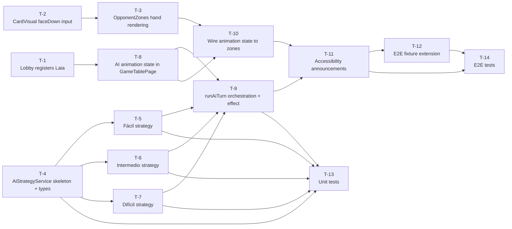

# Implementation Tasks: Single Player Mode — AI Opponent (Laia)

**Source Design:** `docs/specs/single-player/ai-opponent/design.md`

---

## Task Dependency Overview

---

## Tasks

### T-1: Lobby registers "Laia" as the second player name in Single Player configuration

- **Description:** Modify the Lobby's `buildConfiguration()` method so that when the mode is Single Player, the `playerNames` array contains two entries: the human player's name at index 0 and the fixed string `'Laia'` at index 1. `playerCount` remains 2. This change ensures the game engine creates two Player objects — one human, one AI — when `initGame` is called. No changes to the GameConfiguration type or the GameSession service are needed.
- **Status:** ✅ Implemented
- **Architectural Decision:** AD-1
- **Depends on:** None
- **Files affected:** `src/app/features/lobby/lobby/lobby.ts`
- **Acceptance criteria:**
  - [ ] Starting a Single Player match always results in two players in the engine: the human player and a player named "Laia"
  - [ ] The human player is at player index 0; Laia is at player index 1
  - [ ] The Lobby form still validates the human player's name (required, non-empty)
  - [ ] Multiplayer mode is unaffected — the lobby continues to collect all player names as before
  - [ ] The `aiDifficulty` and `playerCount` fields in the configuration remain correct
- **Estimation hint:** XS
- **Spec traceability:** FR-1.1, FR-1.2, US-1

---

### T-2: Add `faceDown` boolean input to CardVisual component

- **Description:** Add a new optional signal-based boolean input `faceDown` (default: `false`) to the `CardVisual` component. When `faceDown` is `true`, the component must render the card back image (`/cards/Card_Back.png`) with the accessibility label "Carta oculta" — distinct from the existing null-card fallback label "Carta no disponible". The `card` input continues to work as before when `faceDown` is `false`. No existing callsites pass `faceDown`, so no regressions are expected.
- **Status:** ✅ Implemented
- **Architectural Decision:** AD-7
- **Depends on:** None
- **Files affected:** `src/app/features/game-board/game-table-page/components/card-visual/card-visual.ts`, `card-visual.html`
- **Acceptance criteria:**
  - [ ] When `faceDown=true`, the back-card image is rendered
  - [ ] When `faceDown=true`, the accessible label is "Carta oculta" (not "Carta no disponible")
  - [ ] When `faceDown=false` (default), existing rendering behaviour is completely unchanged
  - [ ] When `faceDown=true` and a card is also passed, `faceDown` takes precedence
  - [ ] The `selected` input still applies its visual state (elevation/highlight) when `faceDown=true`, to support the animation selection step
- **Estimation hint:** XS
- **Spec traceability:** FR-8.1, FR-8.2, TR-4.1, TR-4.2, US-5

---

### T-3: Extend OpponentZones to render Laia's face-down hand cards with animation support

- **Description:** Add two new signal-based inputs to `OpponentZones`: `aiHandCardCount` (number) and `aiTurnAnimationState` (the animation state object defined in T-8). In the Laia section of the template, render `aiHandCardCount` instances of `CardVisual` with `faceDown=true`. Apply the selected/elevated visual state to the card at `aiTurnAnimationState.selectedCardIndex`. When `aiTurnAnimationState.revealedCard` is non-null, render that specific card position face-up (passing the actual card and `faceDown=false`) while all other positions remain face-down. Apply a CSS active-zone class when `aiTurnAnimationState.phase` is not `'idle'`.
- **Status:** ✅ Implemented
- **Architectural Decision:** AD-8, AD-5
- **Depends on:** T-2
- **Files affected:** `src/app/features/game-board/game-table-page/zones/opponent-zones/opponent-zones.ts`, `opponent-zones.html`, `opponent-zones.scss`
- **Acceptance criteria:**
  - [ ] Laia's hand zone shows exactly `aiHandCardCount` face-down cards
  - [ ] When `selectedCardIndex` is N, card at position N has the elevated/selected visual state
  - [ ] When `revealedCard` is non-null, that card position renders face-up with the card's suit and rank visible
  - [ ] All other card positions remain face-down even while one card is revealed
  - [ ] When `aiTurnAnimationState.phase` is `'idle'`, no active-zone styling is applied
  - [ ] When `aiHandCardCount` is 0 (Laia has no cards), no card elements are rendered
  - [ ] The existing opponent name and capture-count display is not affected
- **Estimation hint:** S
- **Spec traceability:** FR-6.1, FR-6.2, FR-6.3, FR-8.1–FR-8.4, US-3, US-5

---

### T-4: Create AiPlayDecision type, AiTurnAnimationState type, and AiStrategyService skeleton

- **Description:** Create the `AiPlayDecision` type (card to play + capture subset array) and the `AiTurnAnimationState` type (phase string union, selectedCardIndex, revealedCard, highlightedTableCards). Create the `AiStrategyService` as a root-scoped Angular service with a public `decide(state, aiPlayer, difficulty, randomFn?)` method that currently returns a hardcoded stub (will be filled in T-5 through T-7). Include the injectable random function seam as an optional parameter with a secure default. Also create the `delay(ms)` pure utility function.
- **Status:** ✅ Implemented
- **Architectural Decision:** AD-10, AD-9, AD-3
- **Depends on:** None
- **Files affected (new):** `src/app/core/services/ai-strategy.service.ts`, `src/app/core/utils/delay.utils.ts`
- **Files affected (new types):** Can co-locate `AiPlayDecision` and `AiTurnAnimationState` in a new `src/app/models/ai-turn.ts` file
- **Acceptance criteria:**
  - [ ] `AiStrategyService` can be injected in `GameTablePage` without errors
  - [ ] The public `decide` method signature accepts the expected arguments and returns an `AiPlayDecision`
  - [ ] The `delay(ms)` utility returns a Promise that resolves after `ms` milliseconds
  - [ ] `AiTurnAnimationState` has a typed `phase` union with the five values: `'idle'`, `'deliberating'`, `'card-selected'`, `'capture-previewing'`, `'resolving'`
  - [ ] An `AI_TURN_IDLE` constant of type `AiTurnAnimationState` representing the idle state is exported
- **Estimation hint:** S
- **Spec traceability:** TR-1.1, TR-1.2, TR-1.3, TR-1.6, AD-10

---

### T-5: Implement Fácil strategy in AiStrategyService

- **Description:** Implement the `decideFacil(state, aiPlayer, randomFn)` private method in `AiStrategyService`. The method must: (1) enumerate all valid captures available to Laia by testing every hand card against every non-empty subset of table cards whose combined value with the hand card equals exactly 15; (2) check if any valid capture clears the entire table — if so, select one such capture at random and return it; (3) if no escoba is available but captures exist, select one at random; (4) if no capture exists, select a hand card at random and return an empty capture subset. No game history is consulted.
- **Status:** ✅ Implemented
- **Architectural Decision:** AD-10, AD-3
- **Depends on:** T-4
- **Files affected:** `src/app/core/services/ai-strategy.service.ts`
- **Acceptance criteria:**
  - [ ] When an escoba-yielding play exists, Fácil always returns it (verified with a deterministic randomFn returning index 0)
  - [ ] When multiple escoba plays exist, one is selected (no error thrown)
  - [ ] When captures exist but none is an escoba, a capture is returned (not a placement)
  - [ ] When no capture exists, a placement is returned (capture subset is empty)
  - [ ] The returned `cardToPlay` is always a card from Laia's hand
  - [ ] The returned `captureSubset` cards are always a subset of the current table
  - [ ] The returned captureSubset sums to exactly 15 with `cardToPlay.value` when non-empty
- **Estimation hint:** S
- **Spec traceability:** FR-3.1–FR-3.5, NFR-2.1, NFR-2.2, US-6

---

### T-6: Implement Intermedio strategy in AiStrategyService

- **Description:** Implement the `decideIntermedio(state, aiPlayer, randomFn)` private method. Using the same capture enumeration as T-5: (1) check for escoba-yielding captures first — select one at random if found; (2) otherwise, score each valid capture by counting how many cards in the capture subset are either Oros-suit or rank-7 (counting the 7 of Oros once, not twice); (3) select the highest-scoring capture, with random tie-breaking; (4) fall back to random placement if no capture exists. The "seen cards" context needed to identify which high-value cards are unaccounted for can be derived from `state` but the primary decision rule — counting Oros and rank-7 in the capture subset — does not require history.
- **Status:** ✅ Implemented
- **Architectural Decision:** AD-10, AD-3
- **Depends on:** T-4
- **Files affected:** `src/app/core/services/ai-strategy.service.ts`
- **Acceptance criteria:**
  - [ ] Escoba always beats the greedy selection (a capture with 2 Oros is not chosen over an escoba with 1 Oro)
  - [ ] Given two captures, one with 2 high-value cards and one with 1, the 2-card capture is always selected
  - [ ] Given two captures with identical high-value card counts, the tie is broken by the random seam
  - [ ] The 7 of Oros (suit Oros, rank 7) counts as one high-value card, not two
  - [ ] When no capture exists, a random placement is returned
  - [ ] All correctness criteria from T-5 (valid card, valid subset, sum to 15) also hold
- **Estimation hint:** S
- **Spec traceability:** FR-4.1–FR-4.7, NFR-2.1, NFR-2.2, US-7

---

### T-7: Implement Difícil strategy in AiStrategyService

- **Description:** Implement the `decideDificil(state, aiPlayer, randomFn)` private method. Steps: (1) escoba check first — always take it if available; (2) build the "unseen" card set: all 40 deck cards minus Laia's hand, minus current table cards, minus all cards in all players' `capturedPile` arrays; (3) for each possible play (each hand card × each valid capture subset + each hand card as placement), compute an expected score contribution by estimating the probability that Laia wins each of the five scoring categories (mostCards, mostOros, mostSevens, sieteDiVelo, escoba on a future turn) given how the unseen cards might be distributed; (4) select the play with the highest expected total contribution; (5) random tie-breaking; (6) random placement fallback if no capture.
- **Status:** ✅ Implemented
- **Architectural Decision:** AD-10, AD-3, TR-5.1–TR-5.3
- **Depends on:** T-4
- **Files affected:** `src/app/core/services/ai-strategy.service.ts`
- **Acceptance criteria:**
  - [ ] Escoba still always wins over any probability-weighted play
  - [ ] Laia does not access `state.players[humanIndex].hand` in her reasoning — human hand is treated as part of the unseen set
  - [ ] The unseen set is computed correctly: 40-card reference deck minus known cards
  - [ ] The probability model completes in under 100ms for any realistic game state (measured in unit tests with a stopwatch assertion)
  - [ ] All correctness criteria from T-5 (valid card, valid subset, sum to 15) also hold
  - [ ] On a turn where the table has all high-value cards, Difícil prefers capturing them over placing a card
- **Estimation hint:** L
- **Spec traceability:** FR-5.1–FR-5.6, NFR-1.1, NFR-1.2, NFR-2.1, NFR-2.2, US-8, TR-5.1–TR-5.3

---

### T-8: Add AI animation state signals and extend interactionEnabled in GameTablePage

- **Description:** In `GameTablePage`, introduce the following new signals: `isAiTurnInProgress` (writable boolean, initially false), `aiTurnAnimationState` (writable `AiTurnAnimationState`, initially `AI_TURN_IDLE`). Add a `aiPlayerId` computed signal reading `gameEngine.state()?.players[1]?.id`. Add a `aiHandCardCount` computed signal reading the AI player's hand length from the game state. Extend the `interactionEnabled` computed to add `&& !isAiTurnInProgress()`. Add a `aiHighlightedTableCards` computed signal derived from `aiTurnAnimationState.highlightedTableCards` for passing to `CenterTableZone`. Inject `AiStrategyService`. Do not yet implement `runAiTurn()` or the `effect()` — those are T-9.
- **Architectural Decision:** AD-6, AD-5, AD-2
- **Depends on:** T-1, T-4
- **Files affected:** `src/app/features/game-board/game-table-page/game-table-page.ts`
- **Acceptance criteria:**
  - [ ] `isAiTurnInProgress = true` causes `interactionEnabled` to return `false` even when `turnPhase === 'awaiting-card-play'`
  - [ ] `aiPlayerId` correctly resolves to the UUID of the player named "Laia" after game initialisation
  - [ ] `aiHandCardCount` correctly tracks the AI player's current hand size as cards are dealt and played
  - [ ] `AiStrategyService` is injected without errors
  - [ ] The existing `interactionEnabled` behaviour for the human turn is unchanged (still enabled when phase is correct and no overlay is shown)
- **Estimation hint:** S
- **Spec traceability:** FR-7.1, FR-7.3, TR-2.1, TR-2.4, AD-2, AD-6

---

### T-9: Implement runAiTurn() method and the AI turn trigger effect in GameTablePage

- **Description:** Implement the async `runAiTurn()` method in `GameTablePage` that drives the full AI turn animation and engine calls. Sequence: set `isAiTurnInProgress = true` and `aiTurnAnimationState.phase = 'deliberating'`; read current state and call `aiStrategyService.decide(...)`; set `aiTurnAnimationState` to `'card-selected'` with the selected card index; `await delay(~600ms)`; if a capture was decided, set `aiTurnAnimationState` to `'capture-previewing'` with `revealedCard` and `highlightedTableCards`, then `await delay(~700ms)`; call `gameEngine.playCard(...)`; `await delay(~300ms)`; call `gameEngine.confirmTurn()`; clear `isAiTurnInProgress` and reset `aiTurnAnimationState` to idle. Wrap in try/finally. Also implement the Angular `effect()` that watches `activePlayer()` and `turnPhase()` and calls `runAiTurn()` when the active player is Laia, the phase is `'awaiting-card-play'`, and `isAiTurnInProgress` is false.
- **Architectural Decision:** AD-4, AD-5, AD-6, AD-9
- **Depends on:** T-5, T-6, T-7, T-8
- **Files affected:** `src/app/features/game-board/game-table-page/game-table-page.ts`
- **Acceptance criteria:**
  - [ ] When the engine sets Laia as active player in `'awaiting-card-play'` phase, `runAiTurn()` fires automatically
  - [ ] `isAiTurnInProgress` is true for the entire duration of the animation sequence
  - [ ] `aiTurnAnimationState` progresses through the expected phases in order
  - [ ] For a capture play: `revealedCard` is set before `playCard()` is called
  - [ ] For a placement play: `revealedCard` is never set
  - [ ] `confirmTurn()` is called automatically — human never needs to click
  - [ ] The effect does not fire a second time while `isAiTurnInProgress` is true (no double-AI-turn)
  - [ ] If `runAiTurn()` throws, `isAiTurnInProgress` is cleared and `aiTurnAnimationState` is reset to idle (try/finally)
  - [ ] After `confirmTurn()`, if it is still Laia's turn (engine re-evaluates), the effect fires again cleanly
- **Estimation hint:** M
- **Spec traceability:** FR-2.1–FR-2.3, FR-6.1–FR-6.7, FR-7.1–FR-7.3, TR-2.1–TR-2.4, US-2, US-3, US-4

---

### T-10: Wire AI animation state to OpponentZones and CenterTableZone in GameTablePage template

- **Description:** Update the `GameTablePage` template to pass the new animation-related inputs to child components. Pass `aiHandCardCount` and `aiTurnAnimationState` to `OpponentZones`. Change the `selectedTableCards` binding on `CenterTableZone` to a computed that returns `aiHighlightedTableCards` when `aiTurnAnimationState.phase === 'capture-previewing'`, and the human's selected table cards otherwise.
- **Architectural Decision:** AD-5, AD-8
- **Depends on:** T-3, T-8
- **Files affected:** `src/app/features/game-board/game-table-page/game-table-page.html`, `src/app/features/game-board/game-table-page/game-table-page.ts` (new computed for blended selectedTableCards)
- **Acceptance criteria:**
  - [ ] During `'capture-previewing'` phase, the CenterTableZone visually highlights the AI's capture subset
  - [ ] During all other phases, the CenterTableZone highlights the human's selected table cards (or nothing if the human has no selection)
  - [ ] OpponentZones correctly renders Laia's hand zone with the face-down cards (count from `aiHandCardCount`) and responds to the animation state
  - [ ] No existing input bindings are broken — all previously wired inputs still receive correct values
  - [ ] In Multiplayer mode, `aiHandCardCount` is 0 and `aiTurnAnimationState` is idle, so OpponentZones renders no AI hand cards
- **Estimation hint:** S
- **Spec traceability:** FR-6.1–FR-6.4, FR-8.1–FR-8.4, TR-4.1, US-3, US-5

---

### T-11: Implement accessibility announcements for Laia's actions

- **Description:** Inside `runAiTurn()`, after `confirmTurn()` returns, call the existing `announce()` method with an appropriate message. Detect escoba by comparing Laia's `escobaCount` before and after `playCard()`. Three announcement cases: placement ("Laia colocó una carta en la mesa"), capture without escoba ("Laia capturó N cartas de la mesa"), escoba ("¡Escoba! Laia limpió la mesa"). Card identity must not be mentioned in any announcement.
- **Architectural Decision:** FR-9, US-10
- **Depends on:** T-9, T-10
- **Files affected:** `src/app/features/game-board/game-table-page/game-table-page.ts`
- **Acceptance criteria:**
  - [ ] A placement by Laia triggers exactly one live-region announcement with no card name
  - [ ] A capture by Laia triggers exactly one announcement that includes the capture count
  - [ ] An escoba by Laia triggers the escoba announcement instead of the generic capture announcement
  - [ ] No announcement fires before `confirmTurn()` returns (not during animation)
  - [ ] No announcement names the specific card Laia played (card identity is not in the text)
  - [ ] The announcement uses the same `announce()` mechanism used for human actions — no new live region component
- **Estimation hint:** XS
- **Spec traceability:** FR-9.1–FR-9.4, US-10, SC-38–SC-42

---

### T-12: Extend E2E fixture mechanism to support AI-deterministic test scenarios

- **Description:** Add new named fixtures to `GameEngine.applyE2eFixture()` to support deterministic E2E testing of AI turn scenarios. At minimum, two new fixtures are needed: one where it is Laia's turn with a known hand containing a guaranteed escoba opportunity (to verify SC-23/SC-28/SC-33), and one where it is Laia's turn with a non-escoba capture available (to verify SC-24/SC-29/SC-34). The fixtures must set up both players' hands, the table, and the turn index pointing to Laia. The existing five fixture names and their implementations are preserved unchanged.
- **Architectural Decision:** TR-1.6, NFR-3.2
- **Depends on:** T-11
- **Files affected:** `src/app/core/services/game-engine.ts` (new fixture names added to the `applyE2eFixture` switch), `src/main.ts` (no change expected — the test API already exposes `applyEngineFixture`)
- **Acceptance criteria:**
  - [ ] A new fixture name (e.g., `'ai-turn-escoba'`) sets up the engine so it is Laia's turn with at least one escoba-yielding play available
  - [ ] A new fixture name (e.g., `'ai-turn-capture'`) sets up the engine so it is Laia's turn with a non-escoba capture available
  - [ ] The existing five fixtures remain unchanged and their existing E2E tests continue to pass
  - [ ] The new fixtures are accessible via `window.__escobitaTestApi.applyEngineFixture(name)` in Cypress tests
  - [ ] Both new fixtures result in a valid `GameState` that the engine will accept without errors
- **Estimation hint:** S
- **Spec traceability:** TR-1.6, NFR-3.2, SC-06, SC-23, SC-28, SC-33

---

### T-13: Unit tests for AiStrategyService and GameTablePage AI orchestration

- **Description:** Write Vitest unit tests for the full `AiStrategyService`, covering all three difficulty strategies with deterministic random seams. Also write unit tests for the new `GameTablePage` signal logic: `interactionEnabled` with `isAiTurnInProgress`, the `aiPlayerId` derivation, and the `aiHandCardCount` computed. Tests must be independent of browser E2E infrastructure.
- **Architectural Decision:** NFR-3.1, AD-10
- **Depends on:** T-4, T-5, T-6, T-7, T-9
- **Files affected (new):** `src/app/core/services/ai-strategy.service.spec.ts`
- **Files affected (modified):** `src/app/features/game-board/game-table-page/game-table-page.spec.ts` (if it exists) or a new spec file
- **Acceptance criteria:**
  - [ ] Fácil: escoba preference, random capture, random placement all covered with deterministic assertions
  - [ ] Intermedio: escoba beats greedy, greedy selects max high-value, tie-breaking is random, placement fallback covered
  - [ ] Difícil: escoba preference, probability-based selection, unseen set derivation correctness, performance assertion (< 100ms)
  - [ ] GameTablePage: `interactionEnabled` returns false when `isAiTurnInProgress = true`
  - [ ] GameTablePage: `aiPlayerId` resolves to the correct player UUID
  - [ ] All tests pass `ng build` / Vitest run without errors
- **Estimation hint:** M
- **Spec traceability:** NFR-1.1, NFR-2.1, NFR-2.2, NFR-3.1, NFR-4.1, SC-23–SC-37

---

### T-14: E2E tests for Single Player AI turn flow (Cypress / BDD)

- **Description:** Create a new Cypress feature file and step-definition file covering the BDD scenarios from `bdd-test.md` that require E2E testing. Priority scenarios: SC-06 (AI turn fires automatically), SC-10 (full capture animation), SC-11 (placement animation), SC-14–SC-16 (interaction locking and re-enabling), SC-18 (face-down cards), SC-19 (card revealed on capture), SC-23/SC-28/SC-33 (escoba priority across all difficulties), SC-43–SC-47 (full match flow). Use the new E2E fixtures from T-12 for deterministic AI-turn scenarios. Use `cy.clock()` and `cy.tick()` to fast-forward animation delays in tests where timing is not the subject under test.
- **Architectural Decision:** NFR-3.2, TR-1.6
- **Depends on:** T-11, T-12
- **Files affected (new):** `cypress/e2e/single-player-ai.feature`, `cypress/e2e/single-player-ai.ts`
- **Acceptance criteria:**
  - [ ] SC-06: test verifies Laia's turn starts automatically without any `cy.click()` on her behalf
  - [ ] SC-10: test verifies the animation sequence — active zone, card elevation, face-up reveal, table card highlight, then resolution
  - [ ] SC-14–SC-16: test verifies human controls are disabled during Laia's turn and re-enabled after
  - [ ] SC-18: test verifies all cards in the opponent zone have the face-down CSS class / aria label "Carta oculta"
  - [ ] SC-19: test verifies a specific card becomes face-up during a capture animation
  - [ ] SC-43: test verifies round scores appear for both players after a round completes
  - [ ] SC-44/SC-45: test verifies match-over overlay shows the correct winner's name
  - [ ] All new E2E scenarios pass in both headed and headless Cypress modes
- **Estimation hint:** L
- **Spec traceability:** FR-2.1, FR-6.1–FR-6.4, FR-7.1–FR-7.3, FR-8.1–FR-8.4, US-2–US-5, US-11, SC-06, SC-10, SC-11, SC-14–SC-16, SC-18–SC-19, SC-43–SC-47

---

## Implementation Order

Recommended sequence based on dependencies, risk, and incremental verifiability:

1. **T-2** — CardVisual `faceDown` input. Isolated, zero-risk, enables all face-down rendering. Verify immediately with a Storybook/unit render.
2. **T-4** — AiStrategyService skeleton, types, and delay utility. No behaviour yet, but unblocks T-5/T-6/T-7 in parallel and T-8.
3. **T-1** — Lobby registers Laia. Verify the engine initialises with two players before building any AI logic.
4. **T-5** — Fácil strategy. Simplest strategy; verifies the capture-enumeration logic is correct before the harder strategies build on it.
5. **T-6** — Intermedio strategy. Builds on T-5's enumeration; adds the greedy scoring layer.
6. **T-7** — Difícil strategy. Most complex; implement last among strategies once enumeration and scoring utilities are proven.
7. **T-3** — OpponentZones hand rendering. Requires T-2. Deliverable: Laia's face-down hand is visible even before her turns are automated.
8. **T-8** — AI animation state signals in GameTablePage. Requires T-1 and T-4. Adds the new signals and extends `interactionEnabled`. All strategies must be ready (T-5–T-7) before T-9.
9. **T-9** — `runAiTurn()` and the trigger `effect()`. The core orchestration. Requires T-5, T-6, T-7, T-8. After this task, Laia plays automatically in a working match.
10. **T-10** — Wire animation state to zones. Requires T-3 and T-8. After this, the full animation sequence is visible.
11. **T-11** — Accessibility announcements. Final layer on top of the working AI turn. Requires T-9 and T-10.
12. **T-13** — Unit tests. Run concurrently with T-11 or immediately after. Covers the service and orchestration logic.
13. **T-12** — E2E fixture extension. Required before E2E tests can run deterministically.
14. **T-14** — E2E tests. Final verification of the complete integrated feature.
