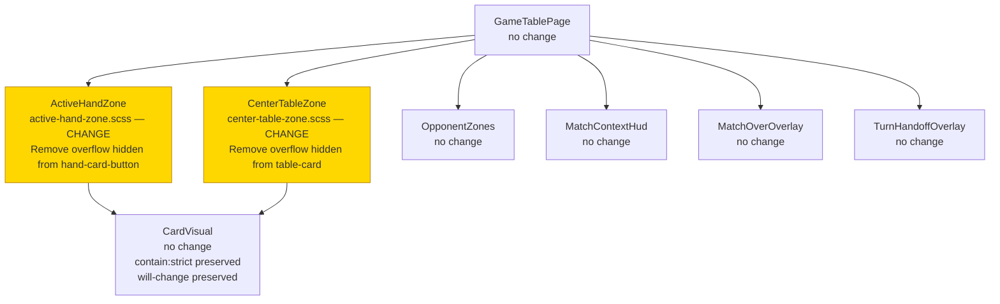
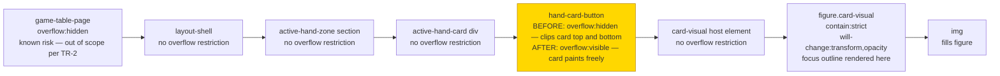
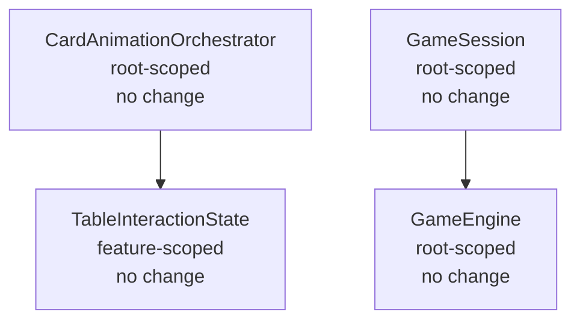

# Technical Design: Card Frame Clipping Fix

**Source Spec:** `docs/specs/ui/2-card-frame-clipping/`
**Based on:** proposal.md, spec.md, user-stories.md

---

## 1. Overview

This feature corrects visible card edge clipping in the active hand zone and center table zone of the Escobita game table. Card slot containers in those two zones declare overflow restrictions that prevent child content from rendering outside the container boundary. Because the card visual component uses CSS keyframe animations that intentionally translate and scale the card figure beyond its resting position, those overflow restrictions clip the card artwork and decorative effects at every animated keyframe where the card moves beyond the slot boundary.

The fix is **purely presentational CSS**. No TypeScript, no new components, no service changes, and no routing changes are required. Exactly two SCSS selectors are affected — one in the active hand zone stylesheet and one in the center table zone stylesheet. All five keyframe animations are already correctly authored; they become fully visible once the containing button elements stop restricting their paint area.

The keyboard focus ring behaviour is corrected as a natural consequence of the same overflow change, with no additional CSS required.

---

## 2. Architecture Diagrams

### 2.1 Component Tree

The diagram marks the two SCSS files that change. All other components are structurally unchanged.



### 2.2 Data Flow — CSS Rendering Chain, Hand Zone

The chain shows how the overflow restriction propagated before the fix and how it is removed. The equivalent chain in the center table zone is structurally identical, with the table-card button as the clipping site instead of hand-card-button.



### 2.3 Sequence Diagram — Deal Animation (Primary Flow)

```mermaid
sequenceDiagram
    participant ACO as CardAnimationOrchestrator
    participant AHZ as ActiveHandZone
    participant CV as CardVisual
    participant CSS as CSS Engine

    ACO->>AHZ: Emits dealIn animation group with per-card visual states
    AHZ->>CV: Passes dealIn visual state as input
    CV->>CSS: Applies animation CSS class to figure element
    CSS->>CSS: card-deal-slide keyframe runs — figure translates from above into rest position
    Note over CSS: BEFORE FIX — figure exceeds button boundary at peak upward translateY;<br/>button overflow:hidden clips card at top edge
    Note over CSS: AFTER FIX — button overflow:visible;<br/>figure paints at full extent outside button box at every keyframe
    CSS-->>CV: Card fully visible throughout entire animation
    CV-->>AHZ: Animation completes; card rests at natural position
```

### 2.4 Sequence Diagram — Keyboard Focus (Secondary Flow)

```mermaid
sequenceDiagram
    participant KB as Keyboard
    participant BTN as hand-card-button
    participant FIG as card-visual figure
    participant CSS as CSS Engine

    KB->>BTN: Tab focus arrives on button element
    BTN->>FIG: Browser applies :focus-visible state
    FIG->>CSS: Outline with 3-pixel outward offset renders outside figure border box
    Note over CSS: BEFORE FIX — outline extends 3px outside figure into button's<br/>overflow:hidden clipping zone; outline ring partially hidden
    Note over CSS: AFTER FIX — button overflow:visible;<br/>full outline ring paints unclipped on all four sides
    CSS-->>KB: Complete focus ring visible; no segment hidden at any edge
```

### 2.5 Service Dependency Diagram

No services are involved in this fix. The diagram confirms that the card animation orchestration chain is entirely unaffected.



### 2.6 Routing Diagram

**Omitted.** This fix introduces no new routes, no lazy-load boundaries, and no guards or resolvers. The game-board feature remains on the existing lazy-loaded "partida" route protected by `PartidaSessionGuard`. Nothing in the routing configuration changes.

---

## 3. Architectural Decisions

### AD-1: Scope Limited to Two Button-Level Overflow Declarations

- **Context:** Three sites in the game-board stylesheet tree declare `overflow: hidden` that are relevant to card rendering — the game-table-page container, the hand-card-button in the active hand zone, and the table-card button in the center table zone. The game-table-page overflow also has the potential to clip animations near zone boundaries, particularly the deal animation's starting translateY position.
- **Decision:** The fix changes only the overflow declaration on the hand-card-button and table-card selectors. The game-table-page overflow restriction is not modified.
- **Rationale:** TR-2 explicitly requires the overflow adjustment to be scoped to card slot containers within the active hand zone and center table zone only. Modifying the page container would exceed that constraint and risk unintended layout effects on adjacent regions. The page-level clipping is a separate concern documented as a known risk.
- **Consequences:** The two reported clipping sites are fully resolved. A residual risk remains that the deal animation's entry translateY, if large enough to fall outside the page container's box, may still exhibit a brief clip at the zone boundary during the first keyframe. This is documented in the Risk Assessment (section 14) and is deferred to a follow-up if testing reveals it to be visible in practice.
- **Requirement:** TR-2, FR-1, FR-2

---

### AD-2: No Explicit Z-Index Elevation for Animating Cards

- **Context:** When a hand card animates and overflows its button boundary, the card figure can visually overlap neighbouring card slots in the flex layout. FR-3 explicitly permits this overlap, provided adjacent card identity is not hidden.
- **Decision:** No explicit z-index elevation is applied to the animating card state. The natural stacking order established by `will-change: transform` on the card-visual figure is relied upon.
- **Rationale:** `will-change: transform` promotes the element to a GPU-composited layer, which creates an implicit stacking context. Within a flex layout, the promoted layer paints in source-order by default but visually above non-promoted siblings in the same stacking context. This is sufficient for the permitted overflow behaviour described in FR-3. Adding explicit z-index would tightly couple the card-visual animation state to the zone's stacking context, creating fragile cross-component dependencies that are unnecessary given the existing compositing model.
- **Consequences:** If a rare edge case reveals that in a specific browser the composited layer does not paint forward naturally, an isolated z-index addition to the animating state class in card-visual.scss would be the minimal and contained mitigation. No architectural rework would be required.
- **Requirement:** FR-3, FR-4

---

### AD-3: `contain: strict` on the Card-Visual Figure Is Preserved

- **Context:** The card-visual figure element declares `contain: strict`, which combines size, layout, paint, and style containment. Paint containment means that visual effects rendered by descendants of the figure are clipped to the figure's own border box. The focus outline and box-shadow glow effects are properties of the figure element itself, not its descendants, so they are not clipped by the figure's own paint containment boundary. The clipping problem exists at the button level, one level above the figure.
- **Decision:** `contain: strict` is not modified.
- **Rationale:** The containment declaration serves the animation performance goal stated in TR-5. It enables the browser to skip compositing and paint work for areas outside the figure's boundary during normal idle states. Relaxing it to `contain: layout style` (removing paint containment) would negate this benefit without addressing the actual clipping site. Since the focus outline and glow effects are rendered on the figure element itself rather than inside it, they are unaffected by the paint containment boundary.
- **Consequences:** All compositing and paint optimisations from `contain: strict` are preserved. `will-change: transform, opacity` and the existing GPU layer promotion remain in effect.
- **Requirement:** TR-5, NFR-1, NFR-2

---

### AD-4: Focus Indicator Visibility Is a Natural Consequence of the Overflow Fix

- **Context:** The focus-visible outline on the card-visual figure uses a 3-pixel solid outline with a 3-pixel outward offset. This causes the outline ring to render 3 pixels outside the figure's border box. Since the figure fills the button completely, the outline ring extends 3 pixels into the button's overflow-hidden clipping zone, which hides the ring segments that fall outside the button's layout box.
- **Decision:** No additional CSS changes are made for focus indicator visibility. The fix to hand-card-button and table-card overflow naturally unblocks the outline.
- **Rationale:** The focus styles in card-visual.scss are correctly authored. They require no modification. Introducing a separate focus-specific rule would be redundant and would add maintenance surface with no benefit.
- **Consequences:** After the fix, the full 3-pixel outline ring becomes visible on all four sides of each card slot when it receives keyboard focus. Existing accessibility tests that verify focus indicator presence may need to be updated to reflect that the indicator is now fully visible rather than partially visible.
- **Requirement:** FR-5, NFR-3, US-5

---

## 4. Component Architecture

### 4.1 ActiveHandZone

- **Type:** Smart (container)
- **Responsibility:** Renders the active player's hand cards as interactive selection buttons. Receives the full set of hand cards, per-card animation visual states from the card animation orchestrator, and the current selection state. Emits card selection toggle events.
- **Inputs:** Array of hand cards, per-card animation visual state metadata, current interaction phase, disabled state flag.
- **Outputs:** Card selection toggle event.
- **Children:** One hand-card-button element per card, each hosting a CardVisual component.
- **Change for this fix:** The hand-card-button selector in active-hand-zone.scss has its overflow restriction removed.

### 4.2 CenterTableZone

- **Type:** Smart (container)
- **Responsibility:** Renders the shared center table cards as interactive toggle buttons in a CSS grid layout. Receives table card data and animation state metadata. Emits card selection toggle events.
- **Inputs:** Array of center table cards, per-card animation visual state metadata, current interaction phase, ARIA multiselectable flag.
- **Outputs:** Card selection toggle event.
- **Children:** One table-card button per card, each hosting a CardVisual component.
- **Change for this fix:** The table-card selector in center-table-zone.scss has its overflow restriction removed.

### 4.3 CardVisual

- **Type:** Presentational
- **Responsibility:** The leaf rendering component for a single card. Applies animation CSS classes to both its host element and the inner figure element based on the visual state input it receives. Renders the card artwork image.
- **Inputs:** Visual animation state, selected state, face-down flag, test identifier.
- **Outputs:** None.
- **Change for this fix:** None. All keyframe definitions, `contain: strict`, `will-change`, selection styles, and focus-visible outline rules are unchanged.

### 4.4 All Other Components

GameTablePage, OpponentZones, MatchContextHud, A11yLiveRegion, PlayActionBar, TurnHandoffOverlay, MatchOverOverlay, and GameBoardPlaceholder are structurally and stylistically unchanged by this fix.

---

## 5. State Management

No state management changes. The card animation state lifecycle — computed by CardAnimationOrchestrator, distributed as signal-derived inputs through GameTablePage to each zone component, and consumed by CardVisual to apply CSS classes — is entirely unaffected. The overflow fix operates entirely within the CSS paint layer and has no relationship to Angular's reactivity model.

---

## 6. Service Layer

No services are introduced or modified by this fix.

### 6.1 CardAnimationOrchestrator (unchanged, referenced for context)

- **Scope:** Feature-scoped, provided in the game-board feature.
- **Responsibility:** Computes per-zone animation group metadata based on current game state transitions. Determines which card receives which visual state class at each phase of a turn.
- **Dependencies:** TableInteractionState, TurnPausePolicy.
- **Relevance:** This service determines when animation CSS classes are applied to CardVisual. The fix has no bearing on its logic; it only ensures that once those classes are applied, the resulting visual transforms render without clipping.

---

## 7. Routing

No routing changes. The game-board feature continues to load lazily on the "partida" path under the `PartidaSessionGuard` canMatch guard. The lobby remains at the empty path. No new routes, outlets, guards, or resolvers are introduced.

---

## 8. Data Model

No data model changes. The animation contracts model (visual state union types, group metadata shapes, per-zone participant records) is unchanged. The card domain model and all other domain types are unaffected.

---

## 9. API Integration

Not applicable. This is a purely presentational CSS fix with no backend API consumption, no data fetching, and no loading, error, or empty state handling involved.

---

## 10. Error Handling

Not applicable. There are no user-facing error states, no async operations, and no failure modes introduced by this fix. The change is a CSS property adjustment on two selectors.

---

## 11. Accessibility

The fix has a net positive effect on keyboard accessibility:

- **Focus indicator completeness:** Removing the overflow restriction from the button elements allows the card-visual figure's focus-visible outline to render fully on all four sides. No segment of the outline ring is clipped at any edge on either mobile or desktop viewports. This directly satisfies FR-5 and the accessibility acceptance criteria in US-5.
- **Touch target integrity:** The interactive area of each card slot is defined by the button element's layout box dimensions, which are set by width and height properties. The overflow setting does not influence the layout box size or the hit-testing boundary. Touch and click targets remain at their current minimum dimensions (TR-1).
- **Keyboard navigation order:** The DOM order of hand-card-button and table-card elements is unchanged. Tab order through the hand zone and table zone is unaffected.
- **ARIA attributes:** No ARIA roles, labels, or states are changed. The aria-pressed, aria-disabled, aria-label, and aria-multiselectable attributes on the zone and button elements remain in place.
- **Screen reader announcements:** The A11yLiveRegion component and its off-screen ARIA live region are entirely unaffected.
- **Prefers-reduced-motion:** The existing media query block in card-visual.scss that zeroes all animation and transition durations continues to function correctly. The overflow change does not introduce any new motion.

---

## 12. Performance Considerations

- **Paint containment preserved:** The `contain: strict` declaration on the card-visual figure (AD-3) is unchanged. The browser retains its ability to skip paint invalidation outside the figure's border box during idle states.
- **Composited layer preserved:** `will-change: transform, opacity` on the figure element is unchanged. GPU layer promotion for animated cards continues as before, maintaining the 60fps animation target on mobile (TR-5).
- **No layout recalculation risk:** Changing overflow from hidden to visible on a button element does not trigger a layout (reflow) pass. It affects only paint behaviour. The layout box of the button, the positions of all its siblings, and the zone container dimensions are all unaffected.
- **No new stacking contexts:** The fix does not introduce any new `transform`, `opacity`, `will-change`, or `isolation` declarations. The stacking context structure of the game table is unchanged.
- **Adjacent zone paint:** The opponent zone, HUD, overlays, and all other game table regions continue to paint independently within their own stacking contexts. Allowing overflow on the two button types does not expand the paint region of any zone beyond the zone section element.

---

## 13. Testing Strategy

### Unit Tests

No unit tests are required. The fix contains no TypeScript logic, no new components, no services, and no reactive state changes. There is no Angular unit-testable behaviour introduced.

### Visual and Integration Tests

The BDD scenarios in `docs/specs/ui/2-card-frame-clipping/bdd-test.md` define the full acceptance test surface. Key test areas:

- **Rest state visibility (SC-01 to SC-08):** Confirm no card edge truncation at rest on mobile and desktop viewports for both zones.
- **Animation overflow (SC-09 to SC-19):** Confirm no card clipping at any keyframe stage across all five animation types (deal, selection elevation, play-arc, escoba burst, capture fade) and at the minimum responsive container size.
- **Focus indicator completeness (SC-20 to SC-25):** Confirm the full four-sided focus ring is visible; confirm navigation order and absence of residual visual artefacts.
- **Non-regression (SC-26 to SC-29):** Confirm no unintended changes to the opponent zone, match-over overlay, or other table regions.

### Reduced-Motion

SC-14 and SC-19 validate that the prefers-reduced-motion fallback continues to function correctly and produces no clipping under any transition type.

### Testability Notes

Because the fix is CSS-only, automated visual regression tooling (screenshot diffing) provides the highest confidence. Manual QA review at representative mobile and desktop viewports is required for NFR-1, NFR-2, and NFR-3 sign-off.

---

## 14. Risk Assessment

| Risk                                                                                                          | Likelihood | Impact | Mitigation                                                                                                                                                                                                                                     |
| ------------------------------------------------------------------------------------------------------------- | ---------- | ------ | ---------------------------------------------------------------------------------------------------------------------------------------------------------------------------------------------------------------------------------------------- |
| game-table-page overflow:hidden clips deal animation at zone boundary (entry translateY exits page box)       | Low        | Low    | Noted as a known limitation per TR-2 scope constraint. If visual testing reveals it, a follow-up task targets the layout-shell layer only, scoped away from the full page boundary.                                                            |
| `will-change` composited-layer stacking does not naturally bring animating card forward in a specific browser | Low        | Low    | If observed, a z-index addition scoped to the animating state class in card-visual.scss resolves it without architectural impact.                                                                                                              |
| Removing overflow:hidden from buttons changes hit-testing behaviour in an older browser engine                | Very Low   | Medium | The layout box (hit-test area) is defined by width/height, not overflow. This is standard CSS behaviour across all modern browsers in the existing support matrix (TR-4). Manual touch-target testing on representative devices confirms TR-1. |
| `contain: strict` paint boundary clips glow effects at figure edge                                            | Very Low   | Low    | Analysis confirms that box-shadow and outline are properties of the figure itself, not its descendants, and are not clipped by the element's own paint containment. Visual QA at escoba burst peak scale validates this.                       |
