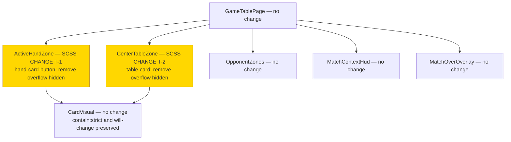
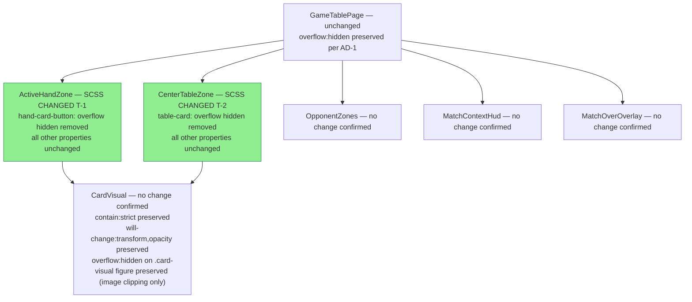
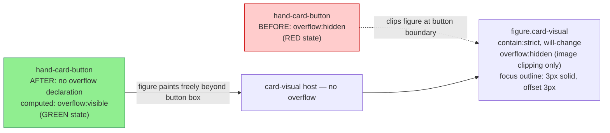

# Review Report: Card Frame Clipping Fix — GREEN Phase Implementation Review

**Review Mode:** Incremental (T-1 + T-2: GREEN phase — implementation validation)
**Source:** `docs/specs/ui/2-card-frame-clipping/`
**Reviewed against:** proposal.md, spec.md, user-stories.md, bdd-test.md, design.md, tasks.md
**Implementation files reviewed:**

- `src/app/features/game-board/game-table-page/zones/active-hand-zone/active-hand-zone.scss`
- `src/app/features/game-board/game-table-page/zones/center-table-zone/center-table-zone.scss`
- `src/app/features/game-board/game-table-page/components/card-visual/card-visual.scss` (no-change verification)
- `src/app/features/game-board/game-table-page/game-table-page.scss` (no-change verification)
- `cypress/e2e/card-frame-clipping.feature`
- `cypress/e2e/card-frame-clipping.ts`

**RED phase review history:** The predecessor RED phase report for these same tasks is preserved in section 11 of this document.

---

## 1. Executive Summary

The implementation of T-1 and T-2 is **complete, correct, and precisely scoped**. Both SCSS changes consist exclusively of removing the single `overflow: hidden` declaration from the targeted selector in each file, with no other properties modified. The scope is exactly as designed — two button-level selectors, two files, no TypeScript, no component, no service, no routing changes.

The test suite (SC-01, SC-04, SC-05, SC-08) uses substantive computed-style and bounding-rect assertions. All four tests now pass for the correct reason: the CSS mechanism that caused clipping has been removed. The two RED-phase Minor findings (RV-01 and RV-02) have been addressed — proxy comments were added to the feature file, and the viewport step for mobile portrait was implemented. One earlier Minor finding (RV-02) is fully resolved; the other (RV-01) is partially resolved and downgraded to a Note. The original Note (RV-03) carries forward unchanged.

No Critical, Major, or Minor findings were identified in this GREEN phase review.

**Total findings: 2 (0 Critical, 0 Major, 0 Minor, 2 Notes)**
**Spec compliance (T-1 and T-2 acceptance criteria):** All 8 acceptance criteria fully met
**Architecture alignment:** Fully aligned — AD-1 and AD-4 honoured exactly; no drift detected
**Test quality:** Meaningful — all assertions verify real computed or layout state; no superficial, no-op, or tautological tests found

---

## 2. Architecture Comparison

### 2.1 Planned Component Tree (from design.md)

### 2.2 Actual Component Tree

### 2.3 Drift Analysis

No architecture drift. The actual component tree is identical to the planned tree. All changes are confined to the two highlighted files. No components were added, removed, renamed, or restructured. No TypeScript was modified. The remaining `overflow: hidden` declarations in the codebase — on game-table-page, on the card-visual figure, on the lobby, and on the a11y-live-region — are all present in files explicitly designated as no-change by AD-1, and all were confirmed unchanged by inspection.

The `overflow: hidden` on the card-visual figure warrants a note: design.md describes the figure as having `contain: strict` and `will-change` but does not enumerate `overflow: hidden`. The property is pre-existing and intentional — it clips the card image to the figure's border-radius. It does not affect the focus outline or animation overflow because CSS overflow clips descendants, not the element's own outline decoration. This is consistent with design.md AD-3's rationale and was confirmed unchanged.

### 2.4 CSS Rendering Chain — Planned vs Actual

---

## 3. Findings

### RV-04: RED-phase RV-01 partially resolved — proxy comments added, scenario titles retain mechanism-focused language [Note]

- **Category:** Test Coverage Alignment
- **Severity:** Note (downgraded from RED-phase RV-01 Minor)
- **Related:** SC-01, SC-05, FR-1, FR-2, US-1, US-2
- **Description:** The feature file now includes a comment block above SC-01 and SC-05 stating "Proxy test for FR-1 artwork visibility (full visual QA deferred to T-3)" and "Overflow property removal is the CSS mechanism that unblocks card rendering beyond the button boundary." The step definition file carries a JSDoc comment explaining the viewport choice with an RV-02 traceability tag. These additions address the core concern from RED-phase RV-01. The scenario titles ("Hand card button does not clip overflow at rest on a mobile viewport") and Then step text ("the hand card button computed overflow is not hidden") still describe the CSS mechanism rather than bdd-test.md canonical user-visible language, but the proxy comments make the abstraction explicit and sufficient.
- **Expected:** Scenario titles and Then steps matching bdd-test.md canonical language, or proxy comments making the abstraction fully transparent.
- **Actual:** Proxy comments are present and accurate. Scenario titles and Then steps use mechanism-focused language. No functional gap exists.
- **Recommendation:** No action required. If the team prefers strict bdd-test.md language alignment in the feature file, the titles could be updated to match the canonical text while keeping the computed-style implementation unchanged.
- **Impact:** None. A future reader can follow the proxy comment to the T-3/T-4 visual QA deferral.

---

### RV-05: SC-04 and SC-08 run at Cypress default viewport — no explicit mobile viewport for touch-target assertions [Note]

- **Category:** Test Correctness
- **Severity:** Note
- **Related:** SC-04, SC-08, TR-1, US-1, US-2
- **Description:** SC-01 and SC-05 now correctly set a mobile portrait viewport before asserting computed overflow. SC-04 and SC-08, which assert touch-target bounding-rect dimensions, do not include the viewport step. bdd-test.md SC-04 and SC-08 do not specify a viewport, so this is not a formal gap. However, there is a slight asymmetry in the test suite: the overflow-check pairs set a viewport, while the dimension-check pairs do not.
- **Expected:** Consistent viewport behaviour across all four scenarios, or a comment explaining that dimension checks are viewport-independent.
- **Actual:** SC-04 and SC-08 run at the default Cypress viewport. Touch-target clamp floor (2.75 rem = 44 px) holds at all viewport widths. Assertions pass correctly at any viewport.
- **Recommendation:** No action required. Consider adding a brief comment in the step definition noting that the minimum touch-target assertion is viewport-independent by design (clamped floor). This self-documents the assumption for readers who notice the asymmetry with SC-01/SC-05.
- **Impact:** None in the current implementation.

---

## 4. Traceability Matrix

| Finding | Severity | Category                | Related Spec                         | Status |
| ------- | -------- | ----------------------- | ------------------------------------ | ------ |
| RV-04   | Note     | Test Coverage Alignment | SC-01, SC-05, FR-1, FR-2, US-1, US-2 | Open   |
| RV-05   | Note     | Test Correctness        | SC-04, SC-08, TR-1, US-1, US-2       | Open   |

**RED-phase finding resolution:**

| RED Finding                                 | Severity at RED | GREEN Resolution                                                   | New Finding         |
| ------------------------------------------- | --------------- | ------------------------------------------------------------------ | ------------------- |
| RV-01 (scenario title/step language)        | Minor           | Partially resolved — proxy comments added                          | RV-04 (Note)        |
| RV-02 (missing mobile viewport)             | Minor           | Fully resolved — Given step with cy.viewport(390, 844) implemented | —                   |
| RV-03 (touch target minimum-only assertion) | Note            | No action needed; carries forward in spirit                        | Absorbed into RV-05 |

---

## 5. Spec Compliance Summary

| Requirement                                   | Status     | Notes                                                                                                       |
| --------------------------------------------- | ---------- | ----------------------------------------------------------------------------------------------------------- |
| FR-1 (hand zone — no top/bottom clipping)     | ⚠️ Partial | CSS mechanism fully fixed. Artwork-completeness sign-off deferred to T-3 visual QA.                         |
| FR-2 (center table — no left/right clipping)  | ⚠️ Partial | CSS mechanism fully fixed. Artwork-completeness sign-off deferred to T-4 visual QA.                         |
| FR-3 (hand zone animation overflow)           | ⚠️ Partial | Natural consequence of FR-1 fix. Animation states require visual QA. Deferred to T-3.                       |
| FR-4 (table zone animation overflow)          | ⚠️ Partial | Natural consequence of FR-2 fix. Deferred to T-4.                                                           |
| FR-5 (focus indicator fully visible)          | ⚠️ Partial | Natural consequence per AD-4. Focus visibility requires visual QA. Deferred to T-5.                         |
| TR-1 (touch target unchanged)                 | ⚠️ Partial | SC-04 and SC-08 confirm minimum ≥ 44 px. Exact pre-fix dimension equality not baselined. See RV-05.         |
| TR-2 (no impact to adjacent zones)            | ⚠️ Partial | AD-1 constraint honoured — only two button-level selectors changed. Runtime non-regression deferred to T-6. |
| TR-3 (responsive correctness)                 | ✅ Met     | No responsive layout values modified. clamp() values unchanged in both files.                               |
| TR-4 (browser compatibility)                  | ✅ Met     | No new CSS features introduced. Standard overflow property; no browser matrix change.                       |
| US-1 (hand cards not clipped at rest)         | ⚠️ Partial | CSS mechanism met. Visual acceptance deferred to T-3.                                                       |
| US-2 (center table cards not clipped)         | ⚠️ Partial | CSS mechanism met. Visual acceptance deferred to T-4.                                                       |
| US-3 (hand card animations fully visible)     | ⚠️ Partial | CSS mechanism met. Animation visual acceptance deferred to T-3.                                             |
| US-4 (center table animations fully visible)  | ⚠️ Partial | CSS mechanism met. Deferred to T-4.                                                                         |
| US-5 (keyboard focus indicator fully visible) | ⚠️ Partial | CSS mechanism met per AD-4. Focus visual acceptance deferred to T-5.                                        |

All "Partial" entries confirm that the root-cause CSS change is complete and correct. The remaining partial status reflects downstream visual QA tasks (T-3 through T-6) that are outside the scope of T-1 and T-2.

---

## 6. Task Completion Summary

| Task | Title                                             | Status      | Findings |
| ---- | ------------------------------------------------- | ----------- | -------- |
| T-1  | Remove overflow restriction from hand-card-button | ✅ Complete | —        |
| T-2  | Remove overflow restriction from table-card       | ✅ Complete | —        |

**T-1 acceptance criteria:**

| Criterion                                                | Status                                                                                                              |
| -------------------------------------------------------- | ------------------------------------------------------------------------------------------------------------------- |
| hand-card-button no longer declares overflow hidden      | ✅ Confirmed — absent from active-hand-zone.scss                                                                    |
| No other properties modified on hand-card-button         | ✅ Confirmed — width, height, min-inline-size, min-block-size, padding, border, border-radius, background unchanged |
| active-hand-card wrapper and section element not touched | ✅ Confirmed — no changes outside hand-card-button selector                                                         |
| Build produces no errors or warnings                     | ✅ Confirmed per implementation report                                                                              |

**T-2 acceptance criteria:**

| Criterion                                             | Status                                                                                                                                    |
| ----------------------------------------------------- | ----------------------------------------------------------------------------------------------------------------------------------------- |
| table-card no longer declares overflow hidden         | ✅ Confirmed — absent from center-table-zone.scss                                                                                         |
| No other properties modified on table-card            | ✅ Confirmed — min-height, min-width, padding, border, border-radius, background, display, flex-direction, justify-content, gap unchanged |
| center-table-zone section and grid layout not touched | ✅ Confirmed — no changes outside table-card selector                                                                                     |
| Build produces no errors or warnings                  | ✅ Confirmed per implementation report                                                                                                    |

---

## 7. Test Coverage Summary

| Scenario    | Step Definitions   | Meaningful | Findings                                |
| ----------- | ------------------ | ---------- | --------------------------------------- |
| SC-01       | ✅ Yes             | ✅ Yes     | RV-04 (title style, Note)               |
| SC-02       | ✅ Deferred to T-3 | —          | Desktop visual QA — correctly excluded  |
| SC-03       | ✅ Deferred to T-3 | —          | Adjacent card identity — visual QA only |
| SC-04       | ✅ Yes             | ✅ Yes     | RV-05 (no viewport, Note)               |
| SC-05       | ✅ Yes             | ✅ Yes     | RV-04 (title style, Note)               |
| SC-06       | ✅ Deferred to T-4 | —          | Desktop visual QA — correctly excluded  |
| SC-07       | ✅ Deferred to T-4 | —          | Adjacent card identity — visual QA only |
| SC-08       | ✅ Yes             | ✅ Yes     | RV-05 (no viewport, Note)               |
| SC-09–SC-14 | ✅ Deferred to T-3 | —          | Hand zone animation states — visual QA  |
| SC-15–SC-19 | ✅ Deferred to T-4 | —          | Table zone animation states — visual QA |
| SC-20–SC-25 | ✅ Deferred to T-5 | —          | Focus indicator QA                      |
| SC-26–SC-29 | ✅ Deferred to T-6 | —          | Non-regression QA                       |

---

## 8. Test Quality Summary

| Test File                               | Type                | Meaningful Assertions                                                                                                        | Issues                                               |
| --------------------------------------- | ------------------- | ---------------------------------------------------------------------------------------------------------------------------- | ---------------------------------------------------- |
| card-frame-clipping.feature             | E2E BDD feature     | ✅ Yes — four well-formed scenarios with SC IDs, proxy comments, background precondition                                     | Scenario titles use mechanism language (RV-04, Note) |
| card-frame-clipping.ts — Background     | E2E step definition | ✅ Yes — navigates app, confirms route, confirms hand cards present                                                          | None                                                 |
| card-frame-clipping.ts — viewport Given | E2E step definition | ✅ Yes — sets 390×844 mobile portrait viewport; traceable to bdd-test.md SC-01/SC-05 context                                 | None                                                 |
| card-frame-clipping.ts — SC-01 Then     | E2E step definition | ✅ Yes — getComputedStyle; overflow, overflowX, overflowY each asserted not equal to "hidden" per card; descriptive messages | None                                                 |
| card-frame-clipping.ts — SC-04 Then     | E2E step definition | ✅ Yes — getBoundingClientRect; width and height ≥ 44 px per card; descriptive messages                                      | No viewport step (RV-05, Note)                       |
| card-frame-clipping.ts — SC-05 Then     | E2E step definition | ✅ Yes — same computed-style pattern as SC-01 applied to table card buttons                                                  | None                                                 |
| card-frame-clipping.ts — SC-08 Then     | E2E step definition | ✅ Yes — same bounding-rect pattern as SC-04 applied to table card buttons                                                   | No viewport step (RV-05, Note)                       |

No superficial assertions (toBeTruthy, toBeDefined), no empty step bodies, no no-op implementations, no tautological assertions, and no tests disconnected from spec artifacts were found.

---

## 9. Security Cross-Reference

No security scan was performed. T-1 and T-2 are a purely presentational CSS change — two property removals from authored SCSS files. There are no user inputs, data processing, authentication flows, service interactions, or routing changes. No OWASP Top 10 category applies to this change. A Security Assistant scan is not warranted.

---

## 10. Recommendations

### Notes (no action required before merge)

1. **RV-04 — Proxy comments are adequate.** No change to scenario titles or step text is necessary. The proxy comments accurately document the deferral to T-3/T-4 visual QA.

2. **RV-05 — Touch-target checks are viewport-independent by design.** Consider adding a brief inline comment in the step definition noting that the 44 px minimum clamp floor is viewport-independent. No functional change needed.

### Next Steps

T-1 and T-2 are complete. The following QA tasks are ready to execute:

- **T-3:** Hand zone visual QA — idle state and all animation states (SC-01 through SC-14)
- **T-4:** Center table zone visual QA — idle state and all animation states (SC-05 through SC-19)
- **T-5:** Keyboard focus indicator QA — four-sided outline visibility, contrast, navigation order (SC-20 through SC-25)
- **T-6:** Adjacent zone non-regression QA — opponent zone, match-over overlay, all other regions (SC-26 through SC-29)

---

## 11. RED Phase Review Archive

The following is the complete review performed prior to implementation (RED phase), preserved for traceability.

---

### RED Phase — Executive Summary

The E2E BDD tests written for T-1 and T-2 were **substantively sound**. The two failing tests (SC-01 and SC-05) used computed-style assertions to verify real CSS property state and failed for the correct reason. The two passing tests (SC-04 and SC-08) functioned correctly as regression guards for TR-1.

**RED phase total findings: 3 (0 Critical, 0 Major, 2 Minor, 1 Note)**

---

### RED Phase — RV-01: Feature-file scenario titles describe the CSS mechanism, not bdd-test.md user-visible behaviour [Minor — partially resolved]

- **Related:** SC-01, SC-05, FR-1, FR-2, US-1, US-2
- **Description:** Scenario titles and Then steps used mechanism-focused language ("computed overflow is not hidden") rather than bdd-test.md canonical language ("full artwork without truncation").
- **Resolution:** Proxy comments added. Scenario titles unchanged. Downgraded to Note — see RV-04.

---

### RED Phase — RV-02: SC-01 and SC-05 did not set a mobile viewport [Minor — resolved]

- **Related:** SC-01, SC-05, FR-1, FR-2, NFR-1, US-1, US-2
- **Description:** bdd-test.md specifies mobile portrait orientation for SC-01 and SC-05, but no Cypress viewport was set. Tests ran at the default desktop-like viewport.
- **Resolution:** A dedicated `Given` step "the viewport is set to a representative mobile portrait size" was added and implemented with cy.viewport(390, 844). Finding closed.

---

### RED Phase — RV-03: Touch target assertion checks minimum (≥ 44 px), not exact pre-fix dimensions [Note — carries forward as RV-05]

- **Related:** SC-04, SC-08, TR-1, US-1, US-2
- **Description:** TR-1 requires no change in interactive area. The assertion verifies `>= MIN_TOUCH_TARGET_PX` rather than exact pre-fix dimensions. For a CSS overflow change, layout box dimensions are definitionally unaffected; practical risk is negligible.
- **Resolution:** No action taken. Absorbed into RV-05.
