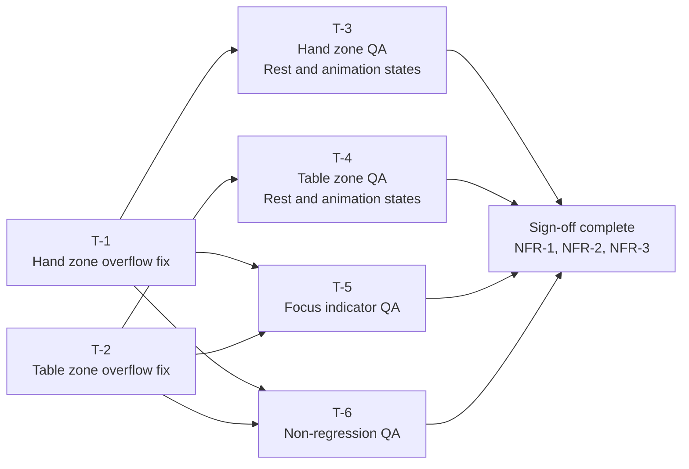

# Implementation Tasks: Card Frame Clipping Fix

**Source Design:** `docs/specs/ui/2-card-frame-clipping/design.md`

---

## Task Dependency Overview

T-1 and T-2 are independent of each other and can be implemented in either order or in parallel. All four QA tasks depend on at least one implementation task being complete. Sign-off requires all four QA tasks to pass.

---

## Tasks

### T-1: Remove Overflow Restriction from Hand Card Button

- **Description:** In the active hand zone stylesheet, locate the selector that targets the interactive button wrapping each hand card and remove the overflow hidden declaration from it. The button element's layout box dimensions and all other properties must remain unchanged. This is the primary fix for hand card clipping reported in FR-1 and FR-3.
- **Architectural Decision:** AD-1 (scope limited to button-level selectors), AD-4 (focus fix is a natural consequence).
- **Depends on:** None.
- **Components affected:** ActiveHandZone — its stylesheet only.
- **Acceptance criteria:**
  - [ ] The hand-card-button selector no longer declares overflow hidden after the change
  - [ ] No other properties on the hand-card-button selector are modified
  - [ ] The active-hand-card div wrapper and the active-hand-zone section element are not touched
  - [ ] The build produces no errors or warnings related to the modified file
- **Estimation hint:** XS
- **Spec traceability:** FR-1, FR-3, TR-1, TR-2, US-1, US-3
- **Status:** ✅ Implemented

---

### T-2: Remove Overflow Restriction from Table Card Button

- **Description:** In the center table zone stylesheet, locate the selector that targets the interactive button wrapping each table card and remove the overflow hidden declaration from it. The button element's minimum height, minimum width, and all other properties must remain unchanged. This is the primary fix for table card clipping reported in FR-2 and FR-4.
- **Architectural Decision:** AD-1 (scope limited to button-level selectors), AD-4 (focus fix is a natural consequence).
- **Depends on:** None.
- **Components affected:** CenterTableZone — its stylesheet only.
- **Acceptance criteria:**
  - [ ] The table-card selector no longer declares overflow hidden after the change
  - [ ] No other properties on the table-card selector are modified
  - [ ] The center-table-zone section element and its grid layout are not touched
  - [ ] The build produces no errors or warnings related to the modified file
- **Estimation hint:** XS
- **Spec traceability:** FR-2, FR-4, TR-1, TR-2, US-2, US-4
- **Status:** ✅ Implemented

---

### T-3: Visual QA — Hand Zone at Rest and During All Animation States

- **Description:** Perform visual acceptance testing of the active hand zone on both a representative mobile viewport (portrait orientation) and a representative desktop viewport. Validate all rest and animation states against the BDD scenarios SC-01 through SC-14. This includes idle state visibility, deal animation, selection elevation, play-arc peak, escoba burst peak scale, adjacent card identity during overflow, and the reduced-motion fallback across all hand animation types.
- **Architectural Decision:** AD-1, AD-2 (stacking order verified during overlap scenarios).
- **Depends on:** T-1.
- **Components affected:** ActiveHandZone — validated visually; no code changes expected.
- **Acceptance criteria:**
  - [ ] SC-01: No card edge truncation at the top or bottom on mobile at rest (NFR-1 satisfied)
  - [ ] SC-02: No card edge truncation at the top or bottom on desktop at rest (NFR-2 satisfied)
  - [ ] SC-03: All cards in a full hand are individually identifiable with no identity-obscuring overlap at rest
  - [ ] SC-04: Card slot touch and click target dimensions are confirmed unchanged from before the fix
  - [ ] SC-09: Deal animation card fully visible at peak upward translateY position
  - [ ] SC-10: Selection elevation card fully visible when shifted upward
  - [ ] SC-11: Play-arc card fully visible at arc peak
  - [ ] SC-12: Escoba burst card fully visible at peak scale — no edge or glow effect clipping observed
  - [ ] SC-13: Overflowing card is layered above neighbours; adjacent card identity is preserved
  - [ ] SC-14: Reduced-motion fallback transitions complete with no card edge clipping across all hand animation types
- **Estimation hint:** M
- **Spec traceability:** FR-1, FR-3, NFR-1, NFR-2, TR-1, TR-5, US-1, US-3

---

### T-4: Visual QA — Center Table Zone at Rest and During All Animation States

- **Description:** Perform visual acceptance testing of the center table zone on both a representative mobile viewport (portrait orientation) and a representative desktop viewport. Validate all rest and animation states against BDD scenarios SC-05 through SC-19. This includes idle state visibility, capture glow and fade animation, escoba burst peak scale, multi-card simultaneous capture, minimum responsive container size at the smallest supported mobile viewport, and the reduced-motion fallback.
- **Architectural Decision:** AD-1, AD-2.
- **Depends on:** T-2.
- **Components affected:** CenterTableZone — validated visually; no code changes expected.
- **Acceptance criteria:**
  - [ ] SC-05: No card edge truncation at the left or right on mobile at rest (NFR-1 satisfied)
  - [ ] SC-06: No card edge truncation at the left or right on desktop at rest (NFR-2 satisfied)
  - [ ] SC-07: All table cards in a full layout are individually identifiable at rest
  - [ ] SC-08: Table card slot touch and click target dimensions are confirmed unchanged
  - [ ] SC-15: Capture animation — captured card fully visible throughout glow and fade phases
  - [ ] SC-16: Escoba burst table card fully visible at peak scale — no edge or glow clipping
  - [ ] SC-17: Multi-card simultaneous capture — all cards animate without clipping and identity is preserved
  - [ ] SC-18: No clipping observed at the minimum responsive container size during a capture animation
  - [ ] SC-19: Reduced-motion fallback transitions complete with no card edge clipping for all table animation types
- **Estimation hint:** M
- **Spec traceability:** FR-2, FR-4, NFR-1, NFR-2, TR-1, TR-3, TR-5, US-2, US-4

---

### T-5: Keyboard Focus Indicator QA

- **Description:** Validate keyboard focus ring visibility across both zones and both viewport sizes against BDD scenarios SC-20 through SC-25. Navigate to each card slot using the keyboard and confirm the four-sided focus outline is fully visible, unclipped, and meets the contrast requirement from the existing accessibility baseline. Confirm navigation order is unchanged and no residual outline artefact remains after focus departure.
- **Architectural Decision:** AD-4 (focus visibility is a natural consequence of T-1 and T-2).
- **Depends on:** T-1, T-2.
- **Components affected:** ActiveHandZone and CenterTableZone — validated visually; no code changes expected.
- **Acceptance criteria:**
  - [ ] SC-20: Hand card focus ring fully visible on all four sides on mobile viewport
  - [ ] SC-21: Hand card focus ring fully visible on all four sides on desktop viewport
  - [ ] SC-22: Table card focus ring fully visible on all four sides on desktop viewport
  - [ ] SC-23: Focus ring contrast meets the existing accessibility baseline requirement (NFR-3 satisfied)
  - [ ] SC-24: Tab navigation order through all hand cards is sequential and unchanged
  - [ ] SC-25: No ghost outline or visual remnant remains on a card slot after focus moves away
- **Estimation hint:** S
- **Spec traceability:** FR-5, NFR-3, TR-1, US-5

---

### T-6: Adjacent Zone Non-Regression QA

- **Description:** Validate that zones outside the active hand and center table show no unintended visual changes after T-1 and T-2 are applied. Validate against BDD scenarios SC-26 through SC-29. This covers the opponent hand display, the match-over overlay, and all other game table regions on both mobile and desktop viewports.
- **Architectural Decision:** AD-1 (scope constraint — no other zones modified).
- **Depends on:** T-1, T-2.
- **Components affected:** None modified. OpponentZones, MatchOverOverlay, and other table regions are confirmed visually unchanged.
- **Acceptance criteria:**
  - [ ] SC-26: Opponent hand display shows no overflow bleed, layout shift, or new clipping on desktop
  - [ ] SC-27: Match-over overlay renders correctly with no visual difference from the pre-fix baseline
  - [ ] SC-28: All non-affected table regions show no new defects on mobile viewport
  - [ ] SC-29: All non-affected table regions show no new defects on desktop viewport
  - [ ] Game state progression, turn logic, and score display are unaffected (confirmed by completing a full round during QA)
- **Estimation hint:** S
- **Spec traceability:** TR-2, NFR-4, US-6

---

## Implementation Order

Recommended sequence considering the dependency graph, risk, and effort:

1. **T-1** — Hand zone overflow fix — Independent; start here. The hand zone is the primary focus of issue #2 and the higher-visibility fix.
2. **T-2** — Table zone overflow fix — Independent; can be done immediately after or in parallel with T-1.
3. **T-3** — Hand zone QA — Validate the hand zone fix fully before proceeding. The animation overflow scenarios (deal, escoba burst) are the highest-risk areas; surface any residual clipping early.
4. **T-4** — Table zone QA — Validate the table zone fix. Multi-card simultaneous capture at minimum container size is the highest-risk scenario.
5. **T-5** — Focus indicator QA — Both button fixes must be in place; validate both zones in one pass.
6. **T-6** — Non-regression QA — Final gate before sign-off; confirms no collateral impact from either fix.
