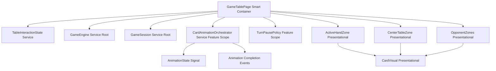
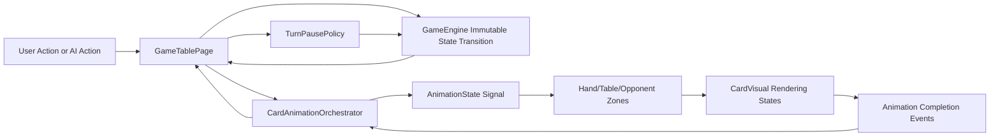
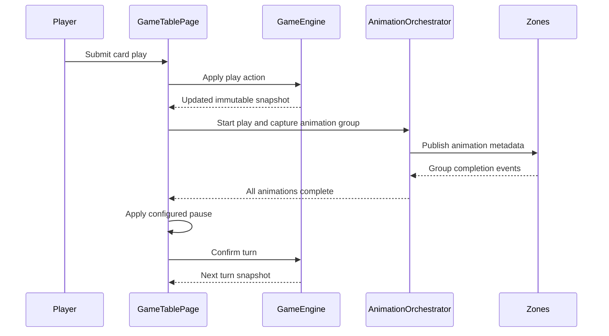
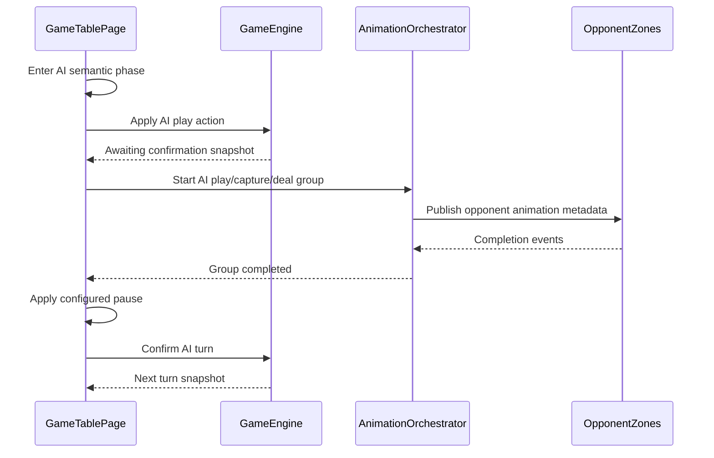
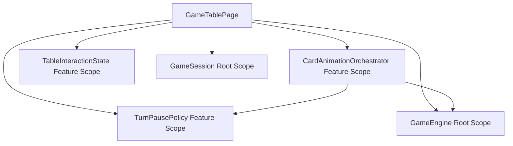
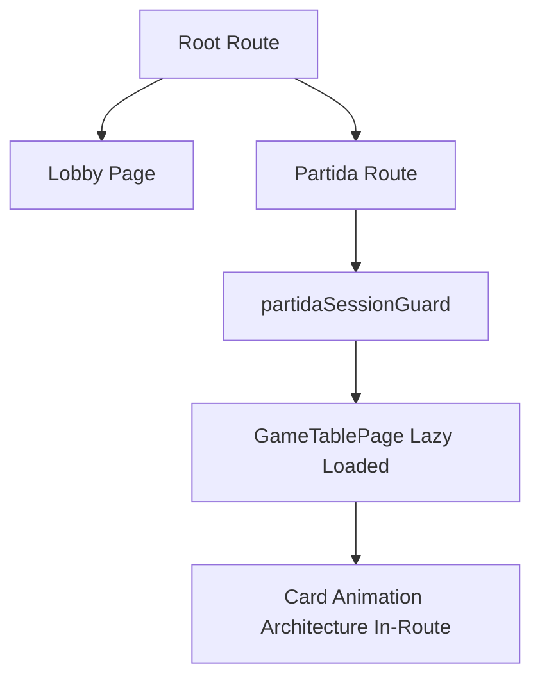

# Technical Design: Card Animation System

**Source Spec:** docs/specs/ui/card-animations/
**Based on:** proposal.md, spec.md, user-stories.md, bdd-test.md

## 1. Overview

This feature introduces a presentation-only card animation architecture for the existing game table flow. It keeps immutable game logic unchanged and adds a separate animation orchestration layer that coordinates card movement, capture effects, dealing effects, Escoba special effects, and turn-transition pauses. The design aligns with the current Angular 21 standalone and signals-first structure and preserves accessibility, responsiveness, and testability.

## 2. Architecture Diagrams

### 2.1 Component Tree

### 2.2 Data Flow

### 2.3 Sequence Diagram — Player Play and Capture Flow

### 2.4 Sequence Diagram — AI Turn with Completion-Driven Timing

### 2.5 Service Dependency Diagram

### 2.6 Routing Diagram

## 3. Architectural Decisions

### AD-1: Use a feature-scoped signal-driven animation orchestration service

- **Context:** The application already follows signals-first, immutable game state patterns.
- **Decision:** Add a dedicated CardAnimationOrchestrator service at game-table feature scope.
- **Rationale:** Keeps animation state isolated from domain state while preserving existing architecture conventions.
- **Consequences:** Adds one feature service and explicit animation lifecycle management.
- **Requirement:** FR-1, FR-2, FR-3, FR-5, FR-8, TR-1, TR-8, US-12.

### AD-2: Make animation completion the source of truth for phase progression

- **Context:** Fixed delays can drift from real animation completion and cause inconsistent UX.
- **Decision:** Advance turn flow from animation-group completion events, then apply configured pause.
- **Rationale:** Synchronizes UI transitions and state progression deterministically.
- **Consequences:** Requires robust completion/fallback logic for cancellation and DOM churn.
- **Requirement:** FR-7, FR-8, TR-4, TR-8, US-7, US-8, US-14.

### AD-3: Keep pauses runtime-configurable with explicit test override

- **Context:** E2E must stay stable while production keeps cinematic timing.
- **Decision:** Introduce feature-level pause policy configuration with test override capability.
- **Rationale:** Preserves production behavior and enables deterministic automation.
- **Consequences:** Requires policy plumbing and test environment wiring.
- **Requirement:** FR-7, TR-4, US-7, US-14.

### AD-4: Implement motion using transform and opacity only

- **Context:** Mobile 60fps target requires GPU-friendly animation properties.
- **Decision:** Restrict animations to translate, rotate, scale, and opacity.
- **Rationale:** Prevents layout thrash and improves cross-device smoothness.
- **Consequences:** Arc and burst effects must be composed with transform/opacity techniques.
- **Requirement:** TR-2, TR-7, NFR-1, US-10.

### AD-5: Preserve reduced-motion accessibility with instant state updates and retained pause

- **Context:** Motion-sensitive users need no movement; product also requires transition clarity.
- **Decision:** Reduced-motion disables motion timing while keeping transition pause behavior.
- **Rationale:** Satisfies accessibility and gameplay readability constraints.
- **Consequences:** Two timing modes must be tested and supported consistently.
- **Requirement:** TR-6, NFR-3, FR-7, US-9.

### AD-6: Escoba special effect includes mandatory burst-style emphasis

- **Context:** Escoba must be visually distinct and was explicitly confirmed as required.
- **Decision:** Include enhanced glow plus required burst-style visual on full table clear.
- **Rationale:** Differentiates special events from normal captures.
- **Consequences:** Adds dedicated Escoba animation profile and validations.
- **Requirement:** FR-6, NFR-7, US-6.

### AD-7: Opponent animation scope is single-player AI for this release

- **Context:** Multiplayer synchronization complexity is outside this release scope.
- **Decision:** Implement and validate full animation for AI opponent only.
- **Rationale:** Delivers requested behavior without expanding to network synchronization work.
- **Consequences:** Remote multiplayer animation remains future work.
- **Requirement:** FR-5, FR-8, US-5, US-8.

## 4. Component Architecture

### 4.1 GameTablePage

- **Type:** Smart container
- **Responsibility:** Orchestrates turn lifecycle, animation lifecycle, and pause policy.
- **Inputs:** Current game snapshot, turn phase, session mode, AI phase state.
- **Outputs:** User intents and phase transitions to game engine.
- **Children:** ActiveHandZone, CenterTableZone, OpponentZones, action controls and overlays.

### 4.2 ActiveHandZone

- **Type:** Presentational
- **Responsibility:** Renders hand cards and reflects selection and animation states.
- **Inputs:** Hand cards, selection metadata, animation metadata.
- **Outputs:** Card select or deselect intents.
- **Children:** CardVisual instances.

### 4.3 CenterTableZone

- **Type:** Presentational
- **Responsibility:** Renders table cards and capture highlighting or removal animation states.
- **Inputs:** Table cards, selected subset, capture animation metadata.
- **Outputs:** Table card toggle intents.
- **Children:** CardVisual instances.

### 4.4 OpponentZones

- **Type:** Presentational
- **Responsibility:** Renders AI opponent visual states, hand count deltas, and opponent animation cues.
- **Inputs:** Opponent summary state, AI animation phase, opponent animation metadata.
- **Outputs:** None for gameplay control.
- **Children:** CardVisual for visible played cards and indicators.

### 4.5 CardVisual

- **Type:** Presentational
- **Responsibility:** Atomic card rendering with visual states for selection, motion, glow, depth, and burst emphasis.
- **Inputs:** Card identity, face visibility, selected state, animation class metadata.
- **Outputs:** None.
- **Children:** None.

## 5. State Management

Game domain state remains in immutable GameEngine snapshots. Animation state is managed in a parallel signal graph under CardAnimationOrchestrator. Animation groups represent atomic visual transactions per action and track action type, participant cards, source and target zones, timing mode, and completion status. Turn progression listens to group completion and then applies pause policy. AI semantic phase state remains intact and is coordinated with animation completion events.

## 6. Service Layer

### 6.1 CardAnimationOrchestrator

- **Scope:** Feature scope at game table route component level.
- **Responsibility:** Build animation groups, publish animation metadata, collect completion events, expose animation state.
- **Dependencies:** TurnPausePolicy, read-only game state context.
- **Key methods:** Start action animation group, mark card completion, finalize group, cancel active group safely.

### 6.2 TurnPausePolicy

- **Scope:** Feature scope.
- **Responsibility:** Resolve effective pause durations for normal and test contexts.
- **Dependencies:** Feature configuration source.
- **Key methods:** Resolve effective pause, indicate test override state.

### 6.3 Reused GameEngine

- **Scope:** Root scope.
- **Responsibility:** Domain rules, snapshots, phase transitions.
- **Dependencies:** Existing domain collaborators.
- **Key methods:** Apply play action, confirm turn, derive phase and round transitions.

### 6.4 Reused TableInteractionState

- **Scope:** Feature scope.
- **Responsibility:** Selection and local interaction state.
- **Dependencies:** None significant.
- **Key methods:** Select or clear hand card, toggle table subset, reset transient interaction state.

## 7. Routing

No route additions are required. The existing partida route remains guarded and lazy loaded. Animation architecture is internal to the game-table feature and does not alter navigation contracts.

## 8. Data Model

The feature introduces animation transaction data in plain terms:

- Animation group identifier for one action lifecycle.
- Action category such as play, capture, deal, Escoba, or opponent play.
- Participating card identifiers.
- Source zone and destination zone markers.
- Timing profile markers including reduced-motion mode and effective duration band.
- Group status values such as queued, running, completed, canceled, or recovered.
- Completion counters for expected versus acknowledged participants.

Pause policy data includes:

- Minimum and maximum pause bands.
- Runtime test override marker.
- Effective pause chosen for current context.

## 9. API Integration

No backend endpoint changes are required. Animation behavior is local presentation orchestration layered over existing game-engine state transitions. Request or response structures are unaffected. Loading and empty state handling remains as-is for this feature.

## 10. Error Handling

Animation orchestration handles incomplete or interrupted flows using group-level recovery:

- If a participant completion signal is missing, a safe fallback finalizes the group.
- If DOM changes invalidate per-card tracking, reconciliation finalizes visible state to match domain state.
- If reduced-motion mode is active, instant completion path is used.
- If cancellation occurs during route or phase teardown, active groups are canceled and local animation state is reset.

## 11. Accessibility

The feature preserves keyboard focus order and focus visibility during all animation states. Reduced-motion preference disables movement and glow timing while preserving semantic outcomes and transition pause clarity. Visual emphasis states remain distinguishable without relying on motion alone.

## 12. Performance Considerations

The architecture is optimized for mobile and tablet targets by restricting animation properties to transform and opacity. Group orchestration minimizes repeated recalculation during active playback and limits simultaneous work to action-sized sets. Responsive path resolution occurs at action start boundaries and supports orientation-aware correction.

## 13. Testing Strategy

Unit and integration focus:

- Orchestrator group lifecycle and completion reconciliation.
- Pause policy resolution including test overrides.
- Reduced-motion mode behavior parity with normal mode outcomes.

E2E focus:

- Player play, capture, deal, Escoba, and AI turn visibility.
- Pause sequencing and completion-driven turn advancement.
- Responsive viewport behavior and keyboard safety.
- Performance and compatibility checks aligned with bdd-test scenarios.

## 14. Risk Assessment

| Risk                                               | Likelihood | Impact | Mitigation                                                             |
| -------------------------------------------------- | ---------- | ------ | ---------------------------------------------------------------------- |
| Completion events lost during DOM churn            | Medium     | High   | Group-level reconciliation and fallback completion finalization        |
| Timing flakiness in E2E                            | Medium     | High   | Runtime pause override and deterministic completion hooks              |
| Responsive path mismatch after orientation changes | Medium     | Medium | Recompute action geometry at action boundary and enforce fallback path |
| Mobile frame drops during multi-card actions       | Medium     | High   | Transform and opacity-only motion and constrained simultaneous effects |
| Reduced-motion divergence from normal outcomes     | Low        | High   | Shared orchestration path with timing-mode switch only                 |
| AI phase and animation timing drift                | Medium     | Medium | Completion-driven phase progression as source of truth                 |
