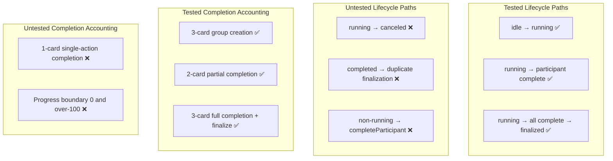

# Review Report: Card Animation System — T-1 Animation Domain Contracts (RED Phase)

**Review Mode:** Incremental (T-1: Define animation domain contracts) — Tests Only (RED Phase)
**Source:** `docs/specs/ui/card-animations/`
**Reviewed against:** spec.md, user-stories.md, bdd-test.md, design.md, tasks.md
**Focus file:** `src/app/features/game-board/services/card-animation-orchestrator.spec.ts`

## 1. Executive Summary

The test suite for the CardAnimationOrchestrator demonstrates solid baseline coverage of the happy-path orchestration lifecycle — group creation, participant completion tracking, and finalization. All five action categories are exercised, assertions are structural and meaningful (not superficial), and the test style is idiomatic Angular TestBed usage. However, several boundary conditions and edge cases required by T-1 acceptance criteria remain untested, including the 'canceled' lifecycle state, single-card completion accounting, progress clamping boundaries, duplicate finalization, and operations on non-running groups. These gaps mean the RED phase is incomplete for validating the full contract surface.

- Total findings: 7 (0 Critical, 3 Major, 3 Minor, 1 Note)
- T-1 acceptance criteria coverage: 2 of 3 fully met, 1 partially met
- Test meaningfulness: meaningful (no superficial assertions detected)
- Boundary coverage: incomplete

## 2. Architecture Comparison

### 2.1 Planned Contract Surface (from design.md and spec.md)

```mermaid
flowchart TD
  subgraph ContractTypes["Animation Domain Contracts"]
    AT[CardAnimationActionType<br/>play | capture | deal | escoba | opponent-play]
    GS[CardAnimationGroupStatus<br/>running | completed | canceled]
    P[CardAnimationParticipant<br/>cardId, progress, completed]
    G[CardAnimationGroup<br/>id, actionType, status, participantCards]
    S[CardAnimationState<br/>groups, activeGroupId, completedGroupIds]
    R[StartCardAnimationGroupRequest<br/>actionType, cardIds]
  end

  subgraph Lifecycle["Group Lifecycle"]
    L1[idle: no active group] --> L2[running: group started]
    L2 --> L3[completed: group finalized]
    L2 --> L4[canceled: group aborted]
  end

  subgraph Accounting["Completion Accounting"]
    A1[Single-card action: 1 participant]
    A2[Multi-card action: N participants]
    A3[All participants complete before finalization]
  end
```

### 2.2 Actual Test Coverage Map



### 2.3 Drift Analysis

The implementation file defines a 'canceled' status in the CardAnimationGroupStatus type union, but the service does not yet expose a cancel method. Since T-1 is about defining contracts, and the contract declares three lifecycle states (running, completed, canceled), the test suite should verify expectations around all three states — even if the cancel path is exercised via a future method, the contract shape and state transitions for 'canceled' should be documented through test intent.

No structural drift exists in what IS tested — the tests accurately reflect the implemented service API.

## 3. Findings

### RV-01: Missing 'canceled' lifecycle state test coverage [Major]

- **Category:** Test Coverage
- **Severity:** Major
- **Related:** AC-1 (lifecycle states documented and unambiguous), AD-1, TR-1
- **Description:** T-1 acceptance criterion AC-1 requires that "animation group lifecycle states are documented and unambiguous." The CardAnimationGroupStatus type defines three states: 'running', 'completed', and 'canceled'. The test suite only exercises transitions to 'running' and 'completed'. No test verifies the 'canceled' state contract or its expected behavior.
- **Expected:** At minimum, a test documenting the expected shape of a canceled group (status value, whether it appears in completedGroupIds, whether activeGroupId clears, whether lastCompletedGroupId updates).
- **Actual:** The 'canceled' status exists only as a type declaration. No test references or exercises it.
- **Recommendation:** Add a test that documents the expected contract for group cancellation — even if the cancel method is not yet implemented (T-12), the RED phase can assert the expected state shape when a group transitions to 'canceled'. This establishes the contract boundary.
- **Impact:** Without this test, the 'canceled' lifecycle path is undocumented in executable form, leaving ambiguity about its semantics (does it clear activeGroupId? does it appear in completedGroupIds?).

### RV-02: No single-card completion accounting test [Major]

- **Category:** Test Coverage
- **Severity:** Major
- **Related:** AC-3 (completion accounting for single and multi-card actions), TR-8, US-12
- **Description:** AC-3 explicitly requires "completion accounting expectations are defined for single and multi-card actions." All existing tests use 2-card or 3-card groups. No test verifies that a single-card group (one participant) correctly transitions through completion and finalization.
- **Expected:** A test creating a group with exactly one cardId, completing that single participant, and finalizing — verifying the full lifecycle for the minimum-size case.
- **Actual:** The test using 1-card (`cardIds: ['card-1']` in the unknown card test) only exercises the negative path (unknown card name). No test covers the positive single-card completion path.
- **Recommendation:** Add a dedicated test that starts a group with one card, completes that card, and finalizes the group — asserting the full state shape at each step.
- **Impact:** Single-card actions (a simple play without capture) are the most common animation action. Missing this boundary case leaves the minimum accounting path unverified.

### RV-03: Progress clamping boundary not tested [Major]

- **Category:** Test Quality
- **Severity:** Major
- **Related:** TR-1, US-12
- **Description:** The implementation contains explicit progress clamping logic (`Math.max(0, Math.min(100, progress))`), which is a defensive boundary relevant to the animation state contract. No test verifies that negative progress values are clamped to 0, or that values exceeding 100 are clamped to 100.
- **Expected:** Tests asserting that `completeParticipant(groupId, cardId, -10)` results in progress 0 and completed false, and that `completeParticipant(groupId, cardId, 150)` results in progress 100 and completed true.
- **Actual:** All tests pass progress value 100 (the happy path). The clamping logic is implemented but untested.
- **Recommendation:** Add boundary tests for progress values below 0 and above 100, verifying clamped values and the derived completed flag.
- **Impact:** Without boundary tests, a future refactor could accidentally remove the clamping logic, allowing invalid progress values to propagate into the animation state signal and cause unexpected behavior in zone rendering.

### RV-04: Duplicate finalization behavior undocumented [Minor]

- **Category:** Test Coverage
- **Severity:** Minor
- **Related:** TR-8, US-12
- **Description:** The implementation guards against duplicate entries in completedGroupIds (`state.completedGroupIds.includes(groupId)`), indicating an intentional idempotency decision. No test verifies that calling `finalizeGroup` twice on the same group produces the same result (no duplicate entries, no state corruption).
- **Expected:** A test calling `finalizeGroup(groupId)` twice and asserting completedGroupIds contains the groupId exactly once.
- **Actual:** Only single finalization is tested.
- **Recommendation:** Add a test documenting the idempotent finalization guarantee.
- **Impact:** Low immediate risk, but the defensive code lacks executable documentation of its intent.

### RV-05: completeParticipant on non-running group not tested [Minor]

- **Category:** Test Coverage
- **Severity:** Minor
- **Related:** TR-8, US-12
- **Description:** The implementation checks `group.status !== 'running'` before applying participant completion, silently ignoring updates to completed or canceled groups. No test verifies this guard behavior.
- **Expected:** A test that finalizes a group, then attempts to call completeParticipant on it, asserting the participant state remains unchanged.
- **Actual:** Only the running-group path for completeParticipant is tested.
- **Recommendation:** Add a test verifying that participant completion events are ignored for already-finalized groups.
- **Impact:** Without this test, the defensive guard lacks executable specification. A future change could accidentally process stale completion events.

### RV-06: lastCompletedGroupId not verified in initial state test [Minor]

- **Category:** Test Quality
- **Severity:** Minor
- **Related:** TR-1, TR-8
- **Description:** The first test verifies `animationState()` initial shape but does not assert `lastCompletedGroupId()` is null at initialization. This signal is a separate observable boundary of the contract. While the unknown-group test indirectly verifies it, the initial state test should be self-contained.
- **Expected:** The initial state test includes `expect(service.lastCompletedGroupId()).toBeNull()`.
- **Actual:** lastCompletedGroupId initial state is only verified as a side-effect in a different test.
- **Recommendation:** Add the assertion to the existing initial state test for explicit baseline documentation.
- **Impact:** Minimal — the gap is covered indirectly. But for RED phase contract clarity, each observable signal should have its baseline asserted in the dedicated initial-state test.

### RV-07: Multiple sequential groups not exercised [Note]

- **Category:** Test Coverage
- **Severity:** Note
- **Related:** AD-1, TR-1
- **Description:** No test starts a second group while the first is still running or after the first is finalized. The activeGroupId semantics when multiple groups exist are unverified.
- **Expected:** The contract for how activeGroupId behaves with overlapping or sequential groups should be documented through tests (e.g., starting a new group overwrites activeGroupId, previous groups remain in the groups array).
- **Actual:** All tests operate on a single group in isolation.
- **Recommendation:** Consider adding a test that starts two groups sequentially, verifying activeGroupId tracks the latest and both groups remain in the array.
- **Impact:** Low for T-1 scope (single group is the primary use case), but relevant for T-12 resilience and cancellation.

## 4. Traceability Matrix

| Finding | Severity | Category      | Related Spec      | Status |
| ------- | -------- | ------------- | ----------------- | ------ |
| RV-01   | Major    | Test Coverage | AC-1, AD-1, TR-1  | Open   |
| RV-02   | Major    | Test Coverage | AC-3, TR-8, US-12 | Open   |
| RV-03   | Major    | Test Quality  | TR-1, US-12       | Open   |
| RV-04   | Minor    | Test Coverage | TR-8, US-12       | Open   |
| RV-05   | Minor    | Test Coverage | TR-8, US-12       | Open   |
| RV-06   | Minor    | Test Quality  | TR-1, TR-8        | Open   |
| RV-07   | Note     | Test Coverage | AD-1, TR-1        | Open   |

## 5. Spec Compliance Summary (T-1 Scope)

| Requirement                                | Status     | Notes                                                                     |
| ------------------------------------------ | ---------- | ------------------------------------------------------------------------- |
| TR-1 (Animation State Signal)              | ⚠️ Partial | Signal contract tested for running/completed; 'canceled' state untested   |
| TR-8 (Animation Completion Signals)        | ⚠️ Partial | Completion signaling tested; boundary/edge conditions not covered         |
| US-12 (Animations Do Not Break Game Logic) | ✅ Met     | Isolation verified through independent signal state and readonly exposure |

## 6. Task Completion Summary

| Task | Title                             | Status     | Findings                                        |
| ---- | --------------------------------- | ---------- | ----------------------------------------------- |
| T-1  | Define animation domain contracts | ⚠️ Partial | RV-01, RV-02, RV-03, RV-04, RV-05, RV-06, RV-07 |

## 7. Test Coverage Summary (T-1 Relevant Scenarios)

| Scenario                                                   | Step Definitions    | Meaningful | Findings |
| ---------------------------------------------------------- | ------------------- | ---------- | -------- |
| SC-20 (Animation state updates do not alter rule outcomes) | ✅ Yes (unit-level) | ✅ Yes     | —        |
| SC-21 (Animation interruption preserves game consistency)  | ❌ No               | ❌ No      | RV-01    |

## 8. Test Quality Summary

| Test File                           | Type | Meaningful Assertions | Issues                                                  |
| ----------------------------------- | ---- | --------------------- | ------------------------------------------------------- |
| card-animation-orchestrator.spec.ts | Unit | ✅ Yes                | Boundary gaps (RV-01–RV-05), minor baseline gap (RV-06) |

## 9. Positive Observations

The following aspects of the test suite are well-executed:

- **Structural assertions:** Every test uses typed `toEqual<T>()` with full interface shape verification — no `toBeTruthy()` or partial matchers.
- **Action category coverage:** The `it.each` pattern cleanly exercises all five action types without duplication.
- **Negative path coverage:** Two tests cover unknown group and unknown card scenarios, documenting resilience boundaries.
- **Test isolation:** Each test starts fresh via TestBed, with no shared mutable state between tests.
- **Signal readonly exposure:** The test verifies that `animationState` is consumed as a readonly signal (via function call syntax).
- **Idiomatic style:** Tests follow Angular testing conventions with proper TestBed setup and inject pattern.

## 10. Recommendations

### Major (fix before RED phase is considered complete)

1. Add a test documenting the expected state shape for a 'canceled' group — covering whether it clears activeGroupId, whether it appears in completedGroupIds, and whether it updates lastCompletedGroupId.
2. Add a single-card group test covering the full lifecycle: start with one card → complete participant → finalize → verify state.
3. Add progress boundary tests: negative values clamped to 0 (completed: false), values over 100 clamped to 100 (completed: true).

### Minor (improvement)

1. Add duplicate finalization idempotency test.
2. Add completeParticipant-on-non-running-group guard test.
3. Add `lastCompletedGroupId()` null assertion to the initial state test.

### Notes (informational)

1. Sequential/overlapping group behavior can be deferred to T-12 if deemed out of T-1 contract scope.
