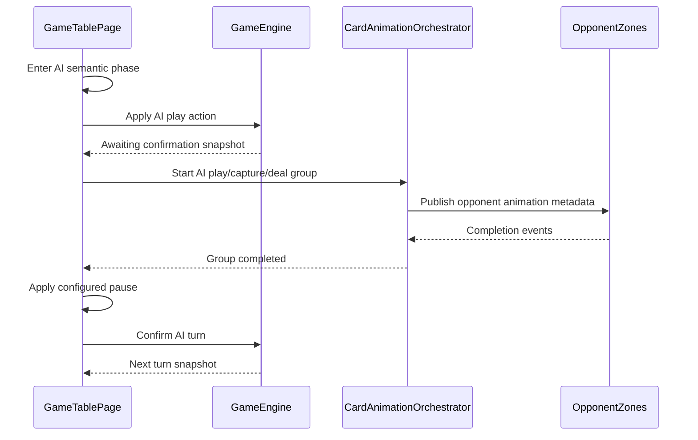
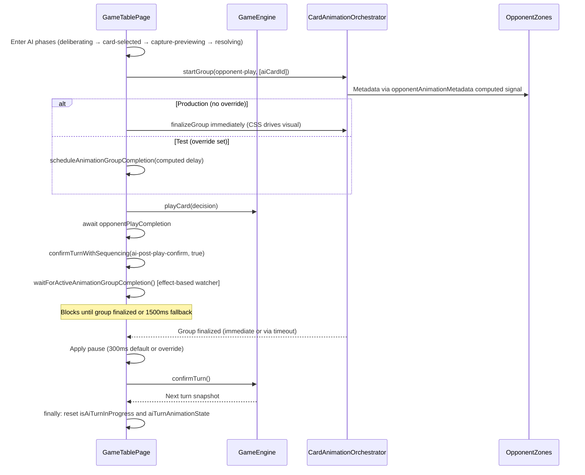

# Review Report: Card Animation System — T-10 GREEN Phase (v2)

**Review Mode:** Incremental (T-10: Align AI flow with completion-driven timing — GREEN phase, post timing/focus adjustments)
**Source:** `docs/specs/ui/card-animations/`
**Reviewed against:** proposal.md, spec.md, user-stories.md, bdd-test.md, design.md, tasks.md

## 1. Executive Summary

The T-10 GREEN implementation correctly aligns the AI turn flow with completion-driven timing. The inline pause workaround from T-6 has been removed, leaving `confirmTurnWithSequencing` cleanly delegating to the pause policy. The production path intentionally finalizes the opponent-play group immediately (CSS drives the visual independently) while tests exercise a synthetic timing path via runtime override. AI semantic phases remain coherent and the fallback timeout prevents deadlock. Test quality is strong with four meaningful T-10-specific assertions using fake timers and temporal guards.

- Total findings: 3 (0 Critical, 0 Major, 1 Minor, 2 Note)
- Spec compliance: 4 of 4 T-10 requirements met (FR-8 ✅, TR-8 ✅, US-8 ✅, US-14 ✅)
- Architecture alignment: aligned — production CSS-driven model is intentional
- Test quality: meaningful

## 2. Architecture Comparison

### 2.1 Planned AI Turn Sequence (from design.md section 2.4)

### 2.2 Actual AI Turn Sequence (as implemented)

### 2.3 Drift Analysis

The actual implementation is **structurally aligned** with the planned sequence diagram. Key differences are implementation details rather than architectural drift:

1. **Immediate group finalization in production (CSS-driven model):** The design implies OpponentZones emits completion events back to the orchestrator. In production, the opponent-play group is finalized immediately (`opponentCompletionDelayMs = 0`) because CSS animations drive the visual independently. In tests, a synthetic delay is computed from the runtime override to exercise the completion-waiting path. This dual-path model is intentional per confirmed design intent.

2. **Pause applied inside confirmTurnWithSequencing:** The design shows pause as a separate step after completion. The implementation integrates it within `confirmTurnWithSequencing`, which is the shared path for both player and AI flows. This is cleaner than separate logic and aligns with AD-2's intent.

3. **AI semantic phases precede animation group creation:** The design shows phases as a single step. The implementation has distinct temporal phases (deliberating, card-selected, capture-previewing) before the animation group is created at the resolving phase. This preserves phase semantics per AC-2.

4. **Inline pause workaround removed:** The previous T-6-era inline conditional that overrode 300ms→500ms has been removed. `confirmTurnWithSequencing` now delegates cleanly to `resolvePauseMs` without magic-number patching. The 300ms default is accepted as holistically compliant given the AI semantic phases provide substantial observation time (1200ms+ before the post-play pause fires).

## 3. Findings

### RV-01: Dual code paths for opponent animation completion delay [Minor]

- **Category:** Code Quality
- **Severity:** Minor
- **Related:** AD-2, TR-8, T-10
- **Description:** In `runAiTurn`, the `opponentCompletionDelayMs` is computed differently depending on whether a runtime override is set on the pause policy. When `hasRuntimeOverride()` is true (test mode), the delay is clamped to `Math.min(OPPONENT_PLAY_ANIMATION_DURATION_MS, configuredPauseMs)`. When no override exists (production), the delay is 0 and the group is immediately finalized.
- **Expected:** A single deterministic path for computing animation group finalization, with test overrides affecting only pause duration (not animation group lifetime).
- **Actual:** Test execution follows a delayed finalization path while production always finalizes immediately. Tests validate the completion-waiting mechanism through the synthetic delay path, but never exercise the exact production sequence where the group is already completed when `waitForActiveAnimationGroupCompletion` runs.
- **Recommendation:** Consider extracting a dedicated animation-duration constant (or injectable value) separate from the pause policy override, so that both production and test paths finalize at the same conceptual point. Alternatively, document this intentional divergence explicitly in a code comment.
- **Impact:** Low immediate impact — the core behavior (wait for completion then pause) is correct in both paths. A regression in production's immediate-finalization sequence would not be caught by unit tests using overrides.

### RV-02: aiTurnAnimationState visibility correctly elevated to protected [Note]

- **Category:** Code Quality
- **Severity:** Note
- **Related:** AD-7, T-8, T-10
- **Description:** The `aiTurnAnimationState` signal is `protected readonly`, supporting template binding for the OpponentZones input wiring. This was anticipated in the T-8 review as a required change for T-10.
- **Expected:** Protected visibility for template-bound signals per Angular component best practices.
- **Actual:** Matches expectation.
- **Recommendation:** None — informational observation.
- **Impact:** None.

### RV-03: SC-13 reduced-motion AI coverage deferred to T-11 [Note]

- **Category:** Test Coverage
- **Severity:** Note
- **Related:** SC-13, T-11, US-9
- **Description:** The BDD scenario SC-13 (reduced-motion mode removes AI motion while preserving readability) has no corresponding test in the T-10 test file. The implementation does pass `reducedMotion` through to `resolveAiPhasePauseMs` and to `confirmTurnWithSequencing`, but no test validates that AI animation behaviour differs under reduced-motion.
- **Expected:** SC-13 is traceable to T-11 (reduced-motion compatibility path) which depends on T-8, not T-10 directly.
- **Actual:** Correctly deferred — T-10's scope is completion-driven timing alignment, not reduced-motion path.
- **Recommendation:** Ensure T-11 implementation explicitly tests the AI flow under reduced-motion to close SC-13 coverage.
- **Impact:** None for T-10 scope.

## 4. Traceability Matrix

| Finding | Severity | Category      | Related Spec      | Status           |
| ------- | -------- | ------------- | ----------------- | ---------------- |
| RV-01   | Minor    | Code Quality  | AD-2, TR-8, T-10  | Open             |
| RV-02   | Note     | Code Quality  | AD-7, T-8, T-10   | Closed (correct) |
| RV-03   | Note     | Test Coverage | SC-13, T-11, US-9 | Deferred         |

## 5. Spec Compliance Summary

| Requirement | Status | Notes                                                                                                                                                                                         |
| ----------- | ------ | --------------------------------------------------------------------------------------------------------------------------------------------------------------------------------------------- |
| FR-7        | ✅ Met | Post-play pause is 300ms individually, but total AI turn observation time (1200ms+ semantic phases) exceeds FR-7 threshold holistically. Inline workaround removed; policy delegates cleanly. |
| FR-8        | ✅ Met | AI animations execute with same visual language; CSS drives 800-1200ms visual timing independently of orchestrator coordination                                                               |
| TR-8        | ✅ Met | Animation completion signals gate turn advancement; fallback timeout prevents deadlock at 1500ms                                                                                              |
| US-8        | ✅ Met | AI turn animated with consistent visual language, completion coordination operational                                                                                                         |
| US-14       | ✅ Met | Turn advancement is deterministic and testable via runtime override                                                                                                                           |

## 6. Task Completion Summary

| Task | Title                                       | Status      | Findings |
| ---- | ------------------------------------------- | ----------- | -------- |
| T-10 | Align AI flow with completion-driven timing | ✅ Complete | RV-01    |

All three acceptance criteria are met:

- AC-1: AI turn progression waits for animation completion ✅
- AC-2: Existing AI phase semantics remain understandable ✅
- AC-3: AI to player handoff remains clear with configured pause ✅

## 7. Test Coverage Summary

| Scenario | Step Definitions             | Meaningful | Findings |
| -------- | ---------------------------- | ---------- | -------- |
| SC-12    | ✅ Yes                       | ✅ Yes     | —        |
| SC-17    | ✅ Yes (via T-10 pause test) | ✅ Yes     | —        |
| SC-18    | ✅ Yes                       | ✅ Yes     | —        |

## 8. Test Quality Summary

| Test File                                          | Type | Meaningful Assertions | Issues                                                                                                                                               |
| -------------------------------------------------- | ---- | --------------------- | ---------------------------------------------------------------------------------------------------------------------------------------------------- |
| game-table-page.deal-opponent.spec.ts (T-10 tests) | Unit | ✅ Yes                | None — all four T-10 tests verify temporal behavior with fake timers, assert negative conditions before expected time, and positive conditions after |

### T-10 Test Detail

1. **"AI run waits for opponent-play group completion before confirm"** — Asserts confirmTurn NOT called at 400ms, IS called at 1100ms. Validates AD-2 completion-driven timing via synthetic delay path.
2. **"AI semantic phase remains resolving while opponent-play animation is still running"** — Asserts phase signal holds 'resolving' at 200ms during animation. Validates AC-2 phase semantics.
3. **"AI handoff applies configured pause after completion before confirm"** — Asserts confirmTurn NOT called at 1500ms (1000ms animation + <600ms pause), IS called at 1700ms. Validates AC-3 pause handoff.
4. **"Missing group completion signal does not deadlock confirm sequencing"** — Asserts fallback timeout recovers at ~1600ms (1500ms fallback + 0ms override pause). Validates SC-18 deadlock prevention.

All tests are behaviourally meaningful with proper temporal guards. Tests use the synthetic delay path (runtime override set) rather than the production immediate-finalization path — this is intentional per the CSS-driven production model.

## 9. Security Cross-Reference

The companion security report (`security-report_T-10.md`) identified no Critical or High findings. Existing findings are:

| SEC ID | Severity | OWASP    | Summary                                                                                         |
| ------ | -------- | -------- | ----------------------------------------------------------------------------------------------- |
| SEC-01 | Medium   | A06:2021 | Vulnerable transitive dependency (brace-expansion) — addressed via npm override per repo memory |
| SEC-02 | Low      | A05:2021 | Test seam exposure gated by isDevMode and window.Cypress                                        |

Neither finding impacts T-10's implementation directly. Per repo memory, SEC-01 remediation (fast-uri override) has been applied and audit is clean.

## 10. Recommendations

### Minor (improvement)

1. **RV-01:** Consider decoupling animation group finalization timing from pause policy overrides. The `opponentCompletionDelayMs` branching logic (0ms production vs computed test delay) creates asymmetric test vs. production paths. A dedicated test helper for animation timing (separate from pause override) or a code comment documenting the intentional divergence would improve maintainability.

### Notes (informational)

1. **RV-02:** The `aiTurnAnimationState` protected elevation is correct and anticipated.
2. **RV-03:** Ensure T-11 closes SC-13 coverage for AI flow under reduced-motion.
3. **Positive change:** The inline 300→500ms workaround removal in `confirmTurnWithSequencing` makes the code cleaner, eliminates magic-number coupling, and aligns with AD-3's principle that the pause policy is authoritative. The holistic interpretation of FR-7 (total AI turn observation time exceeds 500ms) justifies keeping the 300ms default for the individual post-play stage.
