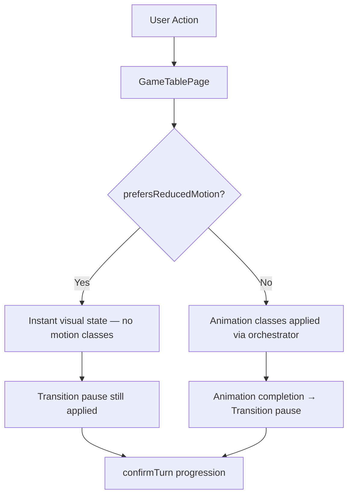
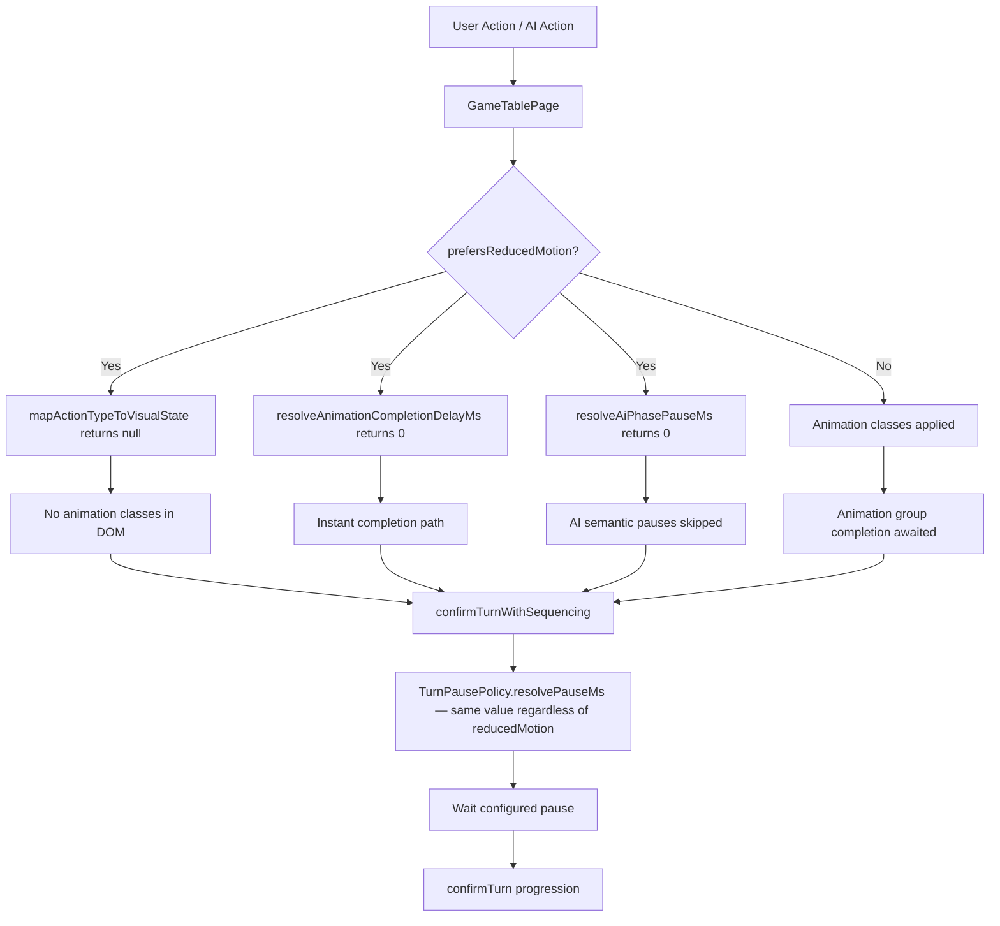

# Review Report: Card Animation System — T-11 Reduced-Motion Compatibility (GREEN Phase)

**Review Mode:** Incremental (T-11: Implement reduced-motion compatibility path)
**Source:** `docs/specs/ui/card-animations/`
**Reviewed against:** proposal.md, spec.md, user-stories.md, bdd-test.md, design.md, tasks.md

## 1. Executive Summary

The GREEN implementation of T-11 is **well-aligned** with AD-5 and fully meets all three acceptance criteria. A dual-layer approach provides robust reduced-motion support: TypeScript suppresses animation class application at the orchestration boundary (`mapActionTypeToVisualState` returns `null`), and a CSS `@media (prefers-reduced-motion: reduce)` rule zeroes all animation timing as defense-in-depth. Transition pause behavior is correctly preserved through TurnPausePolicy returning identical values regardless of the `reducedMotion` flag.

- Total findings: 5 (0 Critical, 0 Major, 3 Minor, 2 Note)
- Spec compliance: 4 of 4 requirements fully met (TR-6, NFR-3, FR-7, US-9)
- Architecture alignment: Aligned with AD-5
- Test quality: Meaningful — all T-11 tests verify genuine behaviour

## 2. Architecture Comparison

### 2.1 Planned Reduced-Motion Path (AD-5 from design.md)

### 2.2 Actual Reduced-Motion Path (as implemented)

### 2.3 Drift Analysis

Architecture is **aligned**. The implementation faithfully delivers AD-5's two mandates:

1. **Motion disabled**: `mapActionTypeToVisualState()` returns `null` under reduced-motion, preventing any animation class from reaching the DOM. The CSS media query provides a safety net.
2. **Pause retained**: `TurnPausePolicy.resolvePauseMs()` returns the same configured pause regardless of the `reducedMotion` flag, ensuring turn clarity is preserved.

One minor deviation: the design envisioned "instant state updates" generically, but the implementation also zeroes AI semantic pauses (`resolveAiPhasePauseMs` returns 0), making AI turns effectively instantaneous. This is acceptable per SC-13 ("AI visual updates occur instantly without motion") but goes slightly beyond "no motion" into "no AI deliberation pauses." The transition pause at confirm boundaries still applies, maintaining readability.

## 3. Findings

### RV-01: CSS reduced-motion rule does not explicitly declare end-state values [Minor]

- **Category:** Code Quality
- **Severity:** Minor
- **Related:** AD-5, TR-6, NFR-3
- **Description:** The `@media (prefers-reduced-motion: reduce)` rule in card-visual.scss only zeroes `transition-duration`, `animation-duration`, `animation-delay`, and `animation-iteration-count`. It does not explicitly set final-state `opacity` and `transform` values for animation classes.
- **Expected:** Per TR-6, "Cards instant-teleport to final positions (no transition duration, opacity changes instant)." A fully robust CSS fallback would also declare `opacity: 1; transform: none;` for non-disappearing classes and `opacity: 0` for capture/escoba classes.
- **Actual:** The CSS zeroes timing only. End-state values are inherited from the class declarations (e.g., `.card-visual--animation-capture` still has `opacity: 0; transform: scale(0.5)` declared as the resting state). With `animation-duration: 0ms` and `animation-fill-mode: both`, the browser jumps to the 100% keyframe instantly — which matches final state for most classes.
- **Recommendation:** Since the primary mechanism (`mapActionTypeToVisualState` returning `null`) prevents class application entirely, this is defense-in-depth only. However, adding explicit end-state declarations in the media query would make intent clearer and protect against future changes that might bypass the TypeScript guard.
- **Impact:** Minimal practical impact. If a future code path applies animation classes without going through `mapActionTypeToVisualState`, the `animation-fill-mode: both` with 0ms duration would still jump to keyframe end-state. The only risk scenario is capture/escoba classes where the declared base state (`opacity: 0`) matches the desired end-state anyway.

### RV-02: Three tests misattributed to T-11 with non-existent FR-9.x references [Minor]

- **Category:** Test Coverage Alignment
- **Severity:** Minor
- **Related:** T-11, T-10
- **Description:** Three tests in game-table-page.spec.ts (lines 2735, 2788, 2840) are labeled `T-11 / FR-9.1`, `T-11 / FR-9.2`, and `T-11 / FR-9.3`. They test AI live-region announcements (placement, capture count, escoba), which are accessibility features unrelated to reduced-motion.
- **Expected:** These tests exercise AI turn announcement logic, which belongs to T-10 (AI flow orchestration) or T-13 (accessibility verification). No `FR-9` requirement exists in spec.md.
- **Actual:** Tests are meaningful and pass, but their task/requirement attribution is incorrect.
- **Recommendation:** Re-label these tests with correct task attribution (likely T-10 or T-13) and valid spec references (NFR-2 for accessibility, FR-8 for AI flow).
- **Impact:** Misleading traceability. Someone reviewing T-11 coverage would count three extra tests that don't validate reduced-motion behaviour, inflating apparent coverage.

### RV-03: E2E scenarios SC-03, SC-06, SC-09, SC-13 have no feature file implementations [Minor]

- **Category:** Test Coverage Alignment
- **Severity:** Minor
- **Related:** SC-03, SC-06, SC-09, SC-13, T-16
- **Description:** The BDD spec defines four reduced-motion alternative path scenarios (SC-03 for play, SC-06 for capture, SC-09 for deal, SC-13 for AI motion). None appear in the E2E feature files. Only SC-16 (escoba) and SC-19 (transition pause) have E2E implementations for reduced-motion.
- **Expected:** Full BDD scenario coverage at E2E level for reduced-motion paths.
- **Actual:** Unit tests in game-table-page.spec.ts and game-table-page.deal-opponent.spec.ts cover the equivalent behaviour at integration level. E2E feature files omit these scenarios.
- **Recommendation:** This gap is properly scoped to T-16 (E2E scenario alignment) per the task dependency graph. No action needed for T-11 acceptance, but the gap should be tracked.
- **Impact:** Low immediate risk. Unit tests validate the orchestration layer. E2E gap means no browser-level validation of CSS media query interaction with the full rendering pipeline in reduced-motion mode.

### RV-04: TurnPausePolicy accepts reducedMotion parameter but uses identical logic for both paths [Note]

- **Category:** Code Quality
- **Severity:** Note
- **Related:** AD-5, T-3
- **Description:** `TurnPausePolicy.resolvePauseMs()` accepts `{ reducedMotion: boolean }` in its options but the method body returns the same value regardless of the flag. Both branches (lines 33-37) are identical.
- **Expected:** AD-5 mandates that transition pause is preserved under reduced-motion, which is exactly what this achieves.
- **Actual:** The parameter exists for future extensibility and makes the intent explicit at call sites, but the dead branch may confuse future developers.
- **Recommendation:** This is a deliberate design choice per AD-5 and correctly communicates intent at call sites. No change needed, but a brief code comment noting the intentional identity would aid maintainability.
- **Impact:** None. Behaviour is correct.

### RV-05: AI semantic pauses completely zeroed in reduced-motion mode [Note]

- **Category:** Spec Compliance
- **Severity:** Note
- **Related:** AD-5, SC-13, US-9
- **Description:** `resolveAiPhasePauseMs()` returns 0 when `reducedMotion` is true, meaning AI deliberation, selection preview, and capture preview pauses are all skipped. The AI turn resolves near-instantaneously except for the transition pause at confirm.
- **Expected:** SC-13 states "AI visual updates occur instantly without motion" and "the player can still clearly understand the AI action result." US-9 says "A brief pause (500–800ms) is still applied between actions for clarity."
- **Actual:** The transition pause at `confirmTurnWithSequencing` is preserved (via TurnPausePolicy), satisfying the US-9 requirement. But the AI's "thinking" phases are zero-delay, so the AI turn feels instantaneous up to the confirm boundary.
- **Recommendation:** This is spec-compliant and acceptable. The confirm-boundary pause preserves readability. If user feedback indicates AI turns feel too instant in reduced-motion, the AI semantic pause path could retain a small non-motion pause, but this is a future consideration outside T-11 scope.
- **Impact:** None. Current behaviour is consistent with SC-13 and US-9.

## 4. Traceability Matrix

| Finding | Severity | Category        | Related Spec                     | Status                  |
| ------- | -------- | --------------- | -------------------------------- | ----------------------- |
| RV-01   | Minor    | Code Quality    | AD-5, TR-6, NFR-3                | Open                    |
| RV-02   | Minor    | Test Coverage   | T-10, T-11                       | Open                    |
| RV-03   | Minor    | Test Coverage   | SC-03, SC-06, SC-09, SC-13, T-16 | Open (deferred to T-16) |
| RV-04   | Note     | Code Quality    | AD-5, T-3                        | Informational           |
| RV-05   | Note     | Spec Compliance | AD-5, SC-13, US-9                | Informational           |

## 5. Spec Compliance Summary

| Requirement | Status | Notes                                                                                                        |
| ----------- | ------ | ------------------------------------------------------------------------------------------------------------ |
| TR-6        | ✅ Met | CSS media query disables animation timing; TypeScript returns null visual state preventing class application |
| NFR-3       | ✅ Met | Motion preferences fully respected; instant fallback implemented via dual mechanism                          |
| FR-7        | ✅ Met | Transition pause preserved — TurnPausePolicy returns same duration regardless of reduced-motion flag         |
| US-9        | ✅ Met | All animations disabled; game logic unchanged; pause between actions preserved; silent and automatic         |

## 6. Task Completion Summary

| Task | Title                                       | Status      | Findings                        |
| ---- | ------------------------------------------- | ----------- | ------------------------------- |
| T-11 | Implement reduced-motion compatibility path | ✅ Complete | RV-01, RV-02, RV-03 (all Minor) |

### Acceptance Criteria Verification:

| Criterion                                                      | Status | Evidence                                                                                                                       |
| -------------------------------------------------------------- | ------ | ------------------------------------------------------------------------------------------------------------------------------ |
| Movement and timed effects are disabled in reduced-motion mode | ✅ Met | `mapActionTypeToVisualState()` returns `null`; CSS zeros all animation timing; `resolveAnimationCompletionDelayMs()` returns 0 |
| End-state outcomes match normal mode                           | ✅ Met | `confirmTurn` still called; game state transitions identical; cards appear/disappear at logical boundaries                     |
| Transition pause behavior follows approved policy              | ✅ Met | `TurnPausePolicy.resolvePauseMs()` returns configured pause regardless of reducedMotion flag                                   |

## 7. Test Coverage Summary

| Scenario | Unit Coverage                       | Meaningful | Findings       |
| -------- | ----------------------------------- | ---------- | -------------- |
| SC-03    | ✅ Covered (spec line 915)          | ✅ Yes     | RV-03 (no E2E) |
| SC-06    | ✅ Covered (spec line 915)          | ✅ Yes     | RV-03 (no E2E) |
| SC-09    | ✅ Covered (deal-opponent line 538) | ✅ Yes     | RV-03 (no E2E) |
| SC-13    | ✅ Covered (deal-opponent line 610) | ✅ Yes     | RV-03 (no E2E) |
| SC-16    | ✅ E2E + Unit                       | ✅ Yes     | —              |
| SC-19    | ✅ E2E + Unit (spec line 743)       | ✅ Yes     | —              |

## 8. Test Quality Summary

| Test File                                        | Type | Meaningful Assertions      | Issues                                                                                               |
| ------------------------------------------------ | ---- | -------------------------- | ---------------------------------------------------------------------------------------------------- |
| game-table-page.spec.ts (line 743)               | Unit | ✅ Yes                     | None — verifies pause timing with fake timers, asserts resolvePauseMs called with reducedMotion:true |
| game-table-page.spec.ts (line 915)               | Unit | ✅ Yes                     | None — verifies zero animation-class elements in DOM after submit                                    |
| game-table-page.spec.ts (lines 2735, 2788, 2840) | Unit | ✅ Yes (but misattributed) | RV-02 — T-11/FR-9.x label incorrect; tests are meaningful but belong to T-10/T-13                    |
| game-table-page.deal-opponent.spec.ts (line 538) | Unit | ✅ Yes                     | None — verifies no running deal groups under reduced-motion, confirms confirmTurn still called       |
| game-table-page.deal-opponent.spec.ts (line 575) | Unit | ✅ Yes                     | None — verifies AI decide is called within 20ms (semantic pauses bypassed)                           |
| game-table-page.deal-opponent.spec.ts (line 610) | Unit | ✅ Yes                     | None — verifies OpponentZones receives no active opponent animation metadata                         |
| escoba-burst-emphasis.feature (SC-16)            | E2E  | ✅ Yes                     | None — feature-level reduced-motion escoba verification                                              |
| turn-sequencing-completion.feature (SC-19)       | E2E  | ✅ Yes                     | None — feature-level reduced-motion pause enforcement                                                |

## 9. Security Cross-Reference

No security concerns identified for T-11. The implementation reads from `window.matchMedia()`, a read-only browser API with no injection surface. No user-supplied input is processed, no data is persisted, and no network calls are made by reduced-motion logic. No security report generated.

## 10. Recommendations

### Minor (improvement)

1. **RV-01**: Consider adding explicit `opacity` and `transform` end-state declarations inside the `@media (prefers-reduced-motion: reduce)` block as defense-in-depth documentation of intent. Low priority since the TypeScript guard is the primary mechanism.
2. **RV-02**: Re-label the three FR-9.x tests with correct task/requirement attribution to maintain traceability accuracy.
3. **RV-03**: Track E2E coverage for SC-03, SC-06, SC-09, SC-13 as part of T-16 (E2E scenario alignment). No T-11 action needed.

### Notes (informational)

1. **RV-04**: The identical branches in TurnPausePolicy are intentional per AD-5. A brief comment would aid future readability.
2. **RV-05**: AI semantic pauses being zero in reduced-motion is acceptable and spec-compliant. Monitor user feedback for readability concerns.

---

**Verdict: T-11 GREEN implementation is complete and ready for merge.** All acceptance criteria are satisfied, architecture is aligned with AD-5, and tests are meaningful. The three Minor findings are non-blocking improvements.
