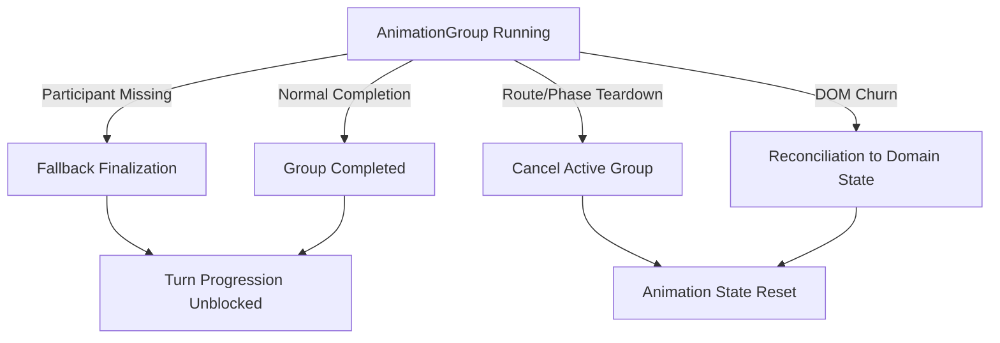
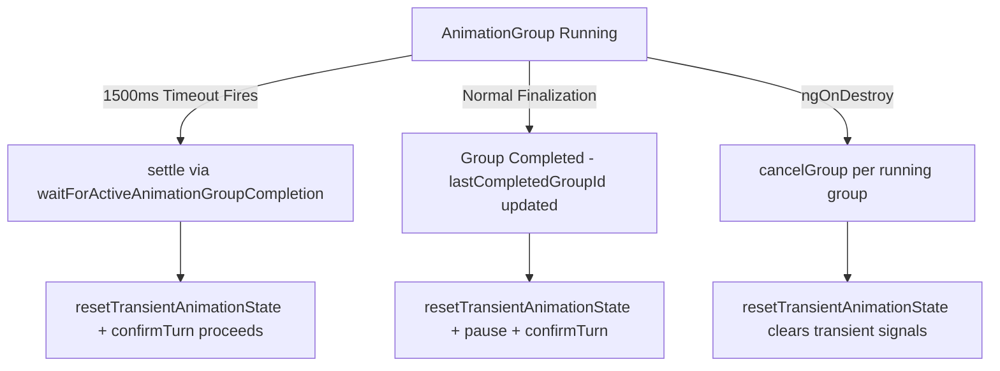

# Review Report: Card Animation System — T-12 GREEN

**Review Mode:** Incremental (T-12: Add resilience for cancellation and completion gaps)
**Source:** `docs/specs/ui/card-animations/`
**Reviewed against:** proposal.md, spec.md, user-stories.md, bdd-test.md, design.md, tasks.md

## 1. Executive Summary

The GREEN implementation of T-12 successfully delivers the three acceptance criteria: fallback timeout prevents deadlock on missing completion signals, cancellation resets animation state safely on component teardown, and transient card state is cleaned up to prevent orphaned visuals. The implementation is architecturally aligned with AD-2 (completion as source of truth for progression) and introduces minimal surface area.

- Total findings: 4 (0 Critical, 0 Major, 2 Minor, 2 Note)
- Spec compliance: 3 of 3 T-12 acceptance criteria met; TR-8, US-12, US-14 addressed
- Architecture alignment: aligned — no significant drift detected
- Test quality: meaningful — both new T-12 tests assert real behavioral outcomes

## 2. Architecture Comparison

### 2.1 Planned Resilience Architecture (from design.md section 10)

### 2.2 Actual Resilience Architecture (implemented)

### 2.3 Drift Analysis

The actual implementation closely follows the planned resilience architecture with one structural simplification: the design mentions a separate "DOM reconciliation" path for when DOM changes invalidate per-card tracking, but the implementation uses a signals-based transient state approach where cleanup is handled uniformly through resetTransientAnimationState. This is a valid simplification — signals-based state does not require explicit DOM observation because the computed projections (activeHandCards, tableCards) derive from signal state that gets cleared.

The design also mentions group status values including 'queued' and 'recovered', but the actual CardAnimationGroupStatus type only includes 'running', 'completed', and 'canceled'. The 'queued' state was judged unnecessary since groups transition directly to 'running' on creation. The 'recovered' concept is expressed through the timeout path rather than a distinct status value.

## 3. Findings

### RV-01: Unnecessary type cast for public cancelGroup in orchestrator spec [Minor]

- **Category:** Code Quality
- **Severity:** Minor
- **Related:** AD-2, T-12, SC-21
- **Description:** The orchestrator spec test "marks an active group as canceled..." accesses cancelGroup through a type assertion cast despite cancelGroup being a public method on CardAnimationOrchestrator.
- **Expected:** Direct invocation via service.cancelGroup(groupId) since the method is publicly declared.
- **Actual:** The test uses `(service as unknown as { cancelGroup: ... }).cancelGroup(groupId)` to invoke the method.
- **Recommendation:** Remove the type cast and call service.cancelGroup directly, aligning with how startGroup, completeParticipant, and finalizeGroup are invoked in the same file.
- **Impact:** No behavioral impact; reduces test readability slightly and may confuse future maintainers about whether cancelGroup is part of the public contract.

### RV-02: SC-21 lacks dedicated E2E feature coverage [Minor]

- **Category:** Test Coverage
- **Severity:** Minor
- **Related:** SC-21, TR-8, US-12, T-12
- **Description:** BDD scenario SC-21 ("Animation interruption preserves game consistency") is covered by two unit tests in game-table-page.deal-opponent.spec.ts but has no corresponding E2E feature file or step definition implementing the scenario end-to-end.
- **Expected:** Per bdd-test.md, SC-21 should eventually have E2E coverage validating that animation interruption produces consistent game state from the user's perspective.
- **Actual:** Only unit-level coverage exists. The turn-sequencing-completion.feature covers SC-17, SC-18, and SC-19 but not SC-21.
- **Recommendation:** This gap is acceptable for T-12 scope since T-16 (E2E scenario alignment) is the designated task for full BDD E2E implementation. Document that SC-21 E2E coverage is deferred to T-16.
- **Impact:** Low immediate risk since the unit tests meaningfully validate the behavior, but full release readiness depends on T-16 delivering SC-21 E2E coverage.

### RV-03: Design mentions 'queued' and 'recovered' group statuses not present in type [Note]

- **Category:** Architecture Drift
- **Severity:** Note
- **Related:** AD-2, T-12
- **Description:** Design.md section 8 lists group status values including 'queued' and 'recovered'. The actual CardAnimationGroupStatus type only defines 'running', 'completed', and 'canceled'.
- **Expected:** All status values described in the design are reflected in the implementation type.
- **Actual:** 'queued' and 'recovered' are absent from the type definition. Groups are created directly in 'running' status. Recovery is expressed through the timeout fallback path rather than a distinct status.
- **Recommendation:** No action required — the simplification is pragmatic. If future tasks need queuing or explicit recovery tracking, the type can be extended then. Consider updating design.md section 8 to reflect the actual simplified status model.
- **Impact:** None — the three-state model ('running', 'completed', 'canceled') fully covers the current resilience requirements.

### RV-04: Transient state test uses private signal manipulation via type cast [Note]

- **Category:** Test Quality
- **Severity:** Note
- **Related:** TR-8, SC-21, US-12, T-12
- **Description:** The test "fallback completion clears transient visual cards after timeout recovery" sets transientPlayedHandCardState and transientCapturedTableCardsState directly through type casting to simulate orphaned state.
- **Expected:** Ideally, orphaned state would be produced through the public runtime path (e.g., starting a play animation that never completes).
- **Actual:** Direct signal manipulation via type cast provides precise control over the scenario and makes the assertion deterministic.
- **Recommendation:** Acceptable for GREEN phase — the test meaningfully validates that timeout recovery clears transient state. A supplementary test exercising the full runtime path (submitPlay without group finalization) would strengthen confidence but is not blocking.
- **Impact:** Minimal — the test validates real cleanup behavior. The type cast is narrowly scoped to the setup phase and the assertions verify public computed outputs (activeHandCards, tableCards).

## 4. Traceability Matrix

| Finding | Severity | Category           | Related Spec                   | Status |
| ------- | -------- | ------------------ | ------------------------------ | ------ |
| RV-01   | Minor    | Code Quality       | AD-2, T-12, SC-21              | Open   |
| RV-02   | Minor    | Test Coverage      | SC-21, TR-8, US-12, T-12, T-16 | Open   |
| RV-03   | Note     | Architecture Drift | AD-2, T-12                     | Open   |
| RV-04   | Note     | Test Quality       | TR-8, SC-21, US-12, T-12       | Open   |

## 5. Spec Compliance Summary

| Requirement                                   | Status     | Notes                                                                                   |
| --------------------------------------------- | ---------- | --------------------------------------------------------------------------------------- |
| TR-8 (Animation Completion Signals)           | ✅ Met     | Timeout fallback at 1500ms prevents deadlock; cancelGroup emits no false completion     |
| US-12 (Animations Do Not Break Game Logic)    | ✅ Met     | Transient state is cleaned on timeout and teardown; game engine confirmTurn still fires |
| US-14 (E2E Tests Validate Animation Behavior) | ⚠️ Partial | Unit tests are meaningful; E2E coverage for SC-21 deferred to T-16                      |

## 6. Task Completion Summary

| Task | Title                                               | Status      | Findings                   |
| ---- | --------------------------------------------------- | ----------- | -------------------------- |
| T-12 | Add resilience for cancellation and completion gaps | ✅ Complete | RV-01, RV-02, RV-03, RV-04 |

### T-12 Acceptance Criteria Verification

| Criterion                                                      | Status | Evidence                                                                                                                                                                                     |
| -------------------------------------------------------------- | ------ | -------------------------------------------------------------------------------------------------------------------------------------------------------------------------------------------- |
| Missing participant completion does not block turn progression | ✅ Met | waitForActiveAnimationGroupCompletion uses 1500ms fallback timeout; validated by "missing group completion signal does not deadlock confirm sequencing" test                                 |
| Cancellation resets animation state safely                     | ✅ Met | cancelGroup marks status as 'canceled' and clears activeGroupId; ngOnDestroy iterates and cancels all running groups; validated by "component teardown cancels active animation groups" test |
| No duplicate or orphaned card visual outcomes remain           | ✅ Met | resetTransientAnimationState clears both transient signals after timeout recovery; validated by "fallback completion clears transient visual cards after timeout recovery" test              |

## 7. Test Coverage Summary

| Scenario | Step Definitions    | Meaningful | Findings                     |
| -------- | ------------------- | ---------- | ---------------------------- |
| SC-18    | ✅ Yes (unit + E2E) | ✅ Yes     | —                            |
| SC-21    | ✅ Yes (unit only)  | ✅ Yes     | RV-02 (E2E deferred to T-16) |

## 8. Test Quality Summary

| Test File                                          | Type | Meaningful Assertions | Issues                                                 |
| -------------------------------------------------- | ---- | --------------------- | ------------------------------------------------------ |
| card-animation-orchestrator.spec.ts                | Unit | ✅ Yes                | RV-01 (unnecessary type cast on cancelGroup)           |
| game-table-page.deal-opponent.spec.ts (T-12 tests) | Unit | ✅ Yes                | RV-04 (private state setup via type cast — acceptable) |

## 9. Security Cross-Reference

See `docs/specs/ui/card-animations/security-report_T-12.md` for the full security analysis. No Critical or High findings were identified.

| SEC ID | Severity | OWASP    | Summary                                                            |
| ------ | -------- | -------- | ------------------------------------------------------------------ |
| SEC-01 | Medium   | A06:2021 | Moderate advisories in test dependency chain (Cypress/transitives) |
| SEC-02 | Info     | A04:2021 | Test fixtures access private runtime state via type casting        |

Neither security finding impacts T-12 acceptance criteria or blocks merge.

## 10. Recommendations

### Critical (blocks release)

None.

### Major (fix before merge)

None.

### Minor (improvement)

1. Remove the unnecessary type cast on cancelGroup in the orchestrator spec — call the public method directly for consistency.
2. Ensure T-16 implementation includes SC-21 E2E coverage for animation interruption.

### Notes (informational)

1. The simplified three-status model (running/completed/canceled) is sufficient. Consider aligning design.md section 8 wording with actual implementation during documentation maintenance.
2. The private-state test fixture approach for resilience scenarios is acceptable but could be supplemented with a public-API-path test in T-15 (unit and integration validation suite).
