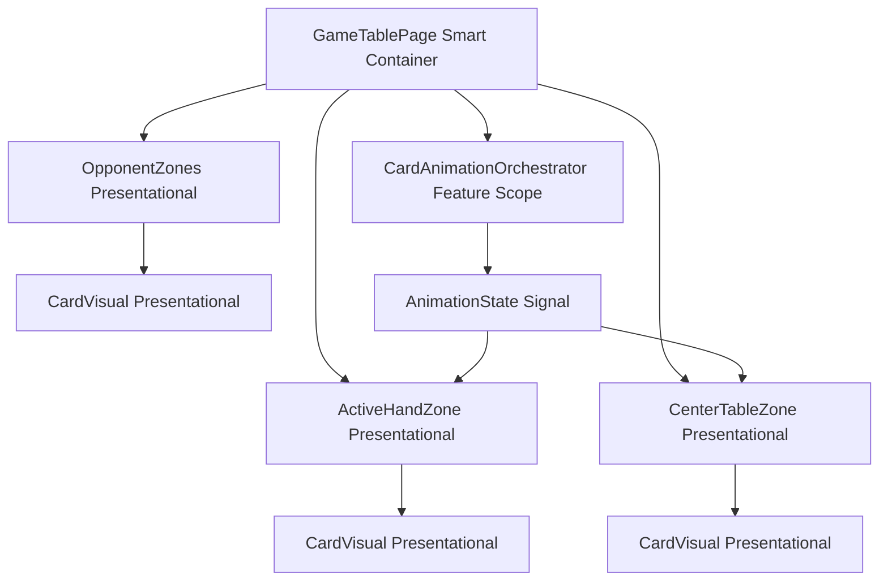
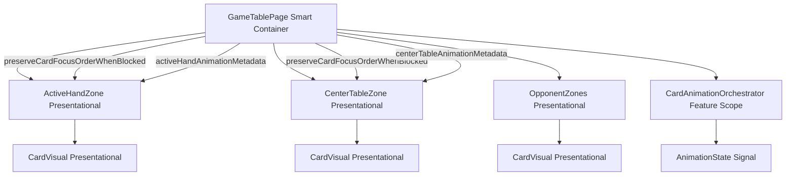

# Review Report: Card Animation System — T-13 Accessibility Verification (GREEN Phase)

**Review Mode:** Incremental (T-13: Verify accessibility behavior under animation load)
**Source:** `docs/specs/ui/card-animations/`
**Reviewed against:** proposal.md, spec.md, user-stories.md, bdd-test.md, design.md, tasks.md
**Previous reviews:** `review-report_T-13_red.md`, `review-report_T-13_red-v2.md`

**Scope — Changed files reviewed:**

- `src/app/features/game-board/game-table-page/zones/active-hand-zone/active-hand-zone.ts`
- `src/app/features/game-board/game-table-page/zones/active-hand-zone/active-hand-zone.html`
- `src/app/features/game-board/game-table-page/zones/center-table-zone/center-table-zone.ts`
- `src/app/features/game-board/game-table-page/zones/center-table-zone/center-table-zone.html`
- `src/app/features/game-board/game-table-page/game-table-page.ts`
- `src/app/features/game-board/game-table-page/game-table-page.html`
- `docs/specs/ui/card-animations/tasks.md`

## 1. Executive Summary

The T-13 GREEN implementation satisfies all three acceptance criteria through a well-designed `preserveFocusOrderWhenBlocked` mechanism that keeps card buttons in the tab order during animation load while blocking their click handlers via `aria-disabled`. The implementation aligns with AD-5 (reduced-motion accessibility path) and NFR-2 (keyboard navigation unaffected). No Critical or Major findings. Minor gaps carry forward from the RED-phase review, all related to traceability and assertion scope rather than functional defects.

- Total findings: 5 (0 Critical, 0 Major, 3 Minor, 2 Note)
- Spec compliance: 3 of 3 acceptance criteria met
- Architecture alignment: aligned with AD-5
- Test quality: meaningful — RED-phase findings addressed implementation gaps; GREEN implementation resolves them

## 2. Architecture Comparison

### 2.1 Planned Component Tree (T-13 scope from design.md)

### 2.2 Actual Component Tree (T-13 scope as implemented)

### 2.3 Drift Analysis

No structural architectural drift is present. The implementation follows the planned hierarchy exactly. The `preserveFocusOrderWhenBlocked` input is an additive accessibility concern applied to the existing presentational zones without altering their responsibilities or the orchestrator contract. This was not explicitly shown in the design.md component tree but is consistent with AD-5 which mandates that accessibility behavior is preserved under animation load. The signal flows from orchestrator through GameTablePage to zones as designed.

## 3. Findings

### RV-01: Unit tests do not exercise preserveFocusOrderWhenBlocked behavior [Minor]

- **Category:** Test Coverage
- **Severity:** Minor
- **Related:** T-13 AC1, NFR-2, SC-25, AD-5
- **Description:** The `preserveFocusOrderWhenBlocked` input is a core mechanism enabling T-13's first acceptance criterion (keyboard navigation remains stable during animations). No unit test in either `active-hand-zone.spec.ts` or `center-table-zone.spec.ts` exercises this input. The behavior is tested only at E2E level in `game-table-accessibility.feature`.
- **Expected:** At least one unit test per zone should verify that when `interactionEnabled` is false and `preserveFocusOrderWhenBlocked` is true, the button is NOT disabled (remains in focus order) while the click handler is blocked.
- **Actual:** The existing interaction-disabled tests verify that the button IS disabled when interaction is disabled, which is correct for the non-animation case. But no test verifies the animation-load case where the button should remain focusable despite being non-interactive.
- **Recommendation:** Add unit tests to both zone specs that set `interactionEnabled = false` and `preserveFocusOrderWhenBlocked = true`, then assert the button does not have the `disabled` attribute but does have `aria-disabled="true"`, and that click does not emit an event.
- **Impact:** A regression that removes the `preserveFocusOrderWhenBlocked` condition from the disabled binding would break keyboard navigation during animation load. Currently, only E2E tests would catch this regression.

### RV-02: SC-25 from card-animations BDD not referenced in implementation or test titles [Minor]

- **Category:** Test Coverage
- **Severity:** Minor
- **Related:** SC-25, NFR-2, US-4, US-14, T-13
- **Description:** Carried forward from RED-phase review. SC-25 ("Keyboard focus and navigation remain intact during animation") is the canonical card-animations BDD scenario for this task. Neither the implementation comments nor the E2E test scenarios reference SC-25 by ID.
- **Expected:** T-13 tests and implementation should reference SC-25 for traceability.
- **Actual:** Tests reference SC-20 and SC-21 from game-table-accessibility.feature (different spec scope).
- **Recommendation:** Annotate the relevant E2E scenarios or step definitions with a comment referencing SC-25 from the card-animations BDD.
- **Impact:** Traceability gap only; no functional risk.

### RV-03: E2E focus-visible assertion does not cover card elements carrying animation classes [Minor]

- **Category:** Test Quality
- **Severity:** Minor
- **Related:** NFR-2, SC-25, T-13 AC2
- **Description:** Carried forward from RED-phase review. The `focus-visible` assertion in the E2E step only verifies the confirm-turn button, not card elements. Cards are the elements that actually receive animation CSS classes (play, capture, deal, escoba) and are most at risk of focus indicator occlusion.
- **Expected:** At least one card button should be focused and verified for `:focus-visible` during animation load.
- **Actual:** Only the confirm-turn action button is checked.
- **Recommendation:** Extend the E2E step to also focus a hand-card button and assert `:focus-visible`.
- **Impact:** A CSS regression where animation box-shadow or transform suppresses focus ring on cards would not be caught.

### RV-04: Capture animation opacity-zero end state may briefly render focus ring on invisible element [Note]

- **Category:** Code Quality
- **Severity:** Note
- **Related:** NFR-2, AD-4, T-13 AC2
- **Description:** During capture and escoba animations, the CardVisual end state includes `opacity: 0`. If a user tabs to a card button during the final phase of capture animation, the focus ring (outline) would be rendered around an invisible element. The card is subsequently removed from DOM when animation completes, but there is a brief transient window.
- **Expected:** Focus ring should only appear on visible elements.
- **Actual:** The button remains in tab order during animation (by design of `preserveFocusOrderWhenBlocked`), and the outline is technically rendered but not user-perceivable since the card is transparent. Under reduced-motion, animation duration is 0ms so this state is instantaneous and practically unobservable.
- **Recommendation:** No action required for this release. The transient duration is well under one second and the card is removed from DOM immediately after. If this becomes user-reportable, consider adding `aria-hidden="true"` to cards in the final capture phase, or removing them from tab order once the capture animation enters the fade phase.
- **Impact:** Negligible in practice. The focus ring would not be visible to the user since the card itself is transparent.

### RV-05: Scenario ID collision remains between feature specs [Note]

- **Category:** Test Coverage
- **Severity:** Note
- **Related:** SC-20, SC-21, SC-25, T-13
- **Description:** Carried forward from RED-phase review. The game-table-accessibility.feature reuses SC-20 and SC-21 IDs for both baseline accessibility scenarios and T-13 animation-load variants, while card-animations bdd-test.md defines those IDs for different scenarios entirely.
- **Expected:** Globally unique scenario IDs across specs.
- **Actual:** SC-20 and SC-21 each refer to different scenarios depending on context.
- **Recommendation:** Consider renaming the T-13 animation-load variants to SC-25a, SC-25b, SC-25c in a future traceability cleanup.
- **Impact:** Audit confusion only; no functional impact.

## 4. Traceability Matrix

| Finding | Severity | Category      | Related Spec                 | Status                  |
| ------- | -------- | ------------- | ---------------------------- | ----------------------- |
| RV-01   | Minor    | Test Coverage | T-13 AC1, NFR-2, SC-25, AD-5 | Open                    |
| RV-02   | Minor    | Test Coverage | SC-25, NFR-2, US-4, US-14    | Open (carried from RED) |
| RV-03   | Minor    | Test Quality  | NFR-2, SC-25, T-13 AC2       | Open (carried from RED) |
| RV-04   | Note     | Code Quality  | NFR-2, AD-4, T-13 AC2        | Open                    |
| RV-05   | Note     | Test Coverage | SC-20, SC-21, SC-25          | Open (carried from RED) |

## 5. Spec Compliance Summary (T-13 scope)

| Requirement | Status | Notes                                                                                                                                                       |
| ----------- | ------ | ----------------------------------------------------------------------------------------------------------------------------------------------------------- |
| NFR-2       | ✅ Met | Keyboard navigation preserved via preserveFocusOrderWhenBlocked; focus ring CSS rule always present on CardVisual                                           |
| NFR-3       | ✅ Met | mapActionTypeToVisualState returns null under reduced-motion; CSS media query zeroes durations; selection/capture distinguishable by class                  |
| US-4        | ✅ Met | Selected state (card-visual--selected) remains visually distinct from capture (card-visual--animation-capture) — different box-shadow colors and transforms |
| US-9        | ✅ Met | Reduced-motion disables animation visuals entirely; pause policy retained; outcomes match normal mode                                                       |
| US-14       | ✅ Met | E2E scenarios verify keyboard operability, focus visibility, and reduced-motion behavior during animation                                                   |

## 6. Task Completion Summary

| Task | Title                                              | Status      | Findings            |
| ---- | -------------------------------------------------- | ----------- | ------------------- |
| T-13 | Verify accessibility behavior under animation load | ✅ Complete | RV-01, RV-02, RV-03 |

## 7. T-13 Acceptance Criteria Assessment

| Criterion                                                          | Status | Implementation Evidence                                                                                                                                                                                                                                                      |
| ------------------------------------------------------------------ | ------ | ---------------------------------------------------------------------------------------------------------------------------------------------------------------------------------------------------------------------------------------------------------------------------- |
| Keyboard navigation remains stable during all action animations    | ✅ Met | `preserveFocusOrderWhenBlocked` signal keeps buttons in tab order with `aria-disabled` instead of `disabled` during running animation groups; click handler returns early when `interactionEnabled` is false                                                                 |
| Focus indicators remain visible and unobscured                     | ✅ Met | CardVisual permanently applies `card-visual--focus-visible` class; SCSS defines `:focus-visible` outline rule with `outline-offset: 3px` that is not overridden by animation classes; CSS uses only `transform`/`opacity`/`box-shadow` which do not affect outline rendering |
| Selection and capture states remain distinguishable without motion | ✅ Met | Under reduced-motion, `mapActionTypeToVisualState` returns null (no animation class applied); selected cards use `card-visual--selected` class (yellow glow box-shadow); capture cards receive no visual animation class — states are inherently distinguishable             |

## 8. AD-5 Alignment Assessment

AD-5 states: "Reduced-motion disables motion timing while keeping transition pause behavior."

The implementation satisfies AD-5:

- Motion timing is disabled through two independent mechanisms: the JavaScript signal layer (`mapActionTypeToVisualState` returns null under reduced-motion) and the CSS layer (`@media (prefers-reduced-motion: reduce)` sets all animation-duration to 0ms).
- Transition pause behavior is retained: `resolveAnimationCompletionDelayMs` returns 0 under reduced-motion, but the TurnPausePolicy still applies configured pauses for clarity.
- The dual-layer approach provides defense-in-depth — even if one mechanism fails, the other prevents motion.

## 9. Security Cross-Reference

The companion `security-report_T-13.md` reports no Critical or High findings. One Medium finding (SEC-01) relates to Moderate npm audit advisories in Cypress test dependencies. This does not affect the T-13 GREEN implementation.

## 10. Recommendations

### Minor (fix before merge)

1. Add unit tests for `preserveFocusOrderWhenBlocked` behavior in both ActiveHandZone and CenterTableZone specs to protect against regression of the keyboard stability mechanism.
2. Annotate relevant E2E scenarios with SC-25 reference for card-animations BDD traceability.
3. Extend E2E focus-visible assertion to include a card element that carries animation classes.

### Notes (informational)

1. The capture animation opacity-zero end state is a cosmetic non-issue under current implementation but worth monitoring if animation durations change.
2. Scenario ID collision across feature specs should be addressed in a traceability cleanup pass.
