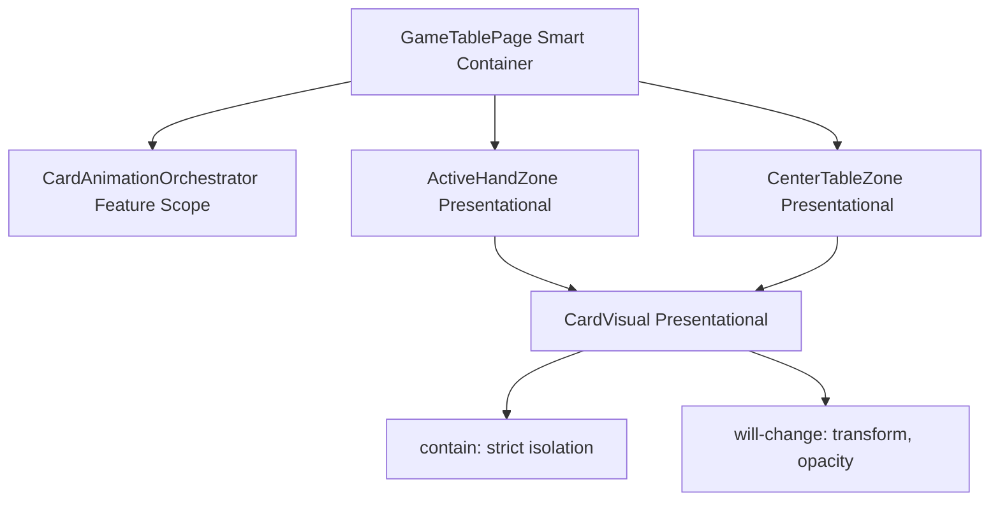
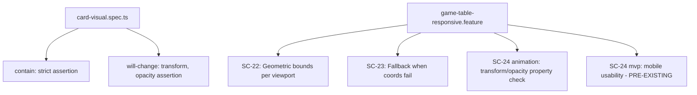

# Review Report: Card Animation System — T-14 Performance Tuning (RED Phase, Tests Only)

**Review Mode:** Incremental (T-14: Tune performance and responsive path behavior) — Tests Only (RED Phase)
**Source:** `docs/specs/ui/card-animations/`
**Reviewed against:** proposal.md, spec.md, user-stories.md, bdd-test.md, design.md, tasks.md

## 1. Executive Summary

The T-14 RED phase introduces two unit tests in card-visual.spec.ts and three E2E scenarios in game-table-responsive.feature, targeting performance contracts (contain/will-change) and responsive animation path validation. Tests are meaningful, deterministic, and well-traced. One traceability collision (duplicate SC-24 identifier) is the primary concern. Overall test quality is strong for a RED phase deliverable.

- Total findings: 4 (0 Critical, 0 Major, 2 Minor, 2 Note)
- Spec compliance: 4 of 6 requirements addressable at test-contract level; 2 partially addressed (NFR-1 fps quantitative, US-10 fps quantitative)
- Architecture alignment: aligned (no drift at test layer)
- Test quality: meaningful

## 2. Architecture Comparison

### 2.1 Planned Component Tree (Relevant Subset for T-14)

### 2.2 Actual Test Coverage Tree

### 2.3 Drift Analysis

No architectural drift detected at the test layer. Unit tests target CardVisual computed styles directly as prescribed by AD-4 (transform and opacity only). E2E scenarios correctly exercise the responsive path system via viewport manipulation and coordinate stub injection (TR-5) and validate GPU-friendly property usage (TR-7). The test structure aligns with the planned separation between unit-level performance contracts and E2E-level integration validation.

## 3. Findings

### RV-01: Duplicate SC-24 identifier in game-table-responsive.feature [Minor]

- **Category:** Test Coverage
- **Severity:** Minor
- **Related:** SC-24 (card-animations), SC-24 (game-table-mvp), TR-7, NFR-1, US-10
- **Description:** The game-table-responsive.feature file now contains two scenarios with the SC-24 identifier. The first (line 3) is "table is usable from mobile baseline width" from the game-table-mvp spec. The second (line 37) is "animation sequencing remains smooth under repeated mobile submissions" from the card-animations spec.
- **Expected:** Each scenario in a shared feature file has a unique, unambiguous identifier that can be traced to exactly one BDD specification.
- **Actual:** Two distinct scenarios share the SC-24 label, making traceability from test results back to spec requirements ambiguous.
- **Recommendation:** Prefix or namespace the card-animations scenario ID to distinguish it from the game-table-mvp scenario (e.g., rename to "SC-24a" or use a feature-scoped identifier like "CA-SC-24"). Alternatively, the card-animations BDD spec could adopt a non-colliding ID range.
- **Impact:** Test run reports referencing "SC-24" cannot be unambiguously attributed to either spec. Low runtime risk but weakens audit trail.

### RV-02: E2E SC-24 adapts fps specification to property-based proxy [Minor]

- **Category:** Spec Compliance
- **Severity:** Minor
- **Related:** SC-24 (card-animations BDD), TR-7, NFR-1, US-10
- **Description:** The BDD spec for SC-24 requires quantitative fps measurement ("measured frame rate remains at or above 55 frames per second" and "no frame stall exceeds 100 milliseconds"). The E2E adaptation instead asserts that card-visual transition-property contains "transform" and excludes layout-triggering properties (top, left, width, height).
- **Expected:** Test assertion matches the BDD scenario's quantitative intent or explicitly documents the adaptation rationale.
- **Actual:** The adaptation is pragmatic and technically sound (Cypress cannot measure fps), but the gap between spec assertion (fps) and test assertion (CSS property inspection) is undocumented.
- **Recommendation:** Add a comment in the feature file or a note in the tasks document acknowledging that fps measurement is validated through Lighthouse audits or manual testing, and that the E2E provides structural guarantees as a proxy. This preserves traceability intent.
- **Impact:** Auditors may question whether NFR-1 is truly validated. Low functional risk since property-based checks are a valid static guarantee for GPU acceleration.

### RV-03: Unit tests are well-targeted, deterministic performance contracts [Note]

- **Category:** Test Quality
- **Severity:** Note
- **Related:** T-14, TR-7, NFR-1, AD-4
- **Description:** The two new unit tests assert specific computed style properties: `contain: strict` and `will-change` containing both "transform" and "opacity". These are precise, non-flaky assertions that directly verify the CSS performance infrastructure required by TR-7 and AD-4.
- **Expected:** RED phase tests define clear failure conditions that the GREEN implementation must satisfy.
- **Actual:** Both tests are narrowly scoped, use standard TestBed setup, and verify observable rendering contracts rather than implementation details. They will fail deterministically until the component's styles provide the required properties.
- **Recommendation:** No action required. These represent high-quality RED phase assertions.
- **Impact:** Positive — provides clear implementation targets for the GREEN phase.

### RV-04: Simultaneous-action smoothness acceptance criterion is indirectly covered [Note]

- **Category:** Test Coverage
- **Severity:** Note
- **Related:** T-14 AC ("Simultaneous actions preserve smoothness"), TR-7, NFR-1, US-10
- **Description:** T-14 acceptance criterion states "Simultaneous actions preserve smoothness." The E2E "repeated play submissions" scenario tests sequential action cadence rather than truly concurrent multi-card animations. The unit-level contain/will-change assertions provide static guarantees for GPU isolation that enable smoothness but do not dynamically verify simultaneous animation behaviour.
- **Expected:** A test that exercises multiple cards animating concurrently and verifies no jank.
- **Actual:** Sequential submission cadence is tested, and GPU-friendly properties are statically validated. True concurrency smoothness is implicitly covered by the combination of both.
- **Recommendation:** Consider whether T-15 or T-16 would be a more appropriate home for a multi-card simultaneous animation assertion (e.g., triggering a capture with multiple table cards and verifying all animate with GPU properties). For T-14 RED scope, the current coverage is adequate.
- **Impact:** Low risk. The contain/will-change contracts are the primary levers for simultaneous smoothness; runtime concurrent timing is difficult to test deterministically in Cypress.

## 4. Traceability Matrix

| Finding | Severity | Category        | Related Spec              | Status            |
| ------- | -------- | --------------- | ------------------------- | ----------------- |
| RV-01   | Minor    | Test Coverage   | SC-24, TR-7, NFR-1, US-10 | Open              |
| RV-02   | Minor    | Spec Compliance | SC-24, TR-7, NFR-1, US-10 | Open              |
| RV-03   | Note     | Test Quality    | T-14, TR-7, NFR-1, AD-4   | Closed (positive) |
| RV-04   | Note     | Test Coverage   | T-14, TR-7, NFR-1, US-10  | Open              |

## 5. Spec Compliance Summary

| Requirement | Status     | Notes                                                                                                                   |
| ----------- | ---------- | ----------------------------------------------------------------------------------------------------------------------- |
| TR-5        | ✅ Met     | SC-22 validates coordinate-based pathing across three viewports; SC-23 validates fallback on coordinate failure         |
| TR-7        | ✅ Met     | Unit tests enforce contain:strict and will-change; E2E enforces transform/opacity-only transitions                      |
| NFR-1       | ⚠️ Partial | Static GPU-property guarantees are in place; quantitative fps assertion adapted to property proxy (RV-02)               |
| NFR-4       | ✅ Met     | SC-22 exercises mobile (375px), tablet (768px), and desktop (1280px) with geometric bounds validation                   |
| US-10       | ⚠️ Partial | Same adaptation gap as NFR-1 — structural guarantees present, quantitative fps not directly measured in automated tests |
| US-11       | ✅ Met     | SC-22 validates actual DOM bounding-box-based paths; SC-23 validates graceful degradation on resolution failure         |

## 6. Task Completion Summary

| Task | Title                                         | Status                                | Findings            |
| ---- | --------------------------------------------- | ------------------------------------- | ------------------- |
| T-14 | Tune performance and responsive path behavior | ⚠️ Partial (RED phase tests complete) | RV-01, RV-02, RV-04 |

## 7. Test Coverage Summary

| Scenario                | Step Definitions | Meaningful | Findings     |
| ----------------------- | ---------------- | ---------- | ------------ |
| SC-22                   | ✅ Yes           | ✅ Yes     | —            |
| SC-23                   | ✅ Yes           | ✅ Yes     | —            |
| SC-24 (card-animations) | ✅ Yes           | ⚠️ Partial | RV-01, RV-02 |

## 8. Test Quality Summary

| Test File                                       | Type        | Meaningful Assertions | Issues                                               |
| ----------------------------------------------- | ----------- | --------------------- | ---------------------------------------------------- |
| card-visual.spec.ts (T-14 tests)                | Unit        | ✅ Yes                | None — precise CSS contract assertions               |
| game-table-responsive.feature (SC-22)           | E2E         | ✅ Yes                | None — geometric bounds check per viewport           |
| game-table-responsive.feature (SC-23)           | E2E         | ✅ Yes                | None — coordinate stub + progression validation      |
| game-table-responsive.feature (SC-24 animation) | E2E         | ⚠️ Partial            | Property proxy for fps (RV-02); ID collision (RV-01) |
| game-table.ts (step definitions)                | E2E Support | ✅ Yes                | Non-trivial implementations with real assertions     |

## 9. Security Cross-Reference

No security concerns identified in the reviewed test artifacts. The getBoundingClientRect stub in the SC-23 step definition is properly scoped to the test window and restored after assertion. No credentials, user data, or injection vectors are present in the test code.

## 10. Recommendations

### Minor (fix before merge)

1. **Resolve SC-24 ID collision** — Disambiguate the card-animations SC-24 from the game-table-mvp SC-24 in game-table-responsive.feature. A namespace prefix or suffix would restore unambiguous traceability.
2. **Document fps-to-property adaptation** — Add a brief note (in tasks.md or as a feature file comment) explaining that NFR-1 fps measurement is validated via Lighthouse/manual audit, and that the E2E provides structural GPU-property guarantees as a CI-friendly proxy.

### Notes (informational)

1. The unit tests represent exemplary RED phase contracts — narrowly scoped, deterministic, and clearly traceable to T-14/TR-7/NFR-1.
2. Consider deferring a concurrent multi-card smoothness assertion to T-15 or T-16 where orchestrator-level integration tests can exercise simultaneous animation groups.
