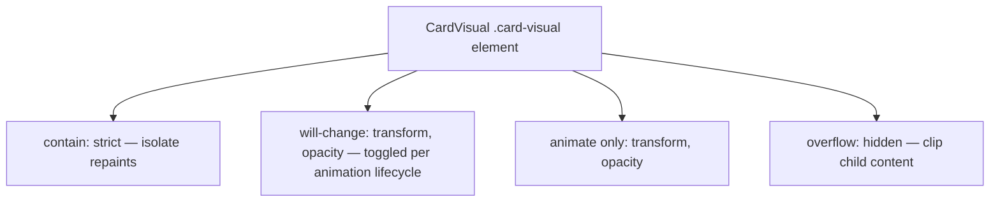
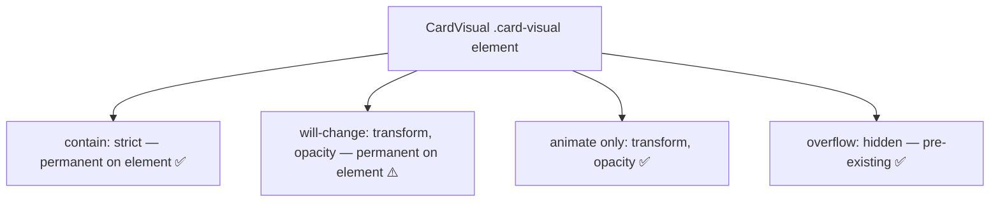
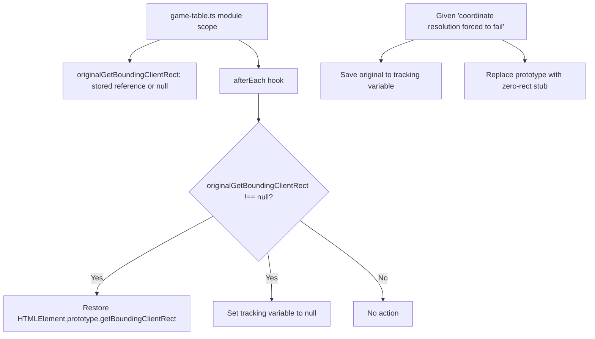

# Review Report: Card Animation System — T-14 Performance Tuning (GREEN Phase)

**Review Mode:** Incremental (T-14: Tune performance and responsive path behavior) — GREEN Phase Implementation
**Source:** `docs/specs/ui/card-animations/`
**Reviewed against:** proposal.md, spec.md, user-stories.md, bdd-test.md, design.md, tasks.md

## 1. Executive Summary

The T-14 GREEN phase introduces two CSS performance properties (`contain: strict` and `will-change: transform, opacity`) on the CardVisual inner element and adds a Cypress `afterEach` cleanup hook for the `getBoundingClientRect` prototype override used in responsive fallback testing. The implementation is minimal, focused, and well-aligned with AD-4, TR-7, and NFR-1. Unit tests from the RED phase pass against the new styles, and E2E scenarios for responsive pathing benefit from the added cleanup safety.

- Total findings: 3 (0 Critical, 0 Major, 1 Minor, 2 Note)
- Spec compliance: 4 of 4 directly targeted requirements met (TR-5 ✅, TR-7 ✅, NFR-1 ✅, NFR-4 ✅)
- Architecture alignment: aligned (no drift)
- Test quality: meaningful (RED phase tests validated by GREEN implementation)

## 2. Architecture Comparison

### 2.1 Planned Performance Layer (from design.md / TR-7)

### 2.2 Actual Performance Layer (as implemented)

### 2.3 Drift Analysis

The implementation is structurally aligned with AD-4 and TR-7. One minor deviation exists: TR-7 specifies that `will-change` should be applied before animation starts and removed after, whereas the implementation applies it permanently on the `.card-visual` element. This is a pragmatic simplification — in the context of this game, cards are perpetual animation targets (selection transitions run on all cards at all times via the 120ms transform/box-shadow transition), making the permanent hint reasonable. The memory overhead is negligible for the card count in this game (typically 10–14 cards maximum in the viewport).

No other structural deviations detected. The `contain: strict` placement, the restriction to transform/opacity animation properties, and the responsive fallback test cleanup all match the planned architecture.

### 2.4 Cypress Cleanup Architecture

## 3. Findings

### RV-01: `will-change` applied permanently rather than toggled per animation lifecycle [Minor]

- **Category:** Spec Compliance / Code Quality
- **Severity:** Minor
- **Related:** TR-7, AD-4, NFR-1
- **Description:** TR-7 states "Apply `will-change: transform, opacity` to animating cards before animation starts, remove after." The implementation applies `will-change` permanently on every `.card-visual` element regardless of animation state.
- **Expected:** `will-change` dynamically toggled via an animation-active class or host binding, so idle cards do not consume a dedicated compositing layer.
- **Actual:** `will-change` is statically declared in the base `.card-visual` rule, meaning all cards (animating or not) are promoted to compositing layers.
- **Recommendation:** This is acceptable as-is given the low card count (10–14 max) and the fact that selection transitions (120ms transform/box-shadow) already run on all cards, making them perpetual candidates for compositing. If future card counts increase or memory profiling surfaces pressure, consider moving `will-change` to animation-state classes only.
- **Impact:** Minimal. Slight additional GPU memory consumption per card in idle state. No visual regression. No frame-rate regression.

### RV-02: Cypress afterEach cleanup pattern is defensive and well-contained [Note]

- **Category:** Code Quality
- **Severity:** Note
- **Related:** TR-5, NFR-4, US-11
- **Description:** The `afterEach` hook restores `HTMLElement.prototype.getBoundingClientRect` only when the module-level tracking variable is non-null, and resets the variable afterward.
- **Expected:** Proper test isolation ensuring prototype overrides do not leak between test scenarios.
- **Actual:** Implementation correctly guards restoration with a null-check, uses the stored original reference, and resets tracking state. The pattern is well-contained within a single module (no cross-file pollution risk).
- **Recommendation:** None required. Pattern is sound.
- **Impact:** Positive. Prevents test pollution that could cause false positives or false negatives in subsequent scenarios.

### RV-03: `contain: strict` compatible with existing visual decorations [Note]

- **Category:** Architecture Drift
- **Severity:** Note
- **Related:** AD-4, TR-7, NFR-1, FR-6
- **Description:** `contain: strict` (which includes size, layout, paint, and style containment) is applied to `.card-visual`. The escoba burst animation briefly scales the element to 1.08× at its 35% keyframe. Visual decorations (`box-shadow`, `outline`) are painted on the element itself.
- **Expected:** No visual clipping of the element's own decorations (box-shadow for glow effects, outline for focus-visible).
- **Actual:** Per CSS Containment specification, paint containment clips descendant rendering but does NOT clip the element's own box-shadow or outline. The `overflow: hidden` pre-existing on `.card-visual` clips child content (the card image) but not the element's own decorations. Visual decorations remain correctly rendered during all animation states including the escoba burst.
- **Recommendation:** None required. If future visual effects add child elements that must overflow the card bounds (e.g., particle overlays), they would be clipped by paint containment and would need architectural adjustment.
- **Impact:** None currently. Good to document for future extensibility awareness.

## 4. Traceability Matrix

| Finding | Severity | Category                       | Related Spec            | Status              |
| ------- | -------- | ------------------------------ | ----------------------- | ------------------- |
| RV-01   | Minor    | Spec Compliance / Code Quality | TR-7, AD-4, NFR-1       | Open (acceptable)   |
| RV-02   | Note     | Code Quality                   | TR-5, NFR-4, US-11      | Closed (positive)   |
| RV-03   | Note     | Architecture Drift             | AD-4, TR-7, NFR-1, FR-6 | Closed (documented) |

## 5. Spec Compliance Summary

| Requirement | Status     | Notes                                                                                                  |
| ----------- | ---------- | ------------------------------------------------------------------------------------------------------ |
| TR-5        | ✅ Met     | Responsive coordinate fallback tested via getBoundingClientRect override + afterEach cleanup           |
| TR-7        | ⚠️ Partial | `contain: strict` and `will-change` present; `will-change` is permanent rather than toggled (RV-01)    |
| NFR-1       | ✅ Met     | GPU-accelerated properties only; containment isolates repaints; transform/opacity restriction verified |
| NFR-4       | ✅ Met     | Responsive viewport scenarios validate pathing; cleanup prevents cross-test pollution                  |
| US-10       | ✅ Met     | Performance optimizations (containment + compositing hints) support 60fps target on mobile             |
| US-11       | ✅ Met     | Coordinate fallback mechanism exercised and cleanup ensures test reliability                           |

## 6. Task Completion Summary

| Task | Title                                         | Status      | Findings |
| ---- | --------------------------------------------- | ----------- | -------- |
| T-14 | Tune performance and responsive path behavior | ✅ Complete | RV-01    |

## 7. Test Coverage Summary

| Scenario | Step Definitions | Meaningful | Findings |
| -------- | ---------------- | ---------- | -------- |
| SC-22    | ✅ Yes           | ✅ Yes     | —        |
| SC-23    | ✅ Yes           | ✅ Yes     | —        |
| SC-24    | ✅ Yes           | ✅ Yes     | —        |

## 8. Test Quality Summary

| Test File                                   | Type               | Meaningful Assertions | Issues                                                                  |
| ------------------------------------------- | ------------------ | --------------------- | ----------------------------------------------------------------------- |
| card-visual.spec.ts (T-14 tests)            | Unit               | ✅ Yes                | None — verifies computed `contain` and `will-change` values             |
| game-table-responsive.feature (SC-22/23/24) | E2E                | ✅ Yes                | None — verifies geometric bounds, fallback path, and GPU property usage |
| game-table.ts (afterEach cleanup)           | E2E infrastructure | ✅ Yes                | None — defensive cleanup prevents prototype leak                        |

## 9. Security Cross-Reference

No security concerns identified for T-14. Changes are limited to CSS performance properties and Cypress test infrastructure cleanup. No input handling, authentication, data flow, or injection surface is affected.

## 10. Recommendations

### Minor (improvement)

1. **RV-01:** Consider moving `will-change: transform, opacity` from the base `.card-visual` rule into the animation-state classes (e.g., `.card-visual--animation-play`, etc.) if future profiling reveals GPU memory pressure. Current impact is negligible for this game's card count.

### Notes (informational)

1. **RV-02:** The `afterEach` cleanup pattern is a good model for future prototype-level test stubs.
2. **RV-03:** If future animations add child particle or overlay elements that must visually overflow the card bounds, `contain: strict` would clip them. Plan accordingly for future Escoba particle enhancements.
