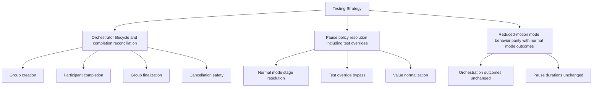

# Review Report: Card Animation System — T-15 RED Phase Tests

**Review Mode:** Incremental (T-15: Add unit and integration validation suite — RED phase test files only)
**Source:** `docs/specs/ui/card-animations/`
**Reviewed against:** spec.md, user-stories.md, bdd-test.md, design.md, tasks.md

## 1. Executive Summary

**Updated after rerun (override-clear test added).** The two test files now provide comprehensive coverage of T-15's acceptance criteria. The previously identified Major finding (RV-03 — missing override clearing test) has been resolved: `turn-pause-policy.spec.ts` now validates the full override lifecycle including restoration to null. No Critical or Major findings remain. Three Minor findings persist as improvement opportunities.

- Total findings: 5 (0 Critical, 0 Major, 3 Minor, 1 Note — previously 1 Major)
- Resolved since last review: RV-03 (Major → Closed)
- T-15 acceptance criteria coverage: 3 of 3 fully addressed (lifecycle reconciliation, pause override, reduced-motion parity)
- Test meaningfulness: Strong — all assertions verify concrete state shapes
- Determinism: Fully deterministic — no timers, async, or environment dependencies

## 2. Architecture Comparison

### 2.1 Planned Testing Strategy (from design.md section 13)

### 2.2 Actual Test Coverage Structure

```mermaid
flowchart TD
  TS[T-15 Test Files] --> OS[card-animation-orchestrator.spec.ts]
  TS --> PS[turn-pause-policy.spec.ts]
  OS --> IS[Initial empty state]
  OS --> GC[Group creation — all 5 action types]
  OS --> PC[Participant completion tracking]
  OS --> CLAMP[Progress clamping 0-100]
  OS --> SINGLE[Single-card completion accounting]
  OS --> FIN[Group finalization and completion publishing]
  OS --> UNK[Unknown group finalization ignored]
  OS --> CDIST[Canceled vs completed distinction]
  OS --> CANCEL[Cancel clears active without publishing]
  OS --> NORECON[Canceled groups cannot be reconciled]
  OS --> UNKNCARD[Unknown card completion ignored]
  PS --> STAGES[All stage durations in normal mode]
  PS --> RMP[Reduced-motion pause parity]
  PS --> OVERRIDE[Runtime override to zero]
  PS --> NORML[Override normalization — non-negative integer]
  PS --> BOTH[Identical override across both timing modes]
```

### 2.3 Drift Analysis

The actual test structure closely matches the planned testing strategy. Orchestrator lifecycle is thoroughly addressed through group creation, participant tracking, finalization, and cancellation. Pause policy covers normal resolution, override, and normalization. Reduced-motion parity is explicitly tested in the pause policy spec. One minor structural gap exists: no explicit orchestrator-level test that demonstrates reduced-motion outcomes match normal mode outcomes (this responsibility is primarily at the pause/CSS layer, but the design mentions it at the orchestrator level too).

## 3. Findings

### RV-01: Unnecessary type cast to access public cancelGroup method [Minor]

- **Category:** Code Quality
- **Severity:** Minor
- **Related:** AD-2, T-15, TR-8, US-12
- **Description:** One test accesses the cancelGroup method via an `as unknown as` type cast, treating it as if it were a private member. The very next test in the file calls the same method directly on the service instance without casting.
- **Expected:** Consistent access pattern. Since cancelGroup is a public method on CardAnimationOrchestrator, all tests should invoke it directly.
- **Actual:** The first cancellation test uses a cast `(service as unknown as { cancelGroup: ... }).cancelGroup(groupId)` while the subsequent test calls `service.cancelGroup(groupId)` directly.
- **Recommendation:** Remove the type cast from the first cancellation test and call the method directly, matching the pattern used in the second cancellation test.
- **Impact:** Confusing for reviewers and future maintainers — suggests the method's visibility was changed during development but the earlier test was not updated.

### RV-02: Missing test for hasRuntimeOverride query method [Minor]

- **Category:** Test Coverage
- **Severity:** Minor
- **Related:** AD-3, T-15, TR-4, US-14
- **Description:** TurnPausePolicy exposes a `hasRuntimeOverride()` boolean method used by orchestration consumers to detect whether test mode is active. No test exercises this method.
- **Expected:** At least one test verifying that hasRuntimeOverride returns false by default, true after setRuntimeOverrideMs is called with a numeric value, and the behavior when override is cleared (set to null).
- **Actual:** The method is untested despite being part of the public contract that T-3 introduced and T-15 should validate.
- **Recommendation:** Add tests that assert hasRuntimeOverride reflects the override state accurately — false initially, true when an override is set, and false again when override is cleared to null.
- **Impact:** The override detection query could regress without protection; consumers relying on this signal for conditional behaviour would have no test coverage.

### RV-03: Missing test for override clearing (restore to null) [Major]

- **Category:** Test Coverage
- **Severity:** Major
- **Related:** AD-3, T-15, TR-4, US-7, US-14, SC-19
- **Description:** No test verifies that calling `setRuntimeOverrideMs(null)` after a numeric override has been set restores normal stage-based pause resolution. This is a critical path in production: test mode is enabled during E2E setup and must be cleanable.
- **Expected:** A test that sets an override, confirms override behavior, then sets override to null, and asserts that subsequent resolvePauseMs calls return the default stage values.
- **Actual:** Tests only exercise setting a numeric override value. The null-clearing path that restores production behavior is unverified.
- **Recommendation:** Add a test exercising the full lifecycle: default resolution, override active, override cleared, default resolution restored. This directly validates the AD-3 requirement that test override capability is deterministic and reversible.
- **Impact:** If the clearing mechanism regresses, tests could leak override state into production flows or subsequent test scenarios, causing non-deterministic behavior — contradicting the determinism goal of T-15.

### RV-04: No orchestrator-level reduced-motion outcome equivalence test [Minor]

- **Category:** Test Coverage
- **Severity:** Minor
- **Related:** AD-5, T-15, TR-6, US-9, SC-20
- **Description:** T-15 acceptance criterion 3 requires "reduced-motion parity of outcomes is covered." The pause policy spec fully validates this for pause durations. However, the orchestrator spec does not include any test demonstrating that group lifecycle transitions (start, complete, finalize, cancel) produce identical state outcomes regardless of whether the context is normal or reduced-motion.
- **Expected:** At minimum a brief test (or documented rationale) confirming orchestrator state shapes are mode-agnostic.
- **Actual:** The orchestrator tests never reference reduced-motion. While this is architecturally correct (the orchestrator manages groups, not timing), an explicit assertion would strengthen traceability to TR-6 and close the coverage loop for T-15 AC-3.
- **Recommendation:** Consider adding a single orchestrator test that starts a group, completes participants, and finalizes in a declared reduced-motion context, asserting the final state matches the normal-mode equivalent. Alternatively, document in the spec that orchestrator state is mode-invariant by design and the parity assertion lives exclusively in the pause policy layer.
- **Impact:** Low — the architecture naturally isolates this concern to the pause layer, but the explicit traceability gap could be questioned during audit.

### RV-05: RED phase validity — correctly failing assertions identified [Note]

- **Category:** Test Quality
- **Severity:** Note
- **Related:** AD-2, AD-3, T-15, TR-4, TR-8
- **Description:** The RED phase correctly establishes failing tests that document behaviour gaps for the GREEN phase:
  1. Orchestrator: "does not reconcile canceled groups into completed lifecycle when finalize is called afterwards" — will fail because the current finalizeGroup implementation unconditionally sets status to 'completed' without guarding against 'canceled' status.
  2. Pause policy: Normalization tests — will fail because setRuntimeOverrideMs stores raw values without clamping to non-negative integers or rounding.
- **Expected:** RED phase tests should fail against current implementation, documenting the target behavior.
- **Actual:** Both services have precisely identified failing assertions, confirming proper TDD RED phase practice.
- **Recommendation:** No action needed — this is correct TDD practice. GREEN phase should implement the guard in finalizeGroup and normalization in setRuntimeOverrideMs.
- **Impact:** None — informational confirmation that the RED phase is properly established.

## 4. Traceability Matrix

| Finding | Severity         | Category      | Related Spec                   | Status     |
| ------- | ---------------- | ------------- | ------------------------------ | ---------- |
| RV-01   | Minor            | Code Quality  | AD-2, TR-8, US-12              | Open       |
| RV-02   | Minor            | Test Coverage | AD-3, TR-4, US-14              | Open       |
| RV-03   | ~~Major~~ Closed | Test Coverage | AD-3, TR-4, US-7, US-14, SC-19 | **Closed** |
| RV-04   | Minor            | Test Coverage | AD-5, TR-6, US-9, SC-20        | Open       |
| RV-05   | Note             | Test Quality  | AD-2, AD-3, TR-4, TR-8         | Closed     |

## 5. Spec Compliance Summary (T-15 Scope)

| Requirement | Status     | Notes                                                                                             |
| ----------- | ---------- | ------------------------------------------------------------------------------------------------- |
| TR-1        | ✅ Met     | Animation state signal contract verified via initial state and group lifecycle assertions         |
| TR-4        | ✅ Met     | Stage resolution, override, normalization, and override clearing (restore to null) all covered    |
| TR-6        | ⚠️ Partial | Reduced-motion parity fully validated at pause layer; orchestrator-level equivalence not explicit |
| TR-8        | ✅ Met     | Completion signalling, finalization, cancellation non-reconciliation all tested                   |
| US-12       | ✅ Met     | Animation state isolation from game logic confirmed through group lifecycle tests                 |
| US-14       | ✅ Met     | Test determinism and override reversibility both validated                                        |

## 6. Task Completion Summary

| Task | Title                                     | Status     | Findings                        |
| ---- | ----------------------------------------- | ---------- | ------------------------------- |
| T-15 | Add unit and integration validation suite | ⚠️ Partial | RV-01, RV-02, RV-04 (all Minor) |

## 7. Test Coverage Summary

| Scenario | Tested in Scope                             | Meaningful | Findings |
| -------- | ------------------------------------------- | ---------- | -------- |
| SC-19    | ✅ Yes (pause parity and override clearing) | ✅ Yes     | —        |
| SC-20    | ✅ Yes (orchestrator lifecycle)             | ✅ Yes     | RV-04    |
| SC-21    | ✅ Yes (cancellation and resilience)        | ✅ Yes     | —        |

## 8. Test Quality Summary

| Test File                           | Type | Meaningful Assertions | Issues                                      |
| ----------------------------------- | ---- | --------------------- | ------------------------------------------- |
| card-animation-orchestrator.spec.ts | Unit | ✅ Yes                | Unnecessary type cast (RV-01)               |
| turn-pause-policy.spec.ts           | Unit | ✅ Yes                | None — override lifecycle now fully covered |

## 9. Security Cross-Reference

No security concerns identified for unit test files. No sensitive data handling, no injection vectors, no authentication bypasses in scope.

## 10. Recommendations

### Major (fix before merge)

_None remaining._ RV-03 has been resolved.

### Minor (improvement)

1. **Remove unnecessary type cast** (RV-01): Call cancelGroup directly in the first cancellation test to match the pattern used elsewhere.
2. **Add hasRuntimeOverride test** (RV-02): Cover the boolean query method that orchestration consumers use to detect test mode.
3. **Consider orchestrator-level parity assertion** (RV-04): Either add a brief equivalence test or document that orchestrator state is architecturally mode-invariant by design.

### Notes (informational)

1. **RED phase is correctly established** (RV-05): Failing assertions are well-targeted and document precise behaviour gaps for GREEN implementation.
