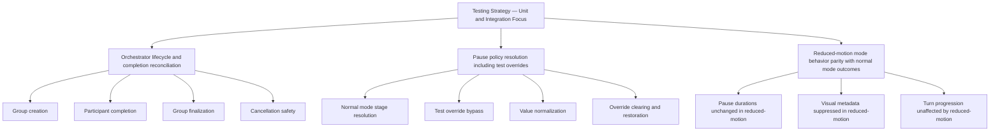

# Review Report: Card Animation System — T-15 GREEN Phase

**Review Mode:** Incremental (T-15: Add unit and integration validation suite — GREEN phase implementation)
**Source:** `docs/specs/ui/card-animations/`
**Reviewed against:** proposal.md, spec.md, user-stories.md, bdd-test.md, design.md, tasks.md

## 1. Executive Summary

The T-15 implementation delivers a solid unit and integration test suite for the animation orchestrator lifecycle, pause policy, reduced-motion behavior, and recovery logic. Both dedicated service-level unit tests and component-level integration tests validate the acceptance criteria meaningfully. All assertions test concrete state shapes and behavioral outcomes rather than superficial existence checks.

- Total findings: 4 (0 Critical, 0 Major, 3 Minor, 1 Note)
- Spec compliance: 5 of 6 scoped requirements fully met, 1 partially met
- Architecture alignment: Aligned — actual test structure matches planned testing strategy from design.md section 13
- Test quality: Strong — meaningful assertions throughout, no superficial or tautological tests

## 2. Architecture Comparison

### 2.1 Planned Testing Strategy (from design.md section 13)

### 2.2 Actual Test Coverage Structure

```mermaid
flowchart TD
  TS[T-15 Test Implementation] --> US[Unit Specs — Service Level]
  TS --> IS[Integration Specs — Component Level]
  US --> OS[card-animation-orchestrator.spec.ts — 11 tests]
  US --> PS[turn-pause-policy.spec.ts — 7 tests]
  IS --> DO[game-table-page.deal-opponent.spec.ts — T-10/T-11/T-12/T-13 tests]
  IS --> EB[game-table-page.escoba-burst.spec.ts — reduced-motion Escoba]
  IS --> MS[game-table-page.spec.ts — reduced-motion pause sequencing]
  OS --> INIT[Initial empty state]
  OS --> GC5[Group creation — all 5 action types via it.each]
  OS --> PC[Participant completion tracking]
  OS --> CLAMP[Progress clamping 0-100]
  OS --> SINGLE[Single-card accounting before finalization]
  OS --> FIN[Finalization and completion publishing]
  OS --> UNK[Unknown group finalization ignored]
  OS --> CDIST[Canceled vs completed distinction]
  OS --> CANCEL[Cancel clears active without publishing]
  OS --> NORECON[Canceled cannot be reconciled via finalize]
  OS --> UNKNCARD[Unknown card ignored]
  PS --> STAGES[All 5 stage durations in normal mode]
  PS --> RMP[Reduced-motion parity — identical pause]
  PS --> OVERRIDE[Runtime override to zero]
  PS --> NORML[Override normalization — non-negative integer]
  PS --> BOTH[Override identical across timing modes]
  PS --> CLR[Override clearing restores defaults]
```

### 2.3 Drift Analysis

The actual test structure is well-aligned with the planned testing strategy. All three acceptance criteria for T-15 are addressed:

1. **Group lifecycle and completion reconciliation:** Comprehensively covered in the orchestrator spec (group creation for all 5 action types, participant completion, finalization, completion publishing, cancellation safety, and non-reconciliation of canceled groups).

2. **Pause override behavior:** Fully covered in the pause policy spec (runtime override to zero, normalization of negative and fractional values, identical behavior across timing modes, and override clearing back to null).

3. **Reduced-motion parity of outcomes:** Covered at the pause policy level (reduced-motion resolves identical durations) and through integration tests in the deal-opponent and escoba-burst specs (visual metadata suppression, pause enforcement under reduced-motion, and turn progression behavior). A minor gap exists at the orchestrator unit level where mode-invariance is architectural rather than explicitly tested.

Integration-level coverage across the component specs validates orchestrator behavior in realistic scenarios: fallback completion recovery (T-12), keyboard focus stability (T-13), AI completion-driven timing (T-10), and reduced-motion path suppression (T-11).

## 3. Findings

### RV-01: Unnecessary type cast to access public cancelGroup method [Minor]

- **Category:** Code Quality
- **Severity:** Minor
- **Related:** AD-2, T-15, TR-8, US-12
- **Description:** In the orchestrator spec, one test accesses the cancelGroup method via an `as unknown as` type cast as if it were a private member. The very next test in the same file calls the same method directly on the service instance without any casting.
- **Expected:** Consistent access pattern — since cancelGroup is a public method on CardAnimationOrchestrator, all tests should invoke it directly.
- **Actual:** The test titled "marks an active group as canceled..." uses a runtime cast, while "does not reconcile canceled groups..." calls the method directly.
- **Recommendation:** Remove the type cast from the first cancellation test and call cancelGroup directly, matching the pattern used in the subsequent test.
- **Impact:** Confusing for reviewers — suggests the method's visibility was changed during development but the earlier test was not updated.

### RV-02: Missing test for hasRuntimeOverride query method [Minor]

- **Category:** Test Coverage
- **Severity:** Minor
- **Related:** AD-3, T-15, TR-4, US-14
- **Description:** TurnPausePolicy exposes a public `hasRuntimeOverride()` boolean method used by orchestration consumers to detect whether test mode is active. No test exercises this method.
- **Expected:** At least one test verifying that hasRuntimeOverride returns false by default, true after setRuntimeOverrideMs is called with a numeric value, and false again after override is cleared to null.
- **Actual:** The method is untested despite being part of the public contract that T-3 introduced and T-15 should validate.
- **Recommendation:** Add a brief test asserting the full lifecycle of hasRuntimeOverride: false initially, true when override is set, false when cleared.
- **Impact:** The override detection query could regress without protection; consumers relying on this signal for conditional behavior would have no test coverage.

### RV-03: No orchestrator-level reduced-motion outcome equivalence test [Minor]

- **Category:** Test Coverage
- **Severity:** Minor
- **Related:** AD-5, T-15, TR-6, US-9, SC-20
- **Description:** T-15 acceptance criterion 3 requires "reduced-motion parity of outcomes is covered." The pause policy spec fully validates this for pause durations, and integration specs validate visual metadata suppression. However, the orchestrator unit spec does not include any test demonstrating that group lifecycle transitions (start, complete, finalize, cancel) produce identical state outcomes regardless of whether the context is normal or reduced-motion.
- **Expected:** At minimum a brief test or documented rationale confirming orchestrator state shapes are mode-agnostic.
- **Actual:** The orchestrator tests never reference reduced-motion. The architecture naturally isolates this concern to the pause layer and CSS, but the explicit traceability gap exists at the unit test level.
- **Recommendation:** Consider adding a single orchestrator test that exercises the full lifecycle and asserts the final state matches normal-mode expectations, or document in a test comment that orchestrator state is mode-invariant by design (the parity assertion lives exclusively in the pause policy and integration layers).
- **Impact:** Low — the architecture correctly isolates this concern, but the explicit traceability gap could be noted during audit. Integration tests in the deal-opponent and escoba-burst specs do validate reduced-motion behavior at the component boundary.

### RV-04: Integration test coverage is distributed across multiple task-scoped spec files [Note]

- **Category:** Code Quality
- **Severity:** Note
- **Related:** AD-2, AD-3, T-15, TR-8, US-14
- **Description:** T-15's integration validation is distributed across multiple spec files originally created for earlier tasks (deal-opponent, escoba-burst, main game-table-page). Tests for orchestrator lifecycle recovery (T-12), accessibility during animation (T-13), and reduced-motion (T-11) live in the deal-opponent spec rather than a dedicated T-15 integration file.
- **Expected:** T-15 integration tests could be co-located for discoverability.
- **Actual:** Integration coverage exists but requires searching across multiple spec files to locate all tests relevant to T-15's acceptance criteria.
- **Recommendation:** No action required — the approach of extending existing task-scoped spec files is a valid pattern that avoids test duplication. The traceability comments at the top of each file help locate relevant coverage. This is informational only.
- **Impact:** None functionally — discoverers reading T-15 may need to check multiple files to understand total coverage.

## 4. Traceability Matrix

| Finding | Severity | Category      | Related Spec            | Status                 |
| ------- | -------- | ------------- | ----------------------- | ---------------------- |
| RV-01   | Minor    | Code Quality  | AD-2, TR-8, US-12       | Open                   |
| RV-02   | Minor    | Test Coverage | AD-3, TR-4, US-14       | Open                   |
| RV-03   | Minor    | Test Coverage | AD-5, TR-6, US-9, SC-20 | Open                   |
| RV-04   | Note     | Code Quality  | AD-2, AD-3, TR-8, US-14 | Closed (informational) |

## 5. Spec Compliance Summary (T-15 Scope)

| Requirement | Status     | Notes                                                                                                                              |
| ----------- | ---------- | ---------------------------------------------------------------------------------------------------------------------------------- |
| TR-1        | ✅ Met     | Animation state signal contract verified via initial state and group lifecycle assertions in orchestrator spec                     |
| TR-4        | ✅ Met     | Stage resolution, override, normalization, and override clearing all covered in pause policy spec                                  |
| TR-6        | ⚠️ Partial | Reduced-motion parity fully validated at pause and integration layers; orchestrator-level explicit equivalence not present (RV-03) |
| TR-8        | ✅ Met     | Completion signalling, finalization, cancellation non-reconciliation, and fallback recovery all tested                             |
| US-12       | ✅ Met     | Animation state isolation from game logic confirmed through group lifecycle and integration tests                                  |
| US-14       | ✅ Met     | Test determinism via override, override reversibility, and comprehensive behavioral assertions                                     |

## 6. Task Completion Summary

| Task | Title                                     | Status                    | Findings            |
| ---- | ----------------------------------------- | ------------------------- | ------------------- |
| T-15 | Add unit and integration validation suite | ⚠️ Partial (3 Minor gaps) | RV-01, RV-02, RV-03 |

## 7. Test Coverage Summary

| Scenario | Tested in Scope                                                               | Meaningful | Findings |
| -------- | ----------------------------------------------------------------------------- | ---------- | -------- |
| SC-19    | ✅ Yes (pause parity, override clearing, reduced-motion pause enforcement)    | ✅ Yes     | —        |
| SC-20    | ✅ Yes (orchestrator lifecycle, animation state isolation)                    | ✅ Yes     | RV-03    |
| SC-21    | ✅ Yes (cancellation non-reconciliation, fallback recovery, teardown cleanup) | ✅ Yes     | —        |

## 8. Test Quality Summary

| Test File                             | Type        | Meaningful Assertions                                                                | Issues                                      |
| ------------------------------------- | ----------- | ------------------------------------------------------------------------------------ | ------------------------------------------- |
| card-animation-orchestrator.spec.ts   | Unit        | ✅ Yes — all assertions verify concrete state shapes                                 | Unnecessary type cast (RV-01)               |
| turn-pause-policy.spec.ts             | Unit        | ✅ Yes — validates full override lifecycle and normalization                         | Missing hasRuntimeOverride coverage (RV-02) |
| game-table-page.deal-opponent.spec.ts | Integration | ✅ Yes — validates recovery, accessibility, and reduced-motion at component boundary | None                                        |
| game-table-page.escoba-burst.spec.ts  | Integration | ✅ Yes — validates reduced-motion Escoba path                                        | None                                        |
| game-table-page.spec.ts               | Integration | ✅ Yes — validates reduced-motion pause enforcement and confirm flow                 | None                                        |

## 9. Security Cross-Reference

The companion security report (`security-report_T-15.md`) identifies no Critical or High findings. One Low-severity finding (SEC-01) notes Moderate vulnerabilities in the Cypress dependency chain (OWASP A06:2021). This does not impact T-15's functional correctness or spec compliance.

## 10. Recommendations

### Critical (blocks release)

_None._

### Major (fix before merge)

_None._

### Minor (improvement)

1. **Remove unnecessary type cast** (RV-01): Call cancelGroup directly in the first cancellation test — the method is public and accessible without casting.
2. **Add hasRuntimeOverride test** (RV-02): Cover the boolean query method to protect consumers that rely on override state detection.
3. **Consider orchestrator-level parity assertion** (RV-03): Either add a brief test exercising the lifecycle under a declared reduced-motion context, or add a comment documenting that orchestrator state is architecturally mode-invariant and parity validation lives in the pause policy and integration layers.

### Notes (informational)

1. **Distributed integration coverage** (RV-04): T-15 integration tests are spread across multiple task-scoped spec files. This is a valid approach that avoids duplication but may require cross-referencing for full T-15 traceability.
