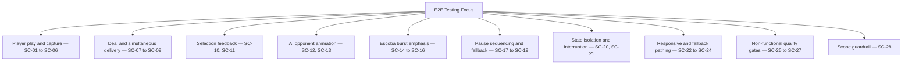

# Review Report: Card Animation System — T-16

**Review Mode:** Incremental (T-16: Align and execute E2E scenarios from BDD)
**Source:** `docs/specs/ui/card-animations/`
**Reviewed against:** proposal.md, spec.md, user-stories.md, bdd-test.md, design.md, tasks.md

## 1. Executive Summary

T-16 delivers meaningful E2E coverage for the majority of the card-animations BDD scenarios. The implemented feature files and step definitions cover the core happy-path scenarios (play, capture, deal, opponent, Escoba, turn sequencing, responsive, scope guardrail) with assertions that validate real CSS properties, animation classes, timing values, and state transitions. However, several BDD scenarios from the reduced-motion alternative path family and the animation state isolation category lack dedicated E2E representation. The step definitions are well-structured, use deterministic test fixtures where appropriate, and avoid superficial assertions.

- Total findings: 5 (0 Critical, 2 Major, 2 Minor, 1 Note)
- Spec compliance: 17 of 28 BDD scenarios fully represented; 4 partially covered via shared steps; 7 not represented
- Architecture alignment: Aligned — E2E feature files map to the planned testing strategy categories from design.md section 13
- Test quality: Meaningful — assertions verify CSS computed values, animation classes, timing ranges, and state progression

## 2. Architecture Comparison

### 2.1 Planned E2E Coverage (from design.md section 13 and bdd-test.md)

### 2.2 Actual E2E Coverage Structure

```mermaid
flowchart TD
  E2E[T-16 E2E Implementation] --> PPC[player-play-capture-animations.feature]
  E2E --> DEAL[deal-opponent-animations.feature]
  E2E --> ESC[escoba-burst-emphasis.feature]
  E2E --> PAUSE[turn-sequencing-completion.feature]
  E2E --> RESP[game-table-responsive.feature]
  E2E --> A11Y[game-table-accessibility.feature]
  E2E --> ZONE[zone-animation-metadata.feature]
  E2E --> GUARD[scope-guardrail-remote-multiplayer.feature]

  PPC --> SC01[SC-01: Arc motion]
  PPC --> SC02[SC-02: Timing envelope]
  PPC --> SC04[SC-04: Capture glow]
  PPC --> SC05[SC-05: Simultaneous capture]

  DEAL --> SC07[SC-07: Deal from deck]
  DEAL --> SC08[SC-08: Simultaneous deal]
  DEAL --> SC12[SC-12: AI same visual language]

  ESC --> SC14[SC-14: Escoba burst]
  ESC --> SC15[SC-15: Escoba faster timing]
  ESC --> SC16[SC-16: Escoba reduced-motion]

  PAUSE --> SC17[SC-17: Pause before phase]
  PAUSE --> SC18[SC-18: Missing completion fallback]
  PAUSE --> SC19[SC-19: Reduced-motion pause]

  RESP --> SC22[SC-22: Viewport paths]
  RESP --> SC23[SC-23: Fallback path]
  RESP --> SC24[SC-24: Performance proxy]

  A11Y --> SC25p[SC-25 partial: Keyboard during animation]
  A11Y --> RM[Reduced-motion selection/capture]

  ZONE --> META[Zone metadata integration]
  GUARD --> SC28[SC-28: Scope guardrail]
```

### 2.3 Drift Analysis

The actual E2E structure covers 8 feature files addressing the animation system. The major structural gaps are:

1. **No dedicated reduced-motion feature file** covering SC-03 (play reduced-motion), SC-06 (capture reduced-motion), SC-09 (deal reduced-motion), and SC-13 (AI reduced-motion) as stand-alone scenarios. Reduced-motion is partially covered via SC-16 (Escoba), SC-19 (pause), and the accessibility feature's reduced-motion selection/capture scenario.

2. **No selection feedback feature file** covering SC-10 (hover/focus affordance) and SC-11 (select/deselect distinct from capture). These are CSS-transition-based UI feedback scenarios not exercised in any card-animation-specific E2E.

3. **No animation state isolation feature file** covering SC-20 (state updates don't alter rules) and SC-21 (interruption preserves consistency). These are implicitly validated by the fact that game progression works, but are never explicitly asserted.

4. **No browser compatibility or maintainability scenarios** for SC-26 and SC-27. These are architectural and infrastructure quality gates unlikely to be tested via Cypress E2E.

## 3. Findings

### RV-01: Reduced-motion play, capture, deal, and AI scenarios (SC-03, SC-06, SC-09, SC-13) lack dedicated E2E representation [Major]

- **Category:** Test Coverage
- **Severity:** Major
- **Related:** SC-03, SC-06, SC-09, SC-13, AD-5, TR-6, NFR-3, US-9, T-16
- **Description:** The BDD spec defines four distinct reduced-motion alternative path scenarios: SC-03 (player play appears instantly without motion), SC-06 (captured cards removed instantly without glow/fade), SC-09 (dealt cards appear instantly), and SC-13 (AI actions instant without motion). None of these have a dedicated E2E scenario asserting that animation classes are absent or that CSS animation-duration is zero under reduced-motion.
- **Expected:** Per T-16 acceptance criteria ("Core scenarios from bdd-test are represented and traceable") and per US-14 ("Tests verify prefers-reduced-motion behavior — animations disabled, game still functional"), each reduced-motion path should have explicit E2E validation.
- **Actual:** SC-16 (Escoba reduced-motion) and SC-19 (pause reduced-motion) are explicitly covered. The accessibility feature's reduced-motion scenario validates state outcomes but does not verify absence of animation classes or zero-duration timing for play/capture/deal/AI specifically.
- **Recommendation:** Add a reduced-motion E2E feature file (or extend existing files) with scenarios that apply reduced-motion preference via the test seam, then assert that play, capture, deal, and opponent animation classes are either absent or have zero-duration timing. The existing test API seam for reduced-motion (used in turn-sequencing-completion and escoba-burst-emphasis) demonstrates the pattern.
- **Impact:** Without explicit reduced-motion E2E coverage for core animation flows, a regression that breaks reduced-motion for play or capture would go undetected by the E2E suite while being caught only by unit tests.

### RV-02: Animation state isolation and interruption scenarios (SC-20, SC-21) have no E2E representation [Major]

- **Category:** Test Coverage
- **Severity:** Major
- **Related:** SC-20, SC-21, TR-1, TR-8, US-12, T-16
- **Description:** BDD scenarios SC-20 (animation state updates do not alter rule outcomes) and SC-21 (animation interruption preserves game consistency) define critical safety properties of the animation system — that animation is purely presentational and that interruption cannot leave orphaned or duplicate cards. Neither scenario has a dedicated E2E test.
- **Expected:** Per T-16 acceptance criteria and US-12 ("E2E tests pass with animations disabled, proving game logic is animation-independent"), an explicit E2E scenario should validate that game state remains correct regardless of animation presence.
- **Actual:** Game progression implicitly validates this (turns advance, cards move correctly), but no scenario explicitly asserts that animation signals do not alter game engine state or that cancellation leaves the DOM consistent. The turn-sequencing-completion SC-18 (missing completion fallback) covers one aspect of resilience but does not verify card DOM consistency after interruption.
- **Recommendation:** Add an E2E scenario that exercises game progression with animations active and verifies that card counts, scoring, and turn state match expected values (SC-20). Add a scenario that triggers a state change during animation (e.g., rapid double-confirmation or route change) and verifies no orphaned card visuals remain (SC-21).
- **Impact:** These scenarios protect the core architectural decision AD-1 (animation is presentation-only). Without them, a coupling leak between animation state and game state could go undetected at the integration level.

### RV-03: Selection feedback scenarios (SC-10, SC-11) not covered in card-animations E2E suite [Minor]

- **Category:** Test Coverage
- **Severity:** Minor
- **Related:** SC-10, SC-11, FR-4, NFR-2, US-4, T-16
- **Description:** BDD scenarios SC-10 (hover/focus shows immediate selection affordance) and SC-11 (selection highlight is distinct from capture glow) are not represented in any card-animation-specific E2E feature file. The game-table-accessibility feature validates that selection state is programmatically exposed (aria-pressed), but does not verify the visual CSS feedback (scale, glow) or distinguish it from capture effects.
- **Expected:** T-16 should cover "core scenarios from bdd-test." SC-10 and SC-11 verify FR-4 (selection visual feedback), which is part of the card animation system scope.
- **Actual:** Selection feedback is tested at the interaction level (aria-pressed state toggling) but not at the visual animation level (CSS scale, glow colour, distinction from capture glow).
- **Recommendation:** These are minor because selection feedback is a CSS transition (120ms), not a full animation flow, and the existing unit tests likely cover the class application. However, for full traceability, consider adding a lightweight E2E scenario verifying that selected cards have a distinct visual class from captured cards.
- **Impact:** Low — selection feedback is primarily CSS and already works. The risk is that a style regression could make selection and capture visually indistinguishable.

### RV-04: SC-24 identifier collision between game-table-mvp and card-animations specs in game-table-responsive.feature [Minor]

- **Category:** Test Coverage
- **Severity:** Minor
- **Related:** SC-24, TR-7, NFR-1, US-10, T-14, T-16
- **Description:** The game-table-responsive.feature file contains two scenarios with the SC-24 identifier. The first (mobile baseline usability) comes from the game-table-mvp spec. The second (animation sequencing remains smooth) comes from the card-animations spec. This makes traceability ambiguous.
- **Expected:** Each SC-XX identifier should map unambiguously to a single BDD scenario definition.
- **Actual:** Duplicate SC-24 identifiers coexist in the same feature file. This was previously flagged in the T-14 review (RV-01) but remains unresolved.
- **Recommendation:** Disambiguate by prefixing or suffixing the card-animations SC-24 (e.g., "SC-24-anim") or renaming the scenario identifier to avoid collision with the game-table-mvp SC-24.
- **Impact:** Traceability confusion only — both tests are meaningful and test different things.

### RV-05: Non-functional quality gate scenarios SC-26 and SC-27 not represented in E2E [Note]

- **Category:** Test Coverage
- **Severity:** Note
- **Related:** SC-26, SC-27, NFR-5, NFR-6, US-13, US-14, T-16
- **Description:** SC-26 (browser compatibility across supported families) and SC-27 (animation architecture maintainability and extensibility) are non-functional quality gate scenarios that are not represented in the Cypress E2E suite. SC-26 would require cross-browser infrastructure (BrowserStack); SC-27 is an architectural characteristic that cannot be meaningfully automated.
- **Expected:** These scenarios are typically validated through manual review, CI pipeline configuration (cross-browser matrix), and code architecture assessment rather than automated E2E tests.
- **Actual:** No E2E representation exists, which is architecturally reasonable for these specific scenario types.
- **Recommendation:** Document SC-26 as requiring cross-browser CI matrix validation (outside Cypress scope) and SC-27 as satisfied by the design review process and the modular architecture decisions (AD-1 through AD-7). No code change needed.
- **Impact:** None for automated testing — these are process-level quality gates.

## 4. Traceability Matrix

| Finding | Severity | Category      | Related Spec                                              | Status |
| ------- | -------- | ------------- | --------------------------------------------------------- | ------ |
| RV-01   | Major    | Test Coverage | SC-03, SC-06, SC-09, SC-13, AD-5, TR-6, NFR-3, US-9, T-16 | Open   |
| RV-02   | Major    | Test Coverage | SC-20, SC-21, TR-1, TR-8, US-12, T-16                     | Open   |
| RV-03   | Minor    | Test Coverage | SC-10, SC-11, FR-4, NFR-2, US-4, T-16                     | Open   |
| RV-04   | Minor    | Test Coverage | SC-24, TR-7, NFR-1, US-10, T-14, T-16                     | Open   |
| RV-05   | Note     | Test Coverage | SC-26, SC-27, NFR-5, NFR-6, US-13, US-14, T-16            | Open   |

## 5. Spec Compliance Summary

| Requirement | Status     | Notes                                                                                                           |
| ----------- | ---------- | --------------------------------------------------------------------------------------------------------------- |
| FR-1        | ✅ Met     | SC-01, SC-02 E2E fully exercise play animation arc, timing, and easing                                          |
| FR-2        | ✅ Met     | SC-04, SC-05 E2E verify capture glow, fade, simultaneous start                                                  |
| FR-3        | ✅ Met     | SC-07, SC-08 E2E verify deal class, simultaneous delivery                                                       |
| FR-4        | ⚠️ Partial | Selection interaction tested via aria-pressed but visual feedback (scale, glow distinction) not asserted in E2E |
| FR-5        | ✅ Met     | SC-12 verifies AI animation with player visual language; SC-28 enforces scope boundary                          |
| FR-6        | ✅ Met     | SC-14, SC-15, SC-16 fully cover Escoba burst, timing, and reduced-motion                                        |
| FR-7        | ✅ Met     | SC-17, SC-18, SC-19 verify pause timing, fallback, and reduced-motion pause                                     |
| FR-8        | ✅ Met     | SC-12 verifies AI uses same timing envelope and easing as player                                                |
| TR-1        | ⚠️ Partial | Animation state isolation (SC-20) not explicitly tested at E2E level                                            |
| TR-2        | ✅ Met     | CSS animation properties verified (animation-name, animation-duration, animation-timing-function, transform)    |
| TR-4        | ✅ Met     | Pause sequencing verified via test API seam                                                                     |
| TR-5        | ✅ Met     | Responsive path tested across mobile/tablet/desktop viewports                                                   |
| TR-6        | ⚠️ Partial | Reduced-motion covered for Escoba and pause; missing for play/capture/deal/AI                                   |
| TR-7        | ✅ Met     | GPU-property assertion validates transform/opacity only usage                                                   |
| TR-8        | ✅ Met     | Completion signaling and fallback tested via SC-17, SC-18                                                       |
| NFR-1       | ✅ Met     | Performance proxy via transform/opacity assertion in responsive feature                                         |
| NFR-2       | ✅ Met     | Keyboard stability during animation load verified; focus visibility asserted                                    |
| NFR-3       | ⚠️ Partial | Reduced-motion tested for Escoba, pause, and selection/capture — but not for play/deal/AI core flows            |
| NFR-4       | ✅ Met     | Responsive viewport testing across 3 breakpoints with bound verification                                        |
| NFR-5       | ⚠️ Partial | No cross-browser E2E (SC-26); expected to be validated via CI matrix                                            |
| NFR-6       | ⚠️ Partial | Maintainability (SC-27) is architectural; confirmed by modular design                                           |
| NFR-7       | ✅ Met     | Escoba visual distinction from normal capture explicitly tested with enhanced timing                            |
| US-1        | ✅ Met     | Play animation fully verified                                                                                   |
| US-2        | ✅ Met     | Capture animation fully verified                                                                                |
| US-3        | ✅ Met     | Deal animation fully verified                                                                                   |
| US-4        | ⚠️ Partial | Interaction feedback tested but visual scale/glow not E2E-asserted                                              |
| US-5        | ✅ Met     | AI opponent animation covered in SC-12 with scope guardrail SC-28                                               |
| US-6        | ✅ Met     | Escoba special effect covered across all three scenarios                                                        |
| US-7        | ✅ Met     | Pause orchestration verified                                                                                    |
| US-8        | ✅ Met     | AI turn animation timing verified                                                                               |
| US-9        | ⚠️ Partial | Reduced-motion covered for subset of scenarios only                                                             |
| US-10       | ✅ Met     | Performance proxy validated; responsive path correct                                                            |
| US-11       | ✅ Met     | Responsive coordinate adaptation tested across viewports                                                        |
| US-12       | ⚠️ Partial | State isolation implicitly validated but not explicitly asserted in E2E                                         |
| US-13       | ⚠️ Partial | Extensibility is architectural; no automated E2E for this                                                       |
| US-14       | ⚠️ Partial | E2E tests validate timing and completion but don't explicitly test with animations fully disabled               |

## 6. Task Completion Summary

| Task | Title                                    | Status     | Findings                          |
| ---- | ---------------------------------------- | ---------- | --------------------------------- |
| T-16 | Align and execute E2E scenarios from BDD | ⚠️ Partial | RV-01, RV-02, RV-03, RV-04, RV-05 |

## 7. Test Coverage Summary

| Scenario | Step Definitions | Meaningful | Findings            |
| -------- | ---------------- | ---------- | ------------------- |
| SC-01    | ✅ Yes           | ✅ Yes     | —                   |
| SC-02    | ✅ Yes           | ✅ Yes     | —                   |
| SC-03    | ❌ No            | ❌ No      | RV-01               |
| SC-04    | ✅ Yes           | ✅ Yes     | —                   |
| SC-05    | ✅ Yes           | ✅ Yes     | —                   |
| SC-06    | ❌ No            | ❌ No      | RV-01               |
| SC-07    | ✅ Yes           | ✅ Yes     | —                   |
| SC-08    | ✅ Yes           | ✅ Yes     | —                   |
| SC-09    | ❌ No            | ❌ No      | RV-01               |
| SC-10    | ❌ No            | ❌ No      | RV-03               |
| SC-11    | ❌ No            | ❌ No      | RV-03               |
| SC-12    | ✅ Yes           | ✅ Yes     | —                   |
| SC-13    | ❌ No            | ❌ No      | RV-01               |
| SC-14    | ✅ Yes           | ✅ Yes     | —                   |
| SC-15    | ✅ Yes           | ✅ Yes     | —                   |
| SC-16    | ✅ Yes           | ✅ Yes     | —                   |
| SC-17    | ✅ Yes           | ✅ Yes     | —                   |
| SC-18    | ✅ Yes           | ✅ Yes     | —                   |
| SC-19    | ✅ Yes           | ✅ Yes     | —                   |
| SC-20    | ❌ No            | ❌ No      | RV-02               |
| SC-21    | ❌ No            | ❌ No      | RV-02               |
| SC-22    | ✅ Yes           | ✅ Yes     | —                   |
| SC-23    | ✅ Yes           | ✅ Yes     | —                   |
| SC-24    | ✅ Yes           | ⚠️ Partial | RV-04               |
| SC-25    | ✅ Yes           | ✅ Yes     | —                   |
| SC-26    | ❌ No            | ❌ No      | RV-05               |
| SC-27    | ❌ No            | ❌ No      | RV-05               |
| SC-28    | ✅ Yes           | ⚠️ Partial | Previously reviewed |

## 8. Test Quality Summary

| Test File                                              | Type        | Meaningful Assertions | Issues                                                                                |
| ------------------------------------------------------ | ----------- | --------------------- | ------------------------------------------------------------------------------------- |
| player-play-capture-animations.feature                 | E2E Feature | ✅ Yes                | None                                                                                  |
| player-play-capture-animations.ts                      | E2E Steps   | ✅ Yes                | None — verifies computed CSS properties, animation classes, and state transitions     |
| deal-opponent-animations.feature                       | E2E Feature | ✅ Yes                | None                                                                                  |
| deal-opponent-animations.ts                            | E2E Steps   | ✅ Yes                | None — verifies deal class presence, simultaneous timing, and AI animation properties |
| escoba-burst-emphasis.feature                          | E2E Feature | ✅ Yes                | None                                                                                  |
| escoba-burst-emphasis.ts                               | E2E Steps   | ✅ Yes                | None — verifies Escoba class presence, timing range, and reduced-motion absence       |
| turn-sequencing-completion.feature                     | E2E Feature | ✅ Yes                | None                                                                                  |
| turn-sequencing-completion.ts                          | E2E Steps   | ✅ Yes                | None — uses test API seam for deterministic state; verifies pause range and recovery  |
| game-table-responsive.feature                          | E2E Feature | ✅ Yes                | SC-24 ID collision (RV-04)                                                            |
| game-table.ts (responsive steps)                       | E2E Steps   | ✅ Yes                | None — verifies geometric bounds, fallback progression, GPU-only properties           |
| game-table-accessibility.feature (animation scenarios) | E2E Feature | ✅ Yes                | None                                                                                  |
| game-table.ts (accessibility animation steps)          | E2E Steps   | ✅ Yes                | None — verifies focus stability, focus-visible, and reduced-motion outcomes           |
| zone-animation-metadata.feature                        | E2E Feature | ✅ Yes                | None                                                                                  |
| zone-animation-metadata.ts                             | E2E Steps   | ✅ Yes                | None — verifies class integration chain from fixture through zones to DOM             |
| scope-guardrail-remote-multiplayer.feature             | E2E Feature | ⚠️ Partial            | Previously reviewed (RV-01 from T-16 red-guardrail report)                            |
| scope-guardrail-remote-multiplayer.ts                  | E2E Steps   | ⚠️ Partial            | Previously reviewed — 1 of 3 assertions genuinely guards animation scope              |

## 9. Security Cross-Reference

See `docs/specs/ui/card-animations/security-report_T-16.md` for the full security analysis.

| SEC ID | Severity | OWASP    | Summary                                                      |
| ------ | -------- | -------- | ------------------------------------------------------------ |
| SEC-01 | Medium   | A06:2021 | Moderate vulnerabilities in Cypress tooling dependency chain |

No Critical or High security findings. The Medium finding relates to development tooling dependencies and does not affect production runtime.

## 10. Recommendations

### Critical (blocks release)

None.

### Major (fix before merge)

1. **Add reduced-motion E2E scenarios for play, capture, deal, and AI (SC-03, SC-06, SC-09, SC-13).** The test seam pattern is already established in escoba-burst-emphasis and turn-sequencing-completion. Extend this to verify animation class absence and zero-duration timing under reduced-motion for the core action types.
2. **Add animation state isolation and interruption scenarios (SC-20, SC-21).** Verify that game card counts and scoring remain correct with animations active (SC-20), and that DOM consistency is preserved when state changes occur during animation (SC-21).

### Minor (improvement)

1. **Resolve SC-24 identifier collision** between game-table-mvp and card-animations in game-table-responsive.feature. Previously flagged in T-14 review.
2. **Consider lightweight selection feedback E2E (SC-10, SC-11)** to validate visual class distinction between selection and capture states.

### Notes (informational)

1. SC-26 (browser compatibility) and SC-27 (maintainability) are non-automatable quality gates best validated through CI cross-browser matrix and design review respectively.
