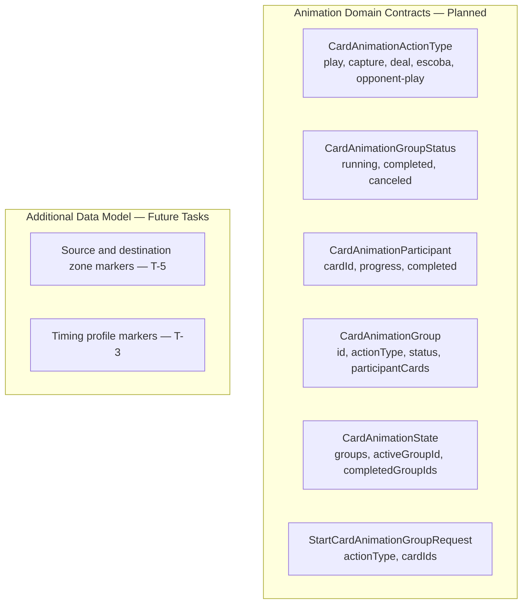
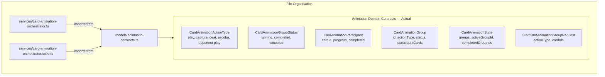

# Review Report: Card Animation System — T-1 Animation Domain Contracts (GREEN Phase)

**Review Mode:** Incremental (T-1: Define animation domain contracts) — Implementation (GREEN Phase)
**Source:** `docs/specs/ui/card-animations/`
**Reviewed against:** proposal.md, spec.md, user-stories.md, bdd-test.md, design.md, tasks.md

## 1. Executive Summary

The GREEN phase implementation of T-1 delivers a clean, well-structured extraction of animation domain contracts into a dedicated feature-scoped model file, along with a fully functional orchestrator service that exercises those contracts. The model extraction to `models/animation-contracts.ts` aligns with the session analysis plan and establishes the contract surface specified in design.md Section 8. The orchestrator service properly imports from the new location, uses `@Injectable()` without `providedIn` for feature scope (matching AD-1), and exposes read-only state via Angular signals. Tests have been expanded since the RED phase to address previously identified boundary gaps (progress clamping, unknown group/card handling, single-card accounting). One Minor finding exists regarding a test that creates a misleading coverage appearance for the 'canceled' lifecycle state. One Note observes that the `lastCompletedGroupId` baseline assertion is only implicitly validated (via the unknown-group test) rather than explicitly in the initial state test.

- Total findings: 3 (0 Critical, 0 Major, 1 Minor, 2 Note)
- Spec compliance: 3 of 3 T-1 requirements fully met
- Architecture alignment: Aligned
- Test quality: Meaningful

## 2. Architecture Comparison

### 2.1 Planned Contract Surface (from design.md Section 8)

### 2.2 Actual Contract Surface (implemented)

### 2.3 Drift Analysis

**No structural deviation from the planned architecture.** All six contract types defined in design.md Section 8 are present in `models/animation-contracts.ts` with the exact fields and values specified. The model extraction from the service file to a dedicated models directory is clean — both the service and its test import from the new location with no residual type exports in the service file.

**Zone and timing metadata absent but planned for later tasks.** Design.md Section 8 also describes "Source zone and destination zone markers" and "Timing profile markers." These are not in the current contracts, which is appropriate — zone metadata is T-5 scope and timing configuration is T-3 scope. No premature abstraction has been introduced.

**Orchestrator behaviour is consistent with contracts.** The service correctly uses the defined types: groups are created with `running` status, participants track `progress` and `completed`, and finalization transitions groups to `completed` status. The `canceled` status exists in the type but has no transition method — deferred to T-12 (Resilience and cancellation).

## 3. Findings

### RV-01: Canceled lifecycle test creates misleading coverage appearance [Minor]

- **Category:** Test Quality
- **Severity:** Minor
- **Related:** AD-2, T-12, design.md Section 8
- **Description:** The test titled "preserves canceled lifecycle as a distinct contract state from normal completion flow" does not actually exercise the canceled state. It completes and finalizes a group, then asserts the status is `completed` and is not `canceled`. This verifies the completed path, not the canceled path.
- **Expected:** Since `CardAnimationGroupStatus` defines 'canceled' as a valid lifecycle state and design.md Section 10 describes cancellation as a recovery mechanism, the contract test should document when a group transitions to 'canceled' — or the test title should accurately describe what it validates.
- **Actual:** The test only proves that normal completion does not accidentally produce a 'canceled' status. It exercises no actual cancellation transition because no `cancelGroup` method exists yet (deferred to T-12).
- **Recommendation:** Rename the test to accurately describe its assertion (e.g., "normal finalization produces completed status, never canceled") or defer the 'canceled' state contract test entirely to T-12 when the cancellation method is implemented. The current title implies coverage that does not exist.
- **Impact:** Creates false confidence that the 'canceled' lifecycle is tested. Developers reviewing test names may believe this contract is validated when it is only negatively asserted.

### RV-02: Initial state test omits explicit lastCompletedGroupId baseline [Note]

- **Category:** Test Coverage
- **Severity:** Note
- **Related:** TR-8, US-12, SC-20
- **Description:** The initial state test verifies the empty `animationState()` structure but does not assert that `lastCompletedGroupId()` returns `null` at baseline.
- **Expected:** The baseline contract for the completion notification signal should be explicitly documented in the initial state test.
- **Actual:** The `null` baseline is implicitly validated by the "ignores finalization attempts for unknown groups" test, which checks `lastCompletedGroupId()` is `null` after a no-op call. The initial state test does not include this assertion.
- **Recommendation:** Add `expect(service.lastCompletedGroupId()).toBeNull()` to the initial state test for explicit contract documentation. Low priority since the behaviour is covered elsewhere.
- **Impact:** Minimal. The baseline is implicitly proven. This is a documentation clarity opportunity, not a functional gap.

### RV-03: Completion accounting implicit — no test verifies expected vs acknowledged count [Note]

- **Category:** Test Coverage
- **Severity:** Note
- **Related:** T-1 AC-3, design.md Section 8
- **Description:** Design.md Section 8 specifies "Completion counters for expected versus acknowledged participants" as part of the data model. The current implementation and tests demonstrate that individual participants track progress and completed status, and that groups can be finalized regardless of participant completion state. However, no test explicitly verifies the "all participants must complete before finalization is valid" semantic — in fact, the implementation allows finalization of groups with incomplete participants.
- **Expected:** T-1 acceptance criterion 3 states "Completion accounting expectations are defined for single and multi-card actions." The tests demonstrate the mechanism but do not establish whether early finalization (before all participants complete) is intentionally valid or a gap.
- **Actual:** The multi-card finalization test does complete all participants before finalizing, but no test verifies what happens when `finalizeGroup` is called with incomplete participants. The implementation allows it without error.
- **Recommendation:** This is likely intentional for resilience (aligns with design.md Section 10 "safe fallback finalizes the group") but should be documented with a test that explicitly exercises early finalization as a valid path. Consider for T-12 resilience scope.
- **Impact:** No functional issue. The permissive finalization supports the recovery model described in Section 10. This note flags that the permissive behaviour is undocumented by tests.

## 4. Traceability Matrix

| Finding | Severity | Category      | Related Spec                | Status |
| ------- | -------- | ------------- | --------------------------- | ------ |
| RV-01   | Minor    | Test Quality  | AD-2, T-12, design.md §8    | Open   |
| RV-02   | Note     | Test Coverage | TR-8, US-12, SC-20          | Open   |
| RV-03   | Note     | Test Coverage | T-1 AC-3, design.md §8, §10 | Open   |

## 5. Spec Compliance Summary

| Requirement                                | Status | Notes                                                                        |
| ------------------------------------------ | ------ | ---------------------------------------------------------------------------- |
| TR-1 (Animation State Signal)              | ✅ Met | Signal-based state with immutable updates, independent of game logic         |
| TR-8 (Animation Completion Signals)        | ✅ Met | `lastCompletedGroupId` provides observable completion for turn orchestration |
| US-12 (Animations Do Not Break Game Logic) | ✅ Met | Animation state is fully isolated in separate signal graph                   |

## 6. Task Completion Summary

| Task | Title                             | Status      | Findings            |
| ---- | --------------------------------- | ----------- | ------------------- |
| T-1  | Define animation domain contracts | ✅ Complete | RV-01, RV-02, RV-03 |

**T-1 Acceptance Criteria Assessment:**

| Criterion                                                                        | Status                                                                       |
| -------------------------------------------------------------------------------- | ---------------------------------------------------------------------------- |
| Animation group lifecycle states are documented and unambiguous                  | ✅ Met — `CardAnimationGroupStatus` defines three unambiguous states         |
| Action categories cover play, capture, deal, Escoba, and opponent actions        | ✅ Met — `CardAnimationActionType` defines all five categories               |
| Completion accounting expectations are defined for single and multi-card actions | ✅ Met — Tests exercise both single-card and multi-card participant tracking |

## 7. Test Coverage Summary

| Scenario                          | Step Definitions                   | Meaningful | Findings |
| --------------------------------- | ---------------------------------- | ---------- | -------- |
| SC-20 (Animation state isolation) | ✅ Partially covered by unit tests | ✅ Yes     | RV-02    |
| SC-21 (Animation interruption)    | ❌ No — deferred to T-12           | N/A        | —        |

Note: Most SC-XX scenarios relate to visual animation behaviour (T-4 through T-9 scope), not T-1 contract definitions.

## 8. Test Quality Summary

| Test File                           | Type | Meaningful Assertions | Issues                                                       |
| ----------------------------------- | ---- | --------------------- | ------------------------------------------------------------ |
| card-animation-orchestrator.spec.ts | Unit | ✅ Yes                | RV-01: one test title misleads about canceled state coverage |

All test assertions verify structural state outcomes (group fields, participant progress, status transitions, completion IDs). No superficial `toBeTruthy()` or `toBeDefined()` assertions are present. The `it.each` parametric test exercises all five action types with full structural equality checks.

## 9. Security Cross-Reference

No Critical or High security findings were identified in the companion `security-report_T-1.md`. The implementation involves only local signal state management with no DOM manipulation, user input processing, or transport interactions in T-1 scope.

## 10. Recommendations

### Minor (improvement)

1. **RV-01:** Rename the canceled-state test to accurately describe its assertion, or defer the test entirely to T-12 when the `cancelGroup` method is implemented.

### Notes (informational)

1. **RV-02:** Consider adding explicit `lastCompletedGroupId()` baseline assertion in the initial state test for documentation clarity.
2. **RV-03:** Consider adding a test that explicitly exercises `finalizeGroup` on a group with incomplete participants to document the permissive (resilient) behaviour as intentional. Natural fit for T-12 scope.
