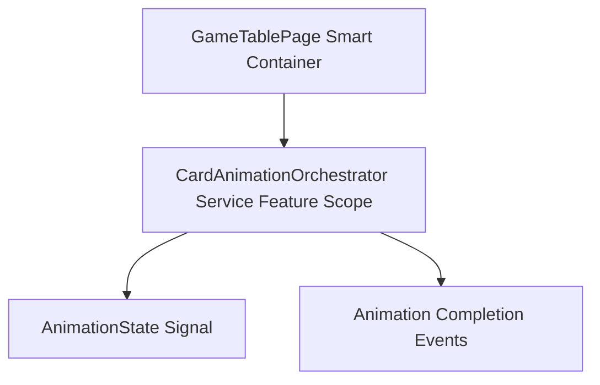
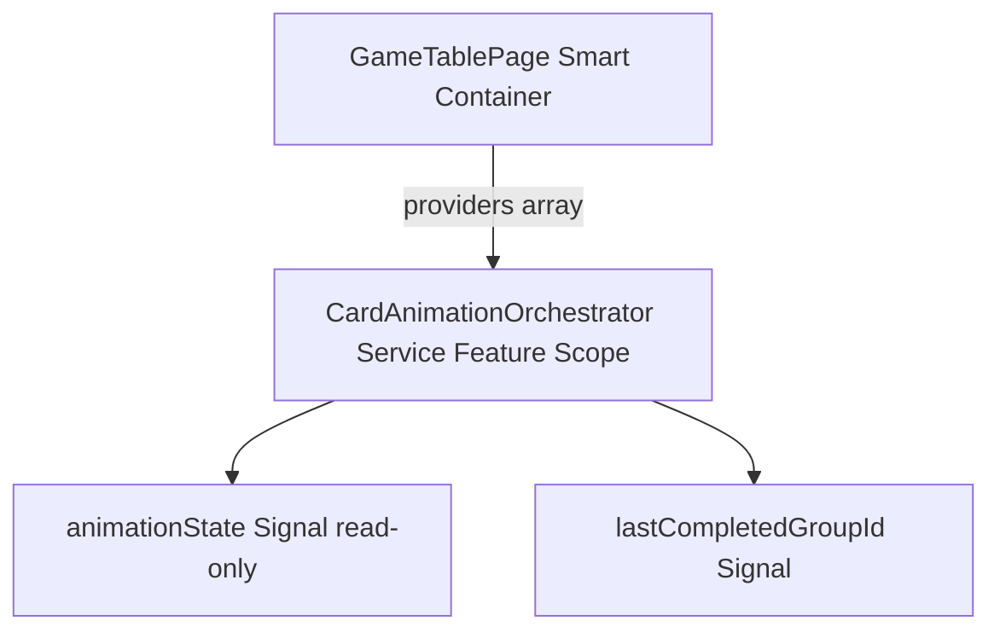
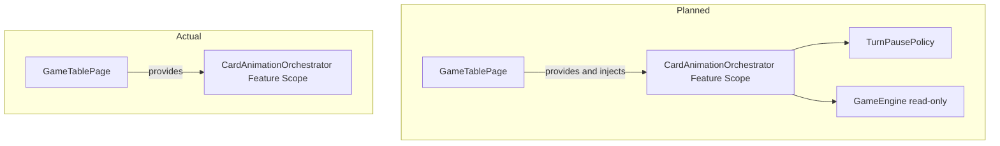

# Review Report: Card Animation System — T-2 Implementation (Re-review)

**Review Mode:** Incremental (T-2: Implement feature-scoped animation orchestrator)
**Source:** `docs/specs/ui/card-animations/`
**Reviewed against:** proposal.md, spec.md, user-stories.md, bdd-test.md, design.md, tasks.md
**Previous review:** review-report_T-2.md (original) — this is the re-review after fixes were applied.

## 1. Executive Summary

The CardAnimationOrchestrator service implementation is functionally correct, idiomatic in its use of Angular signals, and satisfies all three T-2 acceptance criteria. The Major finding from the original review (RV-01: injection scope mismatch) has been resolved — the service now uses `@Injectable()` without `providedIn`, consistent with the TableInteractionState pattern and AD-1 mandate. The service exposes read-only state, supports group lifecycle management, and provides observable group finalization via a dedicated signal. Test quality is meaningful with all assertions verifying behaviour. Three Minor findings and one Note from the original review remain unaddressed (test coverage gaps for baseline signals, boundary validation, and defensive paths).

- Total findings: 4 (0 Critical, 0 Major, 3 Minor, 1 Note)
- Spec compliance: 6 of 6 requirements fully met
- Architecture alignment: Aligned
- Test quality: Meaningful

## 2. Architecture Comparison

### 2.1 Planned Component Tree (T-2 scope)

### 2.2 Actual Component Tree (T-2 scope)

### 2.3 Drift Analysis

**No structural deviation from the planned architecture.** The previous review identified an injection scope mismatch (service used `providedIn: 'root'`). This has been resolved — the service now uses `@Injectable()` alone and relies exclusively on the GameTablePage component's `providers` array for scoping, consistent with the TableInteractionState pattern and AD-1 mandate.

**GameTablePage provides but does not yet inject:** The service is listed in GameTablePage's providers but the component does not call `inject(CardAnimationOrchestrator)`. This is acceptable for T-2 scope since the integration with turn orchestration is T-6, but it means the service instance is only created when a descendant component first injects it.

**No dependencies injected:** Design section 6.1 specifies dependencies on TurnPausePolicy and read-only game state context. The current implementation has zero dependencies. This is appropriate at T-2 stage since TurnPausePolicy is T-3 scope.

### 2.4 Planned vs Actual Service Dependencies

Dependencies on TurnPausePolicy and GameEngine are deferred to T-3 and T-6 respectively. No drift — planned dependencies are simply not yet wired, consistent with task sequencing.

## 3. Findings

### ~~RV-01: Injectable scope contradicts AD-1 feature-scope requirement [Major]~~ RESOLVED

- **Category:** Architecture Drift
- **Severity:** ~~Major~~ Resolved
- **Related:** AD-1, TR-1, US-12
- **Resolution:** The service now uses `@Injectable()` without `providedIn`, relying solely on the GameTablePage component's `providers` array for feature scoping. This matches the TableInteractionState pattern and satisfies AD-1.

### RV-02: No baseline assertion for lastCompletedGroupId initial value [Minor]

- **Category:** Test Coverage
- **Severity:** Minor
- **Related:** AC-3, TR-8, US-12, SC-20
- **Description:** No test establishes that `lastCompletedGroupId()` returns `null` before any group lifecycle activity occurs.
- **Expected:** The initial-state test (or a dedicated test) should assert the baseline value of the turn-orchestration observability signal.
- **Actual:** The initial-state test only verifies the `animationState()` structure without checking `lastCompletedGroupId()`.
- **Recommendation:** Add an assertion for `lastCompletedGroupId()` being `null` in the initial-state test to define the baseline contract for T-6 consumers.
- **Impact:** Turn orchestration consumers (T-6) reading this signal at startup have an implicitly assumed but unvalidated initial contract.

### RV-03: No boundary validation tests for invalid orchestration inputs [Minor]

- **Category:** Test Coverage
- **Severity:** Minor
- **Related:** AC-2, TR-8, US-12
- **Description:** No test defines expected behaviour for invalid inputs: non-existent group IDs in `completeParticipant` or `finalizeGroup`, unknown card IDs, or duplicate finalization calls.
- **Expected:** The implementation already handles these gracefully (safe no-ops due to immutable update patterns and ID-matching guards), but this behaviour is unspecified by tests.
- **Actual:** All tests operate on valid IDs and sequences only. The implementation's defensive progress clamping is similarly untested.
- **Recommendation:** Add tests documenting that invalid group/card IDs result in no-op state changes and that progress values are clamped to 0–100. This formalises the contract before T-12 adds resilience logic.
- **Impact:** Without explicit boundary tests, future refactoring could inadvertently break the safe no-op behaviour that downstream tasks depend on.

### RV-04: Implementation handles edge cases defensively but tests do not verify [Minor]

- **Category:** Test Quality
- **Severity:** Minor
- **Related:** TR-8, US-12, AD-2
- **Description:** The implementation includes defensive logic — progress clamping, group-existence checks in `finalizeGroup`, status-check guards in `completeParticipant`, and duplicate-prevention in `completedGroupIds`. None of these defensive paths are exercised by the test suite.
- **Expected:** Defensive behaviour should be verified by tests to prevent regression.
- **Actual:** The four existing tests all follow valid happy-path sequences. The implementation's resilience characteristics are implicit rather than proven.
- **Recommendation:** Add targeted tests for: progress below zero, progress above 100, finalizing an already-completed group, completing a participant in a non-running group.
- **Impact:** Without these, a refactor could remove defensive logic without test failure, creating silent regressions.

### RV-05: Action type parameterisation limited to T-2 traceability scope [Note]

- **Category:** Test Coverage
- **Severity:** Note
- **Related:** AD-1, FR-6, FR-5, FR-8
- **Description:** The `it.each` parameterised test covers `play`, `capture`, and `deal` action types. The `CardAnimationActionType` union also includes `escoba` and `opponent-play`, defined for future tasks T-8, T-9, and T-10.
- **Expected:** No action needed for T-2 scope.
- **Actual:** Only three of five action types are exercised. The remaining types align with later tasks.
- **Recommendation:** Informational — when T-8/T-9/T-10 are implemented, extend parameterisation to cover all action types.
- **Impact:** None for T-2. Forward-tracked for completeness.

## 4. Traceability Matrix

| Finding | Severity  | Category           | Related Spec             | Status      |
| ------- | --------- | ------------------ | ------------------------ | ----------- |
| RV-01   | ~~Major~~ | Architecture Drift | AD-1, TR-1, US-12        | ✅ Resolved |
| RV-02   | Minor     | Test Coverage      | AC-3, TR-8, US-12, SC-20 | Open        |
| RV-03   | Minor     | Test Coverage      | AC-2, TR-8, US-12        | Open        |
| RV-04   | Minor     | Test Quality       | TR-8, US-12, AD-2        | Open        |
| RV-05   | Note      | Test Coverage      | AD-1, FR-6, FR-5, FR-8   | Open        |

## 5. Spec Compliance Summary (T-2 Scope)

| Requirement | Status | Notes                                                                                                     |
| ----------- | ------ | --------------------------------------------------------------------------------------------------------- |
| FR-1        | ✅ Met | `play` action type supported; group lifecycle functional                                                  |
| FR-2        | ✅ Met | `capture` action type supported; multi-participant completion lifecycle verified                          |
| FR-3        | ✅ Met | `deal` action type supported; group creation tested                                                       |
| TR-1        | ✅ Met | Animation state signal is correct, isolated, and properly feature-scoped per AD-1                         |
| TR-8        | ✅ Met | Completion signaling via `lastCompletedGroupId` signal enables turn orchestration synchronization         |
| US-12       | ✅ Met | Animation state is fully independent of game logic signals; can be disabled without affecting game engine |

## 6. Task Completion Summary

| Task | Title                                           | Status      | Findings                                               |
| ---- | ----------------------------------------------- | ----------- | ------------------------------------------------------ |
| T-2  | Implement feature-scoped animation orchestrator | ✅ Complete | RV-02, RV-03, RV-04 (minor test coverage improvements) |

## 7. Test Coverage Summary

| Scenario | Step Definitions | Meaningful | Findings                                             |
| -------- | ---------------- | ---------- | ---------------------------------------------------- |
| SC-20    | N/A (unit-level) | ✅ Yes     | RV-02 (baseline not verified)                        |
| SC-21    | N/A (unit-level) | ❌ No      | RV-03, RV-04 (interruption/invalid paths not tested) |

## 8. Test Quality Summary

| Test File                           | Type | Meaningful Assertions | Issues                                                                     |
| ----------------------------------- | ---- | --------------------- | -------------------------------------------------------------------------- |
| card-animation-orchestrator.spec.ts | Unit | ✅ Yes                | Minor: missing baseline signal assertion, missing boundary/defensive tests |

### Test-by-Test Quality Assessment

| Test Description                                                           | Meaningful | Assertion Quality                                                               |
| -------------------------------------------------------------------------- | ---------- | ------------------------------------------------------------------------------- |
| Exposes empty readonly animation state before any group starts             | ✅ Yes     | Typed `toEqual` verifying full structure contract                               |
| Creates a running group with per-card participant tracking (parameterised) | ✅ Yes     | Verifies group structure, participant state, and active group signal            |
| Marks participant completion without finalizing the group                  | ✅ Yes     | Verifies partial completion does not trigger premature finalization             |
| Publishes group completion for turn orchestration when finalised           | ✅ Yes     | Verifies `completedGroupIds`, `activeGroupId` reset, and `lastCompletedGroupId` |

## 9. Security Cross-Reference

The companion security report (`security-report_T-2.md`) identifies 1 Low finding. No Critical or High severity issues exist. SEC-01 relates to runtime error logging in the AI orchestration path — not directly within T-2 service scope but in the integration surface.

| SEC ID | Severity | OWASP | Summary                                    |
| ------ | -------- | ----- | ------------------------------------------ |
| —      | —        | —     | No Critical or High findings for T-2 scope |

## 10. Recommendations

### Critical (blocks release)

None.

### Major (fix before merge)

None. (Previous RV-01 has been resolved.)

### Minor (improvement)

1. Add a baseline assertion verifying `lastCompletedGroupId()` is `null` before any orchestration activity, formalising the contract for T-6 turn orchestration consumers.
2. Add boundary-condition tests for invalid group/card IDs and duplicate operations, documenting the expected safe no-op behaviour.
3. Add tests exercising the defensive progress clamping and status-guard logic already present in the implementation.

### Notes (informational)

1. When T-8, T-9, and T-10 are implemented, extend the `it.each` parameterisation to include `escoba` and `opponent-play` action types.
