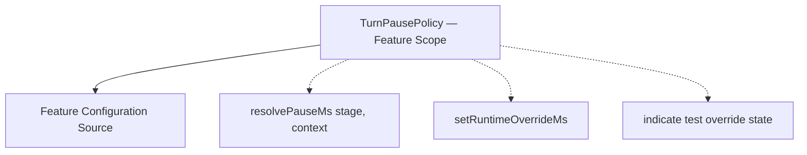
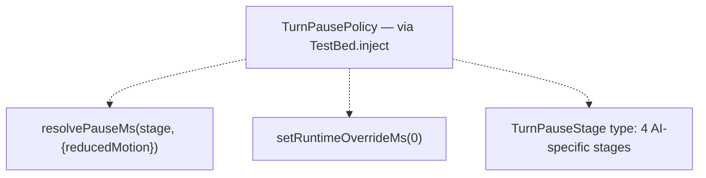

# Review Report: Card Animation System — T-3 Pause Policy (RED Phase, Tests Only)

**Review Mode:** Incremental (T-3: Implement pause policy with runtime test override) — RED phase test review
**Source:** `docs/specs/ui/card-animations/`
**Reviewed against:** proposal.md, spec.md, user-stories.md, bdd-test.md, design.md, tasks.md
**Revision:** 2 (re-reviewed after RV-01 Major finding addressed)
**Files reviewed:**

- `src/app/features/game-board/services/turn-pause-policy.spec.ts` (new)
- `src/app/features/game-board/game-table-page/game-table-page.spec.ts` (T-3-tagged test)

## 1. Executive Summary

The RED phase tests for T-3 are well-structured and meaningful. The unit tests in `turn-pause-policy.spec.ts` cover all three acceptance criteria with specific, falsifiable assertions. The integration test in `game-table-page.spec.ts` now verifies both policy invocation AND timing enforcement — asserting that turn confirmation does NOT occur before the policy-resolved pauses elapse, and DOES occur once they complete. The prior Major finding (RV-01) is fully resolved. Only minor edge-case gaps and one informational note remain.

- Total findings: 3 (0 Critical, 0 Major, 2 Minor, 1 Note)
- T-3 acceptance criteria coverage: 3 of 3 addressed
- Test meaningfulness: Meaningful (unit) / Meaningful (integration)
- Traceability: Good, all primary spec references addressed

## 2. Architecture Comparison

### 2.1 Planned Service Design (from design.md section 6.2)

### 2.2 Tested Contract Surface

### 2.3 Drift Analysis

The tested contract surface aligns with design section 6.2. Two observations:

1. The design mentions "indicate test override state" as a key method — no test asserts a readable property exposing whether an override is active. This may be intentionally deferred until integration consumers need it.
2. The `TurnPauseStage` type covers four AI-specific stages (`ai-deliberation`, `ai-selection-preview`, `ai-capture-preview`, `ai-post-play-confirm`). FR-7 describes pauses for _all_ turn transitions including player-side transitions. The current stage set is appropriate for T-3 + T-9 integration scope, with player-side stages expected in T-6.

## 3. Findings

### ~~RV-01: Integration test verifies invocation but not timing enforcement~~ [RESOLVED]

- **Category:** Test Quality
- **Severity:** ~~Major~~ → Resolved
- **Related:** FR-7, TR-4, SC-17, AD-3
- **Resolution:** The GameTablePage T-3 test now mocks `resolvePauseMs` to return 50ms, advances to 199ms and asserts `confirmTurn` has NOT been called, then advances to 200ms (4 stages × 50ms) and verifies `confirmTurn` IS called exactly once. This proves timing enforcement — the resolved pause value is honored, not merely consulted. The test would fail if the implementation discarded the policy result.

### RV-02: Missing test for partial or non-zero runtime override values [Minor]

- **Category:** Test Coverage
- **Severity:** Minor
- **Related:** TR-4, US-14, AD-3
- **Description:** The unit test for runtime override only tests `setRuntimeOverrideMs(0)`. The acceptance criterion states "Test override can reduce or bypass pause deterministically" — reducing (e.g., to 50ms) is a valid scenario distinct from bypassing entirely (0ms).
- **Expected:** At least one test verifying a non-zero override value (e.g., `setRuntimeOverrideMs(100)`) returns that value for all stages, confirming the override replaces rather than merely zeroes.
- **Actual:** Only the bypass case (0ms) is tested.
- **Recommendation:** Add a parameterized case for a non-zero override to confirm the policy substitutes the override value regardless of stage.
- **Impact:** Low — the 0ms case implicitly demonstrates the override mechanism, but a non-zero case strengthens confidence.

### RV-03: No test verifies clearing or resetting the runtime override [Minor]

- **Category:** Test Coverage
- **Severity:** Minor
- **Related:** TR-4, US-14
- **Description:** Once `setRuntimeOverrideMs` is called, no test verifies that the override can be cleared (returning to normal policy values). Design section 6.2 mentions "indicate test override state" suggesting the override is a distinct mode with observability.
- **Expected:** A test that activates override, verifies overridden behavior, then clears it and verifies normal behavior resumes.
- **Actual:** No clear/reset scenario is tested.
- **Recommendation:** If the implementation supports clearing the override (e.g., `setRuntimeOverrideMs(null)` or `clearRuntimeOverride()`), add a round-trip test. If clearing is not in scope, note this as a design decision.
- **Impact:** Low — primarily relevant if multiple test scenarios share a single service instance and need isolation.

### RV-04: GameTablePage test does not verify the `reducedMotion` context passed to the policy [Note]

- **Category:** Test Coverage
- **Severity:** Note
- **Related:** TR-6, US-9, SC-19
- **Description:** The unit test in `turn-pause-policy.spec.ts` verifies that the policy returns consistent pause values when `reducedMotion: true` is passed. However, the GameTablePage integration test does not verify _what context the component actually passes_ to `resolvePauseMs`. It only asserts the method was called, without checking the arguments.
- **Expected:** The spy assertion could use `toHaveBeenCalledWith(expect.any(String), expect.objectContaining({ reducedMotion: false }))` to confirm the component correctly resolves and passes the reduced-motion state.
- **Actual:** The assertion is `toHaveBeenCalled()` without argument validation.
- **Recommendation:** Consider strengthening the spy assertion in a future iteration (T-6 or T-11 scope where reduced-motion integration is more fully tested). This is informational for T-3.
- **Impact:** Negligible at T-3 scope since reduced-motion detection is typically wired later.

## 4. Traceability Matrix

| Finding | Severity  | Category      | Related Spec            | Status      |
| ------- | --------- | ------------- | ----------------------- | ----------- |
| RV-01   | ~~Major~~ | Test Quality  | FR-7, TR-4, SC-17, AD-3 | ✅ Resolved |
| RV-02   | Minor     | Test Coverage | TR-4, US-14, AD-3       | Open        |
| RV-03   | Minor     | Test Coverage | TR-4, US-14             | Open        |
| RV-04   | Note      | Test Coverage | TR-6, US-9, SC-19       | Open        |

## 5. Spec Compliance Summary (T-3 Scope)

| Requirement | Status | Notes                                                                           |
| ----------- | ------ | ------------------------------------------------------------------------------- |
| FR-7        | ✅ Met | Unit tests verify pause resolution; integration test proves timing enforcement  |
| TR-4        | ✅ Met | Policy resolution verified and delay application proven at integration level    |
| TR-6        | ✅ Met | Unit test confirms reduced-motion returns identical pause values                |
| US-7        | ✅ Met | Pause durations resolved correctly; integration proves delay blocks advancement |
| US-9        | ✅ Met | Reduced-motion path preserves pause behavior per acceptance criteria            |
| US-14       | ✅ Met | Runtime override to 0ms verified (test mode determinism)                        |

## 6. Task Completion Summary

| Task | Title                                             | Status                                                         | Findings            |
| ---- | ------------------------------------------------- | -------------------------------------------------------------- | ------------------- |
| T-3  | Implement pause policy with runtime test override | ✅ Complete (RED phase tests meaningful, no blocking findings) | RV-02, RV-03, RV-04 |

## 7. Test Coverage Summary

| Scenario | Step Definitions            | Meaningful | Findings          |
| -------- | --------------------------- | ---------- | ----------------- |
| SC-17    | ✅ Yes (unit + integration) | ✅ Yes     | —                 |
| SC-18    | ❌ Out of T-3 scope (T-12)  | N/A        | —                 |
| SC-19    | ✅ Yes (unit level)         | ✅ Yes     | RV-04 (Note only) |

## 8. Test Quality Summary

| Test File                          | Type        | Meaningful Assertions | Issues                                  |
| ---------------------------------- | ----------- | --------------------- | --------------------------------------- |
| turn-pause-policy.spec.ts          | Unit        | ✅ Yes                | Minor gaps in edge cases (RV-02, RV-03) |
| game-table-page.spec.ts (T-3 test) | Integration | ✅ Yes                | None — timing enforcement proven        |

## 9. Security Cross-Reference

No security concerns identified for T-3 scope. Pause policy is a pure presentation-timing concern with no data exposure, authentication, or injection surface.

## 10. Recommendations

### Critical (blocks release)

None.

### Major (fix before merge)

None.

### Minor (improvement)

1. **RV-02:** Add a test case for `setRuntimeOverrideMs` with a non-zero value (e.g., 100ms) to confirm the policy substitutes rather than merely zeroes.
2. **RV-03:** If the API supports clearing the override, add a round-trip test. If not, document the design decision.

### Notes (informational)

1. **RV-04:** Consider verifying the `reducedMotion` argument passed to `resolvePauseMs` in a future task (T-11 scope).
