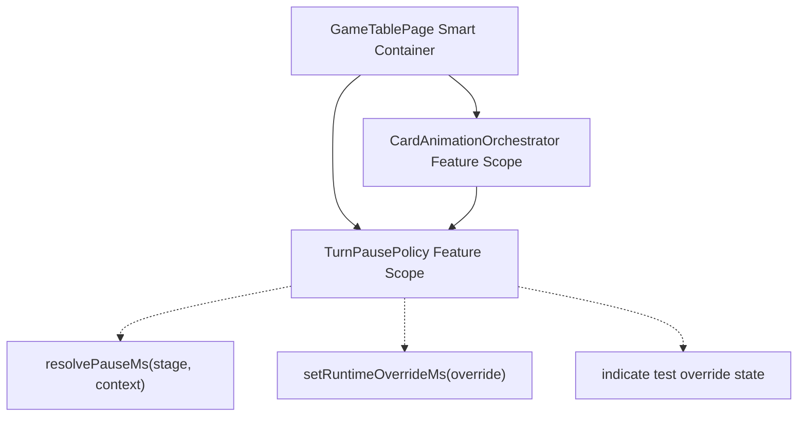
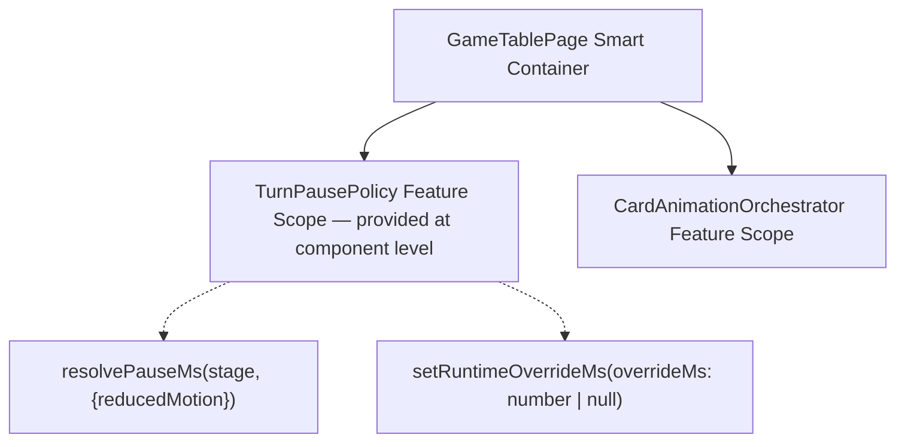

# Review Report: Card Animation System — T-3 Pause Policy (GREEN Phase, Implementation)

**Review Mode:** Incremental (T-3: Implement pause policy with runtime test override) — GREEN phase implementation review
**Source:** `docs/specs/ui/card-animations/`
**Reviewed against:** proposal.md, spec.md, user-stories.md, bdd-test.md, design.md, tasks.md
**Files reviewed:**

- `src/app/features/game-board/services/turn-pause-policy.ts` (new)
- `src/app/features/game-board/services/turn-pause-policy.spec.ts` (new)
- `src/app/features/game-board/game-table-page/game-table-page.ts` (modified — pause integration in `runAiTurn`)
- `src/app/features/game-board/game-table-page/game-table-page.spec.ts` (T-3-tagged integration test)

## 1. Executive Summary

The GREEN implementation for T-3 is well-aligned with the design and spec. TurnPausePolicy is correctly feature-scoped, uses `inject()`, and provides configurable stage-based pause resolution with deterministic test override support. GameTablePage integrates the policy cleanly into its AI turn orchestration flow. All three acceptance criteria are met. Test quality is meaningful — both unit and integration tests verify real behaviour with falsifiable assertions. Minor observations carry forward from the RED review (non-zero override test gap, missing override-state indicator).

- Total findings: 4 (0 Critical, 0 Major, 3 Minor, 1 Note)
- Spec compliance: 6 of 6 traced requirements met
- Architecture alignment: Aligned (minor deferred dependency per task sequencing)
- Test quality: Meaningful

## 2. Architecture Comparison

### 2.1 Planned Component Tree (design.md section 2.1 — T-3 scope)

### 2.2 Actual Component Tree

### 2.3 Drift Analysis

**Aligned:**

- TurnPausePolicy is feature-scoped, provided at the GameTablePage component level via the `providers` array — exactly as design section 6.2 specifies.
- The service is injected via `inject(TurnPausePolicy)` — consistent with Angular best practices.
- `resolvePauseMs` and `setRuntimeOverrideMs` are implemented as planned.
- The service has no dependencies (design mentions "Feature configuration source" which is inlined as a constant map).

**Deferred (expected per task sequencing):**

- Design section 2.5 shows `AO --> TP` (CardAnimationOrchestrator depends on TurnPausePolicy). This dependency is NOT yet wired. Appropriate — T-6 (completion-driven turn sequencing) will introduce this coupling.
- Design section 6.2 lists "indicate test override state" as a key method. No such readable indicator exists. Deferred until consumers require it.

**No unplanned additions or structural divergence.**

## 3. Findings

### RV-01: Dead conditional branch in `resolvePauseMs` [Minor]

- **Category:** Code Quality
- **Severity:** Minor
- **Related:** AD-5, TR-6, US-9, SC-19
- **Description:** The `resolvePauseMs` method contains an `if (options.reducedMotion)` branch that returns the same value as the default path. Both branches evaluate to `configuredPause`.
- **Expected:** Per AD-5 and SC-19, reduced-motion mode retains pause behaviour — so identical return values are _functionally correct_. However, the conditional is dead code that may mislead future maintainers into thinking the paths diverge.
- **Actual:** The conditional exists but both arms return `configuredPause` identically.
- **Recommendation:** Either remove the conditional (relying on a comment to document the design decision that pauses apply uniformly) or add a brief comment explaining that the branch is a future extension point for differentiated reduced-motion timing. No functional change needed.
- **Impact:** Negligible — no behavioural consequence; purely a readability concern.

### RV-02: Missing readable indicator for test override state [Minor]

- **Category:** Architecture Drift
- **Severity:** Minor
- **Related:** AD-3, design section 6.2
- **Description:** Design section 6.2 lists "indicate test override state" as a key method of TurnPausePolicy. The implementation provides `setRuntimeOverrideMs` but no corresponding getter or signal to query whether an override is currently active.
- **Expected:** A method or read-only signal exposing override presence (e.g., `isOverrideActive(): boolean` or a `readonly overrideActive: Signal<boolean>`).
- **Actual:** Only the setter exists. Consumers cannot programmatically detect whether the policy is in overridden mode.
- **Recommendation:** Add an observable indicator when integration consumers (T-6 or E2E harness) require visibility into override state. Acceptable to defer if no consumer currently needs it.
- **Impact:** Low — no current consumer queries override state. Becomes relevant if E2E setup verification or orchestrator fallback logic needs to branch on override presence.

### RV-03: Unit test does not cover non-zero runtime override or override clearing [Minor]

- **Category:** Test Coverage
- **Severity:** Minor
- **Related:** TR-4, US-14, AD-3
- **Description:** The unit test for `setRuntimeOverrideMs` only exercises the bypass case (0ms). No test verifies a non-zero override (e.g., 50ms) or clearing the override (passing `null` to restore defaults).
- **Expected:** At least one test confirming a non-zero override replaces the stage default, and one test confirming `setRuntimeOverrideMs(null)` restores normal policy resolution.
- **Actual:** Only `setRuntimeOverrideMs(0)` is tested.
- **Recommendation:** Add parameterised cases for a non-zero override and for restoring defaults. These would strengthen confidence in the round-trip behaviour.
- **Impact:** Low — the 0ms case implicitly demonstrates the override mechanism, and the `null` path is simple, but explicit coverage would prevent future regressions if the override logic grows in complexity.

### RV-04: `resolvePauseMs` receives `reducedMotion` context but integration test does not validate argument [Note]

- **Category:** Test Coverage
- **Severity:** Note
- **Related:** TR-6, US-9, SC-19
- **Description:** GameTablePage correctly calls `this.prefersReducedMotion()` and passes the result as `{ reducedMotion }` to the policy. However, the integration test spy only asserts `toHaveBeenCalled()` without verifying the argument value. The test does not confirm that the component correctly resolves and forwards the motion preference.
- **Expected:** A stronger assertion such as verifying the spy was called with the expected `reducedMotion` value for the test environment.
- **Actual:** Only invocation presence is asserted.
- **Recommendation:** Strengthen the spy assertion in T-11 (reduced-motion path) scope where this integration is fully exercised. Informational for T-3.
- **Impact:** Negligible at T-3 scope. Reduced-motion argument correctness will be validated naturally when T-11 introduces full reduced-motion integration testing.

## 4. Traceability Matrix

| Finding | Severity | Category           | Related Spec            | Status |
| ------- | -------- | ------------------ | ----------------------- | ------ |
| RV-01   | Minor    | Code Quality       | AD-5, TR-6, US-9, SC-19 | Open   |
| RV-02   | Minor    | Architecture Drift | AD-3, design 6.2        | Open   |
| RV-03   | Minor    | Test Coverage      | TR-4, US-14, AD-3       | Open   |
| RV-04   | Note     | Test Coverage      | TR-6, US-9, SC-19       | Open   |

## 5. Spec Compliance Summary

| Requirement | Status | Notes                                                                                                           |
| ----------- | ------ | --------------------------------------------------------------------------------------------------------------- |
| FR-7        | ✅ Met | Pauses applied between AI turn phases via `delay(turnPausePolicy.resolvePauseMs(...))`                          |
| TR-4        | ✅ Met | Configurable via `setRuntimeOverrideMs`; E2E can bypass or reduce pauses                                        |
| TR-6        | ✅ Met | Reduced-motion context resolved from `window.matchMedia` and forwarded to policy; pause still applies per SC-19 |
| US-7        | ✅ Met | Automatic pauses enforced in AI turn orchestration; players observe results before next phase                   |
| US-9        | ✅ Met | Reduced-motion path retains pause duration (identical resolution); motion-only animations affected elsewhere    |
| US-14       | ✅ Met | Runtime override enables deterministic test timing; integration test demonstrates timing enforcement            |

## 6. Task Completion Summary

| Task | Title                                             | Status      | Findings                   |
| ---- | ------------------------------------------------- | ----------- | -------------------------- |
| T-3  | Implement pause policy with runtime test override | ✅ Complete | RV-01, RV-02, RV-03, RV-04 |

## 7. Test Coverage Summary

| Scenario | Step Definitions                                         | Meaningful | Findings |
| -------- | -------------------------------------------------------- | ---------- | -------- |
| SC-17    | ✅ Yes (unit + integration)                              | ✅ Yes     | —        |
| SC-18    | ❌ No (fallback/timeout not yet tested — T-12 scope)     | N/A        | —        |
| SC-19    | ✅ Yes (unit test covers reduced-motion pause retention) | ✅ Yes     | RV-04    |

## 8. Test Quality Summary

| Test File                          | Type        | Meaningful Assertions                                                                      | Issues            |
| ---------------------------------- | ----------- | ------------------------------------------------------------------------------------------ | ----------------- |
| turn-pause-policy.spec.ts          | Unit        | ✅ Yes — specific numeric assertions per stage, reduced-motion parity, override bypass     | RV-03 (minor gap) |
| game-table-page.spec.ts (T-3 test) | Integration | ✅ Yes — fake timers verify timing enforcement; confirms turn does NOT advance prematurely | RV-04 (note)      |

## 9. Security Cross-Reference

No Critical or High security findings were identified in `security-report_T-3.md`. The T-3 scope introduces no injection paths, credential handling, or access-control surfaces.

| SEC ID | Severity | OWASP | Summary                   |
| ------ | -------- | ----- | ------------------------- |
| —      | —        | —     | No Critical/High findings |

## 10. Recommendations

### Critical (blocks release)

None.

### Major (fix before merge)

None.

### Minor (improvement)

1. Remove or annotate the dead conditional in `resolvePauseMs` to clarify that pauses are intentionally identical in both motion modes (RV-01).
2. Add an override-state indicator method when a consumer needs it, or document the decision to defer (RV-02).
3. Expand unit test coverage with a non-zero override case and an override-clearing round-trip test (RV-03).

### Notes (informational)

1. Integration test argument validation for `reducedMotion` context is deferred to T-11 scope (RV-04).
