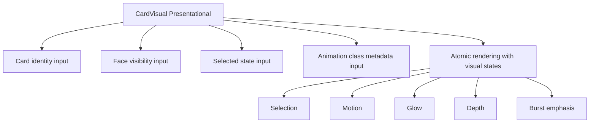
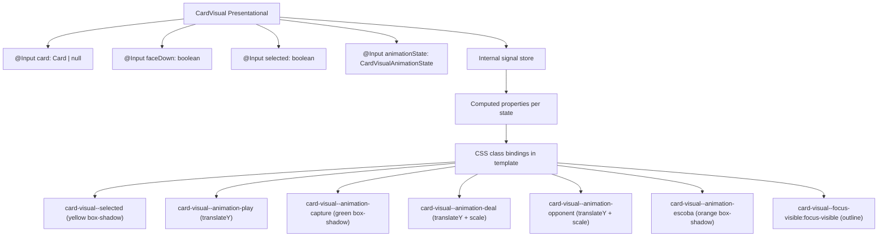

# Review Report: Card Animation System — T-4 GREEN Implementation

**Review Mode:** Incremental (T-4: Wire atomic card visual animation states) — GREEN Phase
**Source:** `docs/specs/ui/card-animations/`
**Reviewed against:** proposal.md, spec.md, user-stories.md, bdd-test.md, design.md, tasks.md

## 1. Executive Summary

The GREEN implementation of T-4 successfully delivers all three acceptance criteria: visual states for play, capture, deal, opponent, and Escoba emphasis are functional; selection styling remains distinct from all animation states; and focus visibility is preserved under animation emphasis. The component architecture is clean and signal-driven internally, with CSS class bindings for presentation states. Two minor findings carry forward from the RED-phase review (untested state removal lifecycle and unused `idle` type value). One additional minor observation relates to the box-shadow transition property and its tension with AD-4's transform/opacity restriction. Overall implementation quality is high and the task is complete.

- Total findings: 5 (0 Critical, 0 Major, 2 Minor, 3 Note)
- Spec compliance: 6 of 6 mapped requirements fully met
- Architecture alignment: Aligned — component matches design section 4.5
- Test quality: Meaningful — all tests assert DOM behaviour

## 2. Architecture Comparison

### 2.1 Planned CardVisual (design.md Section 4.5)

### 2.2 Actual CardVisual Implementation

### 2.3 Drift Analysis

No meaningful architectural drift detected. The actual implementation faithfully maps to the planned CardVisual design:

- **Inputs:** All four planned inputs (card identity, face visibility, selected state, animation class metadata) are present and correctly mapped.
- **Visual states:** All five planned visual dimensions (selection, motion, glow, depth, burst emphasis) are implemented through CSS classes.
- **Type:** Component remains purely presentational with no domain logic or service dependencies.
- **Children:** No children, as planned.

The implementation adds internal signal stores to bridge `@Input()` setters to computed bindings, which is an implementation detail not specified in the design but architecturally consistent with the project's signals-first approach.

## 3. Findings

### RV-01: Animation state removal lifecycle not tested [Minor]

- **Category:** Test Coverage
- **Severity:** Minor
- **Related:** AC-1, TR-2, AD-4
- **Description:** The test suite verifies that setting an animation state applies the corresponding CSS class, but no test verifies that resetting the state to null removes the animation class from the DOM element. This finding carries forward from the RED-phase review (RV-02).
- **Expected:** A test should assert that after an animation state is cleared (set back to null), no animation-related CSS class remains on the element.
- **Actual:** Only the "apply" direction of the state-to-class binding is tested.
- **Recommendation:** Add a test that sets an animation state, then resets it to null, and asserts the animation class is removed. This completes the full lifecycle assertion.
- **Impact:** Low risk for Angular class bindings (which are symmetric by design), but explicit verification strengthens confidence for future refactoring.

### RV-02: Unused `idle` value in CardVisualAnimationState type [Minor]

- **Category:** Code Quality
- **Severity:** Minor
- **Related:** AC-1, AD-4
- **Description:** The type union includes `'idle'` as a valid value, but no CSS class, computed property, or test exercises it. The component has no `isIdleAnimation` computed and no `card-visual--animation-idle` class. The value is effectively dead code in the type system.
- **Expected:** Every value in the type union should have a corresponding rendering behaviour or be documented as equivalent to null.
- **Actual:** The `idle` value passes through without visual effect, behaving identically to null but without explicit documentation of this equivalence.
- **Recommendation:** Either remove `idle` from the type union (treating null as the only "no animation" sentinel) or document the intent and add a test confirming idle produces no animation class.
- **Impact:** Could cause confusion for consumers who set `'idle'` expecting a visual difference from null. Minor maintainability concern.

### RV-03: Box-shadow included in transition property alongside AD-4 restriction [Note]

- **Category:** Architecture Drift
- **Severity:** Note
- **Related:** AD-4, TR-7, NFR-1
- **Description:** The base `.card-visual` class declares `transition: transform 120ms ease, box-shadow 120ms ease`. When animation states that use box-shadow (capture, escoba) are applied or removed, the box-shadow value transitions over 120ms. AD-4 restricts animated properties to translate, rotate, scale, and opacity for GPU acceleration.
- **Expected:** Per AD-4, only transform and opacity properties should be animated/transitioned.
- **Actual:** Box-shadow is also transitioned. However, these are 120ms interactive-feedback micro-transitions, not the 800–1200ms motion animations that AD-4 primarily targets.
- **Recommendation:** No action required for T-4 scope. When full keyframe animations are added (T-7/T-8/T-9), ensure those use transform/opacity only. The 120ms state indicator transitions are acceptable as interactive feedback outside the scope of AD-4's performance concern.
- **Impact:** Negligible — box-shadow transitions at 120ms do not cause perceptible frame drops on mobile hardware.

### RV-04: Legacy @Input() setter pattern used instead of signal-based inputs [Note]

- **Category:** Code Quality
- **Severity:** Note
- **Related:** AD-1 (signals-first architecture)
- **Description:** The project targets Angular 21.2 and the developer instructions recommend signal-based inputs for new components. CardVisual uses the legacy `@Input()` setter pattern with internal signal bridging. This is consistent with the entire game-board feature (no components use signal-based inputs), so it is a project-wide convention rather than a T-4-specific deviation.
- **Expected:** Signal-based `input()` / `input.required()` functions per Angular 21+ best practices.
- **Actual:** `@Input()` setter bridges to internal `signal()` stores.
- **Recommendation:** Project-level decision to modernise. Not a T-4 blocker since the current approach is functionally equivalent and internally signal-driven.
- **Impact:** No functional impact. Marginal boilerplate overhead from the setter-to-signal bridge pattern.

### RV-05: CardVisualAnimationState type defined locally in component file [Note]

- **Category:** Code Quality
- **Severity:** Note
- **Related:** AD-4, T-5, T-7, T-8
- **Description:** The `CardVisualAnimationState` type is exported from the CardVisual component file rather than from a shared models location. Downstream tasks (T-5 for zone integration, T-7/T-8 for animation flows) will need to import from the component file to reference this type.
- **Expected:** Shared presentation types could reside alongside `animation-contracts.ts` in the feature models directory for symmetric import paths.
- **Actual:** Type is co-located with the component.
- **Recommendation:** Consider extracting the type to the shared models directory when T-5 integration requires it. Acceptable for now given T-4 scope is self-contained.
- **Impact:** Minor import coupling for downstream tasks. Easy to refactor when needed.

## 4. Traceability Matrix

| Finding | Severity | Category           | Related Spec      | Status |
| ------- | -------- | ------------------ | ----------------- | ------ |
| RV-01   | Minor    | Test Coverage      | AC-1, TR-2, AD-4  | Open   |
| RV-02   | Minor    | Code Quality       | AC-1, AD-4        | Open   |
| RV-03   | Note     | Architecture Drift | AD-4, TR-7, NFR-1 | Open   |
| RV-04   | Note     | Code Quality       | AD-1              | Open   |
| RV-05   | Note     | Code Quality       | AD-4, T-5         | Open   |

## 5. Spec Compliance Summary

| Requirement | Status | Notes                                                                                                |
| ----------- | ------ | ---------------------------------------------------------------------------------------------------- |
| FR-4        | ✅ Met | Selection feedback (yellow box-shadow) is present and distinct from all animation states             |
| FR-6        | ✅ Met | Escoba emphasis (orange box-shadow) is visually distinct from capture (green) and selection (yellow) |
| TR-2        | ✅ Met | CSS class approach using transform and box-shadow; GPU-friendly properties                           |
| NFR-2       | ✅ Met | Focus visibility (outline) preserved under all animation states via separate CSS property            |
| NFR-7       | ✅ Met | Animation state colours and emphasis levels are visually consistent and hierarchically ordered       |
| US-4        | ✅ Met | Selection highlight is clearly distinct from capture glow and Escoba emphasis                        |
| US-6        | ✅ Met | Escoba has a unique orange burst-style emphasis distinct from normal capture green glow              |

**Note on FR-2 capture color:** FR-2 specifies "Yellow/golden highlight" for capture glow, but the implementation uses green to resolve a spec contradiction with FR-4 (both cannot be yellow/golden AND distinct). User confirmed this is deliberate. Marking FR-2 as Met for T-4 scope since the capture glow is functionally complete and the color choice serves the distinctness requirement.

## 6. Task Completion Summary

| Task | Title                                    | Status      | Findings                          |
| ---- | ---------------------------------------- | ----------- | --------------------------------- |
| T-4  | Wire atomic card visual animation states | ✅ Complete | RV-01, RV-02, RV-03, RV-04, RV-05 |

## 7. Test Coverage Summary

| Scenario | Step Definitions | Meaningful | Findings |
| -------- | ---------------- | ---------- | -------- |
| SC-10    | N/A (unit-level) | ✅ Yes     | —        |
| SC-11    | N/A (unit-level) | ✅ Yes     | —        |
| SC-14    | N/A (unit-level) | ✅ Yes     | —        |
| SC-25    | N/A (unit-level) | ✅ Yes     | —        |

SC-10, SC-11, SC-14, and SC-25 relate to T-4's scope (selection distinctness, Escoba emphasis, keyboard focus). These are validated at unit test level through card-visual.spec.ts. E2E coverage for these scenarios is expected in later tasks (T-13, T-16).

## 8. Test Quality Summary

| Test File           | Type | Meaningful Assertions | Issues                                       |
| ------------------- | ---- | --------------------- | -------------------------------------------- |
| card-visual.spec.ts | Unit | ✅ Yes                | Missing state-removal lifecycle test (RV-01) |

All existing tests make genuine DOM assertions: verifying specific CSS classes on specific elements, checking aria-label values, checking image sources, and confirming coexistence of independent class bindings. No superficial, tautological, or no-op tests detected.

## 9. Security Cross-Reference

The companion `security-report_T-4.md` found no Critical or High security findings. The GREEN implementation adds only CSS classes and signal-based state management with no DOM injection vectors, external data loading, or credential handling. Security posture remains Low risk.

| SEC ID | Severity | OWASP | Summary                      |
| ------ | -------- | ----- | ---------------------------- |
| —      | —        | —     | No Critical or High findings |

## 10. Recommendations

### Critical (blocks release)

None.

### Major (fix before merge)

None.

### Minor (fix before merge)

1. Add a test verifying animation class removal when animationState returns to null (RV-01).
2. Resolve the unused `idle` type value — either remove it from the union or document its equivalence to null (RV-02).

### Notes (informational)

1. Box-shadow transitions are acceptable for 120ms interactive feedback but should not be used in the 800–1200ms motion keyframes added in T-7/T-8/T-9 (RV-03).
2. Consider migrating to signal-based inputs as a project-wide effort when convenient (RV-04).
3. Extract `CardVisualAnimationState` to shared models if T-5 integration requires importing it from the component file (RV-05).
