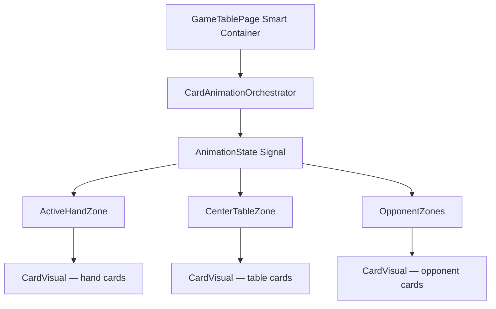
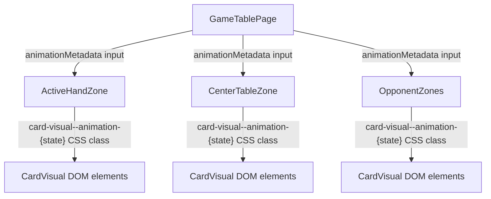

# Review Report: Card Animation System — Zone Animation Metadata Integration

**Review Mode:** Incremental (T-5: Integrate animation metadata into zone components — RED phase, tests only)
**Source:** `docs/specs/ui/card-animations/`
**Reviewed against:** proposal.md, spec.md, user-stories.md, bdd-test.md, design.md, tasks.md

## 1. Executive Summary

This review evaluates the RED-phase tests written for T-5 (zone animation metadata integration). The tests establish a clear behavioral contract for how animation metadata propagates through zone components. Six new unit tests across three zone spec files and one integration test in the game-table-page spec demonstrate targeted expectations for metadata rendering. One E2E feature file with one scenario validates live DOM animation class presence.

- Total findings: 5 (0 Critical, 2 Major, 2 Minor, 1 Note)
- T-5 acceptance criteria coverage: 2 of 3 criteria well-covered, 1 partially covered
- Test meaningfulness: Mostly meaningful, with one significant superficial assertion
- BDD scenario traceability: Partial — maps to SC-01, SC-04, SC-05, SC-12 but omits SC-07, SC-08

## 2. Architecture Comparison

### 2.1 Planned Zone Metadata Flow (from design.md)

### 2.2 Zone Metadata Flow as Tested (RED-phase contracts)

### 2.3 Drift Analysis

The test architecture aligns with the design intent. Tests expect metadata to flow from the GameTablePage container to zone components via an `animationMetadata` input property, and for zones to render per-card CSS classes on their CardVisual children. This is consistent with the presentational component pattern in design.md section 4.

One structural note: the design describes an `AnimationState Signal` as the intermediary from the orchestrator, while the tests model `animationMetadata` as a direct property input on each zone. This is consistent with how presentational components receive state from their smart container parent and represents a valid implementation approach for AD-1.

## 3. Findings

### RV-01: GameTablePage T-5 test uses toBeDefined() superficial assertion [Major]

- **Category:** Test Quality
- **Severity:** Major
- **Related:** T-5, AD-1, FR-1, FR-2, FR-5
- **Description:** The game-table-page.spec.ts test at line 1719 asserts only that `animationMetadata` is defined on each zone instance, using `expect(activeHandZone.animationMetadata).toBeDefined()`. This proves only that a property exists, not that it holds meaningful data, updates correctly, or influences rendering.
- **Expected:** The propagation test should verify that the GameTablePage passes structured metadata matching the orchestrator output shape, or that changes to animation state result in updated metadata reaching child zones.
- **Actual:** Three `toBeDefined()` assertions are the only checks. The test does not set up animation state, trigger an action, or verify metadata content matches any expected structure.
- **Recommendation:** Replace with assertions that verify the metadata structure contains zone-specific arrays (hand, table, opponent), or that a state transition in the orchestrator produces non-null metadata at the zone level.
- **Impact:** Creates false confidence that propagation works. The property could exist as an always-null or always-empty-object stub and this test would pass.

### RV-02: No unit test for "zones do not mutate game logic" acceptance criterion [Major]

- **Category:** Test Coverage
- **Severity:** Major
- **Related:** T-5 acceptance criterion 1, FR-1, SC-20, US-12
- **Description:** T-5 acceptance criterion states: "Zones consume and apply animation metadata without mutating game logic." None of the zone spec tests verify that applying animation metadata leaves the zone's game-facing state (handCards, tableCards, selectedTableCards, opponents) unchanged.
- **Expected:** At least one test per zone should verify that setting `animationMetadata` does not alter the cards collection, selection state, or emitted outputs.
- **Actual:** Tests only verify CSS class application. No assertion confirms that game-relevant signals remain unchanged after metadata application.
- **Recommendation:** Add tests that assert hand/table card arrays and selection state are identical before and after animation metadata is set. This directly validates the state isolation contract of AD-1 and US-12.
- **Impact:** The separation between animation state and game state (the core architectural principle of AD-1) is not explicitly tested at the zone boundary. A future implementation bug that mutates game state during animation rendering would not be caught.

### RV-03: E2E scenario does not verify ActiveHandZone animation classes [Minor]

- **Category:** Test Coverage
- **Severity:** Minor
- **Related:** T-5, FR-1, FR-3, SC-01, SC-07
- **Description:** The E2E feature file validates table-card capture classes and opponent-card animation classes, but does not include a Then step verifying hand-card animation classes (deal or play state). T-5 covers all three zones equally (ActiveHandZone, CenterTableZone, OpponentZones).
- **Expected:** The E2E scenario should verify that animation metadata is rendered in all three zone types, or a separate scenario should cover hand-zone metadata (deal animation from SC-07, play animation from SC-01).
- **Actual:** Only table and opponent assertions are present. The hand zone is exercised indirectly (through game startup) but its animation class rendering is not validated.
- **Recommendation:** Add a Then step asserting hand-card deal or play animation classes, or create a second scenario for the player-play fixture.
- **Impact:** The hand zone's metadata rendering path has no E2E coverage. If ActiveHandZone fails to apply animation classes in a live DOM context, this test suite will not detect it.

### RV-04: E2E fixture 'ai-turn-capture' may not produce animation metadata without orchestrator [Minor]

- **Category:** Test Coverage
- **Severity:** Minor
- **Related:** T-5, AD-1, SC-01, SC-04, SC-12
- **Description:** The E2E step definition calls `testApi.applyEngineFixture('ai-turn-capture')` and immediately asserts animation CSS classes on table and opponent cards. However, the `ai-turn-capture` fixture modifies game engine state — it does not directly trigger the CardAnimationOrchestrator. In the current architecture (before GREEN implementation), there is no production path from engine fixture application to animation metadata propagation.
- **Expected:** The E2E test should either (a) use a fixture that specifically sets animation metadata on the orchestrator, or (b) rely on the full orchestration flow being in place (which T-5 GREEN phase implements).
- **Actual:** The test assumes that applying an engine fixture will produce animation CSS classes on zone DOM elements. This will fail in RED phase (correctly), but the failure mechanism may be misleading — it may fail because the orchestrator is not wired, not because zone rendering is incorrect.
- **Recommendation:** Document clearly that this E2E test depends on both T-5 (zone metadata rendering) AND T-2/T-6 (orchestrator triggering animation metadata from engine state changes). Alternatively, expose a test fixture that directly injects animation metadata into the orchestrator signal.
- **Impact:** When this E2E test turns GREEN, it will validate the full integration chain (engine → orchestrator → zones → DOM classes). This is valuable but means the test cannot distinguish between zone rendering failures and orchestrator wiring failures.

### RV-05: Traceability header comments in zone spec files reference pre-T-5 requirements only [Note]

- **Category:** Code Quality
- **Severity:** Note
- **Related:** T-5, FR-1, FR-2, FR-3, FR-5, FR-8
- **Description:** The `// Covers:` comment at the top of active-hand-zone.card-visual.spec.ts and center-table-zone.card-visual.spec.ts lists `FR-1.5, FR-6.2, TR-3.1, TR-3.4, TR-6.2, US-1`. These appear to be pre-existing traceability markers from earlier tasks. The new T-5 tests within these files trace to FR-1, FR-2, FR-3, FR-5, FR-8 (via inline test title markers like "T-5 / FR-3"), but the file-level comment does not reflect T-5 additions.
- **Expected:** The file-level traceability comment should be updated to include the new requirement references covered by T-5 tests.
- **Actual:** File-level comments remain unchanged; only individual test titles carry T-5 traceability.
- **Recommendation:** Update the file-level `// Covers:` comment to include FR-2, FR-3, FR-5, FR-8 as covered by the new tests.
- **Impact:** Informational only. Individual test titles provide inline traceability. The file-level header is a convenience aid for quick scanning.

## 4. Traceability Matrix

| Finding | Severity | Category      | Related Spec                      | Status |
| ------- | -------- | ------------- | --------------------------------- | ------ |
| RV-01   | Major    | Test Quality  | T-5, AD-1, FR-1, FR-2, FR-5       | Open   |
| RV-02   | Major    | Test Coverage | T-5 AC-1, FR-1, SC-20, US-12      | Open   |
| RV-03   | Minor    | Test Coverage | T-5, FR-1, FR-3, SC-01, SC-07     | Open   |
| RV-04   | Minor    | Test Coverage | T-5, AD-1, SC-01, SC-04, SC-12    | Open   |
| RV-05   | Note     | Code Quality  | T-5, FR-1, FR-2, FR-3, FR-5, FR-8 | Open   |

## 5. Spec Compliance Summary (T-5 Scope)

| Requirement | Status     | Notes                                                                    |
| ----------- | ---------- | ------------------------------------------------------------------------ |
| FR-1        | ⚠️ Partial | Hand zone play animation metadata tested in unit; E2E omits hand zone    |
| FR-2        | ✅ Met     | CenterTableZone capture metadata tested in unit and E2E                  |
| FR-3        | ⚠️ Partial | Hand zone deal metadata tested in unit; E2E does not verify deal classes |
| FR-5        | ✅ Met     | OpponentZones opponent metadata tested in unit and E2E                   |
| FR-8        | ✅ Met     | Simultaneous opponent metadata tested in unit; E2E validates AI classes  |
| US-1        | ⚠️ Partial | Play metadata propagation tested but no state isolation assertion        |
| US-2        | ✅ Met     | Capture metadata rendering fully covered                                 |
| US-3        | ⚠️ Partial | Deal metadata covered in unit but no E2E assertion                       |
| US-5        | ✅ Met     | Opponent animation metadata rendering tested                             |
| US-8        | ✅ Met     | AI turn animation classes verified in E2E                                |

## 6. Task Completion Summary

| Task | Title                                             | Status                 | Findings                          |
| ---- | ------------------------------------------------- | ---------------------- | --------------------------------- |
| T-5  | Integrate animation metadata into zone components | ⚠️ Partial (RED tests) | RV-01, RV-02, RV-03, RV-04, RV-05 |

## 7. Test Coverage Summary (T-5 BDD Scenarios)

| Scenario | Step Definitions                                 | Meaningful | Findings |
| -------- | ------------------------------------------------ | ---------- | -------- |
| SC-01    | ⚠️ Partial (E2E covers table/opponent only)      | ⚠️ Partial | RV-03    |
| SC-04    | ✅ Yes                                           | ✅ Yes     | —        |
| SC-05    | ✅ Yes (unit: multi-card capture simultaneously) | ✅ Yes     | —        |
| SC-07    | ❌ No (no E2E for deal; unit only)               | ⚠️ Partial | RV-03    |
| SC-08    | ❌ No (no simultaneous deal E2E)                 | ⚠️ Partial | RV-03    |
| SC-12    | ✅ Yes                                           | ✅ Yes     | —        |

## 8. Test Quality Summary

| Test File                                         | Type | Meaningful Assertions | Issues                                         |
| ------------------------------------------------- | ---- | --------------------- | ---------------------------------------------- |
| active-hand-zone.card-visual.spec.ts (T-5 tests)  | Unit | ✅ Yes                | None — CSS class application verified per-card |
| center-table-zone.card-visual.spec.ts (T-5 tests) | Unit | ✅ Yes                | None — CSS class application verified per-card |
| opponent-zones.spec.ts (T-5 tests)                | Unit | ✅ Yes                | None — CSS class application verified per-card |
| game-table-page.spec.ts (T-5 test)                | Unit | ❌ No                 | Superficial — toBeDefined() only (RV-01)       |
| zone-animation-metadata.feature                   | E2E  | ✅ Yes                | Coverage gap for hand zone (RV-03)             |
| zone-animation-metadata.ts                        | E2E  | ✅ Yes                | Fixture coupling note (RV-04)                  |

## 9. Security Cross-Reference

No security findings relevant to T-5 RED-phase tests. The E2E step definitions reuse the established `__escobitaTestApi` seam pattern, which is properly gated by `isDevMode()` and `window.Cypress` presence. No new attack surface is introduced by these tests.

## 10. Recommendations

### Major (fix before merge)

1. **RV-01:** Replace the `toBeDefined()` assertion in game-table-page.spec.ts with a structural or behavioral assertion that verifies metadata shape or propagation correctness.
2. **RV-02:** Add at least one test per zone verifying that applying animation metadata does not mutate game-facing state (cards, selection arrays). This directly validates the state isolation principle of AD-1 and T-5 acceptance criterion 1.

### Minor (improvement)

1. **RV-03:** Add an E2E Then step (or a separate scenario) that verifies hand-zone animation classes, covering the deal and/or play animation metadata path in a live DOM context.
2. **RV-04:** Add a comment or test description noting that this E2E scenario validates the full integration chain (engine → orchestrator → zone → DOM) and will turn GREEN only after both T-5 and T-2/T-6 implementations are complete.

### Notes (informational)

1. **RV-05:** Update file-level `// Covers:` comments in zone spec files to include FR-2, FR-3, FR-5, FR-8 as newly tested by T-5 additions.
