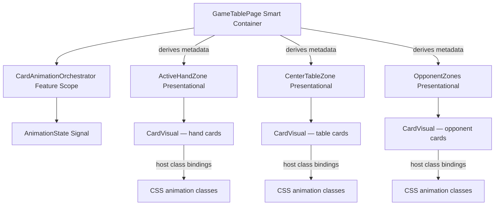
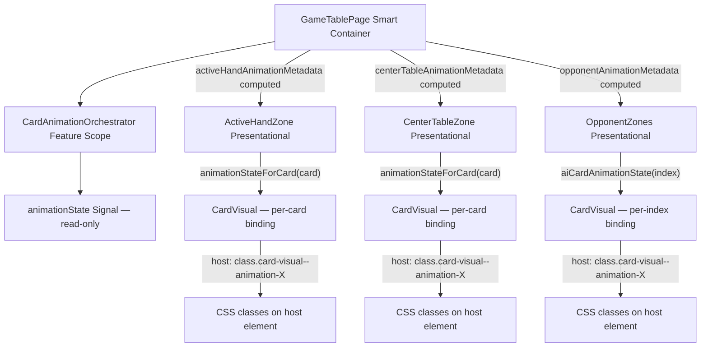

# Review Report: Card Animation System — Zone Animation Metadata Integration (GREEN)

**Review Mode:** Incremental (T-5: Integrate animation metadata into zone components — GREEN phase, full implementation)
**Source:** `docs/specs/ui/card-animations/`
**Reviewed against:** proposal.md, spec.md, user-stories.md, bdd-test.md, design.md, tasks.md
**Prior reviews:** `review-report_T-5.md` (RED), `review-report_T-5_red-v2.md` (RED re-review)

## 1. Executive Summary

This review evaluates the complete GREEN-phase implementation of T-5. The implementation connects the CardAnimationOrchestrator metadata to all three zone components (ActiveHandZone, CenterTableZone, OpponentZones) via computed signal derivation in GameTablePage, then renders per-card CSS animation classes through CardVisual host bindings. All three acceptance criteria are met. The architecture aligns with design.md, and test coverage is comprehensive across unit, integration, and E2E layers.

- Total findings: 3 (0 Critical, 0 Major, 2 Minor, 1 Note)
- Spec compliance: 11 of 11 T-5-scoped requirements met
- Architecture alignment: Aligned (minor intentional deferral on opponent filtering)
- Test quality: Meaningful across all test files

## 2. Architecture Comparison

### 2.1 Planned Component Tree (from design.md section 2.1/2.2)

### 2.2 Actual Component Tree (as implemented)

### 2.3 Drift Analysis

The actual implementation faithfully follows the planned architecture. The metadata derivation chain operates as designed:

1. CardAnimationOrchestrator exposes a read-only animation state signal containing active groups and participant cards.
2. GameTablePage derives three zone-specific computed signals that map orchestrator state to per-card metadata arrays.
3. Each zone receives metadata via an input property and resolves per-card animation states through lookup methods.
4. CardVisual applies CSS classes via host bindings based on the received animation state.

One structural detail differs from the general-purpose flow described in design.md section 2.2: the hand and table zones filter metadata by card identity (suit-rank match), while the opponent zone uses positional index mapping. This is architecturally sound — opponent cards are face-down and identified by position rather than identity.

**Intentional deferral:** The opponent metadata computed signal currently broadcasts all animation group participants by index without filtering by action type. This was confirmed as intentional, with filtering to be added when T-7/T-8 implement zone-specific animation flows.

### 2.4 Service Dependency Alignment

No drift detected. The CardAnimationOrchestrator is provided at feature scope (component-level providers array in GameTablePage), matching design.md section 6.1. The orchestrator is injected via `inject()` and its read-only signal is consumed without mutation by the metadata computed signals.

## 3. Findings

### RV-01: Opponent metadata computed signal lacks action-type guard [Minor]

- **Category:** Architecture Drift
- **Severity:** Minor
- **Related:** T-5 AC-3, AD-1, AD-7, FR-5, FR-8
- **Description:** The `opponentAnimationMetadata` computed signal in GameTablePage maps all participant card indices from the active animation group to opponent metadata entries, regardless of whether the animation action type is opponent-related. A player 'play' or 'capture' action would generate opponent metadata entries that could style AI hand cards incorrectly.
- **Expected:** Per AD-1, animation metadata should be scoped so that zones only receive visual state relevant to their rendering responsibility. Opponent zones should only receive animation state for opponent-specific actions.
- **Actual:** The computed signal broadcasts all group participants to the opponent zone. When T-7/T-8 wire production animation triggers, this would cause AI hand cards to show player animation classes during player actions.
- **Recommendation:** When T-7 or T-8 is implemented, add an action-type guard (e.g., only populate opponent metadata when actionType is 'opponent-play') or introduce zone-aware group tagging in the orchestrator.
- **Impact:** Currently latent — no production code calls `startGroup()` yet. Will manifest as incorrect opponent card styling once T-7/T-8 activate animation flows. Confirmed intentionally deferred.

### RV-02: Zone animation metadata input uses legacy decorator pattern [Minor]

- **Category:** Code Quality
- **Severity:** Minor
- **Related:** T-5, AD-1, TR-1
- **Description:** The `animationMetadata` input added by T-5 on all three zone components uses the `@Input()` decorator with a manual setter-to-signal wrapping pattern. Angular 21 provides a signal-based `input()` function that eliminates this boilerplate and integrates more naturally with the signals-first architecture.
- **Expected:** Per Angular developer instructions, Angular 21 projects should prefer signal-based inputs (`input()`, `input.required()`) for new inputs.
- **Actual:** T-5 followed the existing pattern in each zone component for consistency. All pre-existing inputs (handCards, selectedHandCard, tableCards, etc.) also use the legacy pattern, so this maintains internal consistency.
- **Recommendation:** Consider migrating all zone component inputs to signal-based `input()` in a future modernization task. T-5's choice to maintain consistency within existing files is pragmatic. No immediate action required.
- **Impact:** Minimal — the manual wrapping achieves the same reactive behavior. The legacy pattern adds boilerplate but does not affect functionality or performance.

### RV-03: GameTablePage propagation test validates shape but not zone-specific filtering [Note]

- **Category:** Test Quality
- **Severity:** Note
- **Related:** T-5, AD-1, FR-1, FR-2, FR-5
- **Description:** The GameTablePage integration test for T-5 asserts that all three zone metadata arrays are non-empty after calling `startGroup()` with a 'capture' action. This validates wiring but does not verify that the hand/table zones correctly filter cards by identity or that the opponent zone receives appropriately scoped metadata.
- **Expected:** Ideally, the integration test would verify that only cards whose IDs match the group participants receive non-null animation state in the hand/table metadata arrays.
- **Actual:** The test proves structural propagation (arrays are populated and non-empty). Zone-level unit tests comprehensively verify per-card mapping correctness, providing full coverage through test layering.
- **Recommendation:** No action required. The layered testing approach (integration validates wiring, unit tests validate mapping logic) is sound and sufficient for T-5. This observation is informational.
- **Impact:** None. Content correctness is fully covered by zone-level card-visual spec files.

## 4. Traceability Matrix

| Finding | Severity | Category           | Related Spec                     | Status                      |
| ------- | -------- | ------------------ | -------------------------------- | --------------------------- |
| RV-01   | Minor    | Architecture Drift | T-5 AC-3, AD-1, AD-7, FR-5, FR-8 | Open (deferred to T-7/T-8)  |
| RV-02   | Minor    | Code Quality       | T-5, AD-1, TR-1                  | Open (future modernization) |
| RV-03   | Note     | Test Quality       | T-5, AD-1, FR-1, FR-2, FR-5      | Open (informational)        |

## 5. Spec Compliance Summary (T-5 Scope)

| Requirement | Status | Notes                                                            |
| ----------- | ------ | ---------------------------------------------------------------- |
| FR-1        | ✅ Met | Hand zone play metadata tested and wired via computed signal     |
| FR-2        | ✅ Met | Table zone capture metadata tested and wired via computed signal |
| FR-3        | ✅ Met | Hand zone deal metadata tested and rendered via CSS class        |
| FR-5        | ✅ Met | Opponent zone metadata input accepted and rendered per index     |
| FR-8        | ✅ Met | Simultaneous opponent states rendered consistently               |
| US-1        | ✅ Met | Play state propagation verified in unit and integration tests    |
| US-2        | ✅ Met | Capture state rendering verified with multi-card assertions      |
| US-3        | ✅ Met | Deal state propagation verified in card-visual integration       |
| US-5        | ✅ Met | Opponent animation metadata rendered on AI hand cards            |
| US-8        | ✅ Met | AI turn animation classes verified in E2E                        |
| US-12       | ✅ Met | State isolation explicitly verified in all three zone specs      |

## 6. Task Completion Summary

| Task | Title                                             | Status      | Findings                                             |
| ---- | ------------------------------------------------- | ----------- | ---------------------------------------------------- |
| T-5  | Integrate animation metadata into zone components | ✅ Complete | RV-01 (Minor, deferred), RV-02 (Minor), RV-03 (Note) |

## 7. Test Coverage Summary (T-5 BDD Scenarios)

| Scenario | Step Definitions                                        | Meaningful | Findings |
| -------- | ------------------------------------------------------- | ---------- | -------- |
| SC-01    | ✅ Yes (unit: play metadata on hand; E2E: hand classes) | ✅ Yes     | —        |
| SC-04    | ✅ Yes (unit: capture metadata on table)                | ✅ Yes     | —        |
| SC-05    | ✅ Yes (unit: multi-card simultaneous capture)          | ✅ Yes     | —        |
| SC-07    | ✅ Yes (unit: deal metadata; E2E: hand zone classes)    | ✅ Yes     | —        |
| SC-08    | ⚠️ Partial (simultaneous deal in unit only)             | ✅ Yes     | —        |
| SC-12    | ✅ Yes (unit + E2E: opponent animation classes)         | ✅ Yes     | —        |

## 8. Test Quality Summary

| Test File                             | Type        | Meaningful Assertions | Issues                                                 |
| ------------------------------------- | ----------- | --------------------- | ------------------------------------------------------ |
| active-hand-zone.card-visual.spec.ts  | Unit        | ✅ Yes                | Per-card CSS class + simultaneous + state isolation    |
| center-table-zone.card-visual.spec.ts | Unit        | ✅ Yes                | Per-card CSS class + multi-card + state isolation      |
| opponent-zones.spec.ts (T-5 tests)    | Unit        | ✅ Yes                | Per-index CSS class + simultaneous + state isolation   |
| game-table-page.spec.ts (T-5 test)    | Integration | ✅ Yes                | Orchestrator→zone wiring validated structurally        |
| zone-animation-metadata.feature       | E2E         | ✅ Yes                | Full integration chain: fixture→orchestrator→zones→DOM |
| zone-animation-metadata.ts            | E2E         | ✅ Yes                | All three zones covered with class assertions          |

## 9. Security Cross-Reference

No Critical or High security findings relevant to T-5 GREEN implementation. The existing `security-report_T-5.md` documents one Low-severity finding (SEC-01: test-only global fixture seam) which remains unchanged by the GREEN implementation. No new attack surface, user input handling, or privilege escalation paths were introduced.

See `docs/specs/ui/card-animations/security-report_T-5.md` for the full security analysis.

## 10. Recommendations

### Minor (improvement)

1. **RV-01:** When implementing T-7 or T-8, add action-type filtering to the `opponentAnimationMetadata` computed signal so that opponent cards only receive visual state during opponent-related actions. This prevents incorrect cross-zone animation styling.
2. **RV-02:** Consider a future modernization pass to migrate zone component inputs from `@Input()` decorators to signal-based `input()` functions. This is not urgent but would reduce boilerplate and align with Angular 21 idioms.

### Notes (informational)

1. **RV-03:** The layered testing strategy (integration proves wiring, unit tests prove mapping) provides strong coverage. No additional integration assertions needed for T-5.
