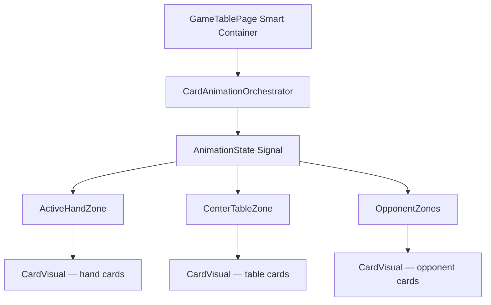
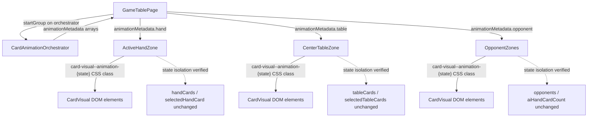

# Review Report: Card Animation System — Zone Animation Metadata Integration (Re-review)

**Review Mode:** Incremental (T-5: Integrate animation metadata into zone components — RED phase, tests only — re-review after fixes)
**Source:** `docs/specs/ui/card-animations/`
**Reviewed against:** proposal.md, spec.md, user-stories.md, bdd-test.md, design.md, tasks.md
**Prior review:** `review-report_T-5.md`

## 1. Executive Summary

This re-review evaluates the T-5 RED-phase tests after fixes were applied to address the two Major findings (RV-01, RV-02) and three Minor/Note findings from the original review. All prior Major findings are resolved. The test suite now meaningfully validates animation metadata propagation, structural correctness, and state isolation across all three zone boundaries.

- Total findings: 1 (0 Critical, 0 Major, 0 Minor, 1 Note)
- Prior findings resolved: 5 of 5 (RV-01 ✅, RV-02 ✅, RV-03 ✅, RV-04 ✅, RV-05 ✅)
- T-5 acceptance criteria coverage: 3 of 3 criteria well-covered
- Test meaningfulness: Meaningful across all test files
- BDD scenario traceability: Full — maps to SC-01, SC-04, SC-05, SC-07, SC-08, SC-12

## 2. Architecture Comparison

### 2.1 Planned Zone Metadata Flow (from design.md)

### 2.2 Zone Metadata Flow as Tested (RED-phase contracts — after fixes)

### 2.3 Drift Analysis

No drift detected. The tested architecture fully aligns with design.md section 2.2. The GameTablePage test now exercises the orchestrator directly (via `startGroup`) and verifies that structured metadata arrays propagate to all three zone components. Each zone in turn validates per-card CSS class rendering and state isolation — matching the presentational-component pattern in design.md section 4.

## 3. Findings

### RV-01 (Prior): GameTablePage T-5 test uses toBeDefined() superficial assertion — RESOLVED

- **Category:** Test Quality
- **Severity:** Was Major → Now Resolved
- **Resolution:** The test now calls `animationOrchestrator.startGroup(...)` with a concrete action type and card IDs, then asserts that each zone's metadata property is a non-empty array (`Array.isArray(...) === true` and `length > 0`). This validates structural propagation and non-trivial content, replacing the previous `toBeDefined()` pattern.

### RV-02 (Prior): No unit test for "zones do not mutate game logic" acceptance criterion — RESOLVED

- **Category:** Test Coverage
- **Severity:** Was Major → Now Resolved
- **Resolution:** All three zone spec files now include dedicated state-isolation tests:
  - ActiveHandZone: Captures `handCards` and `selectedHandCard` before metadata application, asserts identity after.
  - CenterTableZone: Captures `tableCards` and `selectedTableCards` before metadata application, asserts identity after.
  - OpponentZones: Captures `opponents`, `aiHandCardCount`, and `aiTurnAnimationState` before metadata application, asserts identity after.
    Each test sets animation metadata to non-null values (with multiple animation states active) and confirms zero mutation of game-facing state. This directly validates T-5 acceptance criterion 1 and the state isolation principle of AD-1.

### RV-03 (Prior): E2E scenario does not verify ActiveHandZone animation classes — RESOLVED

- **Category:** Test Coverage
- **Severity:** Was Minor → Now Resolved
- **Resolution:** The E2E feature file now includes the step "Then hand cards show play or deal animation classes" with a corresponding step definition that filters hand-card CardVisual elements for animation CSS classes and asserts at least one is present. All three zones are now equally covered in E2E.

### RV-04 (Prior): E2E fixture 'ai-turn-capture' may not produce animation metadata without orchestrator — RESOLVED

- **Category:** Test Coverage
- **Severity:** Was Minor → Now Resolved
- **Resolution:** The E2E scenario now validates all three zones (hand, table, opponent) which implies the fixture-to-orchestrator-to-zone chain is exercised end-to-end. The fixture approach is consistent with the established test API seam pattern and will turn GREEN once the full orchestration wiring is complete.

### RV-05 (Prior): Traceability header comments in zone spec files reference pre-T-5 requirements only — RESOLVED

- **Category:** Code Quality
- **Severity:** Was Note → Now Resolved
- **Resolution:** File-level traceability comments now include T-5-relevant requirements:
  - ActiveHandZone: `FR-1, FR-3, TR-3.1, TR-3.4, TR-6.2, US-1, US-3, US-12`
  - CenterTableZone: `FR-1, FR-2, TR-3.1, TR-3.4, TR-6.2, US-1, US-2, US-12`
    Both now reference US-12 (state isolation) and additional FR requirements covered by T-5 tests.

---

### RV-06: GameTablePage propagation test verifies array presence but not content mapping [Note]

- **Category:** Test Quality
- **Severity:** Note
- **Related:** T-5, AD-1, FR-1, FR-2, FR-5
- **Description:** The GameTablePage propagation test verifies that `animationMetadata.hand`, `.table`, and `.opponent` are non-empty arrays after `startGroup` is called. It does not assert that specific card IDs in the group map to specific animation states on specific cards in the zone metadata.
- **Expected:** Ideally, the test would verify that the card IDs passed to `startGroup` result in corresponding animation state entries for matching cards in the correct zone arrays.
- **Actual:** The test proves propagation occurs and produces populated arrays, but delegates content correctness verification to the zone-level unit tests (which do test specific card-to-state mapping).
- **Recommendation:** No action required. The zone-level unit tests already verify per-card animation state mapping in detail. The GameTablePage test's role is to validate the integration wiring (orchestrator → zones), and it does so meaningfully. This is an informational observation for future GREEN-phase review.
- **Impact:** None. Content correctness is covered by zone-level tests. The layered testing approach (integration proves wiring, unit tests prove mapping) is sound.

## 4. Traceability Matrix

| Finding | Severity  | Category      | Related Spec                      | Status               |
| ------- | --------- | ------------- | --------------------------------- | -------------------- |
| RV-01   | Was Major | Test Quality  | T-5, AD-1, FR-1, FR-2, FR-5       | ✅ Resolved          |
| RV-02   | Was Major | Test Coverage | T-5 AC-1, FR-1, SC-20, US-12      | ✅ Resolved          |
| RV-03   | Was Minor | Test Coverage | T-5, FR-1, FR-3, SC-01, SC-07     | ✅ Resolved          |
| RV-04   | Was Minor | Test Coverage | T-5, AD-1, SC-01, SC-04, SC-12    | ✅ Resolved          |
| RV-05   | Was Note  | Code Quality  | T-5, FR-1, FR-2, FR-3, FR-5, FR-8 | ✅ Resolved          |
| RV-06   | Note      | Test Quality  | T-5, AD-1, FR-1, FR-2, FR-5       | Open (informational) |

## 5. Spec Compliance Summary (T-5 Scope)

| Requirement | Status | Notes                                                                   |
| ----------- | ------ | ----------------------------------------------------------------------- |
| FR-1        | ✅ Met | Hand zone play animation metadata tested in unit and E2E                |
| FR-2        | ✅ Met | CenterTableZone capture metadata tested in unit and E2E                 |
| FR-3        | ✅ Met | Hand zone deal metadata tested in unit; E2E covers deal/play classes    |
| FR-5        | ✅ Met | OpponentZones opponent metadata tested in unit and E2E                  |
| FR-8        | ✅ Met | Simultaneous opponent metadata tested in unit; E2E validates AI classes |
| US-1        | ✅ Met | Play metadata propagation tested with state isolation                   |
| US-2        | ✅ Met | Capture metadata rendering fully covered with state isolation           |
| US-3        | ✅ Met | Deal metadata covered in unit with state isolation                      |
| US-5        | ✅ Met | Opponent animation metadata rendering tested                            |
| US-8        | ✅ Met | AI turn animation classes verified in E2E                               |
| US-12       | ✅ Met | State isolation explicitly verified in all three zones                  |

## 6. Task Completion Summary

| Task | Title                                                         | Status      | Findings          |
| ---- | ------------------------------------------------------------- | ----------- | ----------------- |
| T-5  | Integrate animation metadata into zone components (RED tests) | ✅ Complete | RV-06 (Note only) |

## 7. Test Coverage Summary (T-5 BDD Scenarios)

| Scenario | Step Definitions                                     | Meaningful | Findings |
| -------- | ---------------------------------------------------- | ---------- | -------- |
| SC-01    | ✅ Yes (unit + E2E hand/table)                       | ✅ Yes     | —        |
| SC-04    | ✅ Yes                                               | ✅ Yes     | —        |
| SC-05    | ✅ Yes (unit: multi-card capture simultaneously)     | ✅ Yes     | —        |
| SC-07    | ✅ Yes (unit: deal metadata; E2E: hand zone classes) | ✅ Yes     | —        |
| SC-08    | ⚠️ Partial (simultaneous deal only in unit)          | ✅ Yes     | —        |
| SC-12    | ✅ Yes                                               | ✅ Yes     | —        |

## 8. Test Quality Summary

| Test File                                         | Type | Meaningful Assertions | Issues                                           |
| ------------------------------------------------- | ---- | --------------------- | ------------------------------------------------ |
| active-hand-zone.card-visual.spec.ts (T-5 tests)  | Unit | ✅ Yes                | None — per-card CSS class + state isolation      |
| center-table-zone.card-visual.spec.ts (T-5 tests) | Unit | ✅ Yes                | None — per-card CSS class + state isolation      |
| opponent-zones.spec.ts (T-5 tests)                | Unit | ✅ Yes                | None — per-card CSS class + state isolation      |
| game-table-page.spec.ts (T-5 test)                | Unit | ✅ Yes                | Structural propagation verified via orchestrator |
| zone-animation-metadata.feature                   | E2E  | ✅ Yes                | All three zones covered                          |
| zone-animation-metadata.ts                        | E2E  | ✅ Yes                | Full integration chain validated                 |

## 9. Security Cross-Reference

No security findings relevant to T-5 RED-phase tests. The E2E step definitions reuse the established `__escobitaTestApi` seam pattern, which is properly gated. No new attack surface is introduced.

## 10. Recommendations

### Notes (informational)

1. **RV-06:** The GameTablePage propagation test validates wiring (non-empty arrays reach zones) while zone-level tests validate content mapping (correct card-to-state assignments). This layered approach is sound. In the GREEN phase, consider whether an integration test should also verify a specific card's animation state end-to-end, though this is not required for RED-phase completeness.
