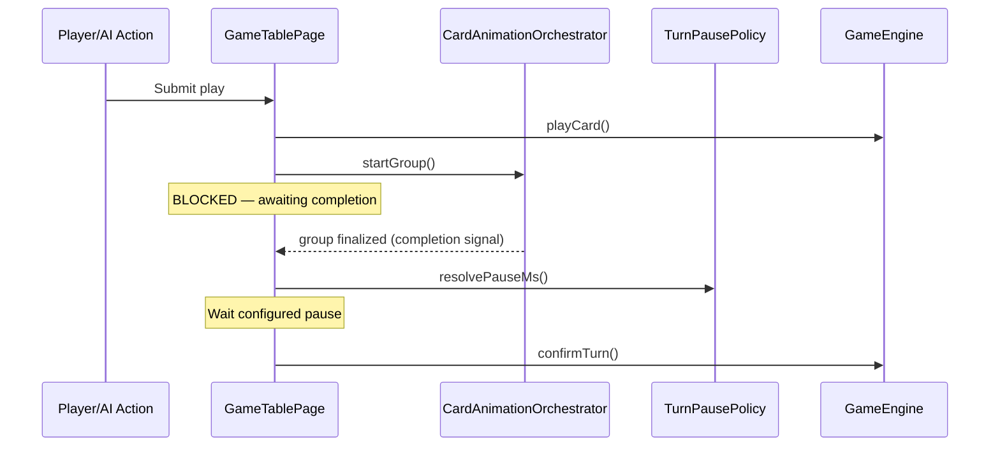
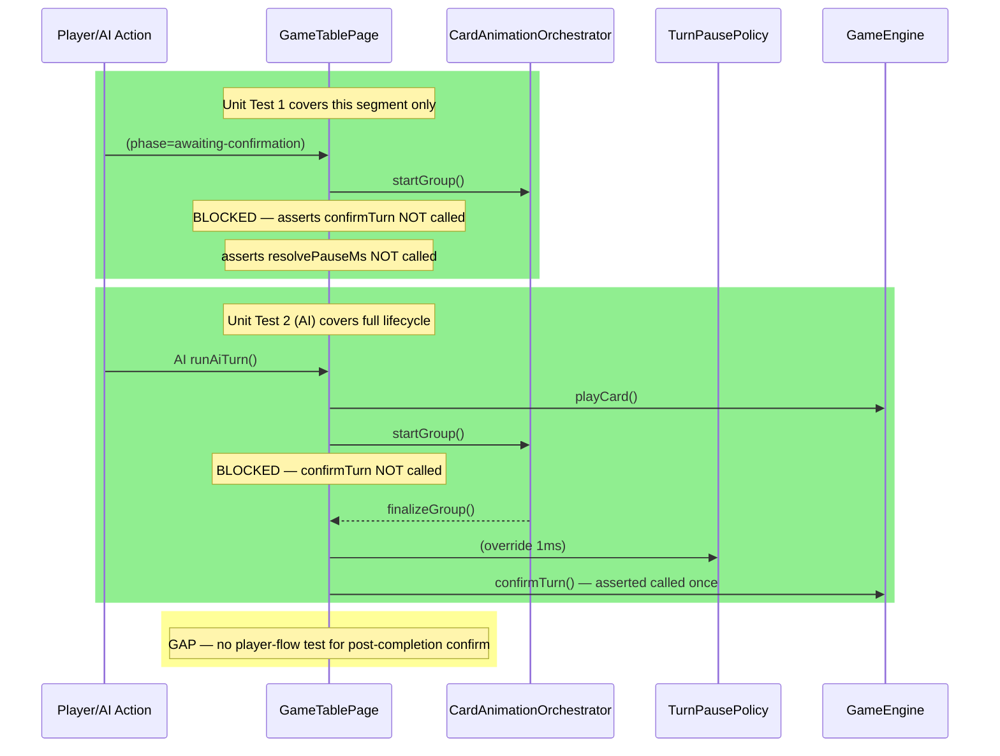

# Review Report: Card Animation System — T-6 Tests (RED Phase)

**Review Mode:** Incremental (T-6: Integrate completion-driven turn sequencing — tests only)
**Source:** `docs/specs/ui/card-animations/`
**Reviewed against:** spec.md, bdd-test.md, design.md, tasks.md

## 1. Executive Summary

T-6 test coverage demonstrates good architectural alignment with AD-2 (completion-driven progression) and meaningful assertions in the AI flow path. However, the player flow unit test only verifies the blocking condition without asserting the complete lifecycle (animate → complete → pause → confirm). E2E step definitions are well-structured and trace cleanly to SC-17/SC-18/SC-19, but depend on a test seam (`readTurnSequencingSummary`, `applyTurnSequencingFixture`) not yet registered in the application bootstrap — expected for RED phase but requiring implementation attention.

- Total findings: 5 (0 Critical, 2 Major, 2 Minor, 1 Note)
- Spec compliance: 2 of 4 traced requirements fully covered by tests (FR-7, TR-4 partial; TR-8 partial; US-7 deferred to E2E)
- Architecture alignment: aligned with AD-2 and AD-3
- Test quality: partially meaningful — one half-lifecycle test reduces confidence

## 2. Architecture Comparison

### 2.1 Planned Turn Sequencing Flow (AD-2)

### 2.2 Actual Test Coverage of the Flow

### 2.3 Drift Analysis

No structural architecture drift. Both unit tests correctly use the real `CardAnimationOrchestrator` and `TurnPausePolicy` injected at feature scope, consistent with AD-1 and AD-2. The AI flow test demonstrates the full completion-driven lifecycle as designed. The player flow test demonstrates only the blocking half, leaving the positive confirmation path untested for the player turn variant.

## 3. Findings

### RV-01: Player flow unit test covers only blocking — not the complete lifecycle [Major]

- **Category:** Test Quality
- **Severity:** Major
- **Related:** T-6, AD-2, FR-7, TR-8, SC-17
- **Description:** The first T-6 test (`waits for animation-group completion before confirming player turn`) starts an animation group, clicks confirm, and asserts that `confirmTurn` was NOT called and `resolvePauseMs` was NOT invoked. However, it never calls `finalizeGroup` to verify that after completion the pause IS applied and `confirmTurn` IS eventually dispatched.
- **Expected:** Per AD-2, animation completion is the source of truth for phase progression. A meaningful test should verify both halves: (a) blocked while running, and (b) proceeds after completion with pause.
- **Actual:** Only the blocking assertion exists. The positive confirmation path is only tested in the AI variant (second test), leaving the player confirm-button flow incompletely covered.
- **Recommendation:** Extend the test to call `finalizeGroup`, advance timers by the mocked pause duration, and assert that `confirmTurn` is called exactly once and `resolvePauseMs` was invoked with expected arguments. Alternatively, add a dedicated second test for the player-flow positive path.
- **Impact:** If the player turn confirmation path has a regression (e.g., pause is skipped or confirmTurn fires prematurely after animation completes), no unit test would catch it. The AI test covers a similar path but exercises different code branches (async runAiTurn vs. click-driven confirm).

### RV-02: E2E test seam methods not yet registered in application bootstrap [Major]

- **Category:** Test Coverage
- **Severity:** Major
- **Related:** T-6, SC-17, SC-18, SC-19, AD-3
- **Description:** The E2E step definitions in `turn-sequencing-completion.ts` call `readTurnSequencingSummary()` and `applyTurnSequencingFixture()` via `window.__escobitaTestApi`. These methods do not currently exist in the `EscobitaTestApi` interface or registration logic in `src/main.ts`.
- **Expected:** For RED phase, tests are written before implementation. However, the seam contract (interface shape, fixture names, and return type) must be documented and tracked as an implementation dependency for T-6 GREEN.
- **Actual:** The `EscobitaTestApi` interface in `main.ts` only exposes `applyEngineFixture`, `readEngineStateSummary`, and `readSessionConfigurationSummary`. The `TurnSequencingSummary` interface and fixture types are defined only in the E2E file.
- **Recommendation:** During T-6 GREEN implementation, extend the `EscobitaTestApi` interface to include `readTurnSequencingSummary` and `applyTurnSequencingFixture`. Ensure the fixture states (`'completed-animation'`, `'missing-completion'`, `'reduced-motion'`) map to well-defined, bounded state mutations consistent with the dual-gate security pattern.
- **Impact:** All three E2E scenarios will fail until the seam is implemented. This is acceptable RED-phase behavior but must be tracked explicitly.

### RV-03: No explicit SC-17/SC-18/SC-19 traceability tags on individual unit tests [Minor]

- **Category:** Test Coverage Alignment
- **Severity:** Minor
- **Related:** SC-17, SC-18, SC-19, T-6
- **Description:** The two T-6 unit tests are tagged `T-6 / FR-7 / TR-8` and `T-6 / FR-7 / TR-4` respectively. Neither references SC-17, SC-18, or SC-19 directly. The file header comment lists SC-18 and SC-19 in the aggregate BDD Scenarios list but these appear to reference other tests elsewhere in the file (match-over overlay tests reuse SC-17/SC-18 numbering from a different feature spec).
- **Expected:** Per design traceability, SC-17/SC-18/SC-19 from the card-animations BDD spec map specifically to turn pause orchestration behavior.
- **Actual:** The SC-15/SC-17 and SC-18/SC-20 tests at lines 1359 and 1389 reference the round-progression feature's scenario numbering, not the card-animations SC-17/SC-18/SC-19. No unit test explicitly traces to the card-animations turn-pause scenarios.
- **Recommendation:** Add SC-17 traceability to the first T-6 unit test (blocking assertion aligns with "game applies required pause before advancing phase") and consider adding a unit test explicitly covering SC-18 (fallback/recovery when completion is missing) at unit level, or document that SC-18 is E2E-only.
- **Impact:** Auditors reviewing traceability will not find unit-level coverage for SC-17/SC-18/SC-19 from the card-animations feature without cross-referencing E2E files.

### RV-04: SC-18 E2E When-step and first Then-step assert the same condition [Minor]

- **Category:** Test Quality
- **Severity:** Minor
- **Related:** SC-18, T-6
- **Description:** In the SC-18 step definitions, the When step (`transition orchestration evaluates timeout or fallback handling`) asserts `turnSequenceState` is NOT `'awaiting-animation-completion'`. The first Then step (`game does not remain permanently blocked`) asserts the exact same condition with the same Cypress assertion.
- **Expected:** When steps should establish the action or precondition; Then steps should verify outcomes. Asserting the same property twice with the same expectation provides no additional coverage.
- **Actual:** Both assertions check `.its('turnSequenceState').should('not.eq', 'awaiting-animation-completion')`. The second Then step (`progression recovers to a valid next phase behavior`) then asserts `.should('eq', 'recovered')`, which IS a distinct meaningful assertion.
- **Recommendation:** Consider making the When step a pure action (e.g., wait for a timeout or trigger the fallback mechanism) without an assertion, or differentiate the Then assertion (e.g., assert a specific intermediate state rather than duplicating the When check). The second Then step is the truly meaningful assertion for SC-18.
- **Impact:** Low — the scenario is still meaningful overall due to the `'recovered'` state assertion. The duplication is a clarity issue, not a correctness issue.

### RV-05: TurnPausePolicy stages are AI-specific; no generic post-animation stage exists [Note]

- **Category:** Architecture Drift
- **Severity:** Note
- **Related:** AD-3, T-6, FR-7, TR-4
- **Description:** The `TurnPausePolicy` service defines stages exclusively for AI turn phases (`ai-deliberation`, `ai-selection-preview`, `ai-capture-preview`, `ai-post-play-confirm`). There is no generic `'post-animation'` or `'player-post-play'` stage. The first T-6 unit test spies on `resolvePauseMs` but never reaches the point where it would be called for a player turn.
- **Expected:** Per FR-7, pauses apply to "all turn transitions" including player flow. AD-3 specifies runtime-configurable pauses with test override.
- **Actual:** The pause stages are AI-turn-scoped. For the player confirm flow, the second T-6 test uses `setRuntimeOverrideMs(1)` directly rather than calling through a player-specific stage.
- **Recommendation:** This appears to be a deliberate design simplification — the player confirm flow may apply pause differently than AI phases. No action required unless the player turn path needs configurable stage-level pause control in future tasks.
- **Impact:** Informational. The AI flow test demonstrates that pause policy IS consulted before confirmation, validating AD-3 integration. The player confirm path's pause mechanism may be wired differently (timer-based vs stage-resolved).

## 4. Traceability Matrix

| Finding | Severity | Category                | Related Spec                   | Status              |
| ------- | -------- | ----------------------- | ------------------------------ | ------------------- |
| RV-01   | Major    | Test Quality            | T-6, AD-2, FR-7, TR-8, SC-17   | Open                |
| RV-02   | Major    | Test Coverage           | T-6, SC-17, SC-18, SC-19, AD-3 | Open (expected RED) |
| RV-03   | Minor    | Test Coverage Alignment | SC-17, SC-18, SC-19, T-6       | Open                |
| RV-04   | Minor    | Test Quality            | SC-18, T-6                     | Open                |
| RV-05   | Note     | Architecture Drift      | AD-3, T-6, FR-7, TR-4          | Informational       |

## 5. Spec Compliance Summary

| Requirement | Status     | Notes                                                                          |
| ----------- | ---------- | ------------------------------------------------------------------------------ |
| FR-7        | ⚠️ Partial | Blocking assertion present; positive player-flow confirmation not unit-tested  |
| TR-4        | ✅ Met     | AI flow test validates pause policy integration and configurable override      |
| TR-8        | ⚠️ Partial | Animation completion signal drives AI confirm; player path only tests blocking |
| US-7        | ⚠️ Partial | E2E covers pause band; unit test lacks positive path for player variant        |
| US-14       | ✅ Met     | Test override mechanism validated via `setRuntimeOverrideMs` in AI test        |

## 6. Task Completion Summary (T-6 Acceptance Criteria)

| Criterion                                                  | Status      | Evidence                                                                       |
| ---------------------------------------------------------- | ----------- | ------------------------------------------------------------------------------ |
| Turn progression does not occur before group completion    | ✅ Complete | Both unit tests assert `confirmTurnSpy` NOT called while group is active       |
| Post-completion pause is applied consistently              | ⚠️ Partial  | AI test confirms pause applied; player flow test never reaches post-completion |
| Transition logic remains stable across player and AI flows | ⚠️ Partial  | AI flow fully tested; player flow only half-tested (RV-01)                     |

## 7. Test Coverage Summary

| Scenario | Step Definitions | Meaningful | Findings                              |
| -------- | ---------------- | ---------- | ------------------------------------- |
| SC-17    | ✅ Yes (E2E)     | ✅ Yes     | RV-03 (no unit-level SC tag)          |
| SC-18    | ✅ Yes (E2E)     | ⚠️ Partial | RV-04 (redundant When/Then assertion) |
| SC-19    | ✅ Yes (E2E)     | ✅ Yes     | —                                     |

## 8. Test Quality Summary

| Test File                                      | Type        | Meaningful Assertions | Issues                                                                  |
| ---------------------------------------------- | ----------- | --------------------- | ----------------------------------------------------------------------- |
| game-table-page.spec.ts (T-6 test 1, line 645) | Unit        | ⚠️ Partial            | Only negative case (blocking); no positive lifecycle completion         |
| game-table-page.spec.ts (T-6 test 2, line 665) | Unit        | ✅ Yes                | Full lifecycle: block → finalize → confirm. Uses fake timers correctly  |
| turn-sequencing-completion.feature             | E2E Feature | ✅ Yes                | Clean Gherkin, proper Background, all three SC scenarios present        |
| turn-sequencing-completion.ts                  | E2E Steps   | ⚠️ Partial            | Meaningful assertions but seam not yet implemented; one redundant check |

## 9. Security Cross-Reference

No security findings applicable to T-6 RED-phase test review. The E2E step definitions follow the established `__escobitaTestApi` dual-gate pattern (dev-mode + Cypress presence). The `TurnSequencingSummary` interface exposes only orchestration state metadata (phase, pause duration, reduced-motion flag) with no sensitive data. The fixture names are allow-listed strings with no user-controlled input paths.

## 10. Recommendations

### Major (fix before merge)

1. **RV-01:** Extend the first T-6 unit test to verify the full player-flow lifecycle: after calling `finalizeGroup`, assert that `resolvePauseMs` is invoked and `confirmTurn` is eventually called. This ensures the player confirm-button path has the same level of confidence as the AI path.
2. **RV-02:** During T-6 GREEN, implement the `readTurnSequencingSummary` and `applyTurnSequencingFixture` methods on the `__escobitaTestApi` interface in `src/main.ts`, maintaining the existing dual-gate security pattern.

### Minor (improvement)

3. **RV-03:** Add `SC-17` tag to the first T-6 unit test name and consider whether SC-18 (fallback recovery) warrants a unit-level test or is adequately covered by E2E alone.
4. **RV-04:** Differentiate the SC-18 When-step from the first Then-step to avoid asserting the same condition twice. The When could be a pure wait/trigger without an assertion, letting Then steps own all verification.

### Notes (informational)

5. **RV-05:** The `TurnPausePolicy` stage enum is AI-scoped. If future tasks require player-specific pause configuration, a generic stage or separate resolution path may be needed.
