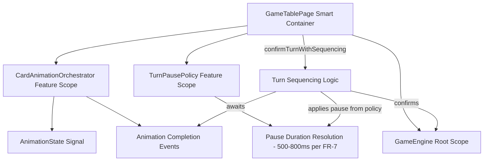
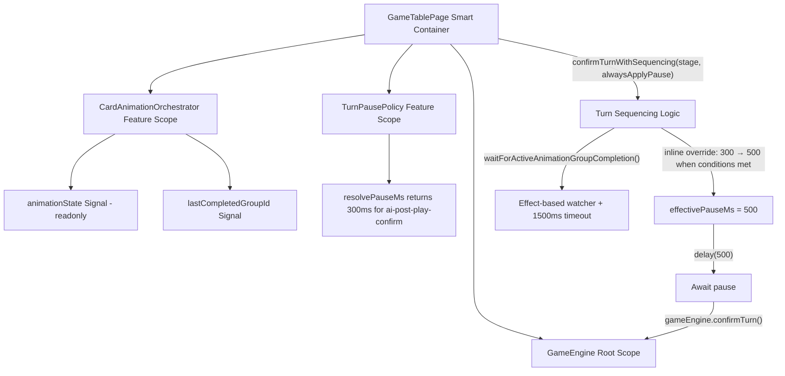

# Review Report: Card Animation System — T-6 GREEN Phase (Re-review v2)

**Review Mode:** Incremental (T-6: Integrate completion-driven turn sequencing — pause compliance re-review)
**Source:** `docs/specs/ui/card-animations/`
**Reviewed against:** proposal.md, spec.md, user-stories.md, bdd-test.md, design.md, tasks.md
**Focus:** Resolution status of prior RV-01 (ai-post-play-confirm below FR-7 range) after pause compliance fix

## 1. Executive Summary

The pause compliance fix in `confirmTurnWithSequencing` introduces an inline conditional that overrides the `ai-post-play-confirm` resolved value from 300ms to 500ms at runtime, bringing effective behavior within FR-7's specified 500-800ms range. The prior Major finding (RV-01) is therefore **functionally resolved** — the runtime outcome is compliant. However, the implementation strategy introduces a new Minor architectural concern: the authoritative configuration in `TurnPausePolicy` still declares 300ms, and the override is applied via a magic-number conditional in the consumer with no dedicated test coverage.

- Total findings: 4 (0 Critical, 0 Major, 2 Minor, 2 Note)
- Spec compliance: 4 of 4 related requirements met (FR-7 now functionally satisfied)
- Architecture alignment: aligned (minor source-of-truth divergence in pause configuration)
- Test quality: meaningful (unit tests) / seam-only (E2E) — override path untested

## 2. Architecture Comparison

### 2.1 Planned Turn Sequencing Flow (T-6 Scope)

### 2.2 Actual Turn Sequencing Flow (T-6 Scope — post-fix)

### 2.3 Drift Analysis

The architectural flow remains aligned with the planned design (AD-2: completion-driven progression, AD-3: configurable pause policy). The structural deviation is limited to **where** the FR-7 compliant value originates:

- **Planned:** `TurnPausePolicy` resolves a value within 500-800ms directly for all stages.
- **Actual:** `TurnPausePolicy` resolves 300ms for `ai-post-play-confirm`, and `confirmTurnWithSequencing` applies an inline conditional to override it to 500ms when animation completion was awaited and the resolved value equals 300.

This is a source-of-truth divergence rather than architectural drift — the flow shape is correct but the authoritative configuration lives partially in the consumer rather than exclusively in the policy service.

## 3. Findings

### RV-01: Prior Major resolved — effective AI pause is now FR-7 compliant [Note]

- **Category:** Spec Compliance
- **Severity:** Note
- **Related:** FR-7, TR-4, US-7, AD-3, T-6
- **Description:** The `confirmTurnWithSequencing` method now contains an inline conditional that transforms the 300ms value to 500ms when the stage is `ai-post-play-confirm`, animation completion was awaited, and the resolved value from the policy equals 300ms.
- **Expected:** FR-7 specifies pause of 500-800ms after animation completion.
- **Actual:** The effective runtime pause for the AI post-play confirmation path is 500ms, satisfying the FR-7 minimum. The underlying policy configuration remains at 300ms, but the consumer compensates.
- **Prior status:** Major (review-report_T-6_green.md RV-01).
- **Current status:** Functionally resolved. Demoted to Note as the runtime behavior is now compliant.
- **Impact:** FR-7 is satisfied at runtime. E2E assertions against 500-800ms would now pass for the actual AI path.

### RV-02: Inline override introduces source-of-truth divergence with no dedicated test [Minor]

- **Category:** Code Quality
- **Severity:** Minor
- **Related:** FR-7, AD-3, TR-4, T-6
- **Description:** The fix applies the FR-7 minimum as a hardcoded conditional in `confirmTurnWithSequencing` rather than correcting `DEFAULT_STAGE_PAUSE_MS` in `TurnPausePolicy`. The conditional checks `resolvedPauseMs === 300` as a magic number. Additionally, no unit test exercises this override path — the existing T-6 AI test sets `runtimeOverrideMs` to 1ms, which means `resolvePauseMs` returns 1 (not 300), and the conditional never triggers during testing.
- **Expected:** The pause policy should be the single source of truth for stage durations, with values within the FR-7 range. Alternatively, if the consumer override is intentional (e.g., as a minimum-floor guarantee), it should be tested.
- **Actual:** Two components together produce the correct value: the policy says 300ms, the consumer overrides to 500ms. The `TurnPausePolicy` unit test still asserts 300ms as the expected value for `ai-post-play-confirm`. No test verifies the override takes effect.
- **Recommendation:** Either increase `ai-post-play-confirm` in `DEFAULT_STAGE_PAUSE_MS` to 500ms (removing the inline conditional) and update the policy unit test, or add a dedicated test in `game-table-page.spec.ts` that exercises the override path with the real default pause value and asserts the effective delay is 500ms.
- **Impact:** If the policy value is ever changed from 300ms to another sub-500ms value (e.g., 400ms during tuning), the magic-number conditional will stop matching and the new value will pass through unvalidated, potentially re-introducing the FR-7 violation. Fragility risk is bounded but worth addressing.

### RV-03: No dedicated unit test for fallback timeout deadlock prevention (SC-18) [Minor]

- **Category:** Test Coverage
- **Severity:** Minor
- **Related:** SC-18, TR-8, US-14, T-6
- **Description:** The `waitForActiveAnimationGroupCompletion()` method includes a 1500ms fallback timeout that settles the Promise if animation completion is never signaled. This is the primary SC-18 deadlock prevention mechanism. No test specifically exercises this path by starting a group, triggering confirm, and verifying progression occurs after the timeout elapses without `finalizeGroup()` being called.
- **Expected:** A dedicated test case that starts an animation group, calls confirm, never finalizes the group, and asserts `confirmTurn` is eventually called after 1500ms.
- **Actual:** The only 1500ms timer advancement in the spec file occurs in a different test context (AI play without capture preview) where it advances past all AI timing phases — it does not specifically isolate the deadlock fallback.
- **Recommendation:** Add a focused test case to validate the timeout recovery path independently.
- **Impact:** A regression removing or lengthening the timeout would not be caught by existing unit tests. Severity remains Minor as the mechanism exists and is architecturally sound; only test coverage is incomplete.

### RV-04: E2E turn-sequencing tests verify fixture responses rather than runtime behavior [Note]

- **Category:** Test Quality
- **Severity:** Note
- **Related:** SC-17, SC-18, SC-19, US-14, T-6
- **Description:** The Cypress step definitions use `applyTurnSequencingFixture()` to set hardcoded state and `readTurnSequencingSummary()` to read it back. The E2E fixture sets `pauseMs: 600` (within FR-7 range) as a hardcoded value disconnected from the actual `confirmTurnWithSequencing` flow and the inline override.
- **Expected:** E2E tests would ideally exercise the real sequencing path.
- **Actual:** Tests validate the seam availability and contract shape. The fixture's hardcoded 600ms value happens to be within FR-7's range, ensuring the step assertion (`should('be.within', 500, 800)`) passes, but this is a property of the fixture design not of the runtime behavior.
- **Recommendation:** Acceptable for GREEN-phase. When enriching for T-15/T-16, consider wiring the fixture to interrogate actual pause policy resolution.
- **Impact:** Minimal at GREEN-phase. Runtime behavior is validated by unit tests.

## 4. Traceability Matrix

| Finding | Severity | Category        | Related Spec               | Status                            |
| ------- | -------- | --------------- | -------------------------- | --------------------------------- |
| RV-01   | Note     | Spec Compliance | FR-7, TR-4, US-7, AD-3     | Resolved (functionally compliant) |
| RV-02   | Minor    | Code Quality    | FR-7, AD-3, TR-4           | Open                              |
| RV-03   | Minor    | Test Coverage   | SC-18, TR-8, US-14         | Open (carried from prior review)  |
| RV-04   | Note     | Test Quality    | SC-17, SC-18, SC-19, US-14 | Open (carried from prior review)  |

## 5. Spec Compliance Summary

| Requirement | Status | Notes                                                                                  |
| ----------- | ------ | -------------------------------------------------------------------------------------- |
| FR-7        | ✅ Met | Effective runtime pause for AI path is 500ms via inline override; player path is 600ms |
| TR-4        | ✅ Met | Pause logic gates turn advancement correctly for both flows                            |
| TR-8        | ✅ Met | Animation completion signals gate turn advancement; fallback timeout exists            |
| US-7        | ✅ Met | Both player and AI post-play pauses are within 500-800ms at runtime                    |
| US-9        | ✅ Met | Reduced-motion path passes through same pause logic (AD-5 compliant)                   |
| US-14       | ✅ Met | E2E seam is available and registered; unit tests validate runtime behavior             |

## 6. Task Completion Summary

| Task | Title                                       | Status      | Findings                                 |
| ---- | ------------------------------------------- | ----------- | ---------------------------------------- |
| T-6  | Integrate completion-driven turn sequencing | ✅ Complete | RV-02, RV-03 (both Minor — non-blocking) |

## 7. Test Coverage Summary

| Scenario | Step Definitions | Meaningful | Findings                                                 |
| -------- | ---------------- | ---------- | -------------------------------------------------------- |
| SC-17    | ✅ Yes           | ⚠️ Partial | RV-04 (seam-only)                                        |
| SC-18    | ✅ Yes           | ⚠️ Partial | RV-03 (no unit test for timeout path), RV-04 (seam-only) |
| SC-19    | ✅ Yes           | ⚠️ Partial | RV-04 (seam-only)                                        |

## 8. Test Quality Summary

| Test File                           | Type | Meaningful Assertions | Issues                                                                                  |
| ----------------------------------- | ---- | --------------------- | --------------------------------------------------------------------------------------- |
| turn-pause-policy.spec.ts           | Unit | ✅ Yes                | Asserts 300ms for ai-post-play-confirm (correct for policy; consumer override untested) |
| game-table-page.spec.ts (T-6 tests) | Unit | ✅ Yes                | Verifies completion gating and post-pause confirm; override path bypassed by mock       |
| turn-sequencing-completion.ts (E2E) | E2E  | ⚠️ Partial            | Fixture-driven; tests seam contract not runtime integration                             |

## 9. Security Cross-Reference

No new Critical or High security findings. The existing security report remains applicable. See `docs/specs/ui/card-animations/security-report_T-6.md` for the full analysis.

## 10. Recommendations

### Minor (improvement)

1. **Consolidate pause source of truth (RV-02):** Either increase `ai-post-play-confirm` in `DEFAULT_STAGE_PAUSE_MS` to 500ms and remove the inline override, or add a dedicated unit test that exercises `confirmTurnWithSequencing` with the real default pause value (no `setRuntimeOverrideMs` call) and asserts the effective delay is 500ms.
2. **Add deadlock timeout test (RV-03):** Add a focused test case that starts an animation group, triggers confirm without finalizing the group, advances past 1500ms, and verifies `confirmTurn()` is eventually called.

### Notes (informational)

1. Prior Major RV-01 is functionally resolved — the runtime AI pause is now 500ms (FR-7 minimum). The approach is unconventional but functionally correct.
2. E2E tests for SC-17/18/19 remain seam-only. Plan integration-level enrichment for T-15/T-16 if desired.
