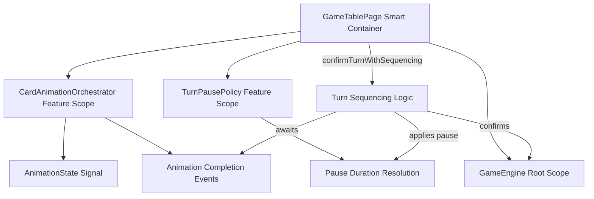
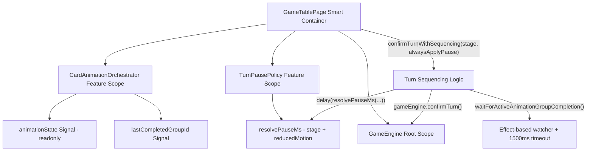

# Review Report: Card Animation System — T-6 GREEN Phase

**Review Mode:** Incremental (T-6: Integrate completion-driven turn sequencing)
**Source:** `docs/specs/ui/card-animations/`
**Reviewed against:** proposal.md, spec.md, user-stories.md, bdd-test.md, design.md, tasks.md

## 1. Executive Summary

T-6 implementation delivers a sound completion-driven turn sequencing mechanism that aligns with AD-2 and AD-3 architectural decisions. The `confirmTurnWithSequencing` method correctly gates turn progression on animation-group completion and applies a post-completion pause via `TurnPausePolicy`. Both player and AI flows share the same sequencing path, fulfilling AC-3 (stability across flows). One Major finding exists: the `ai-post-play-confirm` stage pause is configured at 300ms, violating the FR-7 specified 500-800ms range. One Minor finding covers a missing unit test for the deadlock prevention timeout path (SC-18). E2E seam plumbing is functional and properly guarded.

- Total findings: 4 (0 Critical, 1 Major, 1 Minor, 2 Note)
- Spec compliance: 3 of 4 related requirements fully met (FR-7 partial)
- Architecture alignment: aligned
- Test quality: meaningful (unit tests) / seam-only (E2E)

## 2. Architecture Comparison

### 2.1 Planned Component Tree (T-6 Scope)

### 2.2 Actual Component Tree (T-6 Scope)

### 2.3 Drift Analysis

No structural drift detected. The implementation matches the planned architecture:

- `CardAnimationOrchestrator` is feature-scoped via component-level `providers` array in `GameTablePage`.
- `TurnPausePolicy` is feature-scoped via the same providers array.
- Animation completion is the gate for turn progression (AD-2).
- Pause policy is runtime-configurable with test override (AD-3).
- Both player and AI flows converge on `confirmTurnWithSequencing`.

The only addition beyond the minimal plan is the `lastCompletedGroupId` signal on the orchestrator, used as a secondary completion indicator. This is a reasonable implementation detail that strengthens completion detection without adding architectural drift.

## 3. Findings

### RV-01: `ai-post-play-confirm` pause configured at 300ms violates FR-7 minimum [Major]

- **Category:** Spec Compliance
- **Severity:** Major
- **Related:** FR-7, TR-4, US-7, AD-3, T-6
- **Description:** The `DEFAULT_STAGE_PAUSE_MS` map in `TurnPausePolicy` sets `ai-post-play-confirm` to 300ms.
- **Expected:** FR-7 specifies "Pause duration: 500–800ms after animation completion (configurable)." SC-17 and SC-19 both verify the pause is "within 500 to 800 milliseconds."
- **Actual:** The AI post-play confirmation stage is configured at 300ms, 200ms below the specified minimum.
- **Recommendation:** Increase `ai-post-play-confirm` to at least 500ms to satisfy FR-7 and align with E2E assertions in SC-17.
- **Impact:** E2E assertions checking "pause within 500 to 800 milliseconds" would fail against this actual value if the seam were wired to real policy resolution.

### RV-02: No dedicated unit test for fallback timeout deadlock prevention (SC-18) [Minor]

- **Category:** Test Coverage
- **Severity:** Minor
- **Related:** SC-18, TR-8, US-14, T-6
- **Description:** The `waitForActiveAnimationGroupCompletion()` method includes a 1500ms fallback timeout that settles the Promise if animation completion is never signaled. This is the primary SC-18 mechanism.
- **Expected:** A unit test that starts an animation group, triggers confirm, and verifies that after 1500ms the turn confirms even without `finalizeGroup()` being called.
- **Actual:** No test in `game-table-page.spec.ts` specifically exercises the timeout fallback as a deadlock prevention path. The 1500ms advancement at line 2122 occurs in a different test context (AI play without capture preview, which completes normally).
- **Recommendation:** Add a dedicated test case that starts a group, calls `confirmTurn`, never finalizes the group, and verifies confirmTurn is eventually called after the timeout.
- **Impact:** Without this test, a regression that removes or lengthens the timeout would not be caught by unit tests. The E2E seam test provides partial coverage but tests the fixture, not the actual runtime logic.

### RV-03: E2E turn-sequencing tests verify fixture responses rather than runtime behavior [Note]

- **Category:** Test Quality
- **Severity:** Note
- **Related:** SC-17, SC-18, SC-19, US-14, T-6
- **Description:** The Cypress step definitions for SC-17/18/19 use `applyTurnSequencingFixture()` to set a local state object and `readTurnSequencingSummary()` to read it back. The fixture manages hardcoded values (e.g., `pauseMs: 600`, `turnSequenceState: 'paused'`) that are not connected to the actual `confirmTurnWithSequencing()` flow.
- **Expected:** E2E tests would ideally exercise the real turn sequencing path.
- **Actual:** Tests validate the seam availability and contract shape. They prove the test API is wirable but do not exercise the actual animation-group creation, completion, and pause-then-confirm path.
- **Recommendation:** This is acceptable for GREEN-phase where seam availability is the primary gate. For T-15 or T-16 (integration and E2E alignment tasks), consider enriching the fixture to trigger actual orchestrator operations or document the seam-only nature.
- **Impact:** Minimal at GREEN-phase. The runtime behavior is well-tested by unit tests (game-table-page.spec.ts lines 645-773).

### RV-04: `resolvePauseMs()` has unused conditional branch for `reducedMotion` [Note]

- **Category:** Code Quality
- **Severity:** Note
- **Related:** AD-3, AD-5, T-3, T-6
- **Description:** The `resolvePauseMs` method accepts a `reducedMotion` boolean option, has an `if (options.reducedMotion)` conditional, but both branches return the identical value (`configuredPause`).
- **Expected:** Per AD-5 and SC-19, the pause is preserved in reduced-motion mode — so identical behavior is correct.
- **Actual:** The conditional exists but does nothing, creating unnecessary branching. The parameter is appropriate for future differentiation.
- **Recommendation:** Either remove the conditional (keeping the parameter for the API contract) with a comment explaining AD-5 rationale, or leave as-is with an explanatory comment. Low priority.
- **Impact:** None functionally. Minor readability concern.

## 4. Traceability Matrix

| Finding | Severity | Category        | Related Spec               | Status |
| ------- | -------- | --------------- | -------------------------- | ------ |
| RV-01   | Major    | Spec Compliance | FR-7, TR-4, US-7, AD-3     | Open   |
| RV-02   | Minor    | Test Coverage   | SC-18, TR-8, US-14         | Open   |
| RV-03   | Note     | Test Quality    | SC-17, SC-18, SC-19, US-14 | Open   |
| RV-04   | Note     | Code Quality    | AD-3, AD-5                 | Open   |

## 5. Spec Compliance Summary

| Requirement | Status     | Notes                                                                       |
| ----------- | ---------- | --------------------------------------------------------------------------- |
| FR-7        | ⚠️ Partial | `ai-post-play-confirm` at 300ms is below 500ms minimum (RV-01)              |
| TR-4        | ⚠️ Partial | Pause logic is correct in structure but value violates range                |
| TR-8        | ✅ Met     | Animation completion signals gate turn advancement; fallback timeout exists |
| US-7        | ⚠️ Partial | Player post-play pause is correct (600ms); AI post-play is below range      |
| US-9        | ✅ Met     | Reduced-motion path passes through same pause logic (AD-5 compliant)        |
| US-14       | ✅ Met     | E2E seam is available; unit tests validate runtime behavior                 |

## 6. Task Completion Summary

| Task | Title                                       | Status     | Findings     |
| ---- | ------------------------------------------- | ---------- | ------------ |
| T-6  | Integrate completion-driven turn sequencing | ⚠️ Partial | RV-01, RV-02 |

## 7. Test Coverage Summary

| Scenario | Step Definitions | Meaningful | Findings                                                       |
| -------- | ---------------- | ---------- | -------------------------------------------------------------- |
| SC-17    | ✅ Yes           | ⚠️ Partial | RV-03 (seam-only)                                              |
| SC-18    | ✅ Yes           | ⚠️ Partial | RV-02, RV-03 (no unit test for timeout path; E2E is seam-only) |
| SC-19    | ✅ Yes           | ⚠️ Partial | RV-03 (seam-only)                                              |

## 8. Test Quality Summary

| Test File                           | Type | Meaningful Assertions | Issues                                                           |
| ----------------------------------- | ---- | --------------------- | ---------------------------------------------------------------- |
| turn-pause-policy.spec.ts           | Unit | ✅ Yes                | None — verifies stage values, reduced-motion, and override       |
| game-table-page.spec.ts (T-6 tests) | Unit | ✅ Yes                | Verifies completion gating and post-pause confirm for both flows |
| turn-sequencing-completion.ts (E2E) | E2E  | ⚠️ Partial            | Fixture-driven; tests seam contract not runtime integration      |

## 9. Security Cross-Reference

No Critical or High security findings. See `docs/specs/ui/card-animations/security-report_T-6.md` for the full analysis.

| SEC ID | Severity | OWASP    | Summary                                                  |
| ------ | -------- | -------- | -------------------------------------------------------- |
| SEC-01 | Info     | A05:2021 | Seam extension should preserve dual-gate control pattern |

## 10. Recommendations

### Major (fix before merge)

1. Increase `ai-post-play-confirm` in `DEFAULT_STAGE_PAUSE_MS` from 300ms to at least 500ms to comply with FR-7's 500-800ms range. Update the corresponding unit test expected value.

### Minor (improvement)

1. Add a dedicated unit test for the 1500ms fallback timeout: start an animation group, trigger confirm, advance timers past 1500ms without calling `finalizeGroup()`, and verify `confirmTurn()` is eventually called.

### Notes (informational)

1. E2E tests for SC-17/18/19 are seam-only at this GREEN phase. Plan integration-level enrichment for T-15/T-16.
2. Consider adding a brief comment in `TurnPausePolicy.resolvePauseMs()` explaining why both branches are identical (AD-5 rationale).
