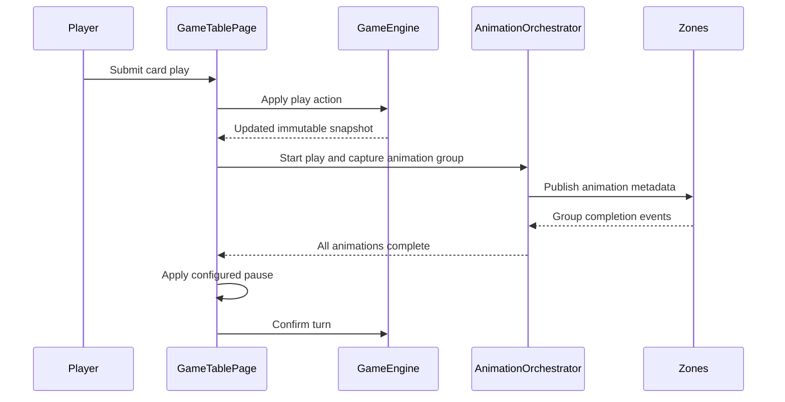
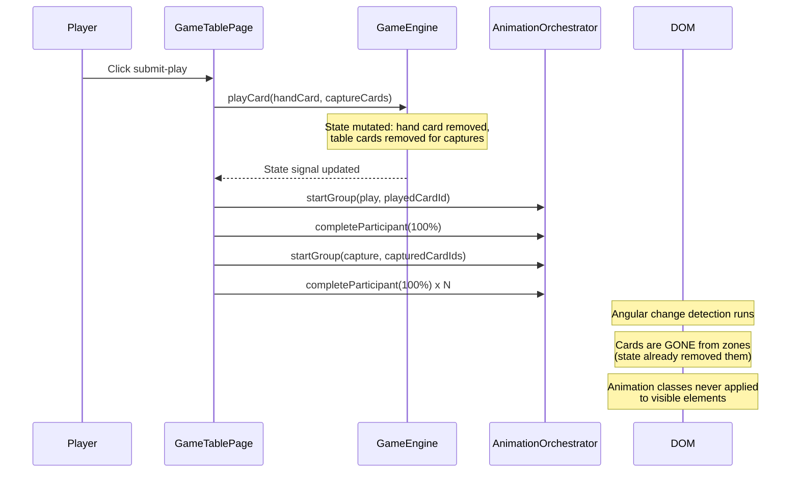
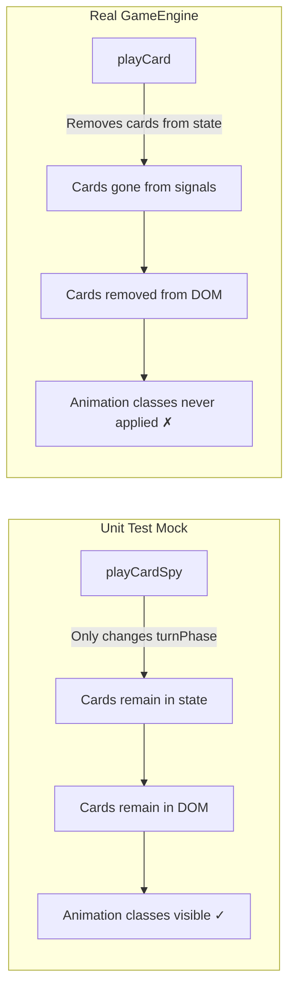

# Review Report: Card Animation System — T-7 GREEN Phase

**Review Mode:** Incremental (T-7: Implement player play and capture animation flows)
**Source:** `docs/specs/ui/card-animations/`
**Reviewed against:** proposal.md, spec.md, user-stories.md, bdd-test.md, design.md, tasks.md
**Scope:** GameTablePage `submitPlay()` flow, CardAnimationOrchestrator, CardVisual SCSS keyframes, ActiveHandZone/CenterTableZone animation metadata propagation, unit tests (game-table-page.spec.ts T-7 tagged), E2E tests (player-play-capture-animations.feature/.ts)
**Previous reports:** `review-report_T-7_red.md`, `review-report_T-7_red-v2.md` — this document covers the GREEN phase implementation.

## 1. Executive Summary

The T-7 GREEN phase implementation introduces animation orchestration into the `submitPlay()` flow and defines CSS keyframe animations for play and capture visual states. However, a critical architectural ordering issue prevents capture animations from being visible in production: `gameEngine.playCard()` is called before animation groups are started, causing cards to be removed from DOM before CSS animation classes can be applied. The unit tests mask this because the mock engine does not replicate the real state mutation. Additionally, the capture glow color deviates from spec.

- Total findings: 5 (1 Critical, 2 Major, 1 Minor, 1 Note)
- Spec compliance: 1 of 2 T-7 requirements met (FR-1 partial, FR-2 not met)
- Architecture alignment: significant drift in state-animation ordering
- Test quality: unit tests give false confidence due to mock mismatch with real engine behavior

## 2. Architecture Comparison

### 2.1 Planned Orchestration Flow (from design.md section 2.3)

### 2.2 Actual Orchestration Flow (from GameTablePage.submitPlay())

### 2.3 Drift Analysis

**Critical ordering divergence:** The planned sequence assumes animation metadata is published to zones WHILE cards are still visible. The actual implementation mutates game state first (removing cards from hand and table), then creates animation groups referencing card IDs that no longer match any rendered element. By the time Angular performs change detection, cards have been removed from zone arrays and their corresponding DOM elements are destroyed.

**Play group overwrite:** When both play and capture groups are created sequentially, `startGroup()` sets `activeGroupId` to the most recently created group. The play group loses its active status when the capture group is started, meaning the played hand card never receives the play visual state even in the brief window before state mutation.

**Immediate participant completion:** All participants are completed at 100% synchronously within `submitPlay()`. The animation groups never remain in a true "running with pending participants" state observable by zones — they are fully completed before the first render.

### 2.4 Unit Test Mock vs Real Engine Behavior

## 3. Findings

### RV-01: State mutation ordering prevents capture animations from being visible [Critical]

- **Category:** Architecture Drift / Spec Compliance
- **Severity:** Critical
- **Related:** AD-2, FR-2, TR-8, US-2, SC-04, SC-05, T-7
- **Description:** In `GameTablePage.submitPlay()`, `gameEngine.playCard()` is invoked before animation groups are created. The real GameEngine immediately removes the played card from the player's hand and removes captured cards from the table state. When Angular subsequently renders, zone components read the updated state (cards absent) and do not render the corresponding card-visual elements. Animation groups referencing removed card IDs cannot produce visible CSS animation classes because no matching DOM elements exist.
- **Expected:** Per design.md section 2.3 and AD-2 ("animation completion the source of truth for phase progression"), animation metadata should be published while cards are still visible, allowing CSS keyframes to play. The state commitment (card removal) should occur after animation completion or via a visual retention mechanism that decouples rendered cards from domain state during the animation window.
- **Actual:** `playCard()` is called at line ~427, removing cards from state signals. Animation groups are started at lines ~429-443, referencing card IDs that no longer map to rendered elements. The capture glow/fade animation defined in `card-capture-fade` keyframes will never be observed by users in a capture scenario.
- **Recommendation:** Either defer the `playCard()` call until after animation completion, or introduce a visual card retention layer (e.g., a "pending removal" list in zone metadata) that keeps cards rendered during the animation window and removes them only when the animation group finalizes. The design's completion-driven approach (AD-2) implies the former strategy.
- **Impact:** FR-2 (capture glow and fade animation) is completely non-functional in production. Users see instant card disappearance with no visual transition, contradicting the feature's core value proposition.

### RV-02: Unit test mock does not replicate real engine state mutation, creating false confidence [Major]

- **Category:** Test Quality
- **Severity:** Major
- **Related:** FR-2, SC-04, SC-05, T-7
- **Description:** The `playCardSpy` in game-table-page.spec.ts is defined as a function that only sets `turnPhaseSignal` to 'awaiting-confirmation'. It does not remove the played card from the hand array or captured cards from the table array. This causes the test assertion "renders capture animation state simultaneously on all selected table cards after submit" to pass — table cards remain in DOM because the mock preserves them.
- **Expected:** Test mocks should faithfully represent the observable behavior of their real counterparts for the properties being asserted. Since the test verifies DOM state (CSS classes on elements), the mock must replicate the DOM-affecting behavior (card removal from zone arrays).
- **Actual:** The mock's `playCard()` preserves all cards in state. The assertion checks that table card elements have `card-visual--animation-capture` class, which only succeeds because the elements still exist. In production, those elements are destroyed before the class can be applied.
- **Recommendation:** Update the `playCardSpy` mock to also remove the played card from the hand and captured cards from the table (matching real GameEngine behavior). This will cause the T-7 unit test to fail, correctly revealing the ordering issue in RV-01.
- **Impact:** The test provides false assurance that capture animations work. Developers relying on this test would not detect the production regression.

### RV-03: Capture glow uses green color instead of spec-mandated yellow/golden [Major]

- **Category:** Spec Compliance
- **Severity:** Major
- **Related:** FR-2, US-2, SC-04, T-7
- **Description:** The `.card-visual--animation-capture` class applies a green box-shadow glow (`rgba(34, 197, 94, 0.65)` and `rgba(34, 197, 94, 0.45)`). FR-2 specifies "Yellow/golden highlight (e.g., box-shadow or filter)" and US-2 says "each card displays a yellow/golden glow effect."
- **Expected:** Capture glow should use yellow or golden tones as specified in FR-2 and US-2.
- **Actual:** Green glow is used. User confirmed this is a deviation, not intentional.
- **Recommendation:** Change the capture glow color to a yellow/golden value (e.g., `rgba(244, 211, 94, ...)` or similar golden tone) to align with FR-2 specification.
- **Impact:** Visual inconsistency with documented specification. Users may confuse the green capture effect with other UI states.

### RV-04: Rotation assertion in E2E SC-02 accepts any transform, not specifically rotation [Minor]

- **Category:** Test Quality
- **Severity:** Minor
- **Related:** SC-02, FR-1, T-7
- **Description:** The E2E step "the card animation includes a flip or rotation effect during travel" asserts that the computed `transform` property is not equal to `none`. This passes for any non-identity transform (translate, scale, skew) without verifying rotation specifically.
- **Expected:** The assertion should verify that a rotation component is present in the transform.
- **Actual:** Asserts `transform !== 'none'`, satisfied by any non-identity transform.
- **Recommendation:** Consider tightening the assertion to verify the transform matrix includes a rotation component, or check that the `card-play-arc` keyframe (which includes `rotateY`) is active. Acceptable as-is given the animation-name is separately verified.
- **Impact:** Low — the `card-play-arc` keyframe does include rotation, and its name is verified in a prior step.

### RV-05: readStyle helper bypasses Cypress retry-ability [Note]

- **Category:** Test Quality
- **Severity:** Note
- **Related:** SC-01, SC-02, SC-04, SC-05, T-7
- **Description:** The `readStyle` helper reads computed style values inside a `.then()` callback without Cypress retry semantics. If animation has not started when the assertion runs, the test would fail without retry.
- **Expected:** Assertions on dynamic style values ideally use `.should()` with callback for retry semantics.
- **Actual:** Uses `.then()` which executes once. Step ordering provides implicit synchronization.
- **Recommendation:** No immediate action. If flakiness is observed, refactor into `.should()` callbacks.
- **Impact:** Negligible given step ordering within scenarios.

## 4. Traceability Matrix

| Finding | Severity | Category           | Related Spec                         | Status       |
| ------- | -------- | ------------------ | ------------------------------------ | ------------ |
| RV-01   | Critical | Architecture Drift | AD-2, FR-2, TR-8, US-2, SC-04, SC-05 | Open         |
| RV-02   | Major    | Test Quality       | FR-2, SC-04, SC-05                   | Open         |
| RV-03   | Major    | Spec Compliance    | FR-2, US-2, SC-04                    | Open         |
| RV-04   | Minor    | Test Quality       | SC-02, FR-1                          | Open         |
| RV-05   | Note     | Test Quality       | SC-01, SC-02, SC-04, SC-05           | Acknowledged |

## 5. Spec Compliance Summary (T-7 Scope)

| Requirement                    | Status     | Notes                                                                                                                                                                              |
| ------------------------------ | ---------- | ---------------------------------------------------------------------------------------------------------------------------------------------------------------------------------- |
| FR-1 (Card Play Animation)     | ⚠️ Partial | Place-only scenario: card appears on table with play-arc keyframe. Capture scenario: hand card gets no visual play animation due to immediate removal and activeGroupId overwrite. |
| FR-2 (Card Capture Animation)  | ❌ Not Met | Captured table cards are removed from DOM before animation classes are applied (RV-01). Additionally, glow color is green instead of yellow/golden (RV-03).                        |
| TR-2 (CSS Keyframe Animations) | ✅ Met     | Keyframes use transform and opacity only. `card-play-arc` and `card-capture-fade` are properly defined.                                                                            |
| TR-5 (Coordinate Systems)      | ⚠️ Partial | Arc path is implemented via CSS keyframes (not coordinate-based DOM calculations). Acceptable as a CSS-only approach for T-7.                                                      |
| US-1 (Player Card Play)        | ⚠️ Partial | Place-only scenario delivers arrival animation. Capture scenario does not deliver hand card animation.                                                                             |
| US-2 (Table Card Capture)      | ❌ Not Met | Capture glow and fade cannot be observed in production due to state ordering.                                                                                                      |

## 6. Task Completion Summary

| Task | Title                                             | Status     | Findings            |
| ---- | ------------------------------------------------- | ---------- | ------------------- |
| T-7  | Implement player play and capture animation flows | ⚠️ Partial | RV-01, RV-02, RV-03 |

**Acceptance Criteria Assessment:**

- [ ] Player play action renders movement to target zone — ⚠️ Partial (works for place-only; not for capture scenarios)
- [ ] Capture applies glow and removal behavior — ❌ Not met (cards removed before glow can display)
- [ ] Multi-card capture starts simultaneously — ❌ Not met (cannot be observed; cards gone from DOM)

## 7. Test Coverage Summary

| Scenario | Step Definitions | Meaningful | Findings                                                                                        |
| -------- | ---------------- | ---------- | ----------------------------------------------------------------------------------------------- |
| SC-01    | ✅ Yes           | ⚠️ Partial | E2E asserts on hand card element that may not exist after playCard in production                |
| SC-02    | ✅ Yes           | ⚠️ Partial | Rotation assertion is broad (RV-04)                                                             |
| SC-04    | ✅ Yes           | ❌ No      | E2E asserts on table card elements that are removed in production (masked by mock in unit test) |
| SC-05    | ✅ Yes           | ❌ No      | Same as SC-04 — simultaneity check targets elements that won't exist in production              |

## 8. Test Quality Summary

| Test File                           | Type | Meaningful Assertions | Issues                                                                                                                                  |
| ----------------------------------- | ---- | --------------------- | --------------------------------------------------------------------------------------------------------------------------------------- |
| game-table-page.spec.ts (T-7 tests) | Unit | ❌ No                 | Mock does not replicate real engine mutation; tests assert on DOM state that only exists with the simplified mock (RV-02)               |
| player-play-capture-animations.ts   | E2E  | ⚠️ Partial            | SC-01/SC-02 assertions may work for place-only if cards sum correctly; SC-04/SC-05 assertions target removed DOM elements in production |

## 9. Security Cross-Reference

No Critical or High security findings were identified in the companion `security-report_T-7.md`. One Medium finding exists related to a transitive dependency vulnerability.

| SEC ID | Severity | OWASP    | Summary                                                            |
| ------ | -------- | -------- | ------------------------------------------------------------------ |
| SEC-01 | Medium   | A06:2021 | Transitive brace-expansion vulnerability (resource exhaustion DoS) |

See `docs/specs/ui/card-animations/security-report_T-7.md` for the full security analysis.

## 10. Recommendations

### Critical (blocks release)

1. **Fix state-animation ordering in submitPlay():** Either start animation groups BEFORE calling `playCard()` (so cards are still in DOM when classes are applied, and defer state mutation to `confirmTurn()`), or introduce a visual retention mechanism that keeps card-visual elements rendered during the animation window despite domain state removal. The design's AD-2 principle ("animation completion is source of truth for phase progression") strongly suggests the first approach.

### Major (fix before merge)

1. **Update unit test mock to replicate real engine behavior:** The `playCardSpy` should remove the played card from hand and captured cards from table arrays, matching the real GameEngine's mutation behavior. This will surface the ordering bug at the test level and prevent false confidence.
2. **Correct capture glow color:** Change the box-shadow in `.card-visual--animation-capture` from green to yellow/golden tones to match FR-2 and US-2 specifications.

### Minor (improvement)

1. **Tighten SC-02 rotation assertion:** Consider verifying the transform matrix includes a rotation component rather than just checking for non-identity.

### Notes (informational)

1. **readStyle helper fragility:** Document for future maintainers that step ordering within scenarios provides implicit synchronization. If E2E flakiness occurs, refactor to `.should()` retry semantics.
